Question 1
Your company has serval departments. Each department has a number of virtual machines (VMs).

The company has an Azure subscription that contains a resource group named RG1.

All VMs are located in RG1.

You want to associate each VM with its respective department.

What should you do?

A.

Create Azure Management Groups for each department.

B.

Create a resource group for each department.

C.

Assign tags to the virtual machines.

D.

Modify the settings of the virtual machines.

Question 2
Note: The question is included in a number of questions that depicts the identical set-up. However, every question has a distinctive result. Establish if the solution satisfies the requirements.

Your company has an Azure Active Directory (Azure AD) tenant named weyland.com that is configured for hybrid coexistence with the on-premises Active

Directory domain.

You have a server named DirSync1 that is configured as a DirSync server.

You create a new user account in the on-premise Active Directory. You now need to replicate the user information to Azure AD immediately.

Solution: You use Active Directory Sites and Services to force replication of the Global Catalog on a domain controller.

Does the solution meet the goal?

A.

Yes

B.

No

Question 3
Note: The question is included in a number of questions that depicts the identical set-up. However, every question has a distinctive result. Establish if the solution satisfies the requirements.

Your company has an Azure Active Directory (Azure AD) tenant named weyland.com that is configured for hybrid coexistence with the on-premises Active

Directory domain.

You have a server named DirSync1 that is configured as a DirSync server.

You create a new user account in the on-premise Active Directory. You now need to replicate the user information to Azure AD immediately.

Solution: You restart the NetLogon service on a domain controller.

Does the solution meet the goal?

A.

Yes

B.

No

Question 4
Your company has a Microsoft Azure subscription.

The company has datacenters in Los Angeles and New York.

You are configuring the two datacenters as geo-clustered sites for site resiliency.

You need to recommend an Azure storage redundancy option.

You have the following data storage requirements:

✑ Data must be stored on multiple nodes.

✑ Data must be stored on nodes in separate geographic locations.

✑ Data can be read from the secondary location as well as from the primary location.

Which of the following Azure stored redundancy options should you recommend?

A.

Geo-redundant storage

B.

Read-only geo-redundant storage

C.

Zone-redundant storage

D.

Locally redundant storage

Question 5
Note: The question is included in a number of questions that depicts the identical set-up. However, every question has a distinctive result. Establish if the solution satisfies the requirements.

Your company has an azure subscription that includes a storage account, a resource group, a blob container and a file share.

A colleague named Jon Ross makes use of a solitary Azure Resource Manager (ARM) template to deploy a virtual machine and an additional Azure Storage account.

You want to review the ARM template that was used by Jon Ross.

Solution: You access the Virtual Machine blade.

Does the solution meet the goal?

A.

Yes

B.

No

Question 6
Note: The question is included in a number of questions that depicts the identical set-up. However, every question has a distinctive result. Establish if the solution satisfies the requirements.

Your company has an azure subscription that includes a storage account, a resource group, a blob container and a file share.

A colleague named Jon Ross makes use of a solitary Azure Resource Manager (ARM) template to deploy a virtual machine and an additional Azure Storage account.

You want to review the ARM template that was used by Jon Ross.

Solution: You access the Resource Group blade.

Does the solution meet the goal?

A.

Yes

B.

No

Question 7
Note: The question is included in a number of questions that depicts the identical set-up. However, every question has a distinctive result. Establish if the solution satisfies the requirements.

Your company has an azure subscription that includes a storage account, a resource group, a blob container and a file share.

A colleague named Jon Ross makes use of a solitary Azure Resource Manager (ARM) template to deploy a virtual machine and an additional Azure Storage account.

You want to review the ARM template that was used by Jon Ross.

Solution: You access the Container blade.

Does the solution meet the goal?

A.

Yes

B.

No

Question 8
Your company has three virtual machines (VMs) that are included in an availability set.

You try to resize one of the VMs, which returns an allocation failure message.

It is imperative that the VM is resized.

Which of the following actions should you take?

A.

You should only stop one of the VMs.

B.

You should stop two of the VMs.

C.

You should stop all three VMs.

D.

You should remove the necessary VM from the availability set.

Question 9
You have an Azure virtual machine (VM) that has a single data disk. You have been tasked with attaching this data disk to another Azure VM.

You need to make sure that your strategy allows for the virtual machines to be offline for the least amount of time possible.

Which of the following is the action you should take FIRST?

A.

Stop the VM that includes the data disk.

B.

Stop the VM that the data disk must be attached to.

C.

Detach the data disk.

D.

Delete the VM that includes the data disk.

Question 10
Your company has an Azure subscription.

You need to deploy a number of Azure virtual machines (VMs) using Azure Resource Manager (ARM) templates. You have been informed that the VMs will be included in a single availability set.

You are required to make sure that the ARM template you configure allows for as many VMs as possible to remain accessible in the event of fabric failure or maintenance.

Which of the following is the value that you should configure for the platformFaultDomainCount property?

A.

10

B.

30

C.

Min Value

D.

Max Value

Question 11
Your company has an Azure subscription.

You need to deploy a number of Azure virtual machines (VMs) using Azure Resource Manager (ARM) templates. You have been informed that the VMs will be included in a single availability set.

You are required to make sure that the ARM template you configure allows for as many VMs as possible to remain accessible in the event of fabric failure or maintenance.

Which of the following is the value that you should configure for the platformUpdateDomainCount property?

A.

10

B.

20

C.

30

D.

40

Question 12
Note: The question is included in a number of questions that depicts the identical set-up. However, every question has a distinctive result. Establish if the solution satisfies the requirements.

Your company has an Azure Active Directory (Azure AD) subscription.

You want to implement an Azure AD conditional access policy.

The policy must be configured to require members of the Global Administrators group to use Multi-Factor Authentication and an Azure AD-joined device when they connect to Azure AD from untrusted locations.

Solution: You access the multi-factor authentication page to alter the user settings.

Does the solution meet the goal?

A.

Yes

B.

No

Question 13
DRAG DROP -

You have downloaded an Azure Resource Manager (ARM) template to deploy numerous virtual machines (VMs). The ARM template is based on a current VM, but must be adapted to reference an administrative password.

You need to make sure that the password cannot be stored in plain text.

You are preparing to create the necessary components to achieve your goal.

Which of the following should you create to achieve your goal? Answer by dragging the correct option from the list to the answer area.

Select and Place:

Question

Question 14
Your company has an Azure Active Directory (Azure AD) tenant that is configured for hybrid coexistence with the on-premises Active Directory domain.

The on-premise virtual environment consists of virtual machines (VMs) running on Windows Server 2012 R2 Hyper-V host servers.

You have created some PowerShell scripts to automate the configuration of newly created VMs. You plan to create several new VMs.

You need a solution that ensures the scripts are run on the new VMs.

Which of the following is the best solution?

A.

Configure a SetupComplete.cmd batch file in the %windir%\setup\scripts directory.

B.

Configure a Group Policy Object (GPO) to run the scripts as logon scripts.

C.

Configure a Group Policy Object (GPO) to run the scripts as startup scripts.

D.

Place the scripts in a new virtual hard disk (VHD).

Question 15
Your company has an Azure Active Directory (Azure AD) tenant that is configured for hybrid coexistence with the on-premises Active Directory domain.

You plan to deploy several new virtual machines (VMs) in Azure. The VMs will have the same operating system and custom software requirements.

You configure a reference VM in the on-premise virtual environment. You then generalize the VM to create an image.

You need to upload the image to Azure to ensure that it is available for selection when you create the new Azure VMs.

Which PowerShell cmdlets should you use?

A.

Add-AzVM

B.

Add-AzVhd

C.

Add-AzImage

D.

Add-AzImageDataDisk

Question 16
DRAG DROP -

Your company has an Azure subscription that includes a number of Azure virtual machines (VMs), which are all part of the same virtual network.

Your company also has an on-premises Hyper-V server that hosts a VM, named VM1, which must be replicated to Azure.

Which of the following objects that must be created to achieve this goal? Answer by dragging the correct option from the list to the answer area.

Select and Place:

Question

Question 17
Note: The question is included in a number of questions that depicts the identical set-up. However, every question has a distinctive result. Establish if the solution satisfies the requirements.

Your company's Azure subscription includes two Azure networks named VirtualNetworkA and VirtualNetworkB.

VirtualNetworkA includes a VPN gateway that is configured to make use of static routing. Also, a site-to-site VPN connection exists between your company's on- premises network and VirtualNetworkA.

You have configured a point-to-site VPN connection to VirtualNetworkA from a workstation running Windows 10. After configuring virtual network peering between

VirtualNetworkA and VirtualNetworkB, you confirm that you are able to access VirtualNetworkB from the company's on-premises network. However, you find that you cannot establish a connection to VirtualNetworkB from the Windows 10 workstation.

You have to make sure that a connection to VirtualNetworkB can be established from the Windows 10 workstation.

Solution: You choose the Allow gateway transit setting on VirtualNetworkA.

Does the solution meet the goal?

A.

Yes

B.

No

Question 18
Note: The question is included in a number of questions that depicts the identical set-up. However, every question has a distinctive result. Establish if the solution satisfies the requirements.

Your company's Azure subscription includes two Azure networks named VirtualNetworkA and VirtualNetworkB.

VirtualNetworkA includes a VPN gateway that is configured to make use of static routing. Also, a site-to-site VPN connection exists between your company's on- premises network and VirtualNetworkA.

You have configured a point-to-site VPN connection to VirtualNetworkA from a workstation running Windows 10. After configuring virtual network peering between

VirtualNetworkA and VirtualNetworkB, you confirm that you are able to access VirtualNetworkB from the company's on-premises network. However, you find that you cannot establish a connection to VirtualNetworkB from the Windows 10 workstation.

You have to make sure that a connection to VirtualNetworkB can be established from the Windows 10 workstation.

Solution: You choose the Allow gateway transit setting on VirtualNetworkB.

Does the solution meet the goal?

A.

Yes

B.

No

Question 19
Note: The question is included in a number of questions that depicts the identical set-up. However, every question has a distinctive result. Establish if the solution satisfies the requirements.

Your company's Azure subscription includes two Azure networks named VirtualNetworkA and VirtualNetworkB.

VirtualNetworkA includes a VPN gateway that is configured to make use of static routing. Also, a site-to-site VPN connection exists between your company's on- premises network and VirtualNetworkA.

You have configured a point-to-site VPN connection to VirtualNetworkA from a workstation running Windows 10. After configuring virtual network peering between

VirtualNetworkA and VirtualNetworkB, you confirm that you are able to access VirtualNetworkB from the company's on-premises network. However, you find that you cannot establish a connection to VirtualNetworkB from the Windows 10 workstation.

You have to make sure that a connection to VirtualNetworkB can be established from the Windows 10 workstation.

Solution: You download and re-install the VPN client configuration package on the Windows 10 workstation.

Does the solution meet the goal?

A.

Yes

B.

No

Question 20
Your company has virtual machines (VMs) hosted in Microsoft Azure. The VMs are located in a single Azure virtual network named VNet1.

The company has users that work remotely. The remote workers require access to the VMs on VNet1.

You need to provide access for the remote workers.

What should you do?

A.

Configure a Site-to-Site (S2S) VPN.

B.

Configure a VNet-toVNet VPN.

C.

Configure a Point-to-Site (P2S) VPN.

D.

Configure DirectAccess on a Windows Server 2012 server VM.

E.

Configure a Multi-Site VPN

Question 21
Note: The question is included in a number of questions that depicts the identical set-up. However, every question has a distinctive result. Establish if the solution satisfies the requirements.

Your company has a Microsoft SQL Server Always On availability group configured on their Azure virtual machines (VMs).

You need to configure an Azure internal load balancer as a listener for the availability group.

Solution: You create an HTTP health probe on port 1433.

Does the solution meet the goal?

A.

Yes

B.

No

Question 22
Note: The question is included in a number of questions that depicts the identical set-up. However, every question has a distinctive result. Establish if the solution satisfies the requirements.

Your company has a Microsoft SQL Server Always On availability group configured on their Azure virtual machines (VMs).

You need to configure an Azure internal load balancer as a listener for the availability group.

Solution: You set Session persistence to Client IP.

Does the solution meet the goal?

A.

Yes

B.

No

Question 23
Note: The question is included in a number of questions that depicts the identical set-up. However, every question has a distinctive result. Establish if the solution satisfies the requirements.

Your company has an Azure Active Directory (Azure AD) subscription.

You want to implement an Azure AD conditional access policy.

The policy must be configured to require members of the Global Administrators group to use Multi-Factor Authentication and an Azure AD-joined device when they connect to Azure AD from untrusted locations.

Solution: You access the Azure portal to alter the session control of the Azure AD conditional access policy.

Does the solution meet the goal?

A.

Yes

B.

No

Question 24
Note: The question is included in a number of questions that depicts the identical set-up. However, every question has a distinctive result. Establish if the solution satisfies the requirements.

Your company has a Microsoft SQL Server Always On availability group configured on their Azure virtual machines (VMs).

You need to configure an Azure internal load balancer as a listener for the availability group.

Solution: You enable Floating IP.

Does the solution meet the goal?

A.

Yes

B.

No

Question 25
Your company has two on-premises servers named SRV01 and SRV02. Developers have created an application that runs on SRV01. The application calls a service on SRV02 by IP address.

You plan to migrate the application on Azure virtual machines (VMs). You have configured two VMs on a single subnet in an Azure virtual network.

You need to configure the two VMs with static internal IP addresses.

What should you do?

A.

Run the New-AzureRMVMConfig PowerShell cmdlet.

B.

Run the Set-AzureSubnet PowerShell cmdlet.

C.

Modify the VM properties in the Azure Management Portal.

D.

Modify the IP properties in Windows Network and Sharing Center.

E.

Run the Set-AzureStaticVNetIP PowerShell cmdlet.

Question 26
Your company has an Azure Active Directory (Azure AD) subscription.

You need to deploy five virtual machines (VMs) to your company's virtual network subnet.

The VMs will each have both a public and private IP address. Inbound and outbound security rules for all of these virtual machines must be identical.

Which of the following is the least amount of network interfaces needed for this configuration?

A.

5

B.

10

C.

20

D.

40

Question 27
Your company has an Azure Active Directory (Azure AD) subscription.

You need to deploy five virtual machines (VMs) to your company's virtual network subnet.

The VMs will each have both a public and private IP address. Inbound and outbound security rules for all of these virtual machines must be identical.

Which of the following is the least amount of security groups needed for this configuration?

A.

4

B.

3

C.

2

D.

1

Question 28
Your company's Azure subscription includes Azure virtual machines (VMs) that run Windows Server 2016.

One of the VMs is backed up every day using Azure Backup Instant Restore.

When the VM becomes infected with data encrypting ransomware, you decide to recover the VM's files.

Which of the following is TRUE in this scenario?

A.

You can only recover the files to the infected VM.

B.

You can recover the files to any VM within the company's subscription.

C.

You can only recover the files to a new VM.

D.

You will not be able to recover the files.

Question 29
Your company's Azure subscription includes Azure virtual machines (VMs) that run Windows Server 2016.

One of the VMs is backed up every day using Azure Backup Instant Restore.

When the VM becomes infected with data encrypting ransomware, you are required to restore the VM.

Which of the following actions should you take?

A.

You should restore the VM after deleting the infected VM.

B.

You should restore the VM to any VM within the company's subscription.

C.

You should restore the VM to a new Azure VM.

D.

You should restore the VM to an on-premise Windows device.

Question 30
You administer a solution in Azure that is currently having performance issues.

You need to find the cause of the performance issues pertaining to metrics on the Azure infrastructure.

Which of the following is the tool you should use?

A.

Azure Traffic Analytics

B.

Azure Monitor

C.

Azure Activity Log

D.

Azure Advisor

Question 31
Your company has an Azure subscription that includes a Recovery Services vault.

You want to use Azure Backup to schedule a backup of your company's virtual machines (VMs) to the Recovery Services vault.

Which of the following VMs can you back up? Choose all that apply.

A.

VMs that run Windows 10.

B.

VMs that run Windows Server 2012 or higher.

C.

VMs that have NOT been shut down.

D.

VMs that run Debian 8.2+.

E.

VMs that have been shut down.

Question 32
Note: This question is part of a series of questions that present the same scenario. Each question in the series contains a unique solution that might meet the stated goals. Some question sets might have more than one correct solution, while others might not have a correct solution.

After you answer a question in this section, you will NOT be able to return to it. As a result, these questions will not appear in the review screen.

You have an Azure Active Directory (Azure AD) tenant named contoso.com.

You have a CSV file that contains the names and email addresses of 500 external users.

You need to create a guest user account in contoso.com for each of the 500 external users.

Solution: You create a PowerShell script that runs the New-AzureADUser cmdlet for each user.

Does this meet the goal?

A.

Yes

B.

No

Question 33
Note: This question is part of a series of questions that present the same scenario. Each question in the series contains a unique solution that might meet the stated goals. Some question sets might have more than one correct solution, while others might not have a correct solution.

After you answer a question in this section, you will NOT be able to return to it. As a result, these questions will not appear in the review screen.

You have an Azure Active Directory (Azure AD) tenant named contoso.com.

You have a CSV file that contains the names and email addresses of 500 external users.

You need to create a guest user account in contoso.com for each of the 500 external users.

Solution: From Azure AD in the Azure portal, you use the Bulk create user operation.

Does this meet the goal?

A.

Yes

B.

No

Question 34
Note: The question is included in a number of questions that depicts the identical set-up. However, every question has a distinctive result. Establish if the solution satisfies the requirements.

Your company has an Azure Active Directory (Azure AD) subscription.

You want to implement an Azure AD conditional access policy.

The policy must be configured to require members of the Global Administrators group to use Multi-Factor Authentication and an Azure AD-joined device when they connect to Azure AD from untrusted locations.

Solution: You access the Azure portal to alter the grant control of the Azure AD conditional access policy.

Does the solution meet the goal?

A.

Yes

B.

No

Question 35
Note: This question is part of a series of questions that present the same scenario. Each question in the series contains a unique solution that might meet the stated goals. Some question sets might have more than one correct solution, while others might not have a correct solution.

After you answer a question in this section, you will NOT be able to return to it. As a result, these questions will not appear in the review screen.

You have an Azure Active Directory (Azure AD) tenant named contoso.com.

You have a CSV file that contains the names and email addresses of 500 external users.

You need to create a guest user account in contoso.com for each of the 500 external users.

Solution: You create a PowerShell script that runs the New-AzureADMSInvitation cmdlet for each external user.

Does this meet the goal?

A.

Yes

B.

No

Question 36
You are planning to deploy an Ubuntu Server virtual machine to your company's Azure subscription.

You are required to implement a custom deployment that includes adding a particular trusted root certification authority (CA).

Which of the following should you use to create the virtual machine?

A.

The New-AzureRmVm cmdlet.

B.

The New-AzVM cmdlet.

C.

The Create-AzVM cmdlet.

D.

The az vm create command.

Question 37
Note: The question is included in a number of questions that depicts the identical set-up. However, every question has a distinctive result. Establish if the solution satisfies the requirements.

Your company makes use of Multi-Factor Authentication for when users are not in the office. The Per Authentication option has been configured as the usage model.

After the acquisition of a smaller business and the addition of the new staff to Azure Active Directory (Azure AD) obtains a different company and adding the new employees to Azure Active Directory (Azure AD), you are informed that these employees should also make use of Multi-Factor Authentication.

To achieve this, the Per Enabled User setting must be set for the usage model.

Solution: You reconfigure the existing usage model via the Azure portal.

Does the solution meet the goal?

A.

Yes

B.

No

Question 38
Note: The question is included in a number of questions that depicts the identical set-up. However, every question has a distinctive result. Establish if the solution satisfies the requirements.

Your company's Azure solution makes use of Multi-Factor Authentication for when users are not in the office. The Per Authentication option has been configured as the usage model.

After the acquisition of a smaller business and the addition of the new staff to Azure Active Directory (Azure AD) obtains a different company and adding the new employees to Azure Active Directory (Azure AD), you are informed that these employees should also make use of Multi-Factor Authentication.

To achieve this, the Per Enabled User setting must be set for the usage model.

Solution: You reconfigure the existing usage model via the Azure CLI.

Does the solution meet the goal?

A.

Yes

B.

No

Question 39
Note: The question is included in a number of questions that depicts the identical set-up. However, every question has a distinctive result. Establish if the solution satisfies the requirements.

Your company's Azure solution makes use of Multi-Factor Authentication for when users are not in the office. The Per Authentication option has been configured as the usage model.

After the acquisition of a smaller business and the addition of the new staff to Azure Active Directory (Azure AD) obtains a different company and adding the new employees to Azure Active Directory (Azure AD), you are informed that these employees should also make use of Multi-Factor Authentication.

To achieve this, the Per Enabled User setting must be set for the usage model.

Solution: You create a new Multi-Factor Authentication provider with a backup from the existing Multi-Factor Authentication provider data.

Does the solution meet the goal?

A.

Yes

B.

No

Question 40
Note: The question is included in a number of questions that depicts the identical set-up. However, every question has a distinctive result. Establish if the solution satisfies the requirements.

Your company has an Azure Active Directory (Azure AD) tenant named weyland.com that is configured for hybrid coexistence with the on-premises Active

Directory domain.

You have a server named DirSync1 that is configured as a DirSync server.

You create a new user account in the on-premise Active Directory. You now need to replicate the user information to Azure AD immediately.

Solution: You run the Start-ADSyncSyncCycle -PolicyType Initial PowerShell cmdlet.

Does the solution meet the goal?

A.

Yes

B.

No

Question 41
You need to implement a backup solution for App1 after the application is moved.

What should you create first?

A.

a recovery plan

B.

an Azure Backup Server

C.

a backup policy

D.

a Recovery Services vault

Question 42
You need to move the blueprint files to Azure.

What should you do?

A.

Generate an access key. Map a drive, and then copy the files by using File Explorer.

B.

Use Azure Storage Explorer to copy the files.

C.

Use the Azure Import/Export service.

D.

Generate a shared access signature (SAS). Map a drive, and then copy the files by using File Explorer.

Question 43
HOTSPOT -

You need to identify the storage requirements for Contoso.

For each of the following statements, select Yes if the statement is true. Otherwise, select No.

NOTE: Each correct selection is worth one point.

Hot Area:

Question

Question 44
HOTSPOT -

You need to create container1 and share1.

Which storage accounts should you use for each resource? To answer, select the appropriate options in the answer area.

NOTE: Each correct selection is worth one point.

Hot Area:

Question

Question 45
HOTSPOT -

You need to create storage5. The solution must support the planned changes.

Which type of storage account should you use, and which account should you configure as the destination storage account? To answer, select the appropriate options in the answer area.

NOTE: Each correct selection is worth one point.

Hot Area:

Question

Question 46
You need to identify which storage account to use for the flow logging of IP traffic from VM5. The solution must meet the retention requirements.

Which storage account should you identify?

A.

storage1

B.

storage2

C.

storage3

D.

storage4

Question 47
You discover that VM3 does NOT meet the technical requirements.

You need to verify whether the issue relates to the NSGs.

What should you use?

A.

Diagram in VNet1

B.

Diagnostic settings in Azure Monitor

C.

Diagnose and solve problems in Traffic Manager profiles

D.

The security recommendations in Azure Advisor

E.

IP flow verify in Azure Network Watcher

Question 48
You need to ensure that VM1 can communicate with VM4. The solution must minimize the administrative effort.

What should you do?

A.

Create an NSG and associate the NSG to VM1 and VM4.

B.

Establish peering between VNET1 and VNET3.

C.

Assign VM4 an IP address of 10.0.1.5/24.

D.

Create a user-defined route from VNET1 to VNET3.

Question 49
HOTSPOT -

You need to meet the connection requirements for the New York office.

What should you do? To answer, select the appropriate options in the answer area.

NOTE: Each correct selection is worth one point.

Hot Area:

Question

Question 50
HOTSPOT -

You need to recommend a solution for App1. The solution must meet the technical requirements.

What should you include in the recommendation? To answer, select the appropriate options in the answer area.

NOTE: Each correct selection is worth one point.

Hot Area:

Question

Question 51
You are planning the move of App1 to Azure.

You create a network security group (NSG).

You need to recommend a solution to provide users with access to App1.

What should you recommend?

A.

Create an incoming security rule for port 443 from the Internet. Associate the NSG to the subnet that contains the web servers.

B.

Create an outgoing security rule for port 443 from the Internet. Associate the NSG to the subnet that contains the web servers.

C.

Create an incoming security rule for port 443 from the Internet. Associate the NSG to all the subnets.

D.

Create an outgoing security rule for port 443 from the Internet. Associate the NSG to all the subnets.

Question 52
HOTSPOT -

You implement the planned changes for NSG1 and NSG2.

For each of the following statements, select Yes if the statement is true. Otherwise, select No.

NOTE: Each correct selection is worth one point.

Hot Area:

Question

Question 53
You need to add VM1 and VM2 to the backend pool of LB1.

What should you do first?

A.

Connect VM2 to VNET1/Subnet1.

B.

Redeploy VM1 and VM2 to the same availability zone.

C.

Redeploy VM1 and VM2 to the same availability set.

D.

Create a new NSG and associate the NSG to VNET1/Subnet1.

Question 54
You need to ensure that VM1 can communicate with VM4. The solution must minimize administrative effort.

What should you do?

A.

Create a user-defined route from VNET1 to VNET3.

B.

Create an NSG and associate the NSG to VM1 and VM4.

C.

Assign VM4 an IP address of 10.0.1.5/24.

D.

Establish peering between VNET1 and VNET3.

Question 55
HOTSPOT -

You need to implement Role1.

Which command should you run before you create Role1? To answer, select the appropriate options in the answer area.

NOTE: Each correct selection is worth one point.

Hot Area:

Question

Question 56
You need to recommend a solution to automate the configuration for the finance department users. The solution must meet the technical requirements.

What should you include in the recommendation?

A.

Azure AD B2C

B.

dynamic groups and conditional access policies

C.

Azure AD Identity Protection

D.

an Azure logic app and the Microsoft Identity Management (MIM) client

Question 57
HOTSPOT -

You have an Azure subscription named Subscription1 that contains a resource group named RG1.

In RG1, you create an internal load balancer named LB1 and a public load balancer named LB2.

You need to ensure that an administrator named Admin1 can manage LB1 and LB2. The solution must follow the principle of least privilege.

Which role should you assign to Admin1 for each task? To answer, select the appropriate options in the answer area.

NOTE: Each correct selection is worth one point.

Hot Area:

Question

Question 58
You have an Azure Active Directory (Azure AD) tenant that contains 5,000 user accounts.

You create a new user account named AdminUser1.

You need to assign the User administrator administrative role to AdminUser1.

What should you do from the user account properties?

A.

From the Licenses blade, assign a new license

B.

From the Directory role blade, modify the directory role

C.

From the Groups blade, invite the user account to a new group

Question 59
HOTSPOT -

You have a Microsoft Entra tenant that contains the groups shown in the following table.

Question
The tenant contains the users shown in the following table.

Question
Which users and groups can you delete? To answer, select the appropriate options in the answer area.

NOTE: Each correct selection is worth one point.

Question

Question 60
You have an Azure subscription that contains the resources shown in the following table.

Question
You need to ensure that data transfers between storage1 and VM1 do NOT traverse the internet

What should you configure for storage1?

A.

data protection

B.

a private endpoint

C.

Public network access in the Firewalls and virtual networks settings

D.

a shared access signature (SAS)

Question 61
HOTSPOT

-

You have a Microsoft Entra tenant that is linked to the subscriptions shown in the following table.

Question
You have the resource groups shown in the following table.

Question
You assign roles to users as shown in the following table.

Question
For each of the following statements, select Yes if the statement is true. Otherwise, select No.

NOTE: Each correct selection is worth one point.

Question

Question 62
Your on-premises network contains a VPN gateway.

You have an Azure subscription that contains the resources shown in the following table.

Question
You need to ensure that all the traffic from VM1 to storage1 travels across the Microsoft backbone network.

What should you configure?

A.

a network security group (NSG)

B.

private endpoints

C.

Microsoft Entra Application Proxy

D.

Azure Virtual WAN

Question 63
You have a Microsoft Entra tenant.

You plan to perform a bulk import of users.

You need to ensure that imported user objects are added automatically as the members of a specific group based on each user's department. The solution must minimize administrative effort.

Which two actions should you perform? Each correct answer presents part of the solution.

NOTE: Each correct selection is worth one point.

A.

Create groups that use the Assigned membership type.

B.

Create an Azure Resource Manager (ARM) template.

C.

Create groups that use the Dynamic User membership type.

D.

Write a PowerShell script that parses an import file.

E.

Create an XML file that contains user information and the appropriate attributes.

F.

Create a CSV file that contains user information and the appropriate attributes.

Question 64
You have an Azure subscription that contains a storage account named storage1.

You need to ensure that the access keys for storage1 rotate automatically.

What should you configure?

A.

a backup vault

B.

redundancy for storage1

C.

lifecycle management for storage1

D.

an Azure key vault

E.

a Recovery Services vault

Question 65
You have an Azure subscription that contains the Microsoft Entra identities shown in the following table.

Question
You need to enable self-service password reset (SSPR).

For which identities can you enable SSPR in the Azure portal?

A.

User1 only

B.

Group1 only

C.

User1 and Group1 only

D.

Group1 and Group2 only

E.

User1, Group1, and Group2

Question 66
DRAG DROP -

You have a Microsoft Entra tenant.

You need to ensure that when a new Microsoft 365 group is created, the group name is automatically formatted as follows:

Question
Which three actions should you perform in sequence in the Microsoft Entra admin center? To answer, move the appropriate actions from the list of actions to the answer area and arrange them in the correct order.

Question

Question 67
HOTSPOT

-

You have a Microsoft Entra tenant that contains the users shown in the following table.

Question
The tenant contains the groups shown in the following table.

Question
Which users and groups can be deleted? To answer, select the appropriate options in the answer area.

NOTE: Each correct selection is worth one point.

Question

Question 68
HOTSPOT -

You have an Azure subscription that contains the resources shown in the following table.

Question
You plan to use an Azure key vault to provide a secret to app1.

What should you create for app1 to access the key vault, and from which key vault can the secret be used? To answer, select the appropriate options in the answer area.

NOTE: Each correct selection is worth one point.

Question

Question 69
You have an Azure Active Directory (Azure AD) tenant named contoso.onmicrosoft.com that contains 100 user accounts.

You purchase 10 Azure AD Premium P2 licenses for the tenant.

You need to ensure that 10 users can use all the Azure AD Premium features.

What should you do?

A.

From the Licenses blade of Azure AD, assign a license

B.

From the Groups blade of each user, invite the users to a group

C.

From the Azure AD domain, add an enterprise application

D.

From the Directory role blade of each user, modify the directory role

Question 70
You have a Microsoft Entra tenant named contoso.com.

You collaborate with an external partner named fabrikam.com.

You plan to invite users in fabrikam.com to the contoso.com tenant.

You need to ensure that invitations can be sent only to fabrikam.com users.

What should you do in the Microsoft Entra admin center?

A.

From Cross-tenant access settings, configure the Tenant restrictions settings.

B.

From Cross-tenant access settings, configure the Microsoft cloud settings.

C.

From External collaboration settings, configure the Guest user access restrictions settings.

D.

From External collaboration settings, configure the Collaboration restrictions settings.

Question 71
You have an Azure subscription that contains a storage account named storage1. The storage1 account contains blob data.

You need to assign a role to a user named User1 to ensure that the user can access the blob data in storage1. The role assignment must support conditions.

Which two roles can you assign to User1? Each correct answer presents a complete solution.

NOTE: Each correct selection is worth one point.

A.

Owner

B.

Storage Account Contributor

C.

Storage Account Backup Contributor

D.

Storage Blob Data Contributor

E.

Storage Blob Data Owner

F.

Storage Blob Delegator

Question 72
HOTSPOT -

Case study -

This is a case study. Case studies are not timed separately. You can use as much exam time as you would like to complete each case. However, there may be additional case studies and sections on this exam. You must manage your time to ensure that you are able to complete all questions included on this exam in the time provided.

To answer the questions included in a case study, you will need to reference information that is provided in the case study. Case studies might contain exhibits and other resources that provide more information about the scenario that is described in the case study. Each question is independent of the other questions in this case study.

At the end of this case study, a review screen will appear. This screen allows you to review your answers and to make changes before you move to the next section of the exam. After you begin a new section, you cannot return to this section.

To start the case study -

To display the first question in this case study, click the Next button. Use the buttons in the left pane to explore the content of the case study before you answer the questions. Clicking these buttons displays information such as business requirements, existing environment, and problem statements. If the case study has an All Information tab, note that the information displayed is identical to the information displayed on the subsequent tabs. When you are ready to answer a question, click the Question button to return to the question.

Overview -

ADatum Corporation is consulting firm that has a main office in Montreal and branch offices in Seattle and New York.

Existing Environment -

Azure Environment -

ADatum has an Azure subscription that contains three resource groups named RG1, RG2, and RG3.

The subscription contains the storage accounts shown in the following table.

Question
The subscription contains the virtual machines shown in the following table.

Question
The subscription has an Azure container registry that contains the images shown in the following table.

Question
The subscription contains the resources shown in the following table.

Question
Azure Key Vault -

The subscription contains an Azure key vault named Vault1.

Vault1 contains the certificates shown in the following table.

Question
Vault1 contains the keys shown in the following table.

Question
Microsoft Entra Environment -

ADatum has a Microsoft Entra tenant named adatum.com that is linked to the Azure subscription and contains the users shown in the following table.

Question
The tenant contains the groups shown in the following table.

Question
The adatum.com tenant has a custom security attribute named Attribute1.

Planned Changes -

ADatum plans to implement the following changes:

• Configure a data collection rule (DCR) named DCR1 to collect only system events that have an event ID of 4648 from VM2 and VM4.

• In storage1, create a new container named cont2 that has the following access policies: o Three stored access policies named Stored1, Stored2, and Stored3 o A legal hold for immutable blob storage

• Whenever possible, use directories to organize storage account content.

• Grant User1 the permissions required to link Zone1 to VNet1.

• Assign Attribute1 to supported adatum.com resources.

• In storage2, create an encryption scope named Scope1.

• Deploy new containers by using Image1 or Image2.

Technical Requirements -

ADatum must meet the following technical requirements:

• Use TLS for WebApp1.

• Follow the principle of least privilege.

• Grant permissions at the required scope only.

• Ensure that Scope1 is used to encrypt storage services.

• Use Azure Backup to back up cont1 and share1 as frequently as possible.

• Whenever possible, use Azure Disk Encryption and a key encryption key (KEK) to encrypt the virtual machines.

You need to implement the planned change for Attribute1.

For each of the following statements, select Yes if the statement is true. Otherwise, select No.

NOTE: Each correct selection is worth one point.

Question

Question 73
You have a Microsoft Entra tenant configured as shown in the following exhibit.

Question
The tenant contains the identities shown in the following table.

Question
You purchase a Microsoft Fabric license.

To which identities can you assign the license?

A.

User1 only

B.

User1 and Group1 only

C.

User1 and Group2 only

D.

User1, Group1, and Group2

Question 74
You have an Azure subscription that contains a storage account named storage. The storage account contains a blob that stores images.

Client access to storage1 is granted by using a shared access signature (SAS).

You need to ensure that users receive a warning message when they generate a SAS that exceeds a seven-day time period.

What should you do for storage?

A.

Enable a read-only lock.

B.

Configure an alert rule.

C.

Add a lifecycle management rule.

D.

Set Allow recommended upper limit for shared access signature (SAS) expiry interval to Enabled.

Question 75
You have an Azure subscription named Subscription1 and an on-premises deployment of Microsoft System Center Service Manager.

Subscription1 contains a virtual machine named VM1.

You need to ensure that an alert is set in Service Manager when the amount of available memory on VM1 is below 10 percent.

What should you do first?

A.

Create an automation runbook

B.

Deploy a function app

C.

Deploy the IT Service Management Connector (ITSM)

D.

Create a notification

Question 76
You sign up for Azure Active Directory (Azure AD) Premium P2.

You need to add a user named admin1@contoso.com as an administrator on all the computers that will be joined to the Azure AD domain.

What should you configure in Azure AD?

A.

Device settings from the Devices blade

B.

Providers from the MFA Server blade

C.

User settings from the Users blade

D.

General settings from the Groups blade

Question 77
HOTSPOT -

You have Azure Active Directory tenant named Contoso.com that includes following users:

Question
Contoso.com includes following Windows 10 devices:

Question
You create following security groups in Contoso.com:

Question
For each of the following statements, select Yes if the statement is true. Otherwise, select No.

NOTE: Each correct selection is worth one point.

Hot Area:

Question

Question 78
You have an Azure subscription that contains a resource group named RG26.

RG26 is set to the West Europe location and is used to create temporary resources for a project. RG26 contains the resources shown in the following table.

Question
SQLDB01 is backed up to RGV1.

When the project is complete, you attempt to delete RG26 from the Azure portal. The deletion fails.

You need to delete RG26.

What should you do first?

A.

Delete VM1

B.

Stop VM1

C.

Stop the backup of SQLDB01

D.

Delete sa001

Question 79
You have an Azure subscription named Subscription1 that contains a virtual network named VNet1. VNet1 is in a resource group named RG1.

Subscription1 has a user named User1. User1 has the following roles:

✑ Reader

✑ Security Admin

✑ Security Reader

You need to ensure that User1 can assign the Reader role for VNet1 to other users.

What should you do?

A.

Remove User1 from the Security Reader and Reader roles for Subscription1.

B.

Assign User1 the User Access Administrator role for VNet1.

C.

Assign User1 the Network Contributor role for VNet1.

D.

Assign User1 the Network Contributor role for RG1.

Question 80
You have an Azure Active Directory (Azure AD) tenant named contosocloud.onmicrosoft.com.

Your company has a public DNS zone for contoso.com.

You add contoso.com as a custom domain name to Azure AD.

You need to ensure that Azure can verify the domain name.

Which type of DNS record should you create?

A.

MX

B.

NSEC

C.

PTR

D.

RRSIG

Question 81
Note: This question is part of a series of questions that present the same scenario. Each question in the series contains a unique solution that might meet the stated goals. Some question sets might have more than one correct solution, while others might not have a correct solution.

After you answer a question in this section, you will NOT be able to return to it. As a result, these questions will not appear in the review screen.

You have an Azure Directory (Azure AD) tenant named Adatum and an Azure Subscription named Subscription1. Adatum contains a group named Developers.

Subscription1 contains a resource group named Dev.

You need to provide the Developers group with the ability to create Azure logic apps in the Dev resource group.

Solution: On Subscription1, you assign the DevTest Labs User role to the Developers group.

Does this meet the goal?

A.

Yes

B.

No

Question 82
Note: This question is part of a series of questions that present the same scenario. Each question in the series contains a unique solution that might meet the stated goals. Some question sets might have more than one correct solution, while others might not have a correct solution.

After you answer a question in this section, you will NOT be able to return to it. As a result, these questions will not appear in the review screen.

You have an Azure Directory (Azure AD) tenant named Adatum and an Azure Subscription named Subscription1. Adatum contains a group named Developers.

Subscription1 contains a resource group named Dev.

You need to provide the Developers group with the ability to create Azure logic apps in the Dev resource group.

Solution: On Subscription1, you assign the Logic App Operator role to the Developers group.

Does this meet the goal?

A.

Yes

B.

No

Question 83
You have an Azure subscription that contains an Azure Active Directory (Azure AD) tenant named contoso.com and an Azure Kubernetes Service (AKS) cluster named AKS1.

An administrator reports that she is unable to grant access to AKS1 to the users in contoso.com.

You need to ensure that access to AKS1 can be granted to the contoso.com users.

What should you do first?

A.

From contoso.com, modify the Organization relationships settings.

B.

From contoso.com, create an OAuth 2.0 authorization endpoint.

C.

Recreate AKS1.

D.

From AKS1, create a namespace.

Question 84
Note: This question is part of a series of questions that present the same scenario. Each question in the series contains a unique solution that might meet the stated goals. Some question sets might have more than one correct solution, while others might not have a correct solution.

After you answer a question in this section, you will NOT be able to return to it. As a result, these questions will not appear in the review screen.

You have an Azure Directory (Azure AD) tenant named Adatum and an Azure Subscription named Subscription1. Adatum contains a group named Developers.

Subscription1 contains a resource group named Dev.

You need to provide the Developers group with the ability to create Azure logic apps in the Dev resource group.

Solution: On Dev, you assign the Contributor role to the Developers group.

Does this meet the goal?

A.

Yes

B.

No

Question 85
DRAG DROP -

You have an Azure subscription that is used by four departments in your company. The subscription contains 10 resource groups. Each department uses resources in several resource groups.

You need to send a report to the finance department. The report must detail the costs for each department.

Which three actions should you perform in sequence? To answer, move the appropriate actions from the list of actions to the answer area and arrange them in the correct order.

Select and Place:

Question

Question 86
You have an Azure subscription named Subscription1 that contains an Azure Log Analytics workspace named Workspace1.

You need to view the error events from a table named Event.

Which query should you run in Workspace1?

A.

Get-Event Event | where {$_.EventType == "error"}

B.

search in (Event) "error"

C.

select * from Event where EventType == "error"

D.

search in (Event) * | where EventType -eq "error"

Question 87
HOTSPOT -

You have an Azure subscription that contains a virtual network named VNET1 in the East US 2 region. A network interface named VM1-NI is connected to

VNET1.

You successfully deploy the following Azure Resource Manager template.

Question
For each of the following statements, select Yes if the statement is true. Otherwise, select No.

NOTE: Each correct selection is worth one point.

Hot Area:

Question

Question 88
You have an Azure subscription named Subscription1. Subscription1 contains the resource groups in the following table.

Question
RG1 has a web app named WebApp1. WebApp1 is located in West Europe.

You move WebApp1 to RG2.

What is the effect of the move?

A.

The App Service plan for WebApp1 remains in West Europe. Policy2 applies to WebApp1.

B.

The App Service plan for WebApp1 moves to North Europe. Policy2 applies to WebApp1.

C.

The App Service plan for WebApp1 remains in West Europe. Policy1 applies to WebApp1.

D.

The App Service plan for WebApp1 moves to North Europe. Policy1 applies to WebApp1.

Question 89
HOTSPOT -

You have an Azure subscription named Subscription1 that has a subscription ID of c276fc76-9cd4-44c9-99a7-4fd71546436e.

You need to create a custom RBAC role named CR1 that meets the following requirements:

✑ Can be assigned only to the resource groups in Subscription1

✑ Prevents the management of the access permissions for the resource groups

✑ Allows the viewing, creating, modifying, and deleting of resources within the resource groups

What should you specify in the assignable scopes and the permission elements of the definition of CR1? To answer, select the appropriate options in the answer area.

NOTE: Each correct selection is worth one point.

Hot Area:

Question

Question 90
You have an Azure subscription.

Users access the resources in the subscription from either home or from customer sites. From home, users must establish a point-to-site VPN to access the Azure resources. The users on the customer sites access the Azure resources by using site-to-site VPNs.

You have a line-of-business-app named App1 that runs on several Azure virtual machine. The virtual machines run Windows Server 2016.

You need to ensure that the connections to App1 are spread across all the virtual machines.

What are two possible Azure services that you can use? Each correct answer presents a complete solution.

NOTE: Each correct selection is worth one point.

A.

an internal load balancer

B.

a public load balancer

C.

an Azure Content Delivery Network (CDN)

D.

Traffic Manager

E.

an Azure Application Gateway

Question 91
You have an Azure subscription.

You have 100 Azure virtual machines.

You need to quickly identify underutilized virtual machines that can have their service tier changed to a less expensive offering.

Which blade should you use?

A.

Monitor

B.

Advisor

C.

Metrics

D.

Customer insights

Question 92
HOTSPOT -

You have an Azure Active Directory (Azure AD) tenant.

You need to create a conditional access policy that requires all users to use multi-factor authentication when they access the Azure portal.

Which three settings should you configure? To answer, select the appropriate settings in the answer area.

NOTE: Each correct selection is worth one point.

Hot Area:

Question

Question 93
You have an Azure Active Directory (Azure AD) tenant named contoso.onmicrosoft.com.

The User administrator role is assigned to a user named Admin1.

An external partner has a Microsoft account that uses the user1@outlook.com sign in.

Admin1 attempts to invite the external partner to sign in to the Azure AD tenant and receives the following error message: `Unable to invite user user1@outlook.com `" Generic authorization exception.`

You need to ensure that Admin1 can invite the external partner to sign in to the Azure AD tenant.

What should you do?

A.

From the Users settings blade, modify the External collaboration settings.

B.

From the Custom domain names blade, add a custom domain.

C.

From the Organizational relationships blade, add an identity provider.

D.

From the Roles and administrators blade, assign the Security administrator role to Admin1.

Question 94
You have a Microsoft 365 tenant and an Azure Active Directory (Azure AD) tenant named contoso.com.

You plan to grant three users named User1, User2, and User3 access to a temporary Microsoft SharePoint document library named Library1.

You need to create groups for the users. The solution must ensure that the groups are deleted automatically after 180 days.

Which two groups should you create? Each correct answer presents a complete solution.

NOTE: Each correct selection is worth one point.

A.

a Microsoft 365 group that uses the Assigned membership type

B.

a Security group that uses the Assigned membership type

C.

a Microsoft 365 group that uses the Dynamic User membership type

D.

a Security group that uses the Dynamic User membership type

E.

a Security group that uses the Dynamic Device membership type

Question 95
You have an Azure subscription linked to an Azure Active Directory tenant. The tenant includes a user account named User1.

You need to ensure that User1 can assign a policy to the tenant root management group.

What should you do?

A.

Assign the Owner role for the Azure Subscription to User1, and then modify the default conditional access policies.

B.

Assign the Owner role for the Azure subscription to User1, and then instruct User1 to configure access management for Azure resources.

C.

Assign the Global administrator role to User1, and then instruct User1 to configure access management for Azure resources.

D.

Create a new management group and delegate User1 as the owner of the new management group.

Question 96
HOTSPOT -

You have an Azure Active Directory (Azure AD) tenant named adatum.com. Adatum.com contains the groups in the following table.

Question
You create two user accounts that are configured as shown in the following table.

Question
Of which groups are User1 and User2 members? To answer, select the appropriate options in the answer area.

NOTE: Each correct selection is worth one point.

Hot Area:

Question

Question 97
HOTSPOT -

You have a hybrid deployment of Azure Active Directory (Azure AD) that contains the users shown in the following table.

Question
You need to modify the JobTitle and UsageLocation attributes for the users.

For which users can you modify the attributes from Azure AD? To answer, select the appropriate options in the answer area.

NOTE: Each correct selection is worth one point.

Hot Area:

Question

Question 98
Note: This question is part of a series of questions that present the same scenario. Each question in the series contains a unique solution that might meet the stated goals. Some question sets might have more than one correct solution, while others might not have a correct solution.

After you answer a question in this section, you will NOT be able to return to it. As a result, these questions will not appear in the review screen.

You need to ensure that an Azure Active Directory (Azure AD) user named Admin1 is assigned the required role to enable Traffic Analytics for an Azure subscription.

Solution: You assign the Network Contributor role at the subscription level to Admin1.

Does this meet the goal?

A.

Yes

B.

No

Question 99
Note: This question is part of a series of questions that present the same scenario. Each question in the series contains a unique solution that might meet the stated goals. Some question sets might have more than one correct solution, while others might not have a correct solution.

After you answer a question in this section, you will NOT be able to return to it. As a result, these questions will not appear in the review screen.

You need to ensure that an Azure Active Directory (Azure AD) user named Admin1 is assigned the required role to enable Traffic Analytics for an Azure subscription.

Solution: You assign the Owner role at the subscription level to Admin1.

Does this meet the goal?

A.

Yes

B.

No

Question 100
Note: This question is part of a series of questions that present the same scenario. Each question in the series contains a unique solution that might meet the stated goals. Some question sets might have more than one correct solution, while others might not have a correct solution.

After you answer a question in this section, you will NOT be able to return to it. As a result, these questions will not appear in the review screen.

You need to ensure that an Azure Active Directory (Azure AD) user named Admin1 is assigned the required role to enable Traffic Analytics for an Azure subscription.

Solution: You assign the Reader role at the subscription level to Admin1.

Does this meet the goal?

A.

Yes

B.

No

Question 101
You have an Azure subscription that contains a user named User1.

You need to ensure that User1 can deploy virtual machines and manage virtual networks. The solution must use the principle of least privilege.

Which role-based access control (RBAC) role should you assign to User1?

A.

Owner

B.

Virtual Machine Contributor

C.

Contributor

D.

Virtual Machine Administrator Login

Question 102
HOTSPOT -

You have an Azure Active Directory (Azure AD) tenant that contains three global administrators named Admin1, Admin2, and Admin3.

The tenant is associated to an Azure subscription. Access control for the subscription is configured as shown in the Access control exhibit. (Click the Access

Control tab.)

Question
You sign in to the Azure portal as Admin1 and configure the tenant as shown in the Tenant exhibit. (Click the Tenant tab.)

Question
For each of the following statements, select Yes if the statement is true. Otherwise, select No.

NOTE: Each correct selection is worth one point.

Hot Area:

Question

Question 103
You have an Azure subscription named Subscription1 that contains an Azure virtual machine named VM1. VM1 is in a resource group named RG1.

VM1 runs services that will be used to deploy resources to RG1.

You need to ensure that a service running on VM1 can manage the resources in RG1 by using the identity of VM1.

What should you do first?

A.

From the Azure portal, modify the Managed Identity settings of VM1

B.

From the Azure portal, modify the Access control (IAM) settings of RG1

C.

From the Azure portal, modify the Access control (IAM) settings of VM1

D.

From the Azure portal, modify the Policies settings of RG1

Question 104
You have an Azure subscription that contains a resource group named TestRG.

You use TestRG to validate an Azure deployment.

TestRG contains the following resources:

Question
You need to delete TestRG.

What should you do first?

A.

Modify the backup configurations of VM1 and modify the resource lock type of VNET1

B.

Remove the resource lock from VNET1 and delete all data in Vault1

C.

Turn off VM1 and remove the resource lock from VNET1

D.

Turn off VM1 and delete all data in Vault1

Question 105
HOTSPOT -

You have an Azure Active Directory (Azure AD) tenant named contoso.com that contains the users shown in the following table:

Question
User3 is the owner of Group1.

Group2 is a member of Group1.

You configure an access review named Review1 as shown in the following exhibit:

Question
For each of the following statements, select Yes if the statement is true. Otherwise, select No.

NOTE: Each correct selection is worth one point.

Hot Area:

Question

Question 106
You have an Azure DNS zone named adatum.com.

You need to delegate a subdomain named research.adatum.com to a different DNS server in Azure.

What should you do?

A.

Create an NS record named research in the adatum.com zone.

B.

Create a PTR record named research in the adatum.com zone.

C.

Modify the SOA record of adatum.com.

D.

Create an A record named *.research in the adatum.com zone.

Question 107
DRAG DROP -

You have an Azure Active Directory (Azure AD) tenant that has the contoso.onmicrosoft.com domain name.

You have a domain name of contoso.com registered at a third-party registrar.

You need to ensure that you can create Azure AD users that have names containing a suffix of @contoso.com.

Which three actions should you perform in sequence? To answer, move the appropriate actions from the list of actions to the answer area and arrange them in the correct order.

Select and Place:

Question

Question 108
You have an Azure subscription named Subscription1 that contains an Azure Log Analytics workspace named Workspace1.

You need to view the error events from a table named Event.

Which query should you run in Workspace1?

A.

Get-Event Event | where {$_.EventType == "error"}

B.

Event | search "error"

C.

select * from Event where EventType == "error"

D.

search in (Event) * | where EventType ג€"eq ג€errorג€

Question 109
You have a registered DNS domain named contoso.com.

You create a public Azure DNS zone named contoso.com.

You need to ensure that records created in the contoso.com zone are resolvable from the internet.

What should you do?

A.

Create NS records in contoso.com.

B.

Modify the SOA record in the DNS domain registrar.

C.

Create the SOA record in contoso.com.

D.

Modify the NS records in the DNS domain registrar.

Question 110
HOTSPOT -

You have an Azure subscription that contains a storage account named storage1. The subscription is linked to an Azure Active Directory (Azure AD) tenant named contoso.com that syncs to an on-premises Active Directory domain.

The domain contains the security principals shown in the following table.

Question
In Azure AD, you create a user named User2.

The storage1 account contains a file share named share1 and has the following configurations.

Question
For each of the following statements, select Yes if the statement is true. Otherwise, select No.

NOTE: Each correct selection is worth one point.

Hot Area:

Question

Question 111
HOTSPOT -

You have an Azure subscription named Subscription1 that contains a virtual network VNet1.

You add the users in the following table.

Question
Which user can perform each configuration? To answer, select the appropriate options in the answer area.

NOTE: Each correct selection is worth one point.

Hot Area:

Question

Question 112
HOTSPOT -

You have the Azure resources shown on the following exhibit.

Question
You plan to track resource usage and prevent the deletion of resources.

To which resources can you apply locks and tags? To answer, select the appropriate options in the answer area.

NOTE: Each correct selection is worth one point.

Hot Area:

Question

Question 113
You have an Azure Active Directory (Azure AD) tenant.

You plan to delete multiple users by using Bulk delete in the Azure Active Directory admin center.

You need to create and upload a file for the bulk delete.

Which user attributes should you include in the file?

A.

The user principal name and usage location of each user only

B.

The user principal name of each user only

C.

The display name of each user only

D.

The display name and usage location of each user only

E.

The display name and user principal name of each user only

Question 114
HOTSPOT -

You have an Azure subscription named Sub1 that contains the Azure resources shown in the following table.

Question
You assign an Azure policy that has the following settings:

✑ Scope: Sub1

✑ Exclusions: Sub1/RG1/VNET1

✑ Policy definition: Append a tag and its value to resources

✑ Policy enforcement: Enabled

✑ Tag name: Tag4

✑ Tag value: value4

You assign tags to the resources as shown in the following table.

Question
For each of the following statements, select Yes if the statement is true. Otherwise, select No.

NOTE: Each correct selection is worth one point.

Hot Area:

Question

Question 115
Note: This question is part of a series of questions that present the same scenario. Each question in the series contains a unique solution that might meet the stated goals. Some question sets might have more than one correct solution, while others might not have a correct solution.

After you answer a question in this section, you will NOT be able to return to it. As a result, these questions will not appear in the review screen.

You need to ensure that an Azure Active Directory (Azure AD) user named Admin1 is assigned the required role to enable Traffic Analytics for an Azure subscription.

Solution: You assign the Traffic Manager Contributor role at the subscription level to Admin1.

Does this meet the goal?

A.

Yes

B.

No

Question 116
HOTSPOT -

You have the Azure management groups shown in the following table:

Question
You add Azure subscriptions to the management groups as shown in the following table:

Question
You create the Azure policies shown in the following table:

Question
For each of the following statements, select Yes if the statement is true. Otherwise, select No.

NOTE: Each correct selection is worth one point.

Hot Area:

Question

Question 117
You have three offices and an Azure subscription that contains an Azure Active Directory (Azure AD) tenant.

You need to grant user management permissions to a local administrator in each office.

What should you use?

A.

Azure AD roles

B.

administrative units

C.

access packages in Azure AD entitlement management

D.

Azure roles

Question 118
Note: This question is part of a series of questions that present the same scenario. Each question in the series contains a unique solution that might meet the stated goals. Some question sets might have more than one correct solution, while others might not have a correct solution.

After you answer a question in this section, you will NOT be able to return to it. As a result, these questions will not appear in the review screen.

You have an Azure Directory (Azure AD) tenant named Adatum and an Azure Subscription named Subscription1. Adatum contains a group named Developers.

Subscription1 contains a resource group named Dev.

You need to provide the Developers group with the ability to create Azure logic apps in the Dev resource group.

Solution: On Dev, you assign the Logic App Contributor role to the Developers group.

Does this meet the goal?

A.

Yes

B.

No

Question 119
HOTSPOT -

You have an Azure Load Balancer named LB1.

You assign a user named User1 the roles shown in the following exhibit.

Question
Use the drop-down menus to select the answer choice that completes each statement based on the information presented in the graphic.

NOTE: Each correct selection is worth one point.

Hot Area:

Question

Question 120
You have an Azure subscription named Subscription1 that contains a virtual network named VNet1. VNet1 is in a resource group named RG1.

Subscription1 has a user named User1. User1 has the following roles:

✑ Reader

✑ Security Admin

✑ Security Reader

You need to ensure that User1 can assign the Reader role for VNet1 to other users.

What should you do?

A.

Remove User1 from the Security Reader role for Subscription1. Assign User1 the Contributor role for RG1.

B.

Assign User1 the Owner role for VNet1.

C.

Assign User1 the Contributor role for VNet1.

D.

Assign User1 the Network Contributor role for VNet1.

Question 121
HOTSPOT -

You configure the custom role shown in the following exhibit.

Question
Use the drop-down menus to select the answer choice that completes each statement based on the information presented in the graphic.

NOTE: Each correct selection is worth one point.

Hot Area:

Question

Question 122
You have an Azure subscription that contains a storage account named storage1. The storage1 account contains a file share named share1.

The subscription is linked to a hybrid Azure Active Directory (Azure AD) tenant that contains a security group named Group1.

You need to grant Group1 the Storage File Data SMB Share Elevated Contributor role for share1.

What should you do first?

A.

Enable Active Directory Domain Service (AD DS) authentication for storage1.

B.

Grant share-level permissions by using File Explorer.

C.

Mount share1 by using File Explorer.

D.

Create a private endpoint.

Question 123
You have 15 Azure subscriptions.

You have an Azure Active Directory (Azure AD) tenant that contains a security group named Group1.

You plan to purchase additional Azure subscription.

You need to ensure that Group1 can manage role assignments for the existing subscriptions and the planned subscriptions. The solution must meet the following requirements:

✑ Use the principle of least privilege.

✑ Minimize administrative effort.

What should you do?

A.

Assign Group1 the Owner role for the root management group.

B.

Assign Group1 the User Access Administrator role for the root management group.

C.

Create a new management group and assign Group1 the User Access Administrator role for the group.

D.

Create a new management group and assign Group1 the Owner role for the group.

Question 124
HOTSPOT -

You have an Azure subscription that contains the hierarchy shown in the following exhibit.

Question
You create an Azure Policy definition named Policy1.

To which Azure resources can you assign Policy1 and which Azure resources can you specify as exclusions from Policy1? To answer, select the appropriate options in the answer area.

NOTE: Each correct selection is worth one point.

Hot Area:

Question

Question 125
Note: This question is part of a series of questions that present the same scenario. Each question in the series contains a unique solution that might meet the stated goals. Some question sets might have more than one correct solution, while others might not have a correct solution.

After you answer a question in this section, you will NOT be able to return to it. As a result, these questions will not appear in the review screen.

You have an Azure subscription that contains the following users in an Azure Active Directory tenant named contoso.onmicrosoft.com:

Question
User1 creates a new Azure Active Directory tenant named external.contoso.onmicrosoft.com.

You need to create new user accounts in external.contoso.onmicrosoft.com.

Solution: You instruct User2 to create the user accounts.

Does that meet the goal?

A.

Yes

B.

No

Question 126
Note: This question is part of a series of questions that present the same scenario. Each question in the series contains a unique solution that might meet the stated goals. Some question sets might have more than one correct solution, while others might not have a correct solution.

After you answer a question in this section, you will NOT be able to return to it. As a result, these questions will not appear in the review screen.

You have an Azure subscription that contains the following users in an Azure Active Directory tenant named contoso.onmicrosoft.com:

Question
User1 creates a new Azure Active Directory tenant named external.contoso.onmicrosoft.com.

You need to create new user accounts in external.contoso.onmicrosoft.com.

Solution: You instruct User4 to create the user accounts.

Does that meet the goal?

A.

Yes

B.

No

Question 127
You have an Azure policy as shown in the following exhibit:

Question
What is the effect of the policy?

A.

You are prevented from creating Azure SQL servers anywhere in Subscription 1.

B.

You can create Azure SQL servers in ContosoRG1 only.

C.

You are prevented from creating Azure SQL Servers in ContosoRG1 only.

D.

You can create Azure SQL servers in any resource group within Subscription 1.

Question 128
Note: This question is part of a series of questions that present the same scenario. Each question in the series contains a unique solution that might meet the stated goals. Some question sets might have more than one correct solution, while others might not have a correct solution.

After you answer a question in this section, you will NOT be able to return to it. As a result, these questions will not appear in the review screen.

You have an Azure subscription that contains the following users in an Azure Active Directory tenant named contoso.onmicrosoft.com:

Question
User1 creates a new Azure Active Directory tenant named external.contoso.onmicrosoft.com.

You need to create new user accounts in external.contoso.onmicrosoft.com.

Solution: You instruct User3 to create the user accounts.

Does that meet the goal?

A.

Yes

B.

No

Question 129
You have two Azure subscriptions named Sub1 and Sub2.

An administrator creates a custom role that has an assignable scope to a resource group named RG1 in Sub1.

You need to ensure that you can apply the custom role to any resource group in Sub1 and Sub2. The solution must minimize administrative effort.

What should you do?

A.

Select the custom role and add Sub1 and Sub2 to the assignable scopes. Remove RG1 from the assignable scopes.

B.

Create a new custom role for Sub1. Create a new custom role for Sub2. Remove the role from RG1.

C.

Create a new custom role for Sub1 and add Sub2 to the assignable scopes. Remove the role from RG1.

D.

Select the custom role and add Sub1 to the assignable scopes. Remove RG1 from the assignable scopes. Create a new custom role for Sub2.

Question 130
You have an Azure Subscription that contains a storage account named storageacct1234 and two users named User1 and User2.

You assign User1 the roles shown in the following exhibit.

Question
Which two actions can User1 perform? Each correct answer presents a complete solution.

NOTE: Each correct selection is worth one point.

A.

Assign roles to User2 for storageacct1234.

B.

Upload blob data to storageacct1234.

C.

Modify the firewall of storageacct1234.

D.

View blob data in storageacct1234.

E.

View file shares in storageacct1234.

Question 131
You have an Azure subscription named Subscription1 that contains an Azure Log Analytics workspace named Workspace1.

You need to view the error events from a table named Event.

Which query should you run in Workspace1?

A.

select * from Event where EventType == "error"

B.

Event | search "error"

C.

Event | where EventType is "error"

D.

Get-Event Event | where {$_.EventType == "error"}

Question 132
You have an Azure App Services web app named App1.

You plan to deploy App1 by using Web Deploy.

You need to ensure that the developers of App1 can use their Azure AD credentials to deploy content to App1. The solution must use the principle of least privilege.

What should you do?

A.

Assign the Owner role to the developers

B.

Configure app-level credentials for FTPS

C.

Assign the Website Contributor role to the developers

D.

Configure user-level credentials for FTPS

Question 133
Note: This question is part of a series of questions that present the same scenario. Each question in the series contains a unique solution that might meet the stated goals. Some question sets might have more than one correct solution, while others might not have a correct solution.

After you answer a question in this section, you will NOT be able to return to it. As a result, these questions will not appear in the review screen.

You have an Azure Active Directory (Azure AD) tenant named contoso.com.

You have a CSV file that contains the names and email addresses of 500 external users.

You need to create a guest user account in contoso.com for each of the 500 external users.

Solution: From Azure AD in the Azure portal, you use the Bulk invite users operation.

Does this meet the goal?

A.

Yes

B.

No

Question 134
HOTSPOT -

You have an Azure subscription that is linked to an Azure AD tenant. The tenant contains the custom role-based access control (RBAC) roles shown in the following table.

Question
From the Azure portal, you need to create two custom roles named Role3 and Role4. Role3 will be an Azure subscription role. Role4 will be an Azure AD role.

Which roles can you clone to create the new roles? To answer, select the appropriate options in the answer area.

NOTE: Each correct selection is worth one point.

Question

Question 135
DRAG DROP

-

You have an Azure subscription named Sub1 that contains two users named User1 and User2.

You need to assign role-based access control (RBAC) roles to User1 and User2. The users must be able to perform the following tasks in Sub1:

• User1 must view the data in any storage account.

• User2 must assign users the Contributor role for storage accounts.

The solution must use the principle of least privilege.

Which RBAC role should you assign to each user? To answer, drag the appropriate roles to the correct users. Each role may be used once, more than once, or not at all. You may need to drag the split bar between panes or scroll to view content.

NOTE: Each correct selection is worth one point.

Question

Question 136
You have an Azure subscription that contains 10 virtual machines, a key vault named Vault1, and a network security group (NSG) named NSG1. All the resources are deployed to the East US Azure region.

The virtual machines are protected by using NSG1. NSG1 is configured to block all outbound traffic to the internet.

You need to ensure that the virtual machines can access Vault1. The solution must use the principle of least privilege and minimize administrative effort

What should you configure as the destination of the outbound security rule for NSG1?

A.

an application security group

B.

a service tag

C.

an IP address range

Question 137
You have an Azure AD tenant named adatum.com that contains the groups shown in the following table.

Question
Adatum.com contains the users shown in the following table.

Question
You assign the Azure Active Directory Premium Plan 2 license to Group1 and User4.

Which users are assigned the Azure Active Directory Premium Plan 2 license?

A.

User4 only

B.

User1 and User4 only

C.

User1, User2, and User4 only

D.

User1, User2, User3, and User4

Question 138
HOTSPOT -

You have an Azure subscription that contains the resources shown in the following table:

Question
You assign a policy to RG6 as shown in the following table:

Question
To RG6, you apply the tag: RGroup: RG6.

You deploy a virtual network named VNET2 to RG6.

Which tags apply to VNET1 and VNET2? To answer, select the appropriate options in the answer area.

NOTE: Each correct selection is worth one point.

Hot Area:

Question

Question 139
HOTSPOT -

You have an Azure AD tenant named contoso.com.

You have two external partner organizations named fabrikam.com and litwareinc.com. Fabrikam.com is configured as a connected organization.

You create an access package as shown in the Access package exhibit. (Click the Access package tab.)

Question
You configure the external user lifecycle settings as shown in the Lifecycle exhibit. (Click the Lifecycle tab.)

Question
For each of the following statements, select Yes if the statement is true. Otherwise, select No.

NOTE: Each correct selection is worth one point.

Question

Question 140
You have an Azure subscription named Subscription1 that contains a virtual network named VNet1. VNet1 is in a resource group named RG1.

Subscription1 has a user named User1. User1 has the following roles:

• Reader

• Security Admin

• Security Reader

You need to ensure that User1 can assign the Reader role for VNet1 to other users.

What should you do?

A.

Assign User1 the Network Contributor role for VNet1.

B.

Remove User1 from the Security Reader role for Subscription1. Assign User1 the Contributor role for RG1.

C.

Assign User1 the Owner role for VNet1.

D.

Assign User1 the Network Contributor role for RG1.

Question 141
HOTSPOT

-

You have an Azure subscription that contains the users shown in the following table.

Question
The groups are configured as shown in the following table.

Question
You have a resource group named RG1 as shown in the following exhibit.

Question
For each of the following statements, select Yes if the statement is true. Otherwise, select No.

NOTE: Each correct selection is worth one point.

Question

Question 142
You have an Azure subscription named Subscription1 that contains a virtual network named VNet1. VNet1 is in a resource group named RG1.

Subscription1 has a user named User1. User1 has the following roles:

• Reader

• Security Admin

• Security Reader

You need to ensure that User1 can assign the Reader role for VNet1 to other users.

What should you do?

A.

Remove User1 from the Security Reader role for Subscript on 1. Assign User1 the Contributor role for RG1.

B.

Assign User1 the Owner role for VNet1.

C.

Remove User1 from the Security Reader and Reader roles for Subscription1. Assign User1 the Contributor role for Subscription 1.

D.

Assign User1 the Contributor role for VNet1.

Question 143
Your on-premises network contains a VPN gateway.

You have an Azure subscription that contains the resources shown in the following table.

Question
You need to ensure that all the traffic from VM1 to storage1 travels across the Microsoft backbone network.

What should you configure?

A.

Azure Application Gateway

B.

private endpoints

C.

a network security group (NSG)

D.

Azure Virtual WAN

Question 144
HOTSPOT

-

You have an Azure subscription that contains a user named User1 and the resources shown in the following table.

Question
NSG1 is associated to networkinterface1.

User1 has role assignments for NSG1 as shown in the following table.

Question
For each of the following statements, select Yes if the statement is true. Otherwise, select No.

NOTE: Each correct selection is worth one point.

Question

Question 145
You have an Azure subscription named Subscription1 that contains a virtual network named VNet1. VNet1 is in a resource group named RG1.

Subscription1 has a user named User1. User1 has the following roles:

• Reader

• Security Admin

• Security Reader

You need to ensure that User1 can assign the Reader role for VNet1 to other users.

What should you do?

A.

Remove User1 from the Security Reader role for Subscription1. Assign User1 the Contributor role for RG1.

B.

Assign User1 the Access Administrator role for VNet1.

C.

Remove User1 from the Security Reader and Reader roles for Subscription1. Assign User1 the Contributor role for Subscription1.

D.

Assign User1 the Network Contributor role for RG1.

Question 146
HOTSPOT

-

You have three Azure subscriptions named Sub1, Sub2, and Sub3 that are linked to an Azure AD tenant.

The tenant contains a user named User1, a security group named Group1, and a management group named MG1. User is a member of Group1.

Sub1 and Sub2 are members of MG1. Sub1 contains a resource group named RG1. RG1 contains five Azure functions.

You create the following role assignments for MG1:

• Group1: Reader

• User1: User Access Administrator

You assign User the Virtual Machine Contributor role for Sub1 and Sub2.

Question

Question 147
You have an Azure subscription that contains the resources shown in the following table.

Question
You need to assign User1 the Storage File Data SMB Share Contributor role for share1.

What should you do first?

A.

Enable identity-based data access for the file shares in storage1.

B.

Modify the security profile for the file shares in storage1.

C.

Select Default to Azure Active Directory authorization in the Azure portal for storage1.

D.

Configure Access control (IAM) for share1.

Question 148
You have an Azure subscription named Subscription1 that contains a virtual network named VNet1. VNet1 is in a resource group named RG1.

Subscription1 has a user named User1. User1 has the following roles:

• Reader

• Security Admin

• Security Reader

You need to ensure that User1 can assign the Reader role for VNet1 to other users.

What should you do?

A.

Remove User1 from the Security Reader role for Subscription1. Assign User1 the Contributor role for RG1.

B.

Assign User1 the User Access Administrator role for VNet1.

C.

Remove User1 from the Security Reader and Reader roles for Subscription1.

D.

Assign User1 the Contributor role for VNet1.

Question 149
You have an Azure subscription named AZPT1 that contains the resources shown in the following table:

Question
You create a new Azure subscription named AZPT2.

You need to identify which resources can be moved to AZPT2.

Which resources should you identify?

A.

VM1, storage1, VNET1, and VM1Managed only

B.

VM1 and VM1Managed only

C.

VM1, storage1, VNET1, VM1Managed, and RVAULT1

D.

RVAULT1 only

Question 150
HOTSPOT -

You have an Azure AD tenant named adatum.com that contains the groups shown in the following table.

Question
Adatum.com contains the users shown in the following table.

Question
You assign an Azure Active Directory Premium P2 license to Group1 as shown in the following exhibit.

Question
Group2 is NOT directly assigned a license.

For each of the following statements, select Yes if the statement is true. Otherwise, select No.

NOTE: Each correct selection is worth one point.

Question

Question 151
HOTSPOT

-

You have a hybrid deployment of Azure Active Directory (Azure AD) that contains the users shown in the following table.

Question
You need to modify the JobTitle and UsageLocation attributes for the users.

For which users can you modify the attributes from Azure AD? To answer, select the appropriate options in the answer area.

NOTE: Each correct selection is worth one point.

Question

Question 152
Note: This question is part of a series of questions that present the same scenario. Each question in the series contains a unique solution that might meet the stated goals. Some question sets might have more than one correct solution, while others might not have a correct solution.

After you answer a question in this section, you will NOT be able to return to it. As a result, these questions will not appear in the review screen.

You have an Azure Active Directory (Azure AD) tenant named contoso.com.

You have a CSV file that contains the names and email addresses of 500 external users.

You need to create a guest user account in contoso.com for each of the 500 external users.

Solution: You create a PowerShell script that runs the New-MgUser cmdlet for each external user.

Does this meet the goal?

A.

Yes

B.

No

Question 153
Note: This question is part of a series of questions that present the same scenario. Each question in the series contains a unique solution that might meet the stated goals. Some question sets might have more than one correct solution, while others might not have a correct solution.

After you answer a question in this section, you will NOT be able to return to it. As a result, these questions will not appear in the review screen.

You have an Azure Active Directory (Azure AD) tenant named contoso.com.

You have a CSV file that contains the names and email addresses of 500 external users.

You need to create a guest user account in contoso.com for each of the 500 external users.

Solution: You create a PowerShell script that runs the New-MgInvitation cmdlet for each external user.

Does this meet the goal?

A.

Yes

B.

No

Question 154
You have an Azure subscription named Subscription1 that contains virtual network named VNet1. VNet1 is in a resource group named RG1.

A user named User1 has the following roles for Subscription1:

• Reader

• Security Admin

• Security Reader

You need to ensure that User1 can assign the Reader role for VNet1 to other users.

What should you do?

A.

Assign User1 the Contributor role for VNet1.

B.

Assign User1 the Network Contributor role for VNet1.

C.

Assign User1 the User Access Administrator role for VNet1.

D.

Remove User1 from the Security Reader and Reader roles for Subscription1. Assign User1 the Contributor role for Subscription1.

Question 155
You have an Azure subscription named Subscription1 that contains virtual network named VNet1. VNet1 is in a resource group named RG1.

User named User1 has the following roles for Subscription1:

• Reader

• Security Admin

• Security Reader

You need to ensure that User1 can assign the Reader role for VNet1 to other users.

What should you do?

A.

Remove User1 from the Security Reader and Reader roles for Subscription1. Assign User1 the Contributor role for Subscription1.

B.

Remove User1 from the Security Reader role for Subscription1. Assign User1 the Contributor role for RG1.

C.

Assign User1 the Network Contributor role for VNet1.

D.

Assign User1 the User Access Administrator role for VNet1.

Question 156
HOTSPOT

-

You have an Azure Storage account named storage1 that uses Azure Blob storage and Azure File storage.

You need to use AzCopy to copy data to the blob storage and file storage in storage1.

Which authentication method should you use for each type of storage? To answer, select the appropriate options in the answer area.

NOTE: Each correct selection is worth one point.

Question

Question 157
HOTSPOT

-

You have an Azure AD tenant that contains a user named External User.

External User authenticates to the tenant by using external195@gmail.com.

You need to ensure that External User authenticates to the tenant by using contractor@gmail.com.

Which two settings should you configure from the Overview blade? To answer, select the appropriate settings in the answer area.

NOTE: Each correct answer is worth one point.

Question

Question 158
You have an Azure subscription that contains the resources shown in the following table.

Question
You need to assign Workspace1 a role to allow read, write, and delete operations for the data stored in the containers of storage1.

Which role should you assign?

A.

Storage Account Contributor

B.

Contributor

C.

Storage Blob Data Contributor

D.

Reader and Data Access

Question 159
You have an Azure subscription named Subscription1 that contains virtual network named VNet1. VNet1 is in a resource group named RG1.

A user named User1 has the following roles for Subscription1:

• Reader

• Security Admin

• Security Reader

You need to ensure that User1 can assign the Reader role for VNet1 to other users.

What should you do?

A.

Remove User1 from the Security Reader and Reader roles for Subscription1. Assign User1 the Contributor role for Subscription1.

B.

Assign User1 the Contributor role for VNet1.

C.

Assign User1 the Owner role for VNet1.

D.

Assign User1 the Network Contributor role for RG1.

Question 160
You recently created a new Azure subscription that contains a user named Admin1.

Admin1 attempts to deploy an Azure Marketplace resource by using an Azure Resource Manager template. Admin1 deploys the template by using Azure

PowerShell and receives the following error message: `User failed validation to purchase resources. Error message: `Legal terms have not been accepted for this item on this subscription. To accept legal terms, please go to the Azure portal (http://go.microsoft.com/fwlink/?LinkId=534873) and configure programmatic deployment for the Marketplace item or create it there for the first time.`

You need to ensure that Admin1 can deploy the Marketplace resource successfully.

What should you do?

A.

From Azure PowerShell, run the Set-AzApiManagementSubscription cmdlet

B.

From the Azure portal, register the Microsoft.Marketplace resource provider

C.

From Azure PowerShell, run the Set-AzMarketplaceTerms cmdlet

D.

From the Azure portal, assign the Billing administrator role to Admin1

Question 161
You have an Azure AD tenant that contains the groups shown in the following table.

Question
You purchase Azure Active Directory Premium P2 licenses.

To which groups can you assign a license?

A.

Group1 only

B.

Group1 and Group3 only

C.

Group3 and Group4 only

D.

Group1, Group2, and Group3 only

E.

Group1, Group2, Group3, and Group4

Question 162
HOTSPOT

-

You have an Azure AD tenant.

You need to create a Microsoft 365 group that contains only members of a marketing department in France.

How should you complete the dynamic membership rule? To answer, select the appropriate options in the answer area.

NOTE: Each correct answer is worth one point.

Question

Question 163
HOTSPOT

-

You have an Azure AD tenant.

You need to modify the Default user role permissions settings for the tenant. The solution must meet the following requirements:

• Standard users must be prevented from creating new service principals.

• Standard users must only be able to use PowerShell or Microsoft Graph to manage their own Azure resources.

Which two settings should you modify? To answer, select the appropriate settings in the answer area.

NOTE: Each correct answer is worth one point.

Question

Question 164
HOTSPOT -

You have an Azure subscription named Sub1 that contains the blob containers shown in the following table.

Question
Sub1 contains two users named User1 and User2. Both users are assigned the Reader role at the Sub1 scope.

You have a condition named Condition1 as shown in the following exhibit.

Question
You have a condition named Condition2 as shown in the following exhibit.

Question
You assign roles to User1 and User2 as shown in the following table.

Question
For each of the following statements, select Yes if the statement is true. Otherwise, select No.

NOTE: Each correct selection is worth one point.

Question

Question 165
Note: This question is part of a series of questions that present the same scenario. Each question in the series contains a unique solution that might meet the stated goals. Some question sets might have more than one correct solution, while others might not have a correct solution.

After you answer a question in this section, you will NOT be able to return to it. As a result, these questions will not appear in the review screen.

You have an Azure Active Directory (Azure AD) tenant named contoso.com.

You have a CSV file that contains the names and email addresses of 500 external users.

You need to create a guest user account in contoso.com for each of the 500 external users.

Solution: You create a PowerShell script that runs the New-MgUser cmdlet for each user.

Does this meet the goal?

A.

Yes

B.

No

Question 166
HOTSPOT -

You purchase a new Azure subscription.

You create an Azure Resource Manager (ARM) template named deploy.json as shown in the following exhibit.

Question
You connect to the subscription and run the following command.

New-AzDeployment –Location westus –TemplateFile “deploy.json”

For each of the following statements, select Yes if the statement is true. Otherwise, select No.

NOTE: Each correct selection is worth one point.

Question

Question 167
Your on-premises network contains a VPN gateway.

You have an Azure subscription that contains the resources shown in the following table.

Question
You need to ensure that all the traffic from VM1 to storage1 travels across the Microsoft backbone network.

What should you configure?

A.

Azure AD Application Proxy

B.

private endpoints

C.

a network security group (NSG)

D.

Azure Peering Service

Question 168
Your on-premises network contains a VPN gateway.

You have an Azure subscription that contains the resources shown in the following table.

Question
You need to ensure that all the traffic from VM1 to storage1 travels across the Microsoft backbone network.

What should you configure?

A.

Azure AD Application Proxy

B.

service endpoints

C.

a network security group (NSG)

D.

Azure Firewall

Question 169
Your on-premises network contains a VPN gateway.

You have an Azure subscription that contains the resources shown in the following table.

Question
You need to ensure that all the traffic from VM1 to storage1 travels across the Microsoft backbone network.

What should you configure?

A.

Azure Application Gateway

B.

service endpoints

C.

a network security group (NSG)

D.

Azure Peering Service

Question 170
You have an Azure subscription named Sub1 that contains the resources shown in the following table.

Question
You create a user named Admin1.

To what can you add Admin1 as a co-administrator?

A.

RG1

B.

MG1

C.

Sub1

D.

VM1

Question 171
You have an Azure subscription named Subscription1 that contains the storage accounts shown in the following table:

Question
You plan to use the Azure Import/Export service to export data from Subscription1.

You need to identify which storage account can be used to export the data.

What should you identify?

A.

storage1

B.

storage2

C.

storage3

D.

storage4

Question 172
DRAG DROP -

You have an Azure subscription named Subscription1.

You create an Azure Storage account named contosostorage, and then you create a file share named data.

Which UNC path should you include in a script that references files from the data file share? To answer, drag the appropriate values to the correct targets. Each value may be used once, more than once or not at all. You may need to drag the split bar between panes or scroll to view content.

NOTE: Each correct selection is worth one point.

Select and Place:

Question

Question 173
HOTSPOT -

You have an Azure subscription that contains an Azure Storage account.

You plan to copy an on-premises virtual machine image to a container named vmimages.

You need to create the container for the planned image.

Which command should you run? To answer, select the appropriate options in the answer area.

NOTE: Each correct selection is worth one point.

Hot Area:

Question

Question 174
HOTSPOT -

You have an Azure File sync group that has the endpoints shown in the following table.

Question
Cloud tiering is enabled for Endpoint3.

You add a file named File1 to Endpoint1 and a file named File2 to Endpoint2.

On which endpoints will File1 and File2 be available within 24 hours of adding the files? To answer, select the appropriate options in the answer area.

NOTE: Each correct selection is worth one point.

Hot Area:

Question

Question 175
HOTSPOT -

You have several Azure virtual machines on a virtual network named VNet1.

You configure an Azure Storage account as shown in the following exhibit.

Question
Use the drop-down menus to select the answer choice that completes each statement based on the information presented in the graphic.

NOTE: Each correct selection is worth one point.

Hot Area:

Question

Question 176
HOTSPOT -

You have a sync group named Sync1 that has a cloud endpoint. The cloud endpoint includes a file named File1.txt.

Your on-premises network contains servers that run Windows Server 2016. The servers are configured as shown in the following table.

Question
You add Share1 as an endpoint for Sync1. One hour later, you add Share2 as an endpoint for Sync1.

For each of the following statements, select Yes if the statement is true. Otherwise, select No.

NOTE: Each correct selection is worth one point.

Hot Area:

Question

Question 177
You have an Azure subscription that contains the storage accounts shown in the following table.

Question
You need to identify which storage account can be converted to zone-redundant storage (ZRS) replication by requesting a live migration from Azure support.

What should you identify?

A.

storage1

B.

storage2

C.

storage3

D.

storage4

Question 178
You have an Azure subscription that contains a storage account named account1.

You plan to upload the disk files of a virtual machine to account1 from your on-premises network. The on-premises network uses a public IP address space of

131.107.1.0/24.

You plan to use the disk files to provision an Azure virtual machine named VM1. VM1 will be attached to a virtual network named VNet1. VNet1 uses an IP address space of 192.168.0.0/24.

You need to configure account1 to meet the following requirements:

✑ Ensure that you can upload the disk files to account1.

✑ Ensure that you can attach the disks to VM1.

✑ Prevent all other access to account1.

Which two actions should you perform? Each correct answer presents part of the solution.

NOTE: Each correct selection is worth one point.

A.

From the Networking blade of account1, select Selected networks.

B.

From the Networking blade of account1, select Allow trusted Microsoft services to access this storage account.

C.

From the Networking blade of account1, add the 131.107.1.0/24 IP address range.

D.

From the Networking blade of account1, add VNet1.

E.

From the Service endpoints blade of VNet1, add a service endpoint.

Question 179
DRAG DROP -

You have an on-premises file server named Server1 that runs Windows Server 2016.

You have an Azure subscription that contains an Azure file share.

You deploy an Azure File Sync Storage Sync Service, and you create a sync group.

You need to synchronize files from Server1 to Azure.

Which three actions should you perform in sequence? To answer, move the appropriate actions from the list of actions to the answer area and arrange them in the correct order.

Select and Place:

Question

Question 180
HOTSPOT -

You plan to create an Azure Storage account in the Azure region of East US 2.

You need to create a storage account that meets the following requirements:

✑ Replicates synchronously.

✑ Remains available if a single data center in the region fails.

How should you configure the storage account? To answer, select the appropriate options in the answer area.

NOTE: Each correct selection is worth one point.

Hot Area:

Question

Question 181
You plan to use the Azure Import/Export service to copy files to a storage account.

Which two files should you create before you prepare the drives for the import job? Each correct answer presents part of the solution.

NOTE: Each correct selection is worth one point.

A.

an XML manifest file

B.

a dataset CSV file

C.

a JSON configuration file

D.

a PowerShell PS1 file

E.

a driveset CSV file

Question 182
HOTSPOT -

You have Azure Storage accounts as shown in the following exhibit.

Question
Use the drop-down menus to select the answer choice that completes each statement based on the information presented in the graphic.

NOTE: Each correct selection is worth one point.

Hot Area:

Question

Question 183
You have a Recovery Service vault that you use to test backups. The test backups contain two protected virtual machines.

You need to delete the Recovery Services vault.

What should you do first?

A.

From the Recovery Service vault, delete the backup data.

B.

Modify the disaster recovery properties of each virtual machine.

C.

Modify the locks of each virtual machine.

D.

From the Recovery Service vault, stop the backup of each backup item.

Question 184
HOTSPOT -

You have an Azure subscription named Subscription1 that contains the resources shown in the following table.

Question
In storage1, you create a blob container named blob1 and a file share named share1.

Which resources can be backed up to Vault1 and Vault2? To answer, select the appropriate options in the answer area.

NOTE: Each correct selection is worth one point.

Hot Area:

Question

Question 185
You have an Azure subscription named Subscription1.

You have 5 TB of data that you need to transfer to Subscription1.

You plan to use an Azure Import/Export job.

What can you use as the destination of the imported data?

A.

a virtual machine

B.

an Azure Cosmos DB database

C.

Azure File Storage

D.

the Azure File Sync Storage Sync Service

Question 186
HOTSPOT -

You have an Azure subscription.

You create the Azure Storage account shown in the following exhibit.

Question
Use the drop-down menus to select the answer choice that completes each statement based on the information presented in the graphic.

NOTE: Each correct selection is worth one point.

Hot Area:

Question

Question 187
You have an Azure Storage account named storage1.

You plan to use AzCopy to copy data to storage1.

You need to identify the storage services in storage1 to which you can copy the data.

Which storage services should you identify?

A.

blob, file, table, and queue

B.

blob and file only

C.

file and table only

D.

file only

E.

blob, table, and queue only

Question 188
HOTSPOT -

You have an Azure Storage account named storage1 that uses Azure Blob storage and Azure File storage.

You need to use AzCopy to copy data to the blob storage and file storage in storage1.

Which authentication method should you use for each type of storage? To answer, select the appropriate options in the answer area.

NOTE: Each correct selection is worth one point.

Hot Area:

Question

Question 189
You have an Azure subscription that contains an Azure Storage account.

You plan to create an Azure container instance named container1 that will use a Docker image named Image1. Image1 contains a Microsoft SQL Server instance that requires persistent storage.

You need to configure a storage service for Container1.

What should you use?

A.

Azure Files

B.

Azure Blob storage

C.

Azure Queue storage

D.

Azure Table storage

Question 190
You have an app named App1 that runs on two Azure virtual machines named VM1 and VM2.

You plan to implement an Azure Availability Set for App1. The solution must ensure that App1 is available during planned maintenance of the hardware hosting

VM1 and VM2.

What should you include in the Availability Set?

A.

one update domain

B.

two fault domains

C.

one fault domain

D.

two update domains

Question 191
You have an Azure subscription named Subscription1.

You have 5 TB of data that you need to transfer to Subscription1.

You plan to use an Azure Import/Export job.

What can you use as the destination of the imported data?

A.

an Azure Cosmos DB database

B.

Azure Blob storage

C.

Azure Data Lake Store

D.

the Azure File Sync Storage Sync Service

Question 192
DRAG DROP -

You have an Azure subscription that contains an Azure file share.

You have an on-premises server named Server1 that runs Windows Server 2016.

You plan to set up Azure File Sync between Server1 and the Azure file share.

You need to prepare the subscription for the planned Azure File Sync.

Which two actions should you perform in the Azure subscription? To answer, drag the appropriate actions to the correct targets. Each action may be used once, more than once, or not at all. You may need to drag the split bar between panes or scroll to view content.

NOTE: Each correct selection is worth one point.

Select and Place:

Question

Question 193
You have Azure subscription that includes data in following locations:

Question
You plan to export data by using Azure import/export job named Export1.

You need to identify the data that can be exported by using Export1.

Which data should you identify?

A.

DB1

B.

container1

C.

share1

D.

Table1

Question 194
HOTSPOT -

You have an Azure subscription that contains the file shares shown in the following table.

Question
You have the on-premises file shares shown in the following table.

Question
You create an Azure file sync group named Sync1 and perform the following actions:

✑ Add share1 as the cloud endpoint for Sync1.

✑ Add data1 as a server endpoint for Sync1.

✑ Register Server1 and Server2 to Sync1.

For each of the following statements, select Yes if the statement is true. Otherwise, select No.

NOTE: Each correct selection is worth one point.

Hot Area:

Question

Question 195
HOTSPOT -

You have an Azure subscription named Subscription1 that contains the resources shown in the following table:

Question
You plan to configure Azure Backup reports for Vault1.

You are configuring the Diagnostics settings for the AzureBackupReports log.

Which storage accounts and which Log Analytics workspaces can you use for the Azure Backup reports of Vault1? To answer, select the appropriate options in the answer area.

NOTE: Each correct selection is worth one point.

Hot Area:

Question

Question 196
HOTSPOT -

You have an Azure subscription that contains the storage accounts shown in the following exhibit.

Question
Use the drop-down menus to select the answer choice that completes each statement based on the information presented in the graphic.

NOTE: Each correct selection is worth one point.

Hot Area:

Question

Question 197
HOTSPOT -

You have an Azure subscription named Subscription1.

In Subscription1, you create an Azure file share named share1.

You create a shared access signature (SAS) named SAS1 as shown in the following exhibit:

Question
To answer, select the appropriate options in the answer area.

NOTE: Each correct selection is worth one point.

Hot Area:

Question

Question 198
You have two Azure virtual machines named VM1 and VM2. You have two Recovery Services vaults named RSV1 and RSV2.

VM2 is backed up to RSV1.

You need to back up VM2 to RSV2.

What should you do first?

A.

From the RSV1 blade, click Backup items and stop the VM2 backup

B.

From the RSV2 blade, click Backup. From the Backup blade, select the backup for the virtual machine, and then click Backup

C.

From the VM2 blade, click Disaster recovery, click Replication settings, and then select RSV2 as the Recovery Services vault

D.

From the RSV1 blade, click Backup Jobs and export the VM2 job

Question 199
You have a general-purpose v1 Azure Storage account named storage1 that uses locally-redundant storage (LRS).

You need to ensure that the data in the storage account is protected if a zone fails. The solution must minimize costs and administrative effort.

What should you do first?

A.

Create a new storage account.

B.

Configure object replication rules.

C.

Upgrade the account to general-purpose v2.

D.

Modify the Replication setting of storage1.

Question 200
You have an Azure subscription that contains the storage accounts shown in the following table.

Question
You plan to manage the data stored in the accounts by using lifecycle management rules.

To which storage accounts can you apply lifecycle management rules?

A.

storage1 only

B.

storage1 and storage2 only

C.

storage3 and storage4 only

D.

storage1, storage2, and storage3 only

E.

storage1, storage2, storage3, and storage4

Question 201
You create an Azure Storage account named contosostorage.

You plan to create a file share named data.

Users need to map a drive to the data file share from home computers that run Windows 10.

Which outbound port should you open between the home computers and the data file share?

A.

80

B.

443

C.

445

D.

3389

Question 202
You have an Azure subscription named Subscription1.

You have 5 TB of data that you need to transfer to Subscription1.

You plan to use an Azure Import/Export job.

What can you use as the destination of the imported data?

A.

Azure File Storage

B.

an Azure Cosmos DB database

C.

Azure Data Factory

D.

Azure SQL Database

Question 203
HOTSPOT -

You have an Azure subscription that contains an Azure Storage account named storageaccount1.

You export storageaccount1 as an Azure Resource Manager template. The template contains the following sections.

Question
For each of the following statements, select Yes if the statement is true. Otherwise, select No.

NOTE: Each correct selection is worth one point

Hot Area:

Question

Question 204
HOTSPOT -

You have an Azure Storage account named storage1.

You have an Azure App Service app named App1 and an app named App2 that runs in an Azure container instance. Each app uses a managed identity.

You need to ensure that App1 and App2 can read blobs from storage1. The solution must meet the following requirements:

✑ Minimize the number of secrets used.

✑ Ensure that App2 can only read from storage1 for the next 30 days.

What should you configure in storage1 for each app? To answer, select the appropriate options in the answer area.

NOTE: Each correct selection is worth one point.

Hot Area:

Question

Question 205
You have an Azure subscription that contains a storage account named storage1.

You have the devices shown in the following table.

Question
From which devices can you use AzCopy to copy data to storage1?

A.

Device 1 only

B.

Device1, Device2 and Device3

C.

Device1 and Device2 only

D.

Device1 and Device3 only

Question 206
You have an Azure Storage account named storage1 that contains a blob container named container1.

You need to prevent new content added to container1 from being modified for one year.

What should you configure?

A.

the access tier

B.

an access policy

C.

the Access control (IAM) settings

D.

the access level

Question 207
HOTSPOT -

You have an Azure Storage account named storage1 that contains a blob container. The blob container has a default access tier of Hot. Storage1 contains a container named conainer1.

You create lifecycle management rules in storage1 as shown in the following table.

Question
You perform the actions shown in the following table.

Question
For each of the following statements, select Yes if the statement is true. Otherwise, select No.

NOTE: Each correct selection is worth one point.

Hot Area:

Question

Question 208
You are configuring Azure Active Directory (Azure AD) authentication for an Azure Storage account named storage1.

You need to ensure that the members of a group named Group1 can upload files by using the Azure portal. The solution must use the principle of least privilege.

Which two roles should you configure for storage1? Each correct answer presents part of the solution.

NOTE: Each correct selection is worth one point.

A.

Storage Account Contributor

B.

Storage Blob Data Contributor

C.

Reader

D.

Contributor

E.

Storage Blob Data Reader

Question 209
HOTSPOT -

You have an Azure Storage account named storage1 that stores images.

You need to create a new storage account and replicate the images in storage1 to the new account by using object replication.

How should you configure the new account? To answer, select the appropriate options in the answer area.

NOTE: Each correct selection is worth one point.

Hot Area:

Question

Question 210
You have an on-premises server that contains a folder named D:\Folder1.

You need to copy the contents of D:\Folder1 to the public container in an Azure Storage account named contosodata.

Which command should you run?

A.

https://contosodata.blob.core.windows.net/public

B.

azcopy sync D:\folder1 https://contosodata.blob.core.windows.net/public --snapshot

C.

azcopy copy D:\folder1 https://contosodata.blob.core.windows.net/public --recursive

D.

az storage blob copy start-batch D:\Folder1 https://contosodata.blob.core.windows.net/public

Question 211
You have an Azure subscription.

In the Azure portal, you plan to create a storage account named storage1 that will have the following settings:

✑ Performance: Standard

✑ Replication: Zone-redundant storage (ZRS)

✑ Access tier (default): Cool

✑ Hierarchical namespace: Disabled

You need to ensure that you can set Account kind for storage1 to BlockBlobStorage.

Which setting should you modify first?

A.

Performance

B.

Replication

C.

Access tier (default)

D.

Hierarchical namespace

Question 212
DRAG DROP -

You have an Azure subscription that contains the storage accounts shown in the following table.

Question
You plan to use AzCopy to copy a blob from container1 directly to share1.

You need to identify which authentication method to use when you use AzCopy.

What should you identify for each account? To answer, drag the appropriate authentication methods to the correct accounts. Each method may be used once, more than once, or not at all. You may need to drag the split bar between panes or scroll to view content.

NOTE: Each correct selection is worth one point.

Select and Place:

Question

Question 213
You create an Azure Storage account.

You plan to add 10 blob containers to the storage account.

For one of the containers, you need to use a different key to encrypt data at rest.

What should you do before you create the container?

A.

Generate a shared access signature (SAS).

B.

Modify the minimum TLS version.

C.

Rotate the access keys.

D.

Create an encryption scope.

Question 214
HOTSPOT

-

You have an Azure subscription. The subscription contains a storage account named storage1 that has the lifecycle management rules shown in the following table.

Question
On June 1, you store two blobs in storage1 as shown in the following table.

Question
For each of the following statements, select Yes if the statement is true. Otherwise, select No.

NOTE: Each correct selection is worth one point.

Question

Question 215
HOTSPOT -

You need to create an Azure Storage account that meets the following requirements:

✑ Minimizes costs

✑ Supports hot, cool, and archive blob tiers

✑ Provides fault tolerance if a disaster affects the Azure region where the account resides

How should you complete the command? To answer, select the appropriate options in the answer area.

NOTE: Each correct selection is worth one point.

Hot Area:

Question

Question 216
HOTSPOT

-

You have an Azure subscription.

You plan to deploy a storage account named storage1 by using the following Azure Resource Manager (ARM) template.

Question
For each of the following statements, select Yes if the statement is hue. Otherwise, select No.

NOTE: Each correct selection is worth one point.

Question

Question 217
You have an on-premises server that contains a folder named D:\Folder1.

You need to copy the contents of D:\Folder1 to the public container in an Azure Storage account named contosodata.

Which command should you run?

A.

az storage blob copy start D:\Folder1 https://contosodata.blob.core.windows.net/public

B.

azcopy sync D:\folder1 https://contosodata.blob.core.windows.net/public --snapshot

C.

azcopy copy D:\folder1 https://contosodata.blob.core.windows.net/public --recursive

D.

az storage blob copy start-batch D:\Folder1 https://contosodata.blob.core.windows.net/public

Question 218
HOTSPOT

-

You have an Azure subscription that contains a storage account named storage1. The storage1 account contains a container named container1.

You need to create a lifecycle management rule for storage1 that will automatically move the blobs in container1 to the lowest-cost tier after 90 days.

How should you complete the rule? To answer, select the appropriate options in the answer area.

NOTE: Each correct selection is worth one point.

Question

Question 219
DRAG DROP

-

You have an Azure subscription that contains a virtual machine named VM1.

You need to back up VM1. The solution must ensure that backups are stored across three availability zones in the primary region.

Which three actions should you perform in sequence? To answer, move the appropriate actions from the list of actions to the answer area and arrange them in the correct order.

Question

Question 220
You have an Azure subscription named Subscription1.

You have 5 TB of data that you need to transfer to Subscription1.

You plan to use an Azure Import/Export job.

What can you use as the destination of the imported data?

A.

an Azure Cosmos DB database

B.

Azure File Storage

C.

Azure SQL Database

D.

a virtual machine

Question 221
You have an Azure subscription that contains the resources shown in the following table.

Question
You need to perform the tasks shown in the following table.

Question
Which tasks can you perform by using Azure Storage Explorer?

A.

Task1 and Task3 only

B.

Task1, Task2, and Task3 only

C.

Task1, Task3, and Task4 only

D.

Task2, Task3, and Task4 only

E.

Task1, Task2, Task3, and Task4

Question 222
HOTSPOT

-

You have an Azure AD user named User1 and a read-access geo-redundant storage (RA-GRS) account named contoso2023.

You need to meet the following requirements:

• User1 must be able to write blob data to contoso2023.

• The contoso2023 account must fail over to its secondary endpoint.

Which two settings should you configure? To answer, select the appropriate settings in the answer area.

NOTE: Each correct selection is worth one point.

Question

Question 223
You have an Azure subscription that contains a storage account named storage1.

You plan to create a blob container named container1.

You need to use customer-managed key encryption for container1.

Which key should you use?

A.

an EC key that uses the P-384 curve only

B.

an EC key that uses the P-521 curve only

C.

an EC key that uses the P-384 curve or P-521 curve only

D.

an RSA key with a key size of 4096 only

E.

an RSA key type with a key size of 2048, 3072, or 4096 only

Question 224
HOTSPOT -

You have an Azure subscription that contains a user named User1 and a storage account named storage1. The storage1 account contains the resources shown in the following table.

Question
User1 is assigned the following roles for storage1:

• Storage Blob Data Reader

• Storage Table Data Contributor

• Storage File Data SMB Share Contributor

For storage1, you create a shared access signature (SAS) named SAS1 that has the settings shown in the following exhibit. (Click the Exhibit tab.)

Question
To which resources can User1 write by using SAS1 and key1? To answer, select the appropriate options in the answer area.

NOTE: Each correct selection is worth one point.

Question

Question 225
HOTSPOT

-

You have an Azure subscription that contains the storage account shown in the following exhibit.

Question
Use the drop-down menus to select the answer choice that completes each statement based on the information presented in the graphic

NOTE: Each correct selection is worth one point.

Question

Question 226
You have an Azure subscription that contains the resources in the following table.

Question
Store1 contains a file share named data. Data contains 5,000 files.

You need to synchronize the files in the file share named data to an on-premises server named Server1.

Which three actions should you perform? Each correct answer presents part of the solution.

NOTE: Each correct selection is worth one point.

A.

Create a container instance

B.

Register Server1

C.

Install the Azure File Sync agent on Server1

D.

Download an automation script

E.

Create a sync group

Question 227
You have an Azure subscription named Subscription1.

You have 5 TB of data that you need to transfer to Subscription1.

You plan to use an Azure Import/Export job.

What can you use as the destination of the imported data?

A.

Azure Blob Storage

B.

Azure Data Lake Store

C.

Azure SQL Database

D.

a virtual machine

Question 228
You have an Azure subscription. The subscription contains a storage account named storage1 that has the lifecycle management rules shown in the following table.

Question
On June 1, you store a blob named File1 in the Hot access tier of storage1.

What is the state of File1 on June 7?

A.

stored in the Cool access tier

B.

stored in the Archive access tier

C.

stored in the Hot access tier

D.

deleted

Question 229
HOTSPOT

-

You have an Azure subscription that contains the storage accounts shown in the following table.

Question
You need to identify which storage accounts support lifecycle management, and which storage accounts support moving data to the Archive access tier.

Which storage accounts should you use? To answer, select the appropriate options in the answer area.

NOTE: Each correct selection is worth one point.

Question

Question 230
You have an Azure subscription named Subscription1.

You have 5 TB of data that you need to transfer to Subscription1.

You plan to use an Azure Import/Export job.

What can you use as the destination of the imported data?

A.

an Azure Cosmos DB database

B.

Azure Data Lake Store

C.

Azure Blob storage

D.

Azure Data Factory

Question 231
HOTSPOT

-

You have an Azure subscription that contains a storage account named storage1. The storage1 account contains a container named container1.

You create a blob lifecycle rule named rule1.

You need to configure rule1 to automatically move blobs that were NOT updated for 45 days from contained to the Cool access tier.

How should you complete the rule? To answer, select the appropriate options in the answer area.

NOTE: Each correct selection is worth one point.

Question

Question 232
You have an Azure subscription named Subscription1.

You have 5 TB of data that you need to transfer to Subscription1.

You plan to use an Azure Import/Export job.

What can you use as the destination of the imported data?

A.

an Azure Cosmos DB database

B.

Azure Blob Storage

C.

Azure SQL Database

D.

the Azure File Sync Storage Sync Service

Question 233
You plan to create an Azure Storage account named storage1 that will contain a file share named share1.

You need to ensure that share1 can support SMB Multichannel. The solution must minimize costs.

How should you configure storage?

A.

Premium performance with locally-redundant storage (LRS)

B.

Standard performance with zone-redundant storage (ZRS)

C.

Premium performance with geo-redundant storage (GRS)

D.

Standard performance with locally-redundant storage (LRS)

Question 234
You have an Azure subscription named Subscription1.

You have 5 TB of data that you need to transfer to Subscription1.

You plan to use an Azure Import/Export job.

What can you use as the destination of the imported data?

A.

Azure Data Lake Store

B.

Azure File Storage

C.

Azure SQL Database

D.

the Azure File Sync Storage Sync Service

Question 235
You have an Azure subscription that contains a storage account named storage1.

You plan to use conditions when assigning role-based access control (RBAC) roles to storage1.

Which storage1 services support conditions when assigning roles?

A.

containers only

B.

file shares only

C.

tables only

D.

queues only

E.

containers and queues only

F.

files shares and tables only

Question 236
HOTSPOT

-

You have an Azure subscription that contains the resource groups shown in the following table.

Question
The subscription contains the virtual networks shown in the following table.

Question
You plan to deploy the Azure Kubernetes Service (AKS) clusters shown in the following table.

Question
For each of the following statements, select Yes if the statement is true. Otherwise, select No.

NOTE: Each correct selection is worth one point.

Question

Question 237
HOTSPOT -

You have an Azure subscription that contains the resources shown in the following table.

Question
The status of VM1 is Running.

You assign an Azure policy as shown in the exhibit. (Click the Exhibit tab.)

Question
You assign the policy by using the following parameters:

Microsoft.ClassicNetwork/virtualNetworks

Microsoft.Network/virtualNetworks

Microsoft.Compute/virtualMachines

For each of the following statements, select Yes if the statement is true. Otherwise, select No.

NOTE: Each correct selection is worth one point.

Hot Area:

Question

Question 238
Note: This question is part of a series of questions that present the same scenario. Each question in the series contains a unique solution that might meet the stated goals. Some question sets might have more than one correct solution, while others might not have a correct solution.

After you answer a question in this section, you will NOT be able to return to it. As a result, these questions will not appear in the review screen.

You have an Azure Storage account named storage1.

You need to enable a user named User1 to list and regenerate storage account keys for storage1.

Solution: You assign the Storage Account Encryption Scope Contributor Role to User1.

Does this meet the goal?

A.

Yes

B.

No

Question 239
HOTSPOT -

You have an Azure subscription that has offices in the East US and West US Azure regions.

You plan to create the storage account shown in the following exhibit.

Question
Use the drop-down menus to select the answer choice that completes each statement based on the information presented in the graphic.

NOTE: Each correct selection is worth one point.

Question

Question 240
HOTSPOT

-

You have an Azure subscription.

You plan to deploy a new storage account.

You need to configure encryption for the account. The solution must meet the following requirements:

• Use a customer-managed key stored in a key vault.

• Use the maximum supported bit length.

Which type of key and which bit length should you use? To answer, select the appropriate options in the answer area.

NOTE: Each correct selection is worth one point.

Question

Question 241
You have an Azure Storage account that contains 5,000 blobs accessed by multiple users.

You need to ensure that the users can view only specific blobs based on blob index tags.

What should you include in the solution?

A.

a role assignment condition

B.

a stored access policy

C.

just-in-time (JIT) VM access

D.

a shared access signature (SAS)

Question 242
You have an Azure Storage account named storage1.

For storage1, you create an encryption scope named Scope1.

Which storage types can you encrypt by using Scope?

A.

file shares only

B.

containers only

C.

file shares and containers only

D.

containers and tables only

E.

file shares, containers, and tables only

F.

file shares, containers, tables, and queues

Question 243
HOTSPOT

-

You have an Azure subscription.

You plan to create a role definition to meet the following requirements:

• Users must be able to view the configuration data of a storage account.

• Users must be able to perform all actions on a virtual network.

• The solution must use the principle of least privilege.

What should you include in the role definition for each requirement? To answer, select the appropriate options in the answer area.

NOTE: Each correct selection is worth one point.
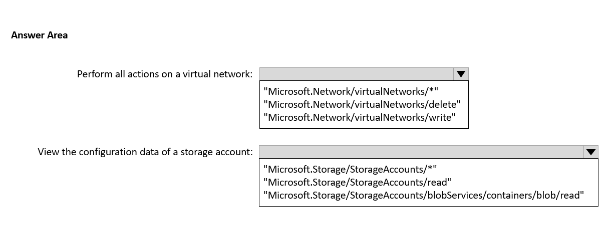
Question

Question 244
You have an Azure subscription named Subscription1.

You have 5 TB of data that you need to transfer to Subscription1.

You plan to use an Azure Import/Export job.

What can you use as the destination of the imported data?

A.

Azure Data Factory

B.

the Azure File Sync Storage Sync Service

C.

Azure File Storage

D.

Azure SQL Database

Question 245
HOTSPOT -

You have an Azure subscription that contains a virtual machine named VM1.

To VM1, you plan to add a 1-TB data disk that meets the following requirements:

• Provides data resiliency in the event of a datacenter outage.

• Provides the lowest latency and the highest performance.

• Ensures that no data loss occurs if a host fails.

You need to recommend which type of storage and host caching to configure for the new data disk.

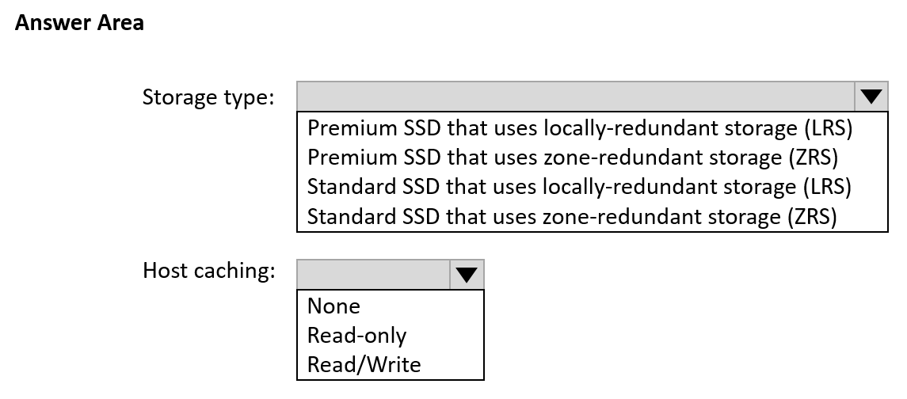

Question 246
You have an Azure virtual machine named VM1 and an Azure key vault named Vault1.

On VM1, you plan to configure Azure Disk Encryption to use a key encryption key (KEK).

You need to prepare Vault1 for Azure Disk Encryption.

Which two actions should you perform on Vault1? Each correct answer presents part of the solution.

NOTE: Each correct selection is worth one point.

A.

Select Azure Virtual machines for deployment.

B.

Create a new key.

C.

Create a new secret.

D.

Configure a key rotation policy.

E.

Select Azure Disk Encryption for volume encryption.

Question 247
You have an Azure subscription that contains a virtual machine named VM1 and an Azure key vault named KV1.

You need to configure encryption for VM1. The solution must meet the following requirements:

• Store and use the encryption key in KV1.

• Maintain encryption if VM1 is downloaded from Azure.

• Encrypt both the operating system disk and the data disks.

Which encryption method should you use?

A.

customer-managed keys

B.

Confidential disk encryption

C.

Azure Disk Encryption

D.

encryption at host

Question 248
DRAG DROP -

You have an Azure subscription that contains a storage account.

You have an on-premises server named Server1 that runs Windows Server 2016. Server1 has 2 TB of data.

You need to transfer the data to the storage account by using the Azure Import/Export service.

In which order should you perform the actions? To answer, move all actions from the list of actions to the answer area and arrange them in the correct order.

NOTE: More than one order of answer choices is correct. You will receive credit for any of the correct orders you select.

Select and Place:
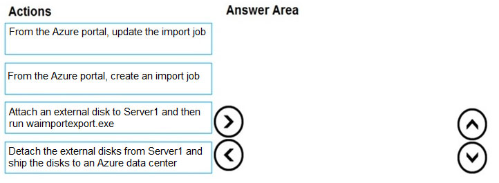
Question

Question 249
HOTSPOT

-

You have an Azure subscription that contains a storage account named storage1.

You need to configure a shared access signature (SAS) to ensure that users can only download blobs securely by name.

Which two settings should you configure? To answer, select the appropriate settings in the answer area.

NOTE: Each correct answer is worth one point.
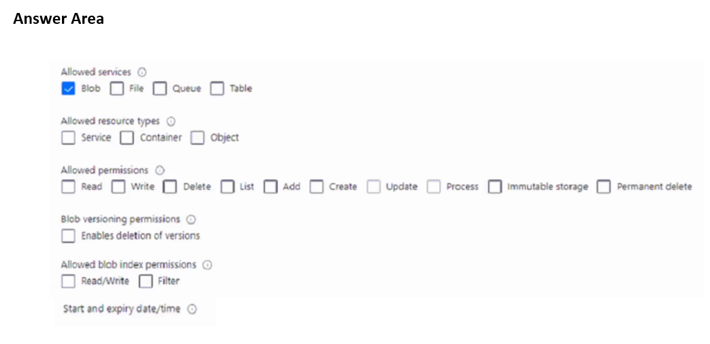
Question

Question 250
You have an Azure subscription that contains a storage account named storage1. The storage1 account contains a container named container1.

You need to configure access to container1. The solution must meet the following requirements:

• Only allow read access.

• Allow both HTTP and HTTPS protocols.

• Apply access permissions to all the content in the container.

What should you use?

A.

an access policy

B.

a shared access signature (SAS)

C.

Azure Content Delivery Network (CDN)

D.

access keys

Question 251
You need to create an Azure Storage account named storage1. The solution must meet the following requirements:

• Support Azure Data Lake Storage.

• Minimize costs for infrequently accessed data.

• Automatically replicate data to a secondary Azure region.

Which three options should you configure for storage1? Each correct answer presents part of the solution.

NOTE: Each correct answer is worth one point.

A.

zone-redundant storage (ZRS)

B.

the Cool access tire

C.

geo-redundant storage (GRS)

D.

the Hot access tier

E.

hierarchical namespace

Question 252
HOTSPOT

-

You have an Azure Storage account named storage1 that contains two containers named container1 and container2. Blob versioning is enabled for both containers.

You periodically take blob snapshots of critical blobs.

You create the following lifecycle management policy.
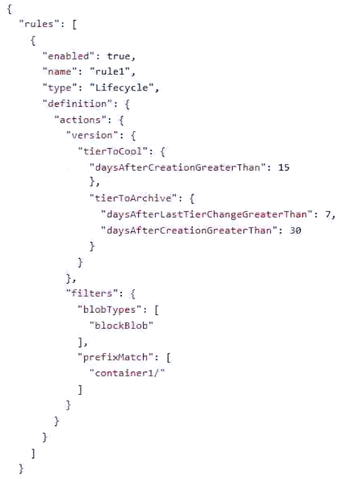
Question
For each of the following statements, select Yes if the statement is true. Otherwise, select No.

NOTE: Each correct selection is worth one point.
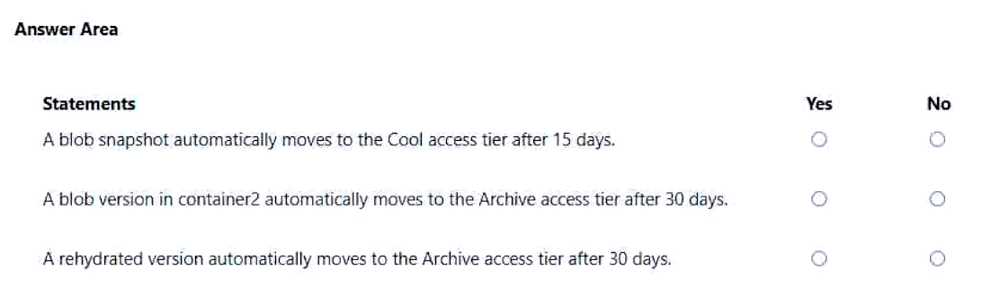
Question

Question 253
You have an Azure subscription that contains the storage accounts shown in the following table.
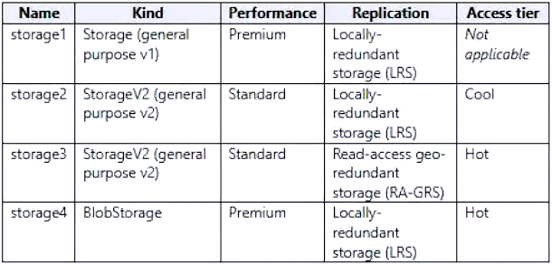
Question
Which storage account can be converted to zone-redundant storage (ZRS) replication?

A.

storage1

B.

storage2

C.

storage3

D.

storage4

Question 254
You have an Azure subscription that contains the devices shown in the following table.
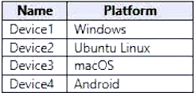
Question
On which devices can you install Azure Storage Explorer?

A.

Device1 only

B.

Device1 and Device2 only

C.

Device1 and Device3 only

D.

Device1, Device2, and Device3 only

E.

Device1, Device3, and Device4 only

Question 255
Note: This question is part of a series of questions that present the same scenario. Each question in the series contains a unique solution that might meet the stated goals. Some question sets might have more than one correct solution, while others might not have a correct solution.

After you answer a question in this section, you will NOT be able to return to it. As a result, these questions will not appear in the review screen.

You have an Azure Storage account named storage1.

You need to enable a user named User1 to list and regenerate storage account keys for storage1.

Solution: You assign the Storage Account Key Operator Service Role to User1.

Does this meet the goal?

A.

Yes

B.

No

Question 256
HOTSPOT

-

You have an Azure Storage account named storage1 that contains a container named container1. The container1 container stores thousands of image files.

You plan to use an Azure Resource Manager (ARM) template to create a blob inventory rule named rule1.

You need to ensure that only blobs whose names start with the word finance are stored daily as a CSV file in container1.

How should you complete rule1? To answer, select the options in the answer area.

NOTE: Each correct answer is worth one point.
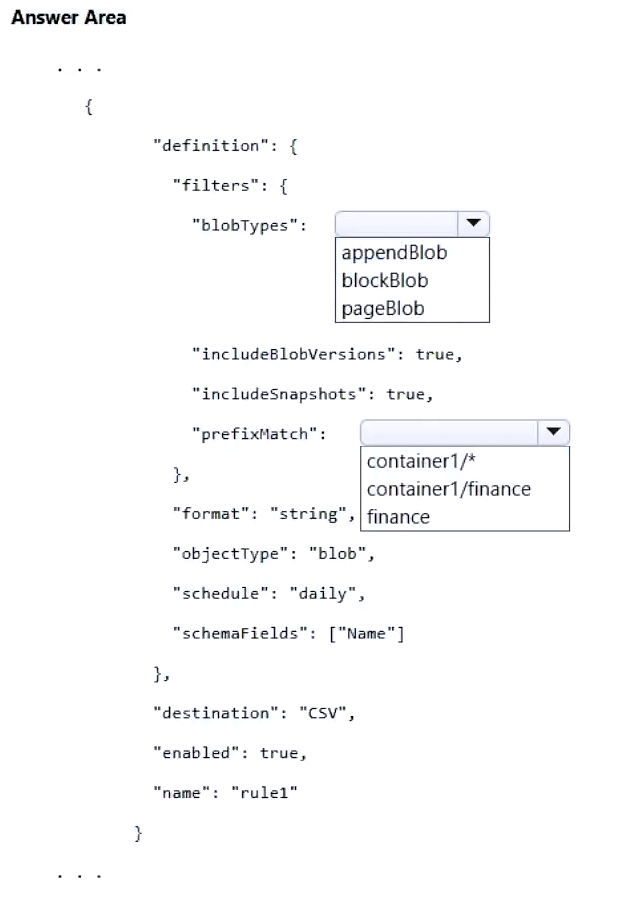
Question

Question 257
HOTSPOT -

You have an Azure subscription that contains a storage account named storage1. The storage1 account contains blobs in a container named container1.

You plan to share access to storage1.

You need to generate a shared access signature (SAS). The solution must meet the following requirements:

• Ensure that the SAS can only be used to enumerate and download blobs stored in container1.

• Use the principle of least privilege.

Which three settings should you enable? To answer, select the appropriate settings in the answer area.
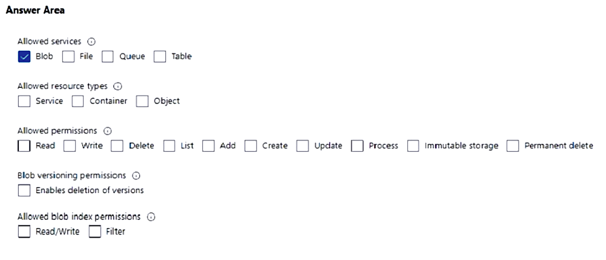
Question

Question 258
HOTSPOT

-

You have an Azure subscription. The subscription contains a storage account named storage1 that has the lifecycle management rules shown in the following table.

Question
On June 1, you store two blobs in storage1 as shown in the following table.

Question
For each of the following statements, select Yes if the statement is true. Otherwise, select No.

NOTE: Each correct selection is worth one point.
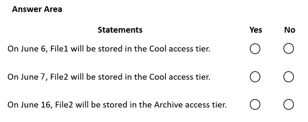
Question

Question 259
HOTSPOT -

You have Azure subscription that includes following Azure file shares:
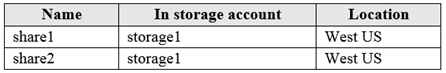
Question
You have the following on-premises servers:
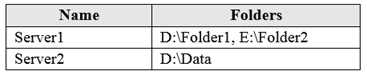
Question
You create a Storage Sync Service named Sync1 and an Azure File Sync group named Group1. Group1 uses share1 as a cloud endpoint.

You register Server1 and Server2 in Sync1. You add D:\Folder1 on Server1 as a server endpoint of Group1.

For each of the following statements, select Yes if the statement is true. Otherwise, select No.

NOTE: Each correct selection is worth one point.

Hot Area:
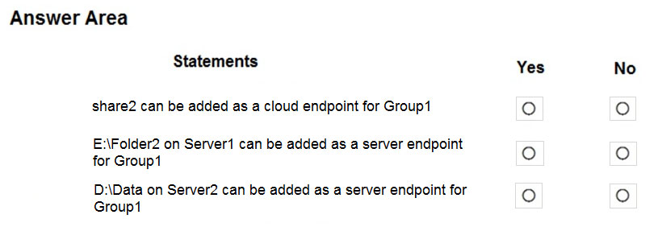
Question

Question 260
HOTSPOT -

You have an Azure Storage account named contoso2024 that contains the resources shown in the following table.
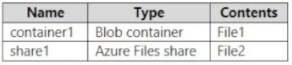
Question
You have users that have permissions for contoso2024 as shown in the following table.
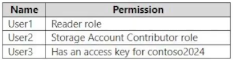
Question
The contoso2024 account is configured as shown in the following exhibit.
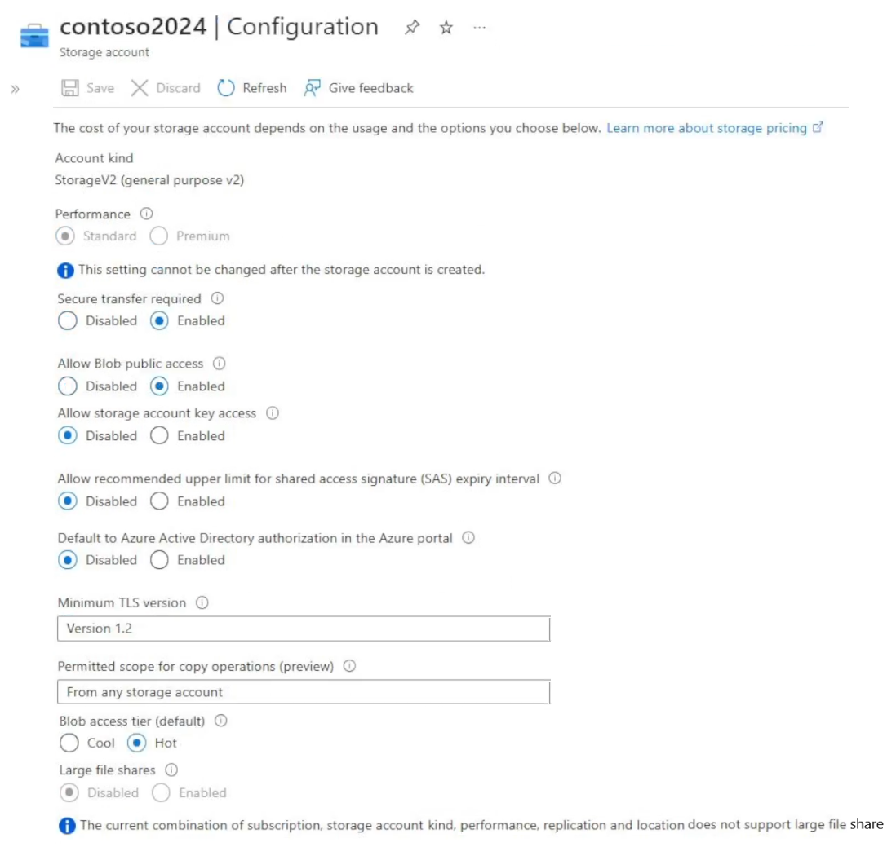
Question
For each of the following statements, select Yes if the statement is true. Otherwise, select No.

NOTE: Each correct selection is worth one point.

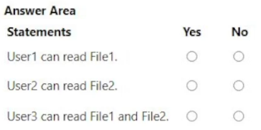

Question 261
HOTSPOT

-

You have an Azure subscription linked to a hybrid Microsoft Entra tenant. The tenant contains the users shown in the following table.
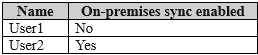
Question
You create the Azure Files shares shown in the following table.
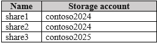
Question
You configure identity-based access for contoso2024 as shown in the following exhibit.
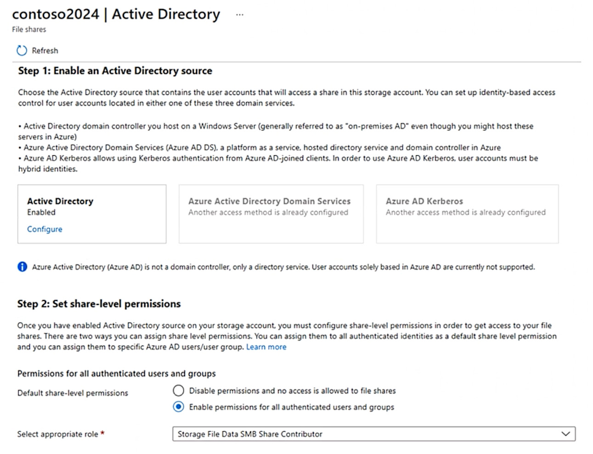
Question
For each of the following statements, select Yes if the statement is true. Otherwise, select No.

NOTE: Each correct selection is worth one point.
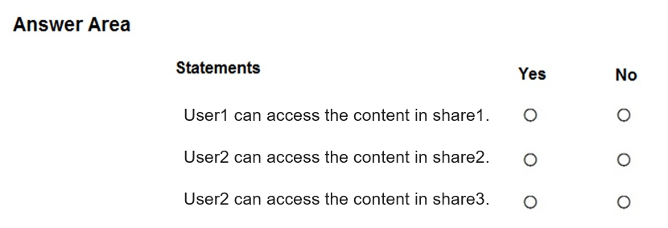
Question

Question 262
HOTSPOT

-

Your network contains an on-premises Active Directory Domain Services (AD DS) domain.

The domain contains the identities shown in the following table.
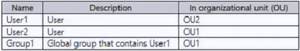
Question
You have an Azure subscription that contains a storage account named storage1. The file shares in storage1 have an identity source of AD DS and Default share-level permissions set to Enable permissions for all authenticated users and groups.

You create an Azure Files share named share1 that has the roles shown in the following table.
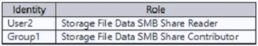
Question
You have a Microsoft Entra tenant that contains a cloud-only user named User3.

You use Microsoft Entra Connect to sync OU1 from the AD DS domain to the Microsoft Entra tenant.

For each of the following statements, select Yes if the statement is true. Otherwise, select No.

NOTE: Each correct selection is worth one point.
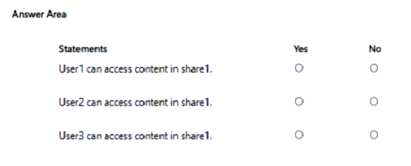
Question

Question 263
You have an Azure subscription that contains the storage accounts shown in the following table.
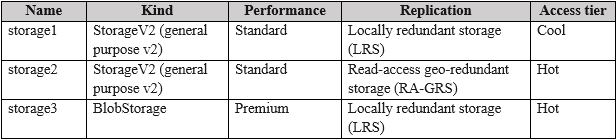
Question
Which storage account can be converted to zone-redundant storage (ZRS) replication?

A.

storage1 only

B.

storage2 only

C.

storage3 only

D.

storage2 and storage3

E.

storage1, storage2, and storage3

Question 264
Note: This question is part of a series of questions that present the same scenario. Each question in the series contains a unique solution that might meet the stated goals. Some question sets might have more than one correct solution, while others might not have a correct solution.

After you answer a question in this section, you will NOT be able to return to it. As a result, these questions will not appear in the review screen.

You have an Azure Storage account named storage1.

You need to enable a user named User1 to list and regenerate storage account keys for storage1.

Solution: You assign the Reader and Data Access role to User1.

Does this meet the goal?

A.

Yes

B.

No

Question 265
You have an Azure subscription that contains a Standard SKU Azure container registry named ContReg1.

You need to ensure that ContReg1 supports geo-replication.

What should you do first for ContReg1?

A.

Enable Admin user.

B.

Add a scope map.

C.

Add an automation task.

D.

Create a cache rule.

E.

Upgrade the SKU.

Question 266
HOTSPOT -

Case study -

This is a case study. Case studies are not timed separately. You can use as much exam time as you would like to complete each case. However, there may be additional case studies and sections on this exam. You must manage your time to ensure that you are able to complete all questions included on this exam in the time provided.

To answer the questions included in a case study, you will need to reference information that is provided in the case study. Case studies might contain exhibits and other resources that provide more information about the scenario that is described in the case study. Each question is independent of the other questions in this case study.

At the end of this case study, a review screen will appear. This screen allows you to review your answers and to make changes before you move to the next section of the exam. After you begin a new section, you cannot return to this section.

To start the case study -

To display the first question in this case study, click the Next button. Use the buttons in the left pane to explore the content of the case study before you answer the questions. Clicking these buttons displays information such as business requirements, existing environment, and problem statements. If the case study has an All Information tab, note that the information displayed is identical to the information displayed on the subsequent tabs. When you are ready to answer a question, click the Question button to return to the question.

Overview -

ADatum Corporation is consulting firm that has a main office in Montreal and branch offices in Seattle and New York.

Existing Environment -

Azure Environment -

ADatum has an Azure subscription that contains three resource groups named RG1, RG2, and RG3.

The subscription contains the storage accounts shown in the following table.

Question
The subscription contains the virtual machines shown in the following table.

Question
The subscription has an Azure container registry that contains the images shown in the following table.

Question
The subscription contains the resources shown in the following table.

Question
Azure Key Vault -

The subscription contains an Azure key vault named Vault1.

Vault1 contains the certificates shown in the following table.

Question
Vault1 contains the keys shown in the following table.
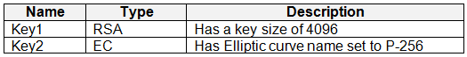
Question
Microsoft Entra Environment -

ADatum has a Microsoft Entra tenant named adatum.com that is linked to the Azure subscription and contains the users shown in the following table.

Question
The tenant contains the groups shown in the following table.

Question
The adatum.com tenant has a custom security attribute named Attribute1.

Planned Changes -

ADatum plans to implement the following changes:

• Configure a data collection rule (DCR) named DCR1 to collect only system events that have an event ID of 4648 from VM2 and VM4.

• In storage1, create a new container named cont2 that has the following access policies: o Three stored access policies named Stored1, Stored2, and Stored3 o A legal hold for immutable blob storage

• Whenever possible, use directories to organize storage account content.

• Grant User1 the permissions required to link Zone1 to VNet1.

• Assign Attribute1 to supported adatum.com resources.

• In storage2, create an encryption scope named Scope1.

• Deploy new containers by using Image1 or Image2.

Technical Requirements -

ADatum must meet the following technical requirements:

• Use TLS for WebApp1.

• Follow the principle of least privilege.

• Grant permissions at the required scope only.

• Ensure that Scope1 is used to encrypt storage services.

• Use Azure Backup to back up cont1 and share1 as frequently as possible.

• Whenever possible, use Azure Disk Encryption and a key encryption key (KEK) to encrypt the virtual machines.

You implement the planned changes for cont2.

What is the maximum number of additional access policies you can create for cont2? To answer, select the appropriate options in the answer area.

NOTE: Each correct selection is worth one point.
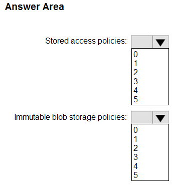
Question

Question 267
Case study -

This is a case study. Case studies are not timed separately. You can use as much exam time as you would like to complete each case. However, there may be additional case studies and sections on this exam. You must manage your time to ensure that you are able to complete all questions included on this exam in the time provided.

To answer the questions included in a case study, you will need to reference information that is provided in the case study. Case studies might contain exhibits and other resources that provide more information about the scenario that is described in the case study. Each question is independent of the other questions in this case study.

At the end of this case study, a review screen will appear. This screen allows you to review your answers and to make changes before you move to the next section of the exam. After you begin a new section, you cannot return to this section.

To start the case study -

To display the first question in this case study, click the Next button. Use the buttons in the left pane to explore the content of the case study before you answer the questions. Clicking these buttons displays information such as business requirements, existing environment, and problem statements. If the case study has an All Information tab, note that the information displayed is identical to the information displayed on the subsequent tabs. When you are ready to answer a question, click the Question button to return to the question.

Overview -

ADatum Corporation is consulting firm that has a main office in Montreal and branch offices in Seattle and New York.

Existing Environment -

Azure Environment -

ADatum has an Azure subscription that contains three resource groups named RG1, RG2, and RG3.

The subscription contains the storage accounts shown in the following table.
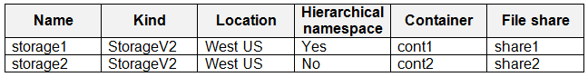
Question
The subscription contains the virtual machines shown in the following table.

Question
The subscription has an Azure container registry that contains the images shown in the following table.

Question
The subscription contains the resources shown in the following table.

Question
Azure Key Vault -

The subscription contains an Azure key vault named Vault1.

Vault1 contains the certificates shown in the following table.

Question
Vault1 contains the keys shown in the following table.

Question
Microsoft Entra Environment -

ADatum has a Microsoft Entra tenant named adatum.com that is linked to the Azure subscription and contains the users shown in the following table.
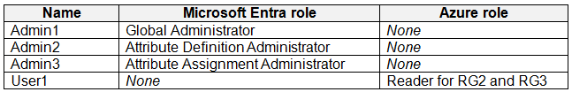
Question
The tenant contains the groups shown in the following table.

Question
The adatum.com tenant has a custom security attribute named Attribute1.

Planned Changes -

ADatum plans to implement the following changes:

• Configure a data collection rule (DCR) named DCR1 to collect only system events that have an event ID of 4648 from VM2 and VM4.

• In storage1, create a new container named cont2 that has the following access policies: o Three stored access policies named Stored1, Stored2, and Stored3 o A legal hold for immutable blob storage

• Whenever possible, use directories to organize storage account content.

• Grant User1 the permissions required to link Zone1 to VNet1.

• Assign Attribute1 to supported adatum.com resources.

• In storage2, create an encryption scope named Scope1.

• Deploy new containers by using Image1 or Image2.

Technical Requirements -

ADatum must meet the following technical requirements:

• Use TLS for WebApp1.

• Follow the principle of least privilege.

• Grant permissions at the required scope only.

• Ensure that Scope1 is used to encrypt storage services.

• Use Azure Backup to back up cont1 and share1 as frequently as possible.

• Whenever possible, use Azure Disk Encryption and a key encryption key (KEK) to encrypt the virtual machines.

You need to configure encryption for the virtual machines. The solution must meet the technical requirements.

Which virtual machines can you encrypt?

A.

VM1 and VM3

B.

VM4 and VM5

C.

VM2 and VM3

D.

VM2 and VM4

Question 268
Case study -

This is a case study. Case studies are not timed separately. You can use as much exam time as you would like to complete each case. However, there may be additional case studies and sections on this exam. You must manage your time to ensure that you are able to complete all questions included on this exam in the time provided.

To answer the questions included in a case study, you will need to reference information that is provided in the case study. Case studies might contain exhibits and other resources that provide more information about the scenario that is described in the case study. Each question is independent of the other questions in this case study.

At the end of this case study, a review screen will appear. This screen allows you to review your answers and to make changes before you move to the next section of the exam. After you begin a new section, you cannot return to this section.

To start the case study -

To display the first question in this case study, click the Next button. Use the buttons in the left pane to explore the content of the case study before you answer the questions. Clicking these buttons displays information such as business requirements, existing environment, and problem statements. If the case study has an All Information tab, note that the information displayed is identical to the information displayed on the subsequent tabs. When you are ready to answer a question, click the Question button to return to the question.

Overview -

ADatum Corporation is consulting firm that has a main office in Montreal and branch offices in Seattle and New York.

Existing Environment -

Azure Environment -

ADatum has an Azure subscription that contains three resource groups named RG1, RG2, and RG3.

The subscription contains the storage accounts shown in the following table.

Question
The subscription contains the virtual machines shown in the following table.
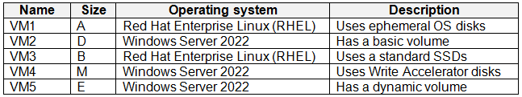
Question
The subscription has an Azure container registry that contains the images shown in the following table.

Question
The subscription contains the resources shown in the following table.
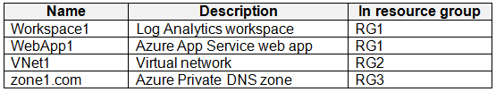
Question
Azure Key Vault -

The subscription contains an Azure key vault named Vault1.

Vault1 contains the certificates shown in the following table.

Question
Vault1 contains the keys shown in the following table.

Question
Microsoft Entra Environment -

ADatum has a Microsoft Entra tenant named adatum.com that is linked to the Azure subscription and contains the users shown in the following table.

Question
The tenant contains the groups shown in the following table.
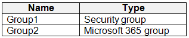
Question
The adatum.com tenant has a custom security attribute named Attribute1.

Planned Changes -

ADatum plans to implement the following changes:

• Configure a data collection rule (DCR) named DCR1 to collect only system events that have an event ID of 4648 from VM2 and VM4.

• In storage1, create a new container named cont2 that has the following access policies: o Three stored access policies named Stored1, Stored2, and Stored3 o A legal hold for immutable blob storage

• Whenever possible, use directories to organize storage account content.

• Grant User1 the permissions required to link Zone1 to VNet1.

• Assign Attribute1 to supported adatum.com resources.

• In storage2, create an encryption scope named Scope1.

• Deploy new containers by using Image1 or Image2.

Technical Requirements -

ADatum must meet the following technical requirements:

• Use TLS for WebApp1.

• Follow the principle of least privilege.

• Grant permissions at the required scope only.

• Ensure that Scope1 is used to encrypt storage services.

• Use Azure Backup to back up cont1 and share1 as frequently as possible.

• Whenever possible, use Azure Disk Encryption and a key encryption key (KEK) to encrypt the virtual machines.

You need to implement the planned changes for the storage account content.

Which containers and file shares can you use to organize the content?

A.

share1 only

B.

cont1 and share1 only

C.

share1 and share2 only

D.

cont1, share1, and share2 only

E.

cont1, cont2, share1, and share2

Question 269
Note: This question is part of a series of questions that present the same scenario. Each question in the series contains a unique solution that might meet the stated goals. Some question sets might have more than one correct solution, while others might not have a correct solution.

After you answer a question in this section, you will NOT be able to return to it. As a result, these questions will not appear in the review screen.

You deploy an Azure Kubernetes Service (AKS) cluster named AKS1.

You need to deploy a YAML file to AKS1.

Solution: From Azure CLI, you run az aks.

Does this meet the goal?

A.

Yes

B.

No

Question 270
HOTSPOT -

You have an Azure Kubernetes Service (AKS) cluster named AKS1 and a computer named Computer1 that runs Windows 10. Computer1 that has the Azure CLI installed.

You need to install the kubectl client on Computer1.

Which command should you run? To answer, select the appropriate options in the answer area.

NOTE: Each correct selection is worth one point.

Hot Area:
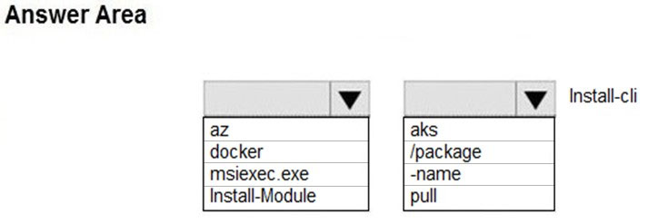

Question 271
You have an Azure subscription.

You create the following Azure Resource Manager (ARM) template named Template.json.
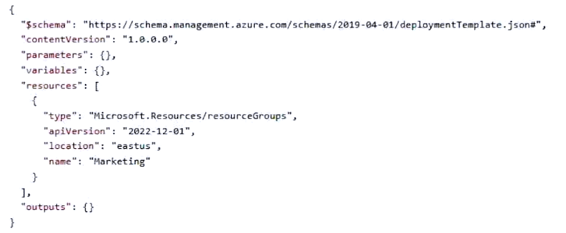
Question
You need to deploy Template.json.

Which PowerShell cmdlet should you run from Azure Cloud Shell?

A.

New-AzSubscriptionDeployment

B.

New-AzManagementGroupDeployment

C.

New-AzResourceGroupDeployment

D.

New-AzTenantDeployment

Question 272
You have an Azure subscription that contains a resource group named RG1.

You plan to create a storage account named storage1.

You have a Bicep file named File1.

You need to modify File1 so that it can be used to automate the deployment of storage1 to RG1.

Which property should you modify?

A.

kind

B.

scope

C.

sku

D.

location

Question 273
HOTSPOT

-

Your company purchases a new Azure subscription.

You create a file named Deploy.json as shown in the following exhibit.
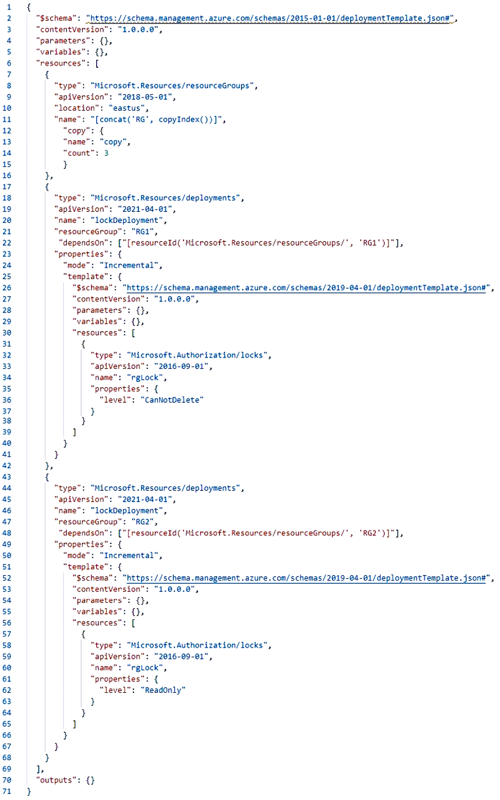
Question
You connect to the subscription and run the following cmdlet.

New-AzDeployment -Location westus -TemplateFile “deploy.json”

For each of the following statements, select Yes if the statement is true. Otherwise, select No.

NOTE: Each correct selection is worth one point.
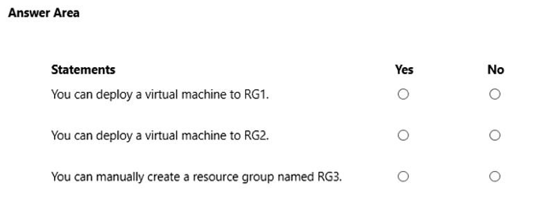
Question

Question 274
You have an Azure subscription that contains the resources shown in the following table.
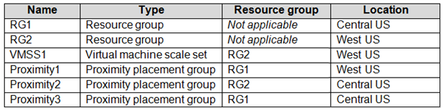
Question
You need to configure a proximity placement group for VMSS1.

Which proximity placement groups should you use?

A.

Proximity2 only

B.

Proximity1, Proximity2, and Proximity3

C.

Proximity1 only

D.

Proximity1 and Proximity3 only

Question 275
HOTSPOT

-

You have an Azure subscription that contains the virtual networks shown in the following table.
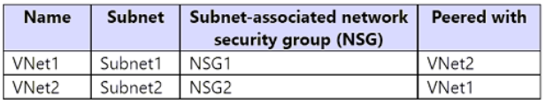
Question
The subscription contains the virtual machines shown in the following table.
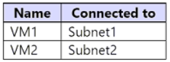
Question
The subscription contains the Azure App Service web apps shown in the following table.
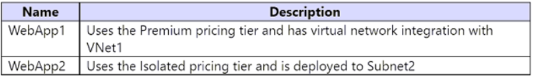
Question
For each of the following statements, select Yes if the statement is true. Otherwise, select No.

NOTE: Each correct selection is worth one point.
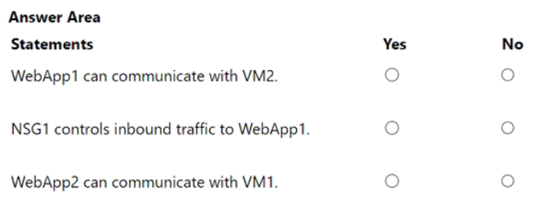

Question 276
You have an Azure subscription named Subscription1 that contains the resources shown in the following table.
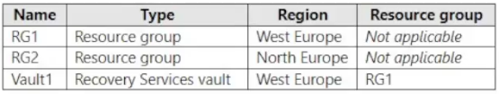
Question
You create virtual machines in Subscription1 as shown in the following table.
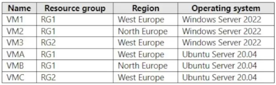
Question
You plan to use Vault1 for the backup of as many virtual machines as possible.

Which virtual machines can be backed up to Vault1?

A.

VM1 only

B.

VM3 and VMC only

C.

VM1, VM2, VM3, VMA, VMB, and VMC

D.

VM1, VM3, VMA, and VMC only

E.

VM1 and VM3 only

Question 277
You have an Azure subscription that contains an Azure container registry named ContReg1.

You enable the Admin user for ContReg1.

Which username can you use to sign in to ContReg1?

A.

root

B.

admin

C.

administrator

D.

ContReg1

Question 278
You have an Azure subscription.

You plan to create an Azure container registry named ContReg1.

You need to ensure that you can push and pull signed images for ContReg1.

What should you do for ContReg1?

A.

Enable encryption by using a customer-managed key.

B.

Create a connected registry.

C.

Add a token.

D.

Enable content trust.

Question 279
HOTSPOT

-

You have an Azure subscription that has the Azure container registries shown in the following table.
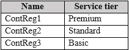
Question
You plan to use ACR Tasks and configure private endpoint connections.

Which container registries support ACR Tasks and private endpoints? To answer, select the appropriate options in the answer area.

NOTE: Each correct selection is worth one point.
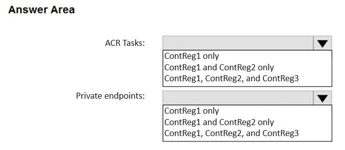
Question

Question 280
You plan to deploy several Azure virtual machines that will run Windows Server 2022 in a virtual machine scale set by using an Azure Resource Manager template.

You need to ensure that NGINX is available on all the virtual machines after they are deployed.

What should you use?

A.

Azure Custom Script Extension

B.

Deployment Center in Azure App Service

C.

Microsoft Entra Application Proxy

D.

the Publish-AzVMDscConfiguration cmdlet

Question 281
DRAG DROP -

You onboard 10 Azure virtual machines to Azure Automation State Configuration.

You need to use Azure Automation State Configuration to manage the ongoing consistency of the virtual machine configurations.

Which three actions should you perform in sequence? To answer, move the appropriate actions from the list of actions to the answer area and arrange them in the correct order.

NOTE: More than one order of answer choices is correct. You will receive credit for any of the correct orders you select.

Select and Place:
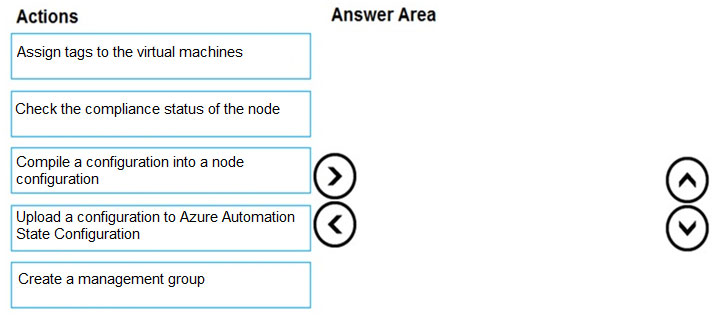
Question

Question 282
You have an Azure subscription that contains a container group named Group1. Group1 contains two Azure container instances as shown in the following table.
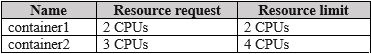
Question
You need to ensure that container2 can use CPU resources without negatively affecting container1.

What should you do?

A.

Increase the resource limit of container1 to three CPUs.

B.

Increase the resource limit of container2 to six CPUs.

C.

Remove the resource limit for both containers.

D.

Decrease the resource limit of container2 to two CPUs.

Question 283
You have an Azure subscription.

You plan to deploy a container.

You need to recommend which Azure services can scale the container automatically.

What should you recommend?

A.

Azure Container Apps only

B.

Azure Container Instances only

C.

Azure Container Apps or Azure App Service only

D.

Azure Container Instances or Azure App Service only

E.

Azure Container Apps, Azure Container Instances, or Azure App Service

Question 284
HOTSPOT

-

You have an Azure subscription that uses Azure Container Instances.

You have a computer that has Azure Command-Line Interface (CLI) and Docker installed.

You create a container image named image1.

You need to provision a new Azure container registry and add image1 to the registry.

Which command should you run for each requirement? To answer, select the options in the answer area.

NOTE: Each correct answer is worth one point.
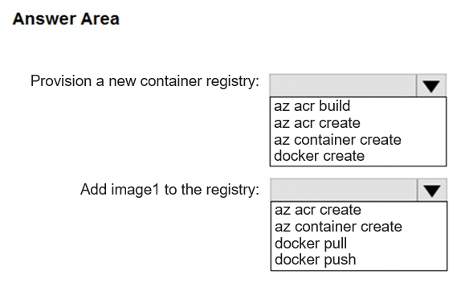
Question

Question 285
Note: This question is part of a series of questions that present the same scenario. Each question in the series contains a unique solution that might meet the stated goals. Some question sets might have more than one correct solution, while others might not have a correct solution.

After you answer a question in this section, you will NOT be able to return to it. As a result, these questions will not appear in the review screen.

You have an Azure container registry named Registry1 that contains an image named image1.

You receive an error message when you attempt to deploy a container instance by using image1.

You need to be able to deploy a container instance by using image1.

Solution: You assign the AcrPull role to ACR-Tasks-Network for Registry1.

Does this meet the goal?

A.

Yes

B.

No

Question 286
Note: This question is part of a series of questions that present the same scenario. Each question in the series contains a unique solution that might meet the stated goals. Some question sets might have more than one correct solution, while others might not have a correct solution.

After you answer a question in this section, you will NOT be able to return to it. As a result, these questions will not appear in the review screen.

You have an Azure container registry named Registry1 that contains an image named image1.

You receive an error message when you attempt to deploy a container instance by using image1.

You need to be able to deploy a container instance by using image1.

Solution: You select Use dedicated data endpoint for Registry1.

Does this meet the goal?

A.

Yes

B.

No

Question 287
Note: This question is part of a series of questions that present the same scenario. Each question in the series contains a unique solution that might meet the stated goals. Some question sets might have more than one correct solution, while others might not have a correct solution.

After you answer a question in this section, you will NOT be able to return to it. As a result, these questions will not appear in the review screen.

You have an Azure container registry named Registry1 that contains an image named image1.

You receive an error message when you attempt to deploy a container instance by using image1.

You need to be able to deploy a container instance by using image1.

Solution: You create a private endpoint connection for Registry1.

Does this meet the goal?

A.

Yes

B.

No

Question 288
You have a Standard Azure App Service plan named Plan1.

You need to ensure that Plan1 will scale automatically when the CPU usage of the web app exceeds 80 percent.

What should you select for Plan1?

A.

Automatic in the Scale out method settings

B.

Rules Based in the Scale out method settings

C.

Premium P1 in the Scale up (App Service plan) settings

D.

Standard S1 in the Scale up (App Service plan) settings

E.

Manual in the Scale out method settings

Question 289
Case study -

This is a case study. Case studies are not timed separately. You can use as much exam time as you would like to complete each case. However, there may be additional case studies and sections on this exam. You must manage your time to ensure that you are able to complete all questions included on this exam in the time provided.

To answer the questions included in a case study, you will need to reference information that is provided in the case study. Case studies might contain exhibits and other resources that provide more information about the scenario that is described in the case study. Each question is independent of the other questions in this case study.

At the end of this case study, a review screen will appear. This screen allows you to review your answers and to make changes before you move to the next section of the exam. After you begin a new section, you cannot return to this section.

To start the case study -

To display the first question in this case study, click the Next button. Use the buttons in the left pane to explore the content of the case study before you answer the questions. Clicking these buttons displays information such as business requirements, existing environment, and problem statements. If the case study has an All Information tab, note that the information displayed is identical to the information displayed on the subsequent tabs. When you are ready to answer a question, click the Question button to return to the question.

Overview -

ADatum Corporation is consulting firm that has a main office in Montreal and branch offices in Seattle and New York.

Existing Environment -

Azure Environment -

ADatum has an Azure subscription that contains three resource groups named RG1, RG2, and RG3.

The subscription contains the storage accounts shown in the following table.

Question
The subscription contains the virtual machines shown in the following table.

Question
The subscription has an Azure container registry that contains the images shown in the following table.
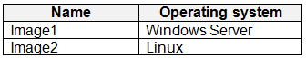
Question
The subscription contains the resources shown in the following table.

Question
Azure Key Vault -

The subscription contains an Azure key vault named Vault1.

Vault1 contains the certificates shown in the following table.

Question
Vault1 contains the keys shown in the following table.

Question
Microsoft Entra Environment -

ADatum has a Microsoft Entra tenant named adatum.com that is linked to the Azure subscription and contains the users shown in the following table.

Question
The tenant contains the groups shown in the following table.

Question
The adatum.com tenant has a custom security attribute named Attribute1.

Planned Changes -

ADatum plans to implement the following changes:

• Configure a data collection rule (DCR) named DCR1 to collect only system events that have an event ID of 4648 from VM2 and VM4.

• In storage1, create a new container named cont2 that has the following access policies: o Three stored access policies named Stored1, Stored2, and Stored3 o A legal hold for immutable blob storage

• Whenever possible, use directories to organize storage account content.

• Grant User1 the permissions required to link Zone1 to VNet1.

• Assign Attribute1 to supported adatum.com resources.

• In storage2, create an encryption scope named Scope1.

• Deploy new containers by using Image1 or Image2.

Technical Requirements -

ADatum must meet the following technical requirements:

• Use TLS for WebApp1.

• Follow the principle of least privilege.

• Grant permissions at the required scope only.

• Ensure that Scope1 is used to encrypt storage services.

• Use Azure Backup to back up cont1 and share1 as frequently as possible.

• Whenever possible, use Azure Disk Encryption and a key encryption key (KEK) to encrypt the virtual machines.

You need to configure WebApp1 to meet the technical requirements.

Which certificate can you use from Vault1?

A.

Cert1 only

B.

Cert1 or Cert2 only

C.

Cert1 or Cert3 only

D.

Cert3 or Cert4 only

E.

Cert1, Cert2 Cert3, or Cert4

Question 290
Note: This question is part of a series of questions that present the same scenario. Each question in the series contains a unique solution that might meet the stated goals. Some question sets might have more than one correct solution, while others might not have a correct solution.

After you answer a question in this section, you will NOT be able to return to it. As a result, these questions will not appear in the review screen.

You have an Azure virtual machine named VM1. VM1 was deployed by using a custom Azure Resource Manager template named ARM1.json.

You receive a notification that VM1 will be affected by maintenance.

You need to move VM1 to a different host immediately.

Solution: From the resource group blade, move VM1 to another subscription.

Does this meet the goal?

A.

Yes

B.

No

Question 291
Note: This question is part of a series of questions that present the same scenario. Each question in the series contains a unique solution that might meet the stated goals. Some question sets might have more than one correct solution, while others might not have a correct solution.

After you answer a question in this section, you will NOT be able to return to it. As a result, these questions will not appear in the review screen.

You have an Azure virtual machine named VM1. VM1 was deployed by using a custom Azure Resource Manager template named ARM1.json.

You receive a notification that VM1 will be affected by maintenance.

You need to move VM1 to a different host immediately.

Solution: From the VM1 Redeploy + reapply blade, you select Redeploy.

Does this meet the goal?

A.

Yes

B.

No

Question 292
You have an Azure Resource Manager template named Template1 that is used to deploy an Azure virtual machine.

Template1 contains the following text:

Question
The variables section in Template1 contains the following text:

"location": "westeurope"

The resources section in Template1 contains the following text:

Question
You need to deploy the virtual machine to the West US location by using Template1.

What should you do?

A.

Modify the location in the resources section to westus

B.

Select West US during the deployment

C.

Modify the location in the variables section to westus

Question 293
Note: This question is part of a series of questions that present the same scenario. Each question in the series contains a unique solution that might meet the stated goals. Some question sets might have more than one correct solution, while others might not have a correct solution.

After you answer a question in this section, you will NOT be able to return to it. As a result, these questions will not appear in the review screen.

You have an Azure virtual machine named VM1. VM1 was deployed by using a custom Azure Resource Manager template named ARM1.json.

You receive a notification that VM1 will be affected by maintenance.

You need to move VM1 to a different host immediately.

Solution: From the VM1 Updates blade, select One-time update.

Does this meet the goal?

A.

Yes

B.

No

Question 294
Case study -

This is a case study. Case studies are not timed separately. You can use as much exam time as you would like to complete each case. However, there may be additional case studies and sections on this exam. You must manage your time to ensure that you are able to complete all questions included on this exam in the time provided.

To answer the questions included in a case study, you will need to reference information that is provided in the case study. Case studies might contain exhibits and other resources that provide more information about the scenario that is described in the case study. Each question is independent of the other questions in this case study.

At the end of this case study, a review screen will appear. This screen allows you to review your answers and to make changes before you move to the next section of the exam. After you begin a new section, you cannot return to this section.

To start the case study -

To display the first question in this case study, click the Next button. Use the buttons in the left pane to explore the content of the case study before you answer the questions. Clicking these buttons displays information such as business requirements, existing environment, and problem statements. If the case study has an All Information tab, note that the information displayed is identical to the information displayed on the subsequent tabs. When you are ready to answer a question, click the Question button to return to the question.

Overview -

ADatum Corporation is consulting firm that has a main office in Montreal and branch offices in Seattle and New York.

Existing Environment -

Azure Environment -

ADatum has an Azure subscription that contains three resource groups named RG1, RG2, and RG3.

The subscription contains the storage accounts shown in the following table.

Question
The subscription contains the virtual machines shown in the following table.

Question
The subscription has an Azure container registry that contains the images shown in the following table.

Question
The subscription contains the resources shown in the following table.

Question
Azure Key Vault -

The subscription contains an Azure key vault named Vault1.

Vault1 contains the certificates shown in the following table.

Question
Vault1 contains the keys shown in the following table.

Question
Microsoft Entra Environment -

ADatum has a Microsoft Entra tenant named adatum.com that is linked to the Azure subscription and contains the users shown in the following table.

Question
The tenant contains the groups shown in the following table.

Question
The adatum.com tenant has a custom security attribute named Attribute1.

Planned Changes -

ADatum plans to implement the following changes:

• Configure a data collection rule (DCR) named DCR1 to collect only system events that have an event ID of 4648 from VM2 and VM4.

• In storage1, create a new container named cont2 that has the following access policies: o Three stored access policies named Stored1, Stored2, and Stored3 o A legal hold for immutable blob storage

• Whenever possible, use directories to organize storage account content.

• Grant User1 the permissions required to link Zone1 to VNet1.

• Assign Attribute1 to supported adatum.com resources.

• In storage2, create an encryption scope named Scope1.

• Deploy new containers by using Image1 or Image2.

Technical Requirements -

ADatum must meet the following technical requirements:

• Use TLS for WebApp1.

• Follow the principle of least privilege.

• Grant permissions at the required scope only.

• Ensure that Scope1 is used to encrypt storage services.

• Use Azure Backup to back up cont1 and share1 as frequently as possible.

• Whenever possible, use Azure Disk Encryption and a key encryption key (KEK) to encrypt the virtual machines.

You need to meet the technical requirements for the KEK.

Which PowerShell cmdlet and key should you use?

A.

Set-AzVMDiskEncryptionExtension and Key2.

B.

Set-AzDiskEncryptionKey and Key2.

C.

Set-AzDiskDiskEncryptionKey and Key1.

D.

Set-AzVMDiskEncryptionExtension and Key1.

Question 295
You create an App Service plan named Plan1 and an Azure web app named webapp1.

You discover that the option to create a staging slot is unavailable.

You need to create a staging slot for Plan1.

What should you do first?

A.

From Plan1, scale up the App Service plan

B.

From webapp1, modify the Application settings

C.

From webapp1, add a custom domain

D.

From Plan1, scale out the App Service plan

Question 296
You plan to move a distributed on-premises app named App1 to an Azure subscription.

After the planned move, App1 will be hosted on several Azure virtual machines.

You need to ensure that App1 always runs on at least eight virtual machines during planned Azure maintenance.

What should you create?

A.

one virtual machine scale set that has 10 virtual machines instances

B.

one Availability Set that has three fault domains and one update domain

C.

one Availability Set that has 10 update domains and one fault domain

D.

one virtual machine scale set that has 12 virtual machines instances

Question 297
Note: This question is part of a series of questions that present the same scenario. Each question in the series contains a unique solution that might meet the stated goals. Some question sets might have more than one correct solution, while others might not have a correct solution.

After you answer a question in this section, you will NOT be able to return to it. As a result, these questions will not appear in the review screen.

You have an Azure virtual machine named VM1 that runs Windows Server 2016.

You need to create an alert in Azure when more than two error events are logged to the System event log on VM1 within an hour.

Solution: You create an event subscription on VM1. You create an alert in Azure Monitor and specify VM1 as the source

Does this meet the goal?

A.

Yes

B.

No

Question 298
Note: This question is part of a series of questions that present the same scenario. Each question in the series contains a unique solution that might meet the stated goals. Some question sets might have more than one correct solution, while others might not have a correct solution.

After you answer a question in this section, you will NOT be able to return to it. As a result, these questions will not appear in the review screen.

You have an Azure virtual machine named VM1. VM1 was deployed by using a custom Azure Resource Manager template named ARM1.json.

You receive a notification that VM1 will be affected by maintenance.

You need to move VM1 to a different host immediately.

Solution: From the Overview blade, you move the virtual machine to a different subscription.

Does this meet the goal?

A.

Yes

B.

No

Question 299
Note: This question is part of a series of questions that present the same scenario. Each question in the series contains a unique solution that might meet the stated goals. Some question sets might have more than one correct solution, while others might not have a correct solution.

After you answer a question in this section, you will NOT be able to return to it. As a result, these questions will not appear in the review screen.

You have an Azure virtual machine named VM1. VM1 was deployed by using a custom Azure Resource Manager template named ARM1.json.

You receive a notification that VM1 will be affected by maintenance.

You need to move VM1 to a different host immediately.

Solution: From the Redeploy blade, you click Redeploy.

Does this meet the goal?

A.

Yes

B.

No

Question 300
Note: This question is part of a series of questions that present the same scenario. Each question in the series contains a unique solution that might meet the stated goals. Some question sets might have more than one correct solution, while others might not have a correct solution.

After you answer a question in this section, you will NOT be able to return to it. As a result, these questions will not appear in the review screen.

You have an Azure virtual machine named VM1. VM1 was deployed by using a custom Azure Resource Manager template named ARM1.json.

You receive a notification that VM1 will be affected by maintenance.

You need to move VM1 to a different host immediately.

Solution: From the Update management blade, you click Enable.

Does this meet the goal?

A.

Yes

B.

No

Question 301
You have an Azure subscription that contains a web app named webapp1.

You need to add a custom domain named www.contoso.com to webapp1.

What should you do first?

A.

Create a DNS record

B.

Add a connection string

C.

Upload a certificate.

D.

Stop webapp1.

Question 302
Note: This question is part of a series of questions that present the same scenario. Each question in the series contains a unique solution that might meet the stated goals. Some question sets might have more than one correct solution, while others might not have a correct solution.

After you answer a question in this section, you will NOT be able to return to it. As a result, these questions will not appear in the review screen.

You deploy an Azure Kubernetes Service (AKS) cluster named AKS1.

You need to deploy a YAML file to AKS1.

Solution: From Azure CLI, you run the kubectl client.

Does this meet the goal?

A.

Yes

B.

No

Question 303
Note: This question is part of a series of questions that present the same scenario. Each question in the series contains a unique solution that might meet the stated goals. Some question sets might have more than one correct solution, while others might not have a correct solution.

After you answer a question in this section, you will NOT be able to return to it. As a result, these questions will not appear in the review screen.

You have an Azure subscription that contains the resources shown in the following table.

Question
VM1 connects to VNET1.

You need to connect VM1 to VNET2.

Solution: You move VM1 to RG2, and then you add a new network interface to VM1.

Does this meet the goal?

A.

Yes

B.

No

Question 304
Note: This question is part of a series of questions that present the same scenario. Each question in the series contains a unique solution that might meet the stated goals. Some question sets might have more than one correct solution, while others might not have a correct solution.

After you answer a question in this section, you will NOT be able to return to it. As a result, these questions will not appear in the review screen.

You have an Azure subscription that contains the resources shown in the following table.

Question
VM1 connects to VNET1.

You need to connect VM1 to VNET2.

Solution: You delete VM1. You recreate VM1, and then you create a new network interface for VM1 and connect it to VNET2.

Does this meet the goal?

A.

Yes

B.

No

Question 305
Note: This question is part of a series of questions that present the same scenario. Each question in the series contains a unique solution that might meet the stated goals. Some question sets might have more than one correct solution, while others might not have a correct solution.

After you answer a question in this section, you will NOT be able to return to it. As a result, these questions will not appear in the review screen.

You have an Azure subscription that contains the resources shown in the following table.

Question
VM1 connects to VNET1.

You need to connect VM1 to VNET2.

Solution: You turn off VM1, and then you add a new network interface to VM1.

Does this meet the goal?

A.

Yes

B.

No

Question 306
HOTSPOT -

You have an Azure subscription named Subscription1 that contains the quotas shown in the following table.

Question
You deploy virtual machines to Subscription1 as shown in the following table.

Question
You plan to deploy the virtual machines shown in the following table.

Question
For each of the following statements, select Yes if the statement is true. Otherwise, select No.

NOTE: Each correct selection is worth one point.

Hot Area:

Question

Question 307
HOTSPOT -

You have an Azure subscription that contains an Azure Availability Set named WEBPROD-AS-USE2 as shown in the following exhibit.

Question
You add 14 virtual machines to WEBPROD-AS-USE2.

Use the drop-down menus to select the answer choice that completes each statement based on the information presented in the graphic.

NOTE: Each correct selection is worth one point.

Hot Area:

Question

Question 308
You deploy an Azure Kubernetes Service (AKS) cluster named Cluster1 that uses the IP addresses shown in the following table.

Question
You need to provide internet users with access to the applications that run in Cluster1.

Which IP address should you include in the DNS record for Cluster1?

A.

131.107.2.1

B.

10.0.10.11

C.

172.17.7.1

D.

192.168.10.2

Question 309
You have a deployment template named Template1 that is used to deploy 10 Azure web apps.

You need to identify what to deploy before you deploy Template1. The solution must minimize Azure costs.

What should you identify?

A.

five Azure Application Gateways

B.

one App Service plan

C.

10 App Service plans

D.

one Azure Traffic Manager

E.

one Azure Application Gateway

Question 310
HOTSPOT -

You plan to deploy an Azure container instance by using the following Azure Resource Manager template.

Question
Use the drop-down menus to select the answer choice that completes each statement based on the information presented in the template.

NOTE: Each correct selection is worth one point.

Hot Area:

Question 311
You have an Azure subscription that contains a virtual machine named VM1. VM1 hosts a line-of-business application that is available 24 hours a day. VM1 has one network interface and one managed disk. VM1 uses the D4s v3 size.

You plan to make the following changes to VM1:

✑ Change the size to D8s v3.

✑ Add a 500-GB managed disk.

✑ Add the Puppet Agent extension.

✑ Enable Desired State Configuration Management.

Which change will cause downtime for VM1?

A.

Enable Desired State Configuration Management

B.

Add a 500-GB managed disk

C.

Change the size to D8s v3

D.

Add the Puppet Agent extension

Question 312
You have an app named App1 that runs on an Azure web app named webapp1.

The developers at your company upload an update of App1 to a Git repository named Git1.

Webapp1 has the deployment slots shown in the following table.

Question
You need to ensure that the App1 update is tested before the update is made available to users.

Which two actions should you perform? Each correct answer presents part of the solution.

NOTE: Each correct selection is worth one point.

A.

Swap the slots

B.

Deploy the App1 update to webapp1-prod, and then test the update

C.

Stop webapp1-prod

D.

Deploy the App1 update to webapp1-test, and then test the update

E.

Stop webapp1-test

Question 313
Note: This question is part of a series of questions that present the same scenario. Each question in the series contains a unique solution that might meet the stated goals. Some question sets might have more than one correct solution, while others might not have a correct solution.

After you answer a question in this section, you will NOT be able to return to it. As a result, these questions will not appear in the review screen.

You deploy an Azure Kubernetes Service (AKS) cluster named AKS1.

You need to deploy a YAML file to AKS1.

Solution: From Azure CLI, you run azcopy.

Does this meet the goal?

A.

Yes

B.

No

Question 314
You have an Azure subscription named Subscription1 that has the following providers registered:

✑ Authorization

✑ Automation

✑ Resources

✑ Compute

✑ KeyVault

✑ Network

✑ Storage

✑ Billing

✑ Web

Subscription1 contains an Azure virtual machine named VM1 that has the following configurations:

✑ Private IP address: 10.0.0.4 (dynamic)

✑ Network security group (NSG): NSG1

✑ Public IP address: None

✑ Availability set: AVSet

✑ Subnet: 10.0.0.0/24

✑ Managed disks: No

✑ Location: East US

You need to record all the successful and failed connection attempts to VM1.

Which three actions should you perform? Each correct answer presents part of the solution.

NOTE: Each correct selection is worth one point.

A.

Enable Azure Network Watcher in the East US Azure region.

B.

Add an Azure Network Watcher connection monitor.

C.

Register the MicrosoftLogAnalytics provider.

D.

Create an Azure Storage account.

E.

Register the Microsoft.Insights resource provider.

F.

Enable Azure Network Watcher flow logs.

Question 315
You need to deploy an Azure virtual machine scale set that contains five instances as quickly as possible.

What should you do?

A.

Deploy five virtual machines. Modify the Availability Zones settings for each virtual machine.

B.

Deploy five virtual machines. Modify the Size setting for each virtual machine.

C.

Deploy one virtual machine scale set that is set to VM (virtual machines) orchestration mode.

D.

Deploy one virtual machine scale set that is set to ScaleSetVM orchestration mode.

Question 316
You plan to create the Azure web apps shown in the following table.

Question
What is the minimum number of App Service plans you should create for the web apps?

A.

1

B.

2

C.

3

D.

4

Question 317
HOTSPOT -

You have a pay-as-you-go Azure subscription that contains the virtual machines shown in the following table.

Question
You create the budget shown in the following exhibit.

Question
The AG1 action group contains a user named admin@contoso.com only.

Use the drop-down menus to select the answer choice that completes each statement based on the information presented in the graphic.

Hot Area:

Question

Question 318
Note: This question is part of a series of questions that present the same scenario. Each question in the series contains a unique solution that might meet the stated goals. Some question sets might have more than one correct solution, while others might not have a correct solution.

After you answer a question in this section, you will NOT be able to return to it. As a result, these questions will not appear in the review screen.

You have an Azure subscription named Subscription1. Subscription1 contains a resource group named RG1. RG1 contains resources that were deployed by using templates.

You need to view the date and time when the resources were created in RG1.

Solution: From the Subscriptions blade, you select the subscription, and then click Programmatic deployment.

Does this meet the goal?

A.

Yes

B.

No

Question 319
Note: This question is part of a series of questions that present the same scenario. Each question in the series contains a unique solution that might meet the stated goals. Some question sets might have more than one correct solution, while others might not have a correct solution.

After you answer a question in this section, you will NOT be able to return to it. As a result, these questions will not appear in the review screen.

You have an Azure subscription that contains the resources shown in the following table.

Question
VM1 connects to VNET1.

You need to connect VM1 to VNET2.

Solution: You create a new network interface, and then you add the network interface to VM1.

Does this meet the goal?

A.

Yes

B.

No

Question 320
You have an Azure Active Directory (Azure AD) tenant named adatum.com that contains the users shown in the following table.

Question
Adatum.com has the following configurations:

✑ Users may join devices to Azure AD is set to User1.

✑ Additional local administrators on Azure AD joined devices is set to None.

You deploy Windows 10 to a computer named Computer1. User1 joins Computer1 to adatum.com.

You need to identify the local Administrator group membership on Computer1.

Which users are members of the local Administrators group?

A.

User1 only

B.

User2 only

C.

User1 and User2 only

D.

User1, User2, and User3 only

E.

User1, User2, User3, and User4

Question 321
HOTSPOT -

You have Azure subscriptions named Subscription1 and Subscription2.

Subscription1 has following resource groups:

Question
RG1 includes a web app named App1 in the West Europe location.

Subscription2 contains the following resource groups:

Question
For each of the following statements, select Yes if the statement is true. Otherwise, select No.

NOTE: Each correct selection is worth one point.

Hot Area:

Question

Question 322
HOTSPOT -

You have an Azure subscription named Subscription1 that contains the following resource group:

✑ Name: RG1

✑ Region: West US

✑ Tag: `tag1`: `value1`

You assign an Azure policy named Policy1 to Subscription1 by using the following configurations:

✑ Exclusions: None

✑ Policy definition: Append a tag and its value to resources

✑ Assignment name: Policy1

✑ Parameters:

✑ Tag name: tag2

Tag value: value2 -

Question
After Policy1 is assigned, you create a storage account that has the following configuration:

✑ Name: storage1

✑ Location: West US

✑ Resource group: RG1

✑ Tags: `tag3`: `value3`

You need to identify which tags are assigned to each resource.

What should you identify? To answer, select the appropriate options in the answer area.

NOTE: Each correct selection is worth one point.

Hot Area:

Question

Question 323
HOTSPOT -

You have an Azure subscription named Subscription1.

In Subscription1, you create an alert rule named Alert1.

The Alert1 action group is configured as shown in the following exhibit.

Question
Alert1 alert criteria triggered every minute.

Use the drop-down menus to select the answer choice that completes each statement based on the information presented in the graphic.

NOTE: Each correct selection is worth one point.

Hot Area:

Question

Question 324
Note: This question is part of a series of questions that present the same scenario. Each question in the series contains a unique solution that might meet the stated goals. Some question sets might have more than one correct solution, while others might not have a correct solution.

After you answer a question in this section, you will NOT be able to return to it. As a result, these questions will not appear in the review screen.

You have an Azure virtual machine named VM1 that runs Windows Server 2016.

You need to create an alert in Azure when more than two error events are logged to the System event log on VM1 within an hour.

Solution: You create an Azure storage account and configure shared access signatures (SASs). You install the Microsoft Monitoring Agent on VM1. You create an alert in Azure Monitor and specify the storage account as the source.

Does that meet the goal?

A.

Yes

B.

No

Question 325
You have an Azure subscription named Subscription1 that contains the resources shown in the following table.

Question
You create virtual machines in Subscription1 as shown in the following table.

Question
You plan to use Vault1 for the backup of as many virtual machines as possible.

Which virtual machines can be backed up to Vault1?

A.

VM1 only

B.

VM3 and VMC only

C.

VM1, VM2, VM3, VMA, VMB, and VMC

D.

VM1, VM3, VMA, and VMC only

E.

VM1 and VM3 only

Question 326
You have an Azure Kubernetes Service (AKS) cluster named AKS1.

You need to configure cluster autoscaler for AKS1.

Which two tools should you use? Each correct answer presents a complete solution.

NOTE: Each correct selection is worth one point.

A.

the kubectl command

B.

the az aks command

C.

the Set-AzVm cmdlet

D.

the Azure portal

E.

the Set-AzAks cmdlet

Question 327
You create the following resources in an Azure subscription:

✑ An Azure Container Registry instance named Registry1

✑ An Azure Kubernetes Service (AKS) cluster named Cluster1

You create a container image named App1 on your administrative workstation.

You need to deploy App1 to Cluster1.

What should you do first?

A.

Run the docker push command.

B.

Create an App Service plan.

C.

Run the az acr build command.

D.

Run the az aks create command.

Question 328
You have an Azure subscription that contains the resources shown in the following table.

Question
You need to configure a proximity placement group for VMSS1.

Which proximity placement groups should you use?

A.

Proximity2 only

B.

Proximity1, Proximity2, and Proximity3

C.

Proximity1 only

D.

Proximity1 and Proximity3 only

Question 329
Note: This question is part of a series of questions that present the same scenario. Each question in the series contains a unique solution that might meet the stated goals. Some question sets might have more than one correct solution, while others might not have a correct solution.

After you answer a question in this section, you will NOT be able to return to it. As a result, these questions will not appear in the review screen.

You have an Azure subscription named Subscription1. Subscription1 contains a resource group named RG1. RG1 contains resources that were deployed by using templates.

You need to view the date and time when the resources were created in RG1.

Solution: From the Subscriptions blade, you select the subscription, and then click Resource providers.

Does this meet the goal?

A.

Yes

B.

No

Question 330
Note: This question is part of a series of questions that present the same scenario. Each question in the series contains a unique solution that might meet the stated goals. Some question sets might have more than one correct solution, while others might not have a correct solution.

After you answer a question in this section, you will NOT be able to return to it. As a result, these questions will not appear in the review screen.

You have an Azure subscription named Subscription1. Subscription1 contains a resource group named RG1. RG1 contains resources that were deployed by using templates.

You need to view the date and time when the resources were created in RG1.

Solution: From the RG1 blade, you click Automation script.

Does this meet the goal?

A.

Yes

B.

No

Question 331
Note: This question is part of a series of questions that present the same scenario. Each question in the series contains a unique solution that might meet the stated goals. Some question sets might have more than one correct solution, while others might not have a correct solution.

After you answer a question in this section, you will NOT be able to return to it. As a result, these questions will not appear in the review screen.

You have an Azure subscription named Subscription1. Subscription1 contains a resource group named RG1. RG1 contains resources that were deployed by using templates.

You need to view the date and time when the resources were created in RG1.

Solution: From the RG1 blade, you click Deployments.

Does this meet the goal?

A.

Yes

B.

No

Question 332
You have an Azure subscription named Subscription1.

You deploy a Linux virtual machine named VM1 to Subscription1.

You need to monitor the metrics and the logs of VM1.

What should you use?

A.

Azure HDInsight

B.

Linux Diagnostic Extension (LAD) 3.0

C.

the AzurePerformanceDiagnostics extension

D.

Azure Analysis Services

Question 333
HOTSPOT -

You have an Azure subscription named Subscription1. Subscription1 contains a virtual machine named VM1.

You install and configure a web server and a DNS server on VM1.

VM1 has the effective network security rules shown in the following exhibit:

Question
Use the drop-down menus to select the answer choice that completes each statement based on the information presented in the graphic.

NOTE: Each correct selection is worth one point.

Hot Area:

Question

Question 334
You plan to deploy three Azure virtual machines named VM1, VM2, and VM3. The virtual machines will host a web app named App1.

You need to ensure that at least two virtual machines are available if a single Azure datacenter becomes unavailable.

What should you deploy?

A.

all three virtual machines in a single Availability Zone

B.

all virtual machines in a single Availability Set

C.

each virtual machine in a separate Availability Zone

D.

each virtual machine in a separate Availability Set

Question 335
HOTSPOT -

You have an Azure subscription named Subscription1. Subscription1 contains the resources in the following table.

Question
VNet1 is in RG1. VNet2 is in RG2. There is no connectivity between VNet1 and VNet2.

An administrator named Admin1 creates an Azure virtual machine named VM1 in RG1. VM1 uses a disk named Disk1 and connects to VNet1. Admin1 then installs a custom application in VM1.

You need to move the custom application to VNet2. The solution must minimize administrative effort.

Which two actions should you perform? To answer, select the appropriate options in the answer area.

NOTE: Each correct selection is worth one point.

Hot Area:

Question 336
You have an Azure virtual machine named VM1 that runs Windows Server 2019.

You save VM1 as a template named Template1 to the Azure Resource Manager library.

You plan to deploy a virtual machine named VM2 from Template1.

What can you configure during the deployment of VM2?

A.

operating system

B.

administrator username

C.

virtual machine size

D.

resource group

Question 337
You have an Azure subscription that contains an Azure virtual machine named VM1. VM1 runs a financial reporting app named App1 that does not support multiple active instances.

At the end of each month, CPU usage for VM1 peaks when App1 runs.

You need to create a scheduled runbook to increase the processor performance of VM1 at the end of each month.

What task should you include in the runbook?

A.

Add the Azure Performance Diagnostics agent to VM1.

B.

Modify the VM size property of VM1.

C.

Add VM1 to a scale set.

D.

Increase the vCPU quota for the subscription.

E.

Add a Desired State Configuration (DSC) extension to VM1.

Question 338
You plan to deploy several Azure virtual machines that will run Windows Server 2019 in a virtual machine scale set by using an Azure Resource Manager template.

You need to ensure that NGINX is available on all the virtual machines after they are deployed.

What should you use?

A.

Deployment Center in Azure App Service

B.

A Desired State Configuration (DSC) extension

C.

the New-AzConfigurationAssignment cmdlet

D.

a Microsoft Intune device configuration profile

Question 339
HOTSPOT -

You deploy an Azure Kubernetes Service (AKS) cluster that has the network profile shown in the following exhibit.

Question
Use the drop-down menus to select the answer choice that completes each statement based on the information presented in the graphic.

NOTE: Each correct selection is worth one point.

Hot Area:

Question

Question 340
HOTSPOT -

You have the App Service plan shown in the following exhibit.

Question
The scale-in settings for the App Service plan are configured as shown in the following exhibit.

Question
The scale out rule is configured with the same duration and cool down tile as the scale in rule.

Use the drop-down menus to select the answer choice that completes each statement based on the information presented in the graphic.

NOTE: Each correct selection is worth one point.

Hot Area:

Question 341
You have an Azure virtual machine named VM1 that runs Windows Server 2019. The VM was deployed using default drive settings.

You sign in to VM1 as a user named User1 and perform the following actions:

✑ Create files on drive C.

✑ Create files on drive D.

✑ Modify the screen saver timeout.

✑ Change the desktop background.

You plan to redeploy VM1.

Which changes will be lost after you redeploy VM1?

A.

the modified screen saver timeout

B.

the new desktop background

C.

the new files on drive D

D.

the new files on drive C

Question 342
You have an Azure subscription.

You have an on-premises virtual machine named VM1. The settings for VM1 are shown in the exhibit. (Click the Exhibit tab.)

Question
You need to ensure that you can use the disks attached to VM1 as a template for Azure virtual machines.

What should you modify on VM1?

A.

the memory

B.

the network adapters

C.

the hard drive

D.

the processor

E.

Integration Services

Question 343
HOTSPOT -

You have an Azure subscription that contains a virtual machine scale set. The scale set contains four instances that have the following configurations:

✑ Operating system: Windows Server 2016

✑ Size: Standard_D1_v2

You run the get-azvmss cmdlet as shown in the following exhibit:

Question
Use the drop-down menus to select the answer choice that completes each statement based on the information presented in the graphic.

NOTE: Each correct selection is worth one point.

Hot Area:

Question

Question 344
You have an Azure subscription named Subscription1 that is used by several departments at your company. Subscription1 contains the resources in the following table:

Question
Another administrator deploys a virtual machine named VM1 and an Azure Storage account named storage2 by using a single Azure Resource Manager template.

You need to view the template used for the deployment.

From which blade can you view the template that was used for the deployment?

A.

VM1

B.

RG1

C.

storage2

D.

container1

Question 345
You have an Azure web app named App1. App1 has the deployment slots shown in the following table:

Question
In webapp1-test, you test several changes to App1.

You back up App1.

You swap webapp1-test for webapp1-prod and discover that App1 is experiencing performance issues.

You need to revert to the previous version of App1 as quickly as possible.

What should you do?

A.

Redeploy App1

B.

Swap the slots

C.

Clone App1

D.

Restore the backup of App1

Question 346
You download an Azure Resource Manager template based on an existing virtual machine. The template will be used to deploy 100 virtual machines.

You need to modify the template to reference an administrative password. You must prevent the password from being stored in plain text.

What should you create to store the password?

A.

an Azure Key Vault and an access policy

B.

an Azure Storage account and an access policy

C.

a Recovery Services vault and a backup policy

D.

Azure Active Directory (AD) Identity Protection and an Azure policy

Question 347
HOTSPOT -

You have an Azure subscription named Subscription1. Subscription1 contains two Azure virtual machines VM1 and VM2. VM1 and VM2 run Windows Server

2016.

VM1 is backed up daily by Azure Backup without using the Azure Backup agent.

VM1 is affected by ransomware that encrypts data.

You need to restore the latest backup of VM1.

To which location can you restore the backup? To answer, select the appropriate options in the answer area.

NOTE: Each correct selection is worth one point.

Hot Area:

Question

Question 348
You plan to back up an Azure virtual machine named VM1.

You discover that the Backup Pre-Check status displays a status of Warning.

What is a possible cause of the Warning status?

A.

VM1 is stopped.

B.

VM1 does not have the latest version of the Azure VM Agent (WaAppAgent.exe) installed.

C.

VM1 has an unmanaged disk.

D.

A Recovery Services vault is unavailable.

Question 349
Note: This question is part of a series of questions that present the same scenario. Each question in the series contains a unique solution that might meet the stated goals. Some question sets might have more than one correct solution, while others might not have a correct solution.

After you answer a question in this section, you will NOT be able to return to it. As a result, these questions will not appear in the review screen.

You have an Azure virtual machine named VM1. VM1 was deployed by using a custom Azure Resource Manager template named ARM1.json.

You receive a notification that VM1 will be affected by maintenance.

You need to move VM1 to a different host immediately.

Solution: From the Overview blade, you move the virtual machine to a different resource group.

Does this meet the goal?

A.

Yes

B.

No

Question 350
HOTSPOT -

You have an Azure subscription.

You plan to use Azure Resource Manager templates to deploy 50 Azure virtual machines that will be part of the same availability set.

You need to ensure that as many virtual machines as possible are available if the fabric fails or during servicing.

How should you configure the template? To answer, select the appropriate options in the answer area.

NOTE: Each correct selection is worth one point.

Hot Area:

Question 351
Note: This question is part of a series of questions that present the same scenario. Each question in the series contains a unique solution that might meet the stated goals. Some question sets might have more than one correct solution, while others might not have a correct solution.

After you answer a question in this section, you will NOT be able to return to it. As a result, these questions will not appear in the review screen.

You have an Azure virtual machine named VM1 that runs Windows Server 2016.

You need to create an alert in Azure when more than two error events are logged to the System event log on VM1 within an hour.

Solution: You create an Azure Log Analytics workspace and configure the Agent configuration settings. You install the Microsoft Monitoring Agent on VM1. You create an alert in Azure Monitor and specify the Log Analytics workspace as the source.

Does this meet the goal?

A.

Yes

B.

No

Question 352
HOTSPOT -

You have an Azure subscription.

You deploy a virtual machine scale set that is configured as shown in the following exhibit.

Question
Use the drop-down menus to select the answer choice that answers each question based on the information presented in the graphic

NOTE: Each correct selection is worth one point.

Hot Area:

Question

Question 353
You have web apps in the West US, Central US and East US Azure regions.

You have the App Service plans shown in the following table.

Question
You plan to create an additional App Service plan named ASP5 that will use the Linux operating system.

You need to identify in which of the currently used locations you can deploy ASP5.

What should you recommend?

A.

West US, Central US, or East US

B.

Central US only

C.

East US only

D.

West US only

Question 354
You plan to deploy several Azure virtual machines that will run Windows Server 2019 in a virtual machine scale set by using an Azure Resource Manager template.

You need to ensure that NGINX is available on all the virtual machines after they are deployed.

What should you use?

A.

the New-AzConfigurationAssignment cmdlet

B.

a Desired State Configuration (DSC) extension

C.

Azure Active Directory (Azure AD) Application Proxy

D.

Azure Application Insights

Question 355
HOTSPOT -

You have an Azure subscription that contains the resources shown in the following table.

Question
In Azure Cloud Shell, you need to create a virtual machine by using an Azure Resource Manager (ARM) template.

How should you complete the command? To answer, select the appropriate options in the answer area.

NOTE: Each correct selection is worth one point.

Hot Area:

Question

Question 356
Note: This question is part of a series of questions that present the same scenario. Each question in the series contains a unique solution that might meet the stated goals. Some questions sets might have more than one correct solution, while others might not have a correct solution.

After you answer a question in this section, you will NOT be able to return to it. As a result, these questions will not appear in the review screen.

You deploy an Azure Kubernetes Service (AKS) cluster named AKS1.

You need to deploy a YAML file to AKS1.

Solution: From Azure Cloud Shell, you run az aks.

Does this meet the goal?

A.

Yes

B.

No

Question 357
HOTSPOT -

You have the App Service plans shown in the following table.

Question
You plan to create the Azure web apps shown in the following table.

Question
You need to identify which App Service plans can be used for the web apps.

What should you identify? To answer, select the appropriate options in the answer area.

NOTE: Each correct selection is worth one point.

Hot Area:

Question

Question 358
Note: This question is part of a series of questions that present the same scenario. Each question in the series contains a unique solution that might meet the stated goals. Some question sets might have more than one correct solution, while others might not have a correct solution.

After you answer a question in this section, you will NOT be able to return to it. As a result, these questions will not appear in the review screen.

You have an Azure virtual machine named VM1 that runs Windows Server 2016.

You need to create an alert in Azure when more than two error events are logged to the System event log on VM1 within an hour.

Solution: You create an Azure Log Analytics workspace and configure the data settings. You add the Microsoft Monitoring Agent VM extension to VM1. You create an alert in Azure Monitor and specify the Log Analytics workspace as the source.

Does this meet the goal?

A.

Yes

B.

No

Question 359
Note: This question is part of a series of questions that present the same scenario. Each question in the series contains a unique solution that might meet the stated goals. Some question sets might have more than one correct solution, while others might not have a correct solution.

After you answer a question in this section, you will NOT be able to return to it. As a result, these questions will not appear in the review screen.

You have an Azure virtual machine named VM1 that runs Windows Server 2016.

You need to create an alert in Azure when more than two error events are logged to the System event log on VM1 within an hour.

Solution: You create an Azure Log Analytics workspace and configure the data settings. You install the Microsoft Monitoring Agent on VM1. You create an alert in

Azure Monitor and specify the Log Analytics workspace as the source.

Does this meet the goal?

A.

Yes

B.

No

Question 360
You have an Azure subscription that contains the resources shown in the following table.

Question
All virtual machines run Windows Server 2016.

On VM1, you back up a folder named Folder1 as shown in the following exhibit.

Question
You plan to restore the backup to a different virtual machine.

You need to restore the backup to VM2.

What should you do first?

A.

From VM1, install the Windows Server Backup feature.

B.

From VM2, install the Microsoft Azure Recovery Services Agent.

C.

From VM1, install the Microsoft Azure Recovery Services Agent.

D.

From VM2, install the Windows Server Backup feature.

Question 361
HOTSPOT -

You have an Azure subscription.

You need to use an Azure Resource Manager (ARM) template to create a virtual machine that will have multiple data disks.

How should you complete the template? To answer, select the appropriate options in the answer area.

NOTE: Each correct selection is worth one point.

Hot Area:

Question

Question 362
Note: This question is part of a series of questions that present the same scenario. Each question in the series contains a unique solution that might meet the stated goals. Some question sets might have more than one correct solution, while others might not have a correct solution.

After you answer a question in this section, you will NOT be able to return to it. As a result, these questions will not appear in the review screen.

You have an Azure subscription named Subscription1 that contains the resources shown in the following table.

Question
Subscription1 also includes a virtual network named VNET2. VM1 connects to a virtual network named VNET2 by using a network interface named NIC1.

You need to create a new network interface named NIC2 for VM1.

Solution: You create NIC2 in RG1 and West US.

Does this meet the goal?

A.

Yes

B.

No

Question 363
Note: This question is part of a series of questions that present the same scenario. Each question in the series contains a unique solution that might meet the stated goals. Some question sets might have more than one correct solution, while others might not have a correct solution.

After you answer a question in this section, you will NOT be able to return to it. As a result, these questions will not appear in the review screen.

You have an Azure subscription named Subscription1 that contains the resources shown in the following table.

Question
Subscription1 also includes a virtual network named VNET2. VM1 connects to a virtual network named VNET2 by using a network interface named NIC1.

You need to create a new network interface named NIC2 for VM1.

Solution: You create NIC2 in RG2 and Central US.

Does this meet the goal?

A.

Yes

B.

No

Question 364
Note: This question is part of a series of questions that present the same scenario. Each question in the series contains a unique solution that might meet the stated goals. Some question sets might have more than one correct solution, while others might not have a correct solution.

After you answer a question in this section, you will NOT be able to return to it. As a result, these questions will not appear in the review screen.

You have an Azure subscription named Subscription1 that contains the resources shown in the following table.

Question
Subscription1 also includes a virtual network named VNET2. VM1 connects to a virtual network named VNET2 by using a network interface named NIC1.

You need to create a new network interface named NIC2 for VM1.

Solution: You create NIC2 in RG2 and West US.

Does this meet the goal?

A.

Yes

B.

No

Question 365
You develop the following Azure Resource Manager (ARM) template to create a resource group and deploy an Azure Storage account to the resource group.

Question
Which cmdlet should you run to deploy the template?

A.

New-AzResource

B.

New-AzResourceGroupDeployment

C.

New-AzTenantDeployment

D.

New-AzDeployment

Question 366
HOTSPOT -

You have an Azure App Service app named WebApp1 that contains two folders named Folder1 and Folder2.

You need to configure a daily backup of WebApp1. The solution must ensure that Folder2 is excluded from the backup.

What should you create first, and what should you use to exclude Folder2? To answer, select the appropriate options in the answer area.

NOTE: Each correct selection is worth one point.

Hot Area:

Question

Question 367
You plan to deploy several Azure virtual machines that will run Windows Server 2019 in a virtual machine scale set by using an Azure Resource Manager template.

You need to ensure that NGINX is available on all the virtual machines after they are deployed.

What should you use?

A.

the Publish-AzVMDscConfiguration cmdlet

B.

Azure Application Insights

C.

Azure Custom Script Extension

D.

a Microsoft Endpoint Manager device configuration profile

Question 368
HOTSPOT -

You create a virtual machine scale set named Scale1. Scale1 is configured as shown in the following exhibit.

Question
Use the drop-down menus to select the answer choice that completes each statement based on the information presented in the graphic.

NOTE: Each correct selection is worth one point.

Hot Area:

Question

Question 369
HOTSPOT -

You have an Azure subscription. The subscription contains a virtual machine that runs Windows 10.

You need to join the virtual machine to an Active Directory domain.

How should you complete the Azure Resource Manager (ARM) template? To answer, select the appropriate options in the answer area.

NOTE: Each correct selection is worth one point.

Hot Area:

Question

Question 370
You have an Azure subscription that contains three virtual machines named VM1, VM2, and VM3. All the virtual machines are in an availability set named AVSet1.

You need to scale up VM1 to a new virtual machine size, but the intended size is unavailable.

What should you do first?

A.

Create a proximity placement group.

B.

Deallocate VM1.

C.

Convert AvSet1 into a managed availability set.

D.

Shut down VM3 and VM3.

Question 371
HOTSPOT

-

You are creating an Azure Kubernetes Services (AKS) cluster as shown in the following exhibit.

Question
Use the drop-down menus to select the answer choice that completes each statement based on the information presented in the graphic.

NOTE: Each correct selection is worth one point.

Question

Question 372
HOTSPOT -

You have an Azure subscription that contains an Azure Kubernetes Service (AKS) cluster named Cluster1. Cluster1 hosts a node pool named Pool1 that has four nodes.

You need to perform a coordinated upgrade of Cluster1. The solution must meet the following requirements:

• Deploy two new nodes to perform the upgrade.

• Minimize costs.

How should you complete the command? To answer, select the appropriate options in the answer area.

NOTE: Each correct selection is worth one point.

Question

Question 373
HOTSPOT

-

You have an Azure subscription.

You create the following file named Deploy.json.

Question
You connect to the subscription and run the following commands.

Question
For each of the following statements, select Yes if the statement is true. Otherwise, select No.

NOTE: Each correct selection is worth one point.

Question

Question 374
Note: This question is part of a series of questions that present the same scenario. Each question in the series contains a unique solution that might meet the stated goals. Some question sets might have more than one correct solution, while others might not have a correct solution.

After you answer a question in this section, you will NOT be able to return to it. As a result, these questions will not appear in the review screen.

You have an Azure container registry named Registry1 that contains an image named image1.

You receive an error message when you attempt to deploy a container instance by using image1.

You need to be able to deploy a container instance by using image1.

Solution: You set Admin user to Enable for Registry1.

Does this meet the goal?

A.

Yes

B.

No

Question 375
HOTSPOT

-

You have an Azure subscription that contains a resource group named RG1.

You plan to use an Azure Resource Manager (ARM) template named template1 to deploy resources. The solution must meet the following requirements:

• Deploy new resources to RG1.

• Remove all the existing resources from RG1 before deploying the new resources.

How should you complete the command? To answer, select the appropriate options in the answer area.

NOTE: Each correct selection is worth one point.

Question 376
HOTSPOT

-

You have an Azure App Service web app named app1.

You configure autoscaling as shown in following exhibit.

Question
You configure the autoscale rule criteria as shown in the following exhibit.

Question
Use the drop-down menus to select the answer choice that answers each question based on the information presented in the graphic.

NOTE: Each correct selection is worth one point.

Question

Question 377
You have an Azure subscription.

You plan to deploy the Azure container instances shown in the following table.

Question
Which instances can you deploy to a container group?

A.

Instance1 only

B.

Instance2 only

C.

Instance1 and Instance2 only

D.

Instance3 and Instance4 only

Question 378
HOTSPOT -

You have an Azure container registry named contoso2023 as shown in the following exhibit.

Question
You need to enable contoso2023 to use a dedicated data endpoint.

Which two settings should you configure for contoso2023? To answer, select the appropriate settings in the answer area.

NOTE: Each correct answer is worth one point.

Question

Question 379
You plan to automate the deployment of a virtual machine scale set that uses the Windows Server 2016 Datacenter image.

You need to ensure that when the scale set virtual machines are provisioned, they have web server components installed.

Which two actions should you perform? Each correct answer presents part of the solution.

NOTE: Each correct selection is worth one point.

A.

Upload a configuration script

B.

Create an automation account

C.

Create an Azure policy

D.

Modify the extensionProfile section of the Azure Resource Manager template

E.

Create a new virtual machine scale set in the Azure portal

Question 380
You have an Azure subscription that has the public IP addresses shown in the following table.

Question
You plan to deploy an Instance of Azure Firewall Premium named FW1.

Which IP addresses can you use?

A.

IP2 only

B.

IP1 and IP2 only

C.

IP1, IP2, and IP5 only

D.

IP1, IP2, IP4, and IP5 only

Question 381
HOTSPOT

-

You have an Azure subscription.

You need to deploy a virtual machine by using an Azure Resource Manager (ARM) template.

How should you complete the template? To answer, select the appropriate options in the answer area.

NOTE: Each correct selection is worth one point.

Question

Question 382
HOTSPOT

-

You need to configure a new Azure App Service app named WebApp1. The solution must meet the following requirements:

• WebApp1 must be able to verify a custom domain name of app.contoso.com.

• WebApp1 must be able to automatically scale up to eight instances.

• Costs and administrative effort must be minimized.

Which pricing plan should you choose, and which type of record should you use to verify the domain? To answer, select the appropriate options in the answer area.

NOTE: Each correct answer is worth one point.

Question

Question 383
HOTSPOT -

You have an Azure subscription that contains the virtual machines shown in the following table.

Question
You create an Azure Compute Gallery named ComputeGallery1 as shown in the Azure Compute Gallery exhibit. (Click the Azure Compute Gallery tab.)

Question
In ComputeGallery1, you create a virtual machine image definition named Image1 as shown in the image definition exhibit. (Click the Image Definition tab.)

Question
For each of the following statements, select Yes if the statement is true. Otherwise, select No,

NOTE: Each correct selection is worth one point.

Question

Question 384
You plan to create the Azure web apps shown in the following table.

Question
What is the minimum number of App Service plans you should create for the web apps?

A.

1

B.

2

C.

3

D.

4

Question 385
HOTSPOT -

You have an Azure subscription that contains the resource groups shown in the following table.

Question
You create the following Azure Resource Manager (ARM) template named deploy.json.

Question
You deploy the template by running the following cmdlet.

Question
For each of the following statements, select Yes if the statement is true. Otherwise, select No.

NOTE: Each correct selection is worth one point.

Question 386
You have an Azure App Service app named App1 that contains two running instances.

You have an autoscale rule configured as shown in the following exhibit.

Question
For the Instance limits scale condition setting, you set Maximum to 5.

During a 30-minute period, App1 uses 80 percent of the available memory.

What is the maximum number of instances for App1 during the 30-minute period?

A.

2

B.

3

C.

4

D.

5

Question 387
HOTSPOT

-

You have an Azure subscription that contains the container images shown in the following table.

Question
You plan to use the following services:

• Azure Container Instances

• Azure Container Apps

• Azure App Service

In which services can you run the images? To answer, select the options in the answer area.

NOTE: Each correct answer is worth one point.

Question

Question 388
You have an Azure AD tenant named contoso.com.

You have an Azure subscription that contains an Azure App Service web app named App1 and an Azure key vault named KV1. KV1 contains a wildcard certificate for contoso.com.

You have a user named user1@contoso.com that is assigned the Owner role for App1 and KV1.

You need to configure App1 to use the wildcard certificate of KV1.

What should you do first?

A.

Create an access policy for KV1 and assign the Microsoft Azure App Service principal to the policy.

B.

Assign a managed user identity to App1.

C.

Configure KV1 to use the role-based access control (RBAC) authorization system.

D.

Create an access policy for KV1 and assign the policy to User1.

Question 389
You have an Azure subscription.

You plan to deploy the resources shown in the following table.

Question
You need to create a single Azure Resource Manager (ARM) template that will be used to deploy the resources.

Which resource should be added to the dependsOn section for VM1?

A.

VNET1

B.

NIC1

C.

IP1

D.

NSG1

Question 390
HOTSPOT -

You have an Azure subscription named Sub1.

You plan to deploy a multi-tiered application that will contain the tiers shown in the following table.

Question
You need to recommend a networking solution to meet the following requirements:

✑ Ensure that communication between the web servers and the business logic tier spreads equally across the virtual machines.

✑ Protect the web servers from SQL injection attacks.

Which Azure resource should you recommend for each requirement? To answer, select the appropriate options in the answer area.

NOTE: Each correct selection is worth one point.

Hot Area:

Question 391
HOTSPOT -

You have an Azure subscription. The subscription contains virtual machines that run Windows Server 2016 and are configured as shown in the following table.

Question
You create a public Azure DNS zone named adatum.com and a private Azure DNS zone named contoso.com.

You create a virtual network link for contoso.com as shown in the following exhibit.

Question
For each of the following statements, select Yes if the statement is true. Otherwise, select No.

NOTE: Each correct selection is worth one point.

Hot Area:

Question

Question 392
You have an Azure subscription that contains a storage account named storage1.

You need to allow access to storage1 from selected networks and your home office. The solution must minimize administrative effort.

What should you do first for storage1?

A.

Add a private endpoint.

B.

Modify the Public network access settings.

C.

Select Internet routing.

D.

Modify the Access Control (IAM) settings.

Question 393
You plan to deploy route-based Site-to-Site VPN connections between several on-premises locations and an Azure virtual network.

Which tunneling protocol should you use?

A.

IKEv1

B.

PPTP

C.

IKEv2

D.

L2TP

Question 394
You have an Azure subscription that contains the resources shown in the following table.

Question
You configure Azure Site Recovery to replicate VM1 between the US East and West US regions.

You perform a test failover of VM1 and specify VNET2 as the target virtual network.

When the test version of VM1 is created, to which subnet will the virtual machine be connected?

A.

TestSubnet1

B.

DemoSubnet1

C.

RecoverySubnetA

D.

RecoverySubnetB

Question 395
You have five Azure virtual machines that run Windows Server 2016. The virtual machines are configured as web servers.

You have an Azure load balancer named LB1 that provides load balancing services for the virtual machines.

You need to ensure that visitors are serviced by the same web server for each request.

What should you configure?

A.

Protocol to UDP

B.

Session persistence to None

C.

Floating IP (direct server return) to Disabled

D.

Session persistence to Client IP

Question 396
HOTSPOT -

You have an Azure subscription that contains the virtual networks shown in the following table.

Question
You have the peering options shown in the following exhibit.

Question
You need to design a communication strategy for the resources on the virtual networks.

For each of the following statements, select Yes if the statement is true. Otherwise, select No.

NOTE: Each correct selection is worth one point.

Question

Question 397
You have five Azure virtual machines that run Windows Server 2016. The virtual machines are configured as web servers.

You have an Azure load balancer named LB1 that provides load balancing services for the virtual machines.

You need to ensure that visitors are serviced by the same web server for each request.

What should you configure?

A.

Floating IP (direct server return) to Disabled

B.

Session persistence to Client IP

C.

Protocol to UDP

D.

Idle Time-out (minutes) to 20

Question 398
You have an Azure subscription that contains 20 virtual machines, a network security group (NSG) named NSG1, and two virtual networks named VNET1 and VNET2 that are peered.

You plan to deploy an Azure Bastion Basic SKU host named Bastion1 to VNET1.

You need to configure NSG1 to allow inbound access to the virtual machines via Bastion1.

Which port should you configure for the inbound security rule?

A.

22

B.

443

C.

389

D.

8080

Question 399
HOTSPOT

-

Your network contains an on-premises Active Directory Domain Services (AD DS) domain named contoso.com. The domain contains the servers shown in the following table.

Question
You plan to migrate contoso.com to Azure.

You create an Azure virtual network named VNET1 that has the following settings:

• Address space: 10.0.0.0/16

• Subnet:

o Name: Subnet1

o IPv4: 10.0.1.0/24

You need to move DC1 to VNET1. The solution must ensure that the member servers in contoso.com can resolve AD DS DNS names.

How should you configure DC1? To answer, select the appropriate options in the answer area.

NOTE: Each correct selection is worth one point.

Question

Question 400
You have five Azure virtual machines that run Windows Server 2016. The virtual machines are configured as web servers.

You have an Azure load balancer named LB1 that provides load balancing services for the virtual machines.

You need to ensure that visitors are serviced by the same web server for each request.

What should you configure?

A.

Session persistence to None

B.

a health probe

C.

Session persistence to Client IP

D.

Idle Time-out (minutes) to 20

Question 401
You have an Azure subscription that contains the virtual networks shown in the following table.

Question
You need to deploy an Azure firewall named AF1 to RG1 in the West US Azure region.

To which virtual networks can you deploy AF1?

A.

VNET1, VNET2, VNET3, and VNET4

B.

VNET1 and VNET2 only

C.

VNET1 only

D.

VNET1, VNET2, and VNET4 only

E.

VNET1 and VNET4 only

Question 402
You have an Azure subscription that contains the resources in the following table.

Question
To which subnets can you apply NSG1?

A.

the subnets on VNet1 only

B.

the subnets on VNet2 and VNet3 only

C.

the subnets on VNet2 only

D.

the subnets on VNet3 only

E.

the subnets on VNet1, VNet2, and VNet3

Question 403
You have an on-premises network.

You have an Azure subscription that contains three virtual networks named VNET1. VNET2. and VNET3. The virtual networks are peered and connected to the on-premises network. The subscription contains the virtual machines shown in the following table.

Question
You need to monitor connectivity between the virtual machines and the on-premises network by using Connection Monitor.

What is the minimum number of connection monitors you should deploy?

A.

1

B.

2

C.

3

D.

4

Question 404
HOTSPOT -

You plan to deploy the following Azure Resource Manager (ARM) template.

Question
For each of the following statements, select Yes if the statement is true. Otherwise, select No.

NOTE: Each correct selection is worth one point.

Question

Question 405
You have an Azure subscription that contains a storage account. The account stores website data.

You need to ensure that inbound user traffic uses the Microsoft point-of-presence (POP) closest to the user's location.

What should you configure?

A.

private endpoints

B.

Azure Firewall rules

C.

Routing preference

D.

load balancing

Question 406
You have two Azure virtual machines named VM1 and VM2 that run Windows Server. The virtual machines are in a subnet named Subnet1. Subnet1 is in a virtual network named VNet1.

You need to prevent VM1 from accessing VM2 on port 3389.

What should you do?

A.

Create a network security group (NSG) that has an outbound security rule to deny destination port 3389 and apply the NSG to the network interface of VM1.

B.

Configure Azure Bastion in VNet1.

C.

Create a network security group (NSG) that has an outbound security rule to deny source port 3389 and apply the NSG to Subnet1.

D.

Create a network security group (NSG) that has an inbound security rule to deny source port 3389 and apply the NSG to Subnet1.

Question 407
You have an Azure subscription that contains the resources shown in the following table.

Question
You need to manage outbound traffic from VNET1 by using Firewall1.

What should you do first?

A.

Configure the Hybrid Connection Manager.

B.

Upgrade ASP1 to the Premium SKU.

C.

Create a route table.

D.

Create an Azure Network Watcher.

Question 408
You have an Azure subscription that contains the resources shown in the following table.

Question
All the resources connect to a virtual network named VNet1.

You plan to deploy an Azure Bastion host named Bastion1 to VNet1.

Which resources can be protected by using Bastion1?

A.

VM1 only

B.

contoso.com only

C.

App1 and contoso.com only

D.

VM1 and contoso.com only

E.

VM1, App1, and contoso.com

Question 409
You have five Azure virtual machines that run Windows Server 2016. The virtual machines are configured as web servers.

You have an Azure load balancer named LB1 that provides load balancing services for the virtual machines.

You need to ensure that visitors are serviced by the same web server for each request.

What should you configure?

A.

Session persistence to None

B.

a health probe

C.

Session persistence to Client IP and protocol

D.

Idle Time-out (minutes) to 20

Question 410
You have five Azure virtual machines that run Windows Server 2016. The virtual machines are configured as web servers.

You have an Azure load balancer named LB1 that provides load balancing services for the virtual machines.

You need to ensure that visitors are serviced by the same web server for each request.

What should you configure?

A.

a health probe

B.

Floating IP (direct server return) to Enabled

C.

Session persistence to Client IP and protocol

D.

Protocol to UDP

Question 411
You have an Azure subscription that contains 10 virtual machines and the resources shown in the following table.

Question
You need to ensure that Bastion1 can support 100 concurrent SSH users. The solution must minimize administrative effort.

What should you do first?

A.

Resize the subnet of Bastion1

B.

Configure host scaling.

C.

Create a network security group (NSG)

D.

Upgrade Bastion1 to the Standard SKU

Question 412
You have five Azure virtual machines that run Windows Server 2016. The virtual machines are configured as web servers.

You have an Azure load balancer named LB1 that provides load balancing services for the virtual machines.

You need to ensure that visitors are serviced by the same web server for each request.

What should you configure?

A.

Session persistence to Client IP and protocol

B.

Protocol to UDP

C.

Session persistence to None

D.

Floating IP (direct server return) to Disabled

Question 413
DRAG DROP -

You have an Azure subscription that contains two virtual networks named VNet1 and VNet2. Virtual machines connect to the virtual networks.

The virtual networks have the address spaces and the subnets configured as shown in the following table.

Question
You need to add the address space of 10.33.0.0/16 to VNet1. The solution must ensure that the hosts on VNet1 and VNet2 can communicate.

Which three actions should you perform in sequence? To answer, move the appropriate actions from the list of actions to the answer area and arrange them in the correct order.

Select and Place:

Question

Question 414
DRAG DROP

-

You have a Windows 11 device named Device and an Azure subscription that contains the resources shown in the following table.

Question
Device1 has Azure PowerShell and Azure Command-Line Interface (CLI) installed.

From Device1, you need to establish a Remote Desktop connection to VM1.

Which three actions should you perform in sequence? To answer, move the appropriate actions from the list of actions to the answer area and arrange them in the correct order.

Question

Question 415
You have five Azure virtual machines that run Windows Server 2016. The virtual machines are configured as web servers.

You have an Azure load balancer named LB1 that provides load balancing services for the virtual machines.

You need to ensure that visitors are serviced by the same web server for each request.

What should you configure?

A.

Floating IP (direct server return) to Enabled

B.

Session persistence to Client IP

C.

Protocol to UDP

D.

Idle Time-out (minutes) to 20

Question 416
You have an Azure subscription that has the public IP addresses shown in the following table.

Question
You plan to deploy an Azure Bastion Basic SKU host named Bastion1.

Which IP addresses can you use?

A.

IP1 only

B.

IP1 and IP2 only

C.

IP3, IP4, and IP5 only

D.

IP1, IP2, IP4, and IP5 only

E.

IP1, IP2, IP3, IP4, and IP5

Question 417
You have five Azure virtual machines that run Windows Server 2016. The virtual machines are configured as web servers.

You have an Azure load balancer named LB1 that provides load balancing services for the virtual machines.

You need to ensure that visitors are serviced by the same web server for each request.

What should you configure?

A.

Floating IP (direct server return) to Disabled

B.

Floating IP (direct server return) to Enabled

C.

a health probe

D.

Session persistence to Client IP

Question 418
You have five Azure virtual machines that run Windows Server 2016. The virtual machines are configured as web servers.

You have an Azure load balancer named LB1 that provides load balancing services for the virtual machines.

You need to ensure that visitors are serviced by the same web server for each request.

What should you configure?

A.

Floating IP (direct server return) to Enabled

B.

Idle Time-out (minutes) to 20

C.

a health probe

D.

Session persistence to Client IP

Question 419
You have two Azure subscriptions named Sub1 and Sub2.

Sub1 contains a virtual machine named VM1 and a storage account named storage1.

VM1 is associated to the resources shown in the following table.

Question
You need to move VM1 to Sub2.

Which resources should you move to Sub2?

A.

VM1, Disk1, and NetInt1 only

B.

VM1, Disk1, and VNet1 only

C.

VM1, Disk1, and storage1 only

D.

VM1, Disk1, NetInt1, and VNet1

Question 420
You have five Azure virtual machines that run Windows Server 2016. The virtual machines are configured as web servers.

You have an Azure load balancer named LB1 that provides load balancing services for the virtual machines.

You need to ensure that visitors are serviced by the same web server for each request.

What should you configure?

A.

Session persistence to Client IP and protocol

B.

Idle Time-out (minutes) to 20

C.

Session persistence to None

D.

Floating IP (direct server return) to Enabled

Question 421
You have five Azure virtual machines that run Windows Server 2016. The virtual machines are configured as web servers.

You have an Azure load balancer named LB1 that provides load balancing services for the virtual machines.

You need to ensure that visitors are serviced by the same web server for each request.

What should you configure?

A.

Floating IP (direct server return) to Disabled

B.

Idle Time-out (minutes) to 20

C.

a health probe

D.

Session persistence to Client IP

Question 422
You have five Azure virtual machines that run Windows Server 2016. The virtual machines are configured as web servers.

You have an Azure load balancer named LB1 that provides load balancing services for the virtual machines.

You need to ensure that visitors are serviced by the same web server for each request.

What should you configure?

A.

Session persistence to Client IP

B.

Idle Time-out (minutes) to 20

C.

Session persistence to None

D.

Protocol to UDP

Question 423
You have an Azure subscription.

You create a routing table named RT1.

You need to add a route to RT1 that specifies the next hop IP address.

Which next hop type should you select?

A.

Internet

B.

Virtual network gateway

C.

Virtual network

D.

Virtual appliance

Question 424
HOTSPOT -

You have an Azure subscription that contains the resource groups shown in the following table.

Question
RG1 contains the resources shown in the following table.

Question
VM1 is running and connects to NIC1 and Disk1. NIC1 connects to VNET1.

RG2 contains a public IP address named IP2 that is in the East US location. IP2 is not assigned to a virtual machine.

For each of the following statements, select Yes if the statement is true. Otherwise, select No.

NOTE: Each correct selection is worth one point.

Hot Area:

Question

Question 425
You have two Azure subscriptions named Sub1 and Sub2 that are linked to separate Microsoft Entra tenants.

Question
You have the virtual networks shown in the following table.

Which virtual networks can you peer with VNet1?

A.

VNet2 only

B.

VNet2 and VNet3 only

C.

VNet2 and VNet4 only

D.

VNet2, VNet3, and VNet4 only

E.

VNet2, VNet3, VNet4, and VNet5

Question 426
You have an Azure subscription that contains a Recovery Services vault named Vault1.

You need to enable multi-user authorization (MAU) for Vault1.

Which resource should you create first?

A.

an administrative unit

B.

a managed identity

C.

a resource guard

D.

a custom Azure role

Question 427
Note: This question is part of a series of questions that present the same scenario. Each question in the series contains a unique solution that might meet the stated goals. Some question sets might have more than one correct solution, while others might not have a correct solution.

After you answer a question in this section, you will NOT be able to return to it. As a result, these questions will not appear in the review screen.

You have an app named App1 that is installed on two Azure virtual machines named VM1 and VM2. Connections to App1 are managed by using an Azure Load Balancer.

The effective network security configurations for VM2 are shown in the following exhibit.

Question
You discover that connections to App1 from 131.107.100.50 over TCP port 443 fail.

You verify that the Load Balancer rules are configured correctly.

You need to ensure that connections to App1 can be established successfully from 131.107.100.50 over TCP port 443.

Solution: You create an inbound security rule that allows any traffic from the AzureLoadBalancer source and has a priority of 150.

Does this meet the goal?

A.

Yes

B.

No

Question 428
You have an Azure subscription that contains the resources shown in the following table.

Question
You create a route table named RT1 in the East US Azure region.

To which resources can you associate RT1?

A.

VNet1 only

B.

Subnet1 only

C.

VNet1 and NIC1 only

D.

Subnet1 and NIC1 only

E.

VNet1, Subnet1, and NIC1

Question 429
You create an Azure VM named VM1 that runs Windows Server 2019.

VM1 is configured as shown in the exhibit. (Click the Exhibit tab.)

Question
You need to enable Desired State Configuration for VM1.

What should you do first?

A.

Connect to VM1.

B.

Start VM1.

C.

Capture a snapshot of VM1.

D.

Configure a DNS name for VM1.

Question 430
HOTSPOT -

You have an Azure subscription that contains the virtual networks shown in the following table.

Question
The subnets have the IP address spaces shown in the following table.

Question
You plan to create a container app named contapp1 in the East US Azure region.

You need to create a container app environment named con-env1 that meets the following requirements:

• Uses its own virtual network.

• Uses its own subnet.

• Is connected to the smallest possible subnet.

To which virtual networks can you connect con-env1, and which subnet mask should you use? To answer, select the appropriate options in the answer area.

NOTE: Each correct selection is worth one point.

Question 431
You have an Azure subscription that contains the virtual networks shown in the following table.

Question
All the virtual networks are peered. Each virtual network contains nine virtual machines.

You need to configure secure RDP connections to the virtual machines by using Azure Bastion.

What is the minimum number of Bastion hosts required?

A.

1

B.

3

C.

9

D.

10

Question 432
HOTSPOT -

You have an Azure subscription that contains the virtual networks shown in the following table.

Question
The subscription contains the virtual machines shown in the following table.

Question
Each virtual machine contains only a private IP address.

You create an Azure bastion for VNet1 as shown in the following exhibit.

Question
For each of the following statements, select Yes if the statement is true. Otherwise, select No.

NOTE: Each correct selection is worth one point.

Question

Question 433
HOTSPOT -

You have an Azure subscription that contains the virtual networks shown in the following table.

Question
The subscription contains the subnets shown in the following table.

Question
The subscription contains the storage accounts shown in the following table.

Question
You create a service endpoint policy named Policy1 in the South Central US Azure region to allow connectivity to all the storage accounts in the subscription.

For each of the following statements, select Yes if the statement is true. Otherwise, select No.

NOTE: Each correct selection is worth one point.

Question

Question 434
You have an Azure virtual network named VNet1 that contains the following settings:

• IPv4 address space: 172.16.10.0/24

• Subnet name: Subnet1

• Subnet address range: 172.16.10.0/25

What is the maximum number of virtual machines that can connect to Subnet1?

A.

24

B.

25

C.

123

D.

128

E.

251

Question 435
You have an Azure web app named webapp1.

You have a virtual network named VNET1 and an Azure virtual machine named VM1 that hosts a MySQL database. VM1 connects to VNET1.

You need to ensure that webapp1 can access the data hosted on VM1.

What should you do?

A.

Deploy an internal load balancer

B.

Peer VNET1 to another virtual network

C.

Connect webapp1 to VNET1

D.

Deploy an Azure Application Gateway

Question 436
You have an Azure subscription that contains a resource group named RG1 and a virtual network named VNet1.

You plan to create an Azure container instance named container1.

You need to be able to configure DNS name label scope reuse for container1.

What should you configure for container1?

A.

the private networking type

B.

the public networking type

C.

a new subnet on VNet1

D.

a confidential SKU

Question 437
HOTSPOT -

You have the Azure virtual machines shown in the following table.

Question
VNET1, VNET2, and VNET3 are peered.

VM4 has a DNS server that is authoritative for a zone named contoso.com and contains the records shown in the following table.

Question
The virtual networks are configured to use the DNS servers shown in the following table.

Question
For each of the following statements, select Yes if the statement is true. Otherwise, select No.

NOTE: Each correct selection is worth one point.

Question

Question 438
DRAG DROP

-

You have an Azure subscription that contains a resource group named RG1.

You plan to create an Azure Resource Manager (ARM) template to deploy a new virtual machine named VM1. VM1 must support the capture of performance data.

You need to specify resource dependencies for the ARM template.

In which order should you deploy the resources? To answer, move all resources from the list of resources to the answer area and arrange them in the correct order.

Question

Question 439
You have an Azure subscription that contains the virtual networks shown in the following table.

Question
The subscription contains the virtual machines shown in the following table.

Question
All the virtual machines have only private IP addresses.

You deploy an Azure Bastion host named Bastion1 to VNet1.

To which virtual machines can you connect through Bastion1?

A.

VM1 only

B.

VM1 and VM2 only

C.

VM1 and VM3 only

D.

VM1, VM2, and VM3

Question 440
You have an Azure subscription.

You plan to migrate 50 virtual machines from VMware vSphere to the subscription.

You create a Recovery Services vault.

What should you do next?

A.

Configure an extended network.

B.

Create a recovery plan.

C.

Deploy an Open Virtualization Application (OVA) template to vSphere.

D.

Configure a virtual network.

Question 441
HOTSPOT

-

You have an Azure subscription that contains the virtual networks shown in the following table.

Question
Each virtual network has 50 connected virtual machines.

You need to implement Azure Bastion. The solution must meet the fallowing requirements:

• Support host scaling.

• Support uploading and downloading files.

• Support the virtual machines on both VNet1 and VNet2.

• Minimize the number of addresses on the Azure Bastion subnet.

How should you configure Azure Bastion? To answer, select the options in the answer area.

NOTE: Each correct answer is worth one point.

Question

Question 442
You have an Azure subscription that contains the virtual networks shown in the following table.

Question
You need to ensure that all the traffic between VNet1 and VNet2 traverses the Microsoft backbone network.

What should you configure?

A.

a private endpoint

B.

peering

C.

Express Route

D.

a route table

Question 443
You have an Azure subscription that contains two peered virtual networks named VNet1 and VNet2. VNet1 has a VPN gateway that uses static routing,

The on-premises network has a VPN connection that uses the VPN gateway of VNet1.

You need to configure access for users on the on-premises network to connect to a virtual machine on VNet2. The solution must minimize costs.

Which type of connectivity should you use?

A.

Azure Firewall with a private IP address

B.

service chaining and user-defined routes (UDRs)

C.

Azure Application Gateway

D.

ExpressRoute circuits to VNet2

Question 444
You have the Azure virtual networks shown in the following table.

Question
Which virtual networks can you peer with VNet1?

A.

VNet2, VNet3, and VNet4

B.

VNet2 only

C.

VNet3 and VNet4 only

D.

VNet2 and VNet3 only

Question 445
You create an Azure VM named VM1 that runs Windows Server 2019.

VM1 is configured as shown in the exhibit. (Click the Exhibit tab.)

Question
You need to enable Desired State Configuration for VM1.

What should you do first?

A.

Connect to VM1.

B.

Start VM1.

C.

Capture a snapshot of VM1.

D.

Configure a DNS name for VM1.

Question 446
You have an Azure subscription that contains two peered virtual networks named VNet1 and VNet2.

You have a Network Virtual Appliance (NVA) named NetVA1.

You need to ensure that the traffic from VNet1 to VNet2 is inspected by using NetVA1.

What should you use?

A.

a local network gateway

B.

a route table that has custom routes

C.

a service endpoint

D.

IP address reservations

Question 447
You have an Azure subscription.

You are creating a new Azure container instance that will have the following settings:

• Container name: cont1

• SKU: Standard

• OS type: Windows

• Networking type: Public

• Memory (GiB): 2.5

• Number of CPU cores: 2

You discover that the Private setting for Networking type is unavailable.

You need to ensure that cont1 can be configured to use private networking.

Which setting should you change?

A.

Memory (GiB)

B.

Networking type

C.

Number of CPU cores

D.

OS type

E.

SKU

Question 448
You have five Azure virtual machines that run Windows Server 2016. The virtual machines are configured as web servers.

You have an Azure load balancer named LB1 that provides load balancing services for the virtual machines.

You need to ensure that visitors are serviced by the same web server for each request.

What should you configure?

A.

Floating IP (direct server return) to Disabled

B.

Session persistence to None

C.

Floating IP (direct server return) to Enabled

D.

Session persistence to Client IP

Question 449
Note: This question is part of a series of questions that present the same scenario. Each question in the series contains a unique solution that might meet the stated goals. Some question sets might have more than one correct solution, while others might not have a correct solution.

After you answer a question in this section, you will NOT be able to return to it. As a result, these questions will not appear in the review screen.

You have an Azure subscription that contains the following resources:

✑ A virtual network that has a subnet named Subnet1

✑ Two network security groups (NSGs) named NSG-VM1 and NSG-Subnet1

✑ A virtual machine named VM1 that has the required Windows Server configurations to allow Remote Desktop connections

NSG-Subnet1 has the default inbound security rules only.

NSG-VM1 has the default inbound security rules and the following custom inbound security rule:

✑ Priority: 100

✑ Source: Any

✑ Source port range: *

✑ Destination: *

✑ Destination port range: 3389

✑ Protocol: UDP

✑ Action: Allow

VM1 has a public IP address and is connected to Subnet1. NSG-VM1 is associated to the network interface of VM1. NSG-Subnet1 is associated to Subnet1.

You need to be able to establish Remote Desktop connections from the internet to VM1.

Solution: You add an inbound security rule to NSG-Subnet1 that allows connections from the Any source to the *destination for port range 3389 and uses the TCP protocol. You remove NSG-VM1 from the network interface of VM1.

Does this meet the goal?

A.

Yes

B.

No

Question 450
Note: This question is part of a series of questions that present the same scenario. Each question in the series contains a unique solution that might meet the stated goals. Some question sets might have more than one correct solution, while others might not have a correct solution.

After you answer a question in this section, you will NOT be able to return to it. As a result, these questions will not appear in the review screen.

You have an Azure subscription that contains the following resources:

✑ A virtual network that has a subnet named Subnet1

✑ Two network security groups (NSGs) named NSG-VM1 and NSG-Subnet1

✑ A virtual machine named VM1 that has the required Windows Server configurations to allow Remote Desktop connections

NSG-Subnet1 has the default inbound security rules only.

NSG-VM1 has the default inbound security rules and the following custom inbound security rule:

✑ Priority: 100

✑ Source: Any

✑ Source port range: *

✑ Destination: *

✑ Destination port range: 3389

Protocol: UDP -

Question
✑ Action: Allow

VM1 has a public IP address and is connected to Subnet1. NSG-VM1 is associated to the network interface of VM1. NSG-Subnet1 is associated to Subnet1.

You need to be able to establish Remote Desktop connections from the internet to VM1.

Solution: You add an inbound security rule to NSG-Subnet1 that allows connections from the internet source to the VirtualNetwork destination for port range 3389 and uses the UDP protocol.

Does this meet the goal?

A.

Yes

B.

No

Question 451
Note: This question is part of a series of questions that present the same scenario. Each question in the series contains a unique solution that might meet the stated goals. Some question sets might have more than one correct solution, while others might not have a correct solution.

After you answer a question in this section, you will NOT be able to return to it. As a result, these questions will not appear in the review screen.

You have an Azure subscription that contains the following resources:

✑ A virtual network that has a subnet named Subnet1

✑ Two network security groups (NSGs) named NSG-VM1 and NSG-Subnet1

✑ A virtual machine named VM1 that has the required Windows Server configurations to allow Remote Desktop connections

NSG-Subnet1 has the default inbound security rules only.

NSG-VM1 has the default inbound security rules and the following custom inbound security rule:

✑ Priority: 100

✑ Source: Any

✑ Source port range: *

✑ Destination: *

✑ Destination port range: 3389

✑ Protocol: UDP

✑ Action: Allow

VM1 has a public IP address and is connected to Subnet1. NSG-VM1 is associated to the network interface of VM1. NSG-Subnet1 is associated to Subnet1.

You need to be able to establish Remote Desktop connections from the internet to VM1.

Solution: You add an inbound security rule to NSG-Subnet1 and NSG-VM1 that allows connections from the internet source to the VirtualNetwork destination for port range 3389 and uses the TCP protocol.

Does this meet the goal?

A.

Yes

B.

No

Question 452
Your company has three offices. The offices are located in Miami, Los Angeles, and New York. Each office contains datacenter.

You have an Azure subscription that contains resources in the East US and West US Azure regions. Each region contains a virtual network. The virtual networks are peered.

You need to connect the datacenters to the subscription. The solution must minimize network latency between the datacenters.

What should you create?

A.

three Azure Application Gateways and one On-premises data gateway

B.

three virtual hubs and one virtual WAN

C.

three virtual WANs and one virtual hub

D.

three On-premises data gateways and one Azure Application Gateway

Question 453
HOTSPOT -

You have a virtual network named VNet1 that has the configuration shown in the following exhibit.

Question
Use the drop-down menus to select the answer choice that completes each statement based on the information presented in the graphic.

NOTE: Each correct selection is worth one point.

Hot Area:

Question

Question 454
You have an Azure subscription that contains a virtual network named VNET1. VNET1 contains the subnets shown in the following table.

Question
Each virtual machine uses a static IP address.

You need to create network security groups (NSGs) to meet following requirements:

✑ Allow web requests from the internet to VM3, VM4, VM5, and VM6.

✑ Allow all connections between VM1 and VM2.

✑ Allow Remote Desktop connections to VM1.

✑ Prevent all other network traffic to VNET1.

What is the minimum number of NSGs you should create?

A.

1

B.

3

C.

4

D.

12

Question 455
You have an Azure subscription that contains the resources shown in the following table.

Question
The Not allowed resource types Azure policy that has policy enforcement enabled is assigned to RG1 and uses the following parameters:

Microsoft.Network/virtualNetworks

Microsoft.Compute/virtualMachines

In RG1, you need to create a new virtual machine named VM2, and then connect VM2 to VNET1.

What should you do first?

A.

Remove Microsoft.Compute/virtualMachines from the policy.

B.

Create an Azure Resource Manager template

C.

Add a subnet to VNET1.

D.

Remove Microsoft.Network/virtualNetworks from the policy.

Question 456
Your company has an Azure subscription named Subscription1.

The company also has two on-premises servers named Server1 and Server2 that run Windows Server 2016. Server1 is configured as a DNS server that has a primary DNS zone named adatum.com. Adatum.com contains 1,000 DNS records.

You manage Server1 and Subscription1 from Server2. Server2 has the following tools installed:

✑ The DNS Manager console

✑ Azure PowerShell

✑ Azure CLI 2.0

You need to move the adatum.com zone to an Azure DNS zone in Subscription1. The solution must minimize administrative effort.

What should you use?

A.

Azure CLI

B.

Azure PowerShell

C.

the Azure portal

D.

the DNS Manager console

Question 457
You have a public load balancer that balances ports 80 and 443 across three virtual machines named VM1, VM2, and VM3.

You need to direct all the Remote Desktop Protocol (RDP) connections to VM3 only.

What should you configure?

A.

an inbound NAT rule

B.

a new public load balancer for VM3

C.

a frontend IP configuration

D.

a load balancing rule

Question 458
HOTSPOT -

You have an Azure subscription named Subscription1 that contains the virtual networks in the following table.

Question
Subscription1 contains the virtual machines in the following table.

Question
In Subscription1, you create a load balancer that has the following configurations:

✑ Name: LB1

✑ SKU: Basic

✑ Type: Internal

✑ Subnet: Subnet12

✑ Virtual network: VNET1

For each of the following statements, select Yes if the statement is true. Otherwise, select No.

NOTE: Each correct selection is worth one point.

Hot Area:

Question

Question 459
HOTSPOT -

You have an Azure virtual machine that runs Windows Server 2019 and has the following configurations:

✑ Name: VM1

✑ Location: West US

✑ Connected to: VNET1

✑ Private IP address: 10.1.0.4

✑ Public IP addresses: 52.186.85.63

✑ DNS suffix in Windows Server: Adatum.com

You create the Azure DNS zones shown in the following table.

Question
You need to identify which DNS zones you can link to VNET1 and the DNS zones to which VM1 can automatically register.

Which zones should you identify? To answer, select the appropriate options in the answer area.

NOTE: Each correct selection is worth one point.

Hot Area:

Question

Question 460
DRAG DROP -

You have an on-premises network that you plan to connect to Azure by using a site-so-site VPN.

In Azure, you have an Azure virtual network named VNet1 that uses an address space of 10.0.0.0/16 VNet1 contains a subnet named Subnet1 that uses an address space of 10.0.0.0/24.

You need to create a site-to-site VPN to Azure.

Which four actions should you perform in sequence? To answer, move the appropriate actions from the list of actions to the answer area and arrange them in the correct order.

NOTE: More than one order of answer choice is correct. You will receive credit for any of the correct orders you select.

Select and Place:

Question 461
You have an Azure subscription that contains the resources in the following table.

Question
VM1 and VM2 are deployed from the same template and host line-of-business applications.

You configure the network security group (NSG) shown in the exhibit. (Click the Exhibit tab.)

Question
You need to prevent users of VM1 and VM2 from accessing websites on the Internet over TCP port 80.

What should you do?

A.

Disassociate the NSG from a network interface

B.

Change the Port_80 inbound security rule.

C.

Associate the NSG to Subnet1.

D.

Change the DenyWebSites outbound security rule.

Question 462
You have two subscriptions named Subscription1 and Subscription2. Each subscription is associated to a different Azure AD tenant.

Subscription1 contains a virtual network named VNet1. VNet1 contains an Azure virtual machine named VM1 and has an IP address space of 10.0.0.0/16.

Subscription2 contains a virtual network named VNet2. VNet2 contains an Azure virtual machine named VM2 and has an IP address space of 10.10.0.0/24.

You need to connect VNet1 to VNet2.

What should you do first?

A.

Move VM1 to Subscription2.

B.

Move VNet1 to Subscription2.

C.

Modify the IP address space of VNet2.

D.

Provision virtual network gateways.

Question 463
HOTSPOT -

You plan to deploy five virtual machines to a virtual network subnet.

Each virtual machine will have a public IP address and a private IP address.

Each virtual machine requires the same inbound and outbound security rules.

What is the minimum number of network interfaces and network security groups that you require? To answer, select the appropriate options in the answer area.

NOTE: Each correct selection is worth one point.

Hot Area:

Question

Question 464
You plan to create an Azure virtual machine named VM1 that will be configured as shown in the following exhibit.

Question
The planned disk configurations for VM1 are shown in the following exhibit.

Question
You need to ensure that VM1 can be created in an Availability Zone.

Which two settings should you modify? Each correct answer presents part of the solution.

NOTE: Each correct selection is worth one point.

A.

Use managed disks

B.

OS disk type

C.

Availability options

D.

Size

E.

Image

Question 465
HOTSPOT -

You have an Azure subscription that contains the resources shown in the following table.

Question
VMSS1 is set to VM (virtual machines) orchestration mode.

You need to deploy a new Azure virtual machine named VM1, and then add VM1 to VMSS1.

Which resource group and location should you use to deploy VM1? To answer, select the appropriate options in the answer area.

NOTE: Each correct selection is worth one point.

Hot Area:

Question 466
HOTSPOT -

You have an Azure subscription that contains three virtual networks named VNET1, VNET2, and VNET3.

Peering for VNET1 is configured as shown in the following exhibit.

Question
Peering for VNET2 is configured as shown in the following exhibit.

Question
Peering for VNET3 is configured as shown in the following exhibit.

Question
How can packets be routed between the virtual networks? To answer, select the appropriate options in the answer area.

NOTE: Each correct selection is worth one point.

Hot Area:

Question

Question 467
Note: This question is part of a series of questions that present the same scenario. Each question in the series contains a unique solution that might meet the stated goals. Some question sets might have more than one correct solution, while others might not have a correct solution.

After you answer a question in this section, you will NOT be able to return to it. As a result, these questions will not appear in the review screen.

You have a computer named Computer1 that has a point-to-site VPN connection to an Azure virtual network named VNet1. The point-to-site connection uses a self-signed certificate.

From Azure, you download and install the VPN client configuration package on a computer named Computer2.

You need to ensure that you can establish a point-to-site VPN connection to VNet1 from Computer2.

Solution: You modify the Azure Active Directory (Azure AD) authentication policies.

Does this meet the goal?

A.

Yes

B.

No

Question 468
Note: This question is part of a series of questions that present the same scenario. Each question in the series contains a unique solution that might meet the stated goals. Some question sets might have more than one correct solution, while others might not have a correct solution.

After you answer a question in this section, you will NOT be able to return to it. As a result, these questions will not appear in the review screen.

You have a computer named Computer1 that has a point-to-site VPN connection to an Azure virtual network named VNet1. The point-to-site connection uses a self-signed certificate.

From Azure, you download and install the VPN client configuration package on a computer named Computer2.

You need to ensure that you can establish a point-to-site VPN connection to VNet1 from Computer2.

Solution: You join Computer2 to Azure Active Directory (Azure AD).

Does this meet the goal?

A.

Yes

B.

No

Question 469
Note: This question is part of a series of questions that present the same scenario. Each question in the series contains a unique solution that might meet the stated goals. Some question sets might have more than one correct solution, while others might not have a correct solution.

After you answer a question in this section, you will NOT be able to return to it. As a result, these questions will not appear in the review screen.

You have an Azure subscription that contains 10 virtual networks. The virtual networks are hosted in separate resource groups.

Another administrator plans to create several network security groups (NSGs) in the subscription.

You need to ensure that when an NSG is created, it automatically blocks TCP port 8080 between the virtual networks.

Solution: You create a resource lock, and then you assign the lock to the subscription.

Does this meet the goal?

A.

Yes

B.

No

Question 470
You have an Azure subscription named Subscription1. Subscription1 contains a virtual machine named VM1.

You have a computer named Computer1 that runs Windows 10. Computer1 is connected to the Internet.

You add a network interface named vm1173 to VM1 as shown in the exhibit. (Click the Exhibit tab.)

Question
From Computer1, you attempt to connect to VM1 by using Remote Desktop, but the connection fails.

You need to establish a Remote Desktop connection to VM1.

What should you do first?

A.

Change the priority of the RDP rule

B.

Attach a network interface

C.

Delete the DenyAllInBound rule

D.

Start VM1

Question 471
You have the Azure virtual machines shown in the following table.

Question
A DNS service is installed on VM1.

You configure the DNS servers settings for each virtual network as shown in the following exhibit.

Question
You need to ensure that all the virtual machines can resolve DNS names by using the DNS service on VM1.

What should you do?

A.

Configure a conditional forwarder on VM1

B.

Add service endpoints on VNET1

C.

Add service endpoints on VNET2 and VNET3

D.

Configure peering between VNET1, VNET2, and VNET3

Question 472
HOTSPOT -

You have an Azure subscription that contains the Azure virtual machines shown in the following table.

Question
You add inbound security rules to a network security group (NSG) named NSG1 as shown in the following table.

Question
You run Azure Network Watcher as shown in the following exhibit.

Question
You run Network Watcher again as shown in the following exhibit.

Question
For each of the following statements, select Yes if the statement is true. Otherwise, select No.

NOTE: Each correct selection is worth one point.

Hot Area:

Question

Question 473
You have the Azure virtual network named VNet1 that contains a subnet named Subnet1. Subnet1 contains three Azure virtual machines. Each virtual machine has a public IP address.

The virtual machines host several applications that are accessible over port 443 to users on the Internet.

Your on-premises network has a site-to-site VPN connection to VNet1.

You discover that the virtual machines can be accessed by using the Remote Desktop Protocol (RDP) from the Internet and from the on-premises network.

You need to prevent RDP access to the virtual machines from the Internet, unless the RDP connection is established from the on-premises network. The solution must ensure that all the applications can still be accessed by the Internet users.

What should you do?

A.

Modify the address space of the local network gateway

B.

Create a deny rule in a network security group (NSG) that is linked to Subnet1

C.

Remove the public IP addresses from the virtual machines

D.

Modify the address space of Subnet1

Question 474
You have an Azure subscription that contains the resources shown in the following table.

Question
LB1 is configured as shown in the following table.

Question
You plan to create new inbound NAT rules that meet the following requirements:

✑ Provide Remote Desktop access to VM1 from the internet by using port 3389.

✑ Provide Remote Desktop access to VM2 from the internet by using port 3389.

What should you create on LB1 before you can create the new inbound NAT rules?

A.

a frontend IP address

B.

a load balancing rule

C.

a health probe

D.

a backend pool

Question 475
You have an Azure subscription that contains the resources in the following table.

Question
Subnet1 is associated to VNet1. NIC1 attaches VM1 to Subnet1.

You need to apply ASG1 to VM1.

What should you do?

A.

Associate NIC1 to ASG1

B.

Modify the properties of ASG1

C.

Modify the properties of NSG1

Question 476
You have an Azure subscription named Subscription1 that contains an Azure virtual network named VNet1. VNet1 connects to your on-premises network by using

Azure ExpressRoute.

You plan to prepare the environment for automatic failover in case of ExpressRoute failure.

You need to connect VNet1 to the on-premises network by using a site-to-site VPN. The solution must minimize cost.

Which three actions should you perform? Each correct answer presents part of the solution.

NOTE: Each correct selection is worth one point.

A.

Create a connection

B.

Create a local site VPN gateway

C.

Create a VPN gateway that uses the VpnGw1 SKU

D.

Create a gateway subnet

E.

Create a VPN gateway that uses the Basic SKU

Question 477
HOTSPOT -

You have peering configured as shown in the following exhibit.

Question
Use the drop-down menus to select the answer choice that completes each statement based on the information presented in the graphic.

NOTE: Each correct selection is worth one point.

Hot Area:

Question

Question 478
HOTSPOT -

You have an Azure subscription that contains the resources in the following table.

Question
You install the Web Server server role (IIS) on VM1 and VM2, and then add VM1 and VM2 to LB1.

LB1 is configured as shown in the LB1 exhibit. (Click the LB1 tab.)

Question
Rule1 is configured as shown in the Rule1 exhibit. (Click the Rule1 tab.)

Question
For each of the following statements, select Yes if the statement is true. Otherwise, select No.

NOTE: Each correct selection is worth one point.

Hot Area:

Question

Question 479
HOTSPOT -

You have an Azure virtual machine named VM1 that connects to a virtual network named VNet1. VM1 has the following configurations:

✑ Subnet: 10.0.0.0/24

✑ Availability set: AVSet

✑ Network security group (NSG): None

✑ Private IP address: 10.0.0.4 (dynamic)

✑ Public IP address: 40.90.219.6 (dynamic)

You deploy a standard, Internet-facing load balancer named slb1.

You need to configure slb1 to allow connectivity to VM1.

Which changes should you apply to VM1 as you configure slb1? To answer, select the appropriate options in the answer area.

NOTE: Each correct selection is worth one point.

Hot Area:

Question

Question 480
You have an Azure subscription that contains the resources shown in the following table.

Question
You need to create a network interface named NIC1.

In which location can you create NIC1?

A.

East US and North Europe only

B.

East US only

C.

East US, West Europe, and North Europe

D.

East US and West Europe only

Question 481
You have Azure virtual machines that run Windows Server 2019 and are configured as shown in the following table.

Question
You create a public Azure DNS zone named adatum.com and a private Azure DNS zone named contoso.com.

For controso.com, you create a virtual network link named link1 as shown in the exhibit. (Click the Exhibit tab.)

Question
You discover that VM1 can resolve names in contoso.com but cannot resolve names in adatum.com. VM1 can resolve other hosts on the Internet.

You need to ensure that VM1 can resolve host names in adatum.com.

What should you do?

A.

Update the DNS suffix on VM1 to be adatum.com

B.

Configure the name servers for adatum.com at the domain registrar

C.

Create an SRV record in the contoso.com zone

D.

Modify the Access control (IAM) settings for link1

Question 482
HOTSPOT -

You plan to use Azure Network Watcher to perform the following tasks:

✑ Task1: Identify a security rule that prevents a network packet from reaching an Azure virtual machine.

✑ Task2: Validate outbound connectivity from an Azure virtual machine to an external host.

Which feature should you use for each task? To answer, select the appropriate options in the answer area.

NOTE: Each correct selection is worth one point.

Hot Area:

Question

Question 483
HOTSPOT -

You have an Azure subscription that contains the Azure virtual machines shown in the following table.

Question
You configure the network interfaces of the virtual machines to use the settings shown in the following table.

Question
From the settings of VNET1 you configure the DNS servers shown in the following exhibit.

Question
The virtual machines can successfully connect to the DNS server that has an IP address of 192.168.10.15 and the DNS server that has an IP address of

193.77.134.10.

For each of the following statements, select Yes if the statement is true. Otherwise, select No.

NOTE: Each correct selection is worth one point.

Hot Area:

Question

Question 484
HOTSPOT -

You have an Azure subscription that contains the resource groups shown in the following table.

Question
RG1 contains the resources shown in the following table.

Question
You need to identify which resources you can move from RG1 to RG2, and which resources you can move from RG2 to RG1.

Which resources should you identify? To answer, select the appropriate options in the answer area.

NOTE: Each correct selection is worth one point.

Hot Area:

Question

Question 485
HOTSPOT -

You have Azure virtual machines that run Windows Server 2019 and are configured as shown in the following table.

Question
You create a private Azure DNS zone named adatum.com. You configure the adatum.com zone to allow auto registration from VNET1.

Which A records will be added to the adatum.com zone for each virtual machine? To answer, select the appropriate options in the answer area.

NOTE: Each correct selection is worth one point.

Hot Area:

Question 486
Note: This question is part of a series of questions that present the same scenario. Each question in the series contains a unique solution that might meet the stated goals. Some question sets might have more than one correct solution, while others might not have a correct solution.

After you answer a question in this section, you will NOT be able to return to it. As a result, these questions will not appear in the review screen.

You have an Azure subscription that contains the virtual machines shown in the following table.

Question
You deploy a load balancer that has the following configurations:

✑ Name: LB1

✑ Type: Internal

✑ SKU: Standard

✑ Virtual network: VNET1

You need to ensure that you can add VM1 and VM2 to the backend pool of LB1.

Solution: You create a Basic SKU public IP address, associate the address to the network interface of VM1, and then start VM1.

Does this meet the goal?

A.

Yes

B.

No

Question 487
Note: This question is part of a series of questions that present the same scenario. Each question in the series contains a unique solution that might meet the stated goals. Some question sets might have more than one correct solution, while others might not have a correct solution.

After you answer a question in this section, you will NOT be able to return to it. As a result, these questions will not appear in the review screen.

You have an Azure subscription that contains the virtual machines shown in the following table.

Question
You deploy a load balancer that has the following configurations:

✑ Name: LB1

✑ Type: Internal

✑ SKU: Standard

✑ Virtual network: VNET1

You need to ensure that you can add VM1 and VM2 to the backend pool of LB1.

Solution: You create a Standard SKU public IP address, associate the address to the network interface of VM1, and then stop VM2.

Does this meet the goal?

A.

Yes

B.

No

Question 488
Note: This question is part of a series of questions that present the same scenario. Each question in the series contains a unique solution that might meet the stated goals. Some question sets might have more than one correct solution, while others might not have a correct solution.

After you answer a question in this section, you will NOT be able to return to it. As a result, these questions will not appear in the review screen.

You have an Azure subscription that contains the virtual machines shown in the following table.

Question
You deploy a load balancer that has the following configurations:

✑ Name: LB1

✑ Type: Internal

✑ SKU: Standard

✑ Virtual network: VNET1

You need to ensure that you can add VM1 and VM2 to the backend pool of LB1.

Solution: You create two Standard SKU public IP addresses and associate a Standard SKU public IP address to the network interface of each virtual machine.

Does this meet the goal?

A.

Yes

B.

No

Question 489
Note: This question is part of a series of questions that present the same scenario. Each question in the series contains a unique solution that might meet the stated goals. Some question sets might have more than one correct solution, while others might not have a correct solution.

After you answer a question in this section, you will NOT be able to return to it. As a result, these questions will not appear in the review screen.

You have a computer named Computer1 that has a point-to-site VPN connection to an Azure virtual network named VNet1. The point-to-site connection uses a self-signed certificate.

From Azure, you download and install the VPN client configuration package on a computer named Computer2.

You need to ensure that you can establish a point-to-site VPN connection to VNet1 from Computer2.

Solution: You export the client certificate from Computer1 and install the certificate on Computer2.

Does this meet the goal?

A.

Yes

B.

No

Question 490
You have an Azure virtual machine named VM1.

The network interface for VM1 is configured as shown in the exhibit. (Click the Exhibit tab.)

Question
You deploy a web server on VM1, and then create a secure website that is accessible by using the HTTPS protocol. VM1 is used as a web server only.

You need to ensure that users can connect to the website from the Internet.

What should you do?

A.

Modify the protocol of Rule4

B.

Delete Rule1

C.

For Rule5, change the Action to Allow and change the priority to 401

D.

Create a new inbound rule that allows TCP protocol 443 and configure the rule to have a priority of 501.

Question 491
Note: This question is part of a series of questions that present the same scenario. Each question in the series contains a unique solution that might meet the stated goals. Some question sets might have more than one correct solution, while others might not have a correct solution.

After you answer a question in this section, you will NOT be able to return to it. As a result, these questions will not appear in the review screen.

You have an Azure subscription that contains 10 virtual networks. The virtual networks are hosted in separate resource groups.

Another administrator plans to create several network security groups (NSGs) in the subscription.

You need to ensure that when an NSG is created, it automatically blocks TCP port 8080 between the virtual networks.

Solution: From the Resource providers blade, you unregister the Microsoft.ClassicNetwork provider.

Does this meet the goal?

A.

Yes

B.

No

Question 492
HOTSPOT -

You manage two Azure subscriptions named Subscription1 and Subscription2.

Subscription1 has following virtual networks:

Question
The virtual networks contain the following subnets:

Question
Subscription2 contains the following virtual network:

✑ Name: VNETA

✑ Address space: 10.10.128.0/17

✑ Location: Canada Central

VNETA contains the following subnets:

Question
For each of the following statements, select Yes if the statement is true. Otherwise, select No.

NOTE: Each correct selection is worth one point.

Hot Area:

Question

Question 493
Note: This question is part of a series of questions that present the same scenario. Each question in the series contains a unique solution that might meet the stated goals. Some question sets might have more than one correct solution, while others might not have a correct solution.

After you answer a question in this section, you will NOT be able to return to it. As a result, these questions will not appear in the review screen.

You have an app named App1 that is installed on two Azure virtual machines named VM1 and VM2. Connections to App1 are managed by using an Azure Load

Balancer.

The effective network security configurations for VM2 are shown in the following exhibit.

Question
You discover that connections to App1 from 131.107.100.50 over TCP port 443 fail.

You verify that the Load Balancer rules are configured correctly.

You need to ensure that connections to App1 can be established successfully from 131.107.100.50 over TCP port 443.

Solution: You create an inbound security rule that denies all traffic from the 131.107.100.50 source and has a cost of 64999.

Does this meet the goal?

A.

Yes

B.

No

Question 494
Note: This question is part of a series of questions that present the same scenario. Each question in the series contains a unique solution that might meet the stated goals. Some question sets might have more than one correct solution, while others might not have a correct solution.

After you answer a question in this section, you will NOT be able to return to it. As a result, these questions will not appear in the review screen.

You have an app named App1 that is installed on two Azure virtual machines named VM1 and VM2. Connections to App1 are managed by using an Azure Load

Balancer.

The effective network security configurations for VM2 are shown in the following exhibit.

Question
You discover that connections to App1 from 131.107.100.50 over TCP port 443 fail.

You verify that the Load Balancer rules are configured correctly.

You need to ensure that connections to App1 can be established successfully from 131.107.100.50 over TCP port 443.

Solution: You delete the BlockAllOther443 inbound security rule.

Does this meet the goal?

A.

Yes

B.

No

Question 495
Note: This question is part of a series of questions that present the same scenario. Each question in the series contains a unique solution that might meet the stated goals. Some question sets might have more than one correct solution, while others might not have a correct solution.

After you answer a question in this section, you will NOT be able to return to it. As a result, these questions will not appear in the review screen.

You have an app named App1 that is installed on two Azure virtual machines named VM1 and VM2. Connections to App1 are managed by using an Azure Load

Balancer.

The effective network security configurations for VM2 are shown in the following exhibit.

Question
You discover that connections to App1 from 131.107.100.50 over TCP port 443 fail.

You verify that the Load Balancer rules are configured correctly.

You need to ensure that connections to App1 can be established successfully from 131.107.100.50 over TCP port 443.

Solution: You modify the priority of the Allow_131.107.100.50 inbound security rule.

Does this meet the goal?

A.

Yes

B.

No

Question 496
HOTSPOT -

You have an Azure virtual network named VNet1 that connects to your on-premises network by using a site-to-site VPN. VNet1 contains one subnet named

Sunet1.

Subnet1 is associated to a network security group (NSG) named NSG1. Subnet1 contains a basic internal load balancer named ILB1. ILB1 has three Azure virtual machines in the backend pool.

You need to collect data about the IP addresses that connects to ILB1. You must be able to run interactive queries from the Azure portal against the collected data.

What should you do? To answer, select the appropriate options in the answer area.

NOTE: Each correct selection is worth one point.

Hot Area:

Question

Question 497
Note: This question is part of a series of questions that present the same scenario. Each question in the series contains a unique solution that might meet the stated goals. Some question sets might have more than one correct solution, while others might not have a correct solution.

After you answer a question in this section, you will NOT be able to return to it. As a result, these questions will not appear in the review screen.

You have an Azure subscription that contains 10 virtual networks. The virtual networks are hosted in separate resource groups.

Another administrator plans to create several network security groups (NSGs) in the subscription.

You need to ensure that when an NSG is created, it automatically blocks TCP port 8080 between the virtual networks.

Solution: You assign a built-in policy definition to the subscription.

Does this meet the goal?

A.

Yes

B.

No

Question 498
You have an Azure subscription.

You plan to deploy an Azure Kubernetes Service (AKS) cluster to support an app named App1. On-premises clients connect to App1 by using the IP address of the pod.

For the AKS cluster, you need to choose a network type that will support App1.

What should you choose?

A.

kubenet

B.

Azure Container Networking Interface (CNI)

C.

Hybrid Connection endpoints

D.

Azure Private Link

Question 499
Note: This question is part of a series of questions that present the same scenario. Each question in the series contains a unique solution that might meet the stated goals. Some question sets might have more than one correct solution, while others might not have a correct solution.

After you answer a question in this section, you will NOT be able to return to it. As a result, these questions will not appear in the review screen.

You have an Azure subscription that contains the virtual machines shown in the following table.

Question
You deploy a load balancer that has the following configurations:

✑ Name: LB1

✑ Type: Internal

✑ SKU: Standard

✑ Virtual network: VNET1

You need to ensure that you can add VM1 and VM2 to the backend pool of LB1.

Solution: You disassociate the public IP address from the network interface of VM2.

Does this meet the goal?

A.

Yes

B.

No

Question 500
Note: This question is part of a series of questions that present the same scenario. Each question in the series contains a unique solution that might meet the stated goals. Some question sets might have more than one correct solution, while others might not have a correct solution.

After you answer a question in this section, you will NOT be able to return to it. As a result, these questions will not appear in the review screen.

You have an Azure subscription that contains 10 virtual networks. The virtual networks are hosted in separate resource groups.

Another administrator plans to create several network security groups (NSGs) in the subscription.

You need to ensure that when an NSG is created, it automatically blocks TCP port 8080 between the virtual networks.

Solution: You configure a custom policy definition, and then you assign the policy to the subscription.

Does this meet the goal?

A.

Yes

B.

No

Question 501
You have two Azure virtual networks named VNet1 and VNet2. VNet1 contains an Azure virtual machine named VM1. VNet2 contains an Azure virtual machine named VM2.

VM1 hosts a frontend application that connects to VM2 to retrieve data.

Users report that the frontend application is slower than usual.

You need to view the average round-trip time (RTT) of the packets from VM1 to VM2.

Which Azure Network Watcher feature should you use?

A.

IP flow verify

B.

Connection troubleshoot

C.

Connection monitor

D.

NSG flow logs

Question 502
HOTSPOT -

You have an Azure subscription that contains the public load balancers shown in the following table.

Question
You plan to create six virtual machines and to load balance requests to the virtual machines. Each load balancer will load balance three virtual machines.

You need to create the virtual machines for the planned solution.

How should you create the virtual machines? To answer, select the appropriate options in the answer area.

NOTE: Each correct selection is worth one point.

Hot Area:

Question

Question 503
HOTSPOT -

You have an on-premises data center and an Azure subscription. The data center contains two VPN devices. The subscription contains an Azure virtual network named VNet1. VNet1 contains a gateway subnet.

You need to create a site-to-site VPN. The solution must ensure that if a single instance of an Azure VPN gateway fails, or a single on-premises VPN device fails, the failure will not cause an interruption that is longer than two minutes.

What is the minimum number of public IP addresses, virtual network gateways, and local network gateways required in Azure? To answer, select the appropriate options in the answer area.

NOTE: Each correct selection is worth one point.

Hot Area:

Question

Question 504
You have an Azure subscription that contains two virtual machines as shown in the following table.

Question
You perform a reverse DNS lookup for 10.0.0.4 from VM2.

Which FQDN will be returned?

A.

vm1.core.windows.net

B.

vm1.azure.com

C.

vm1.westeurope.cloudapp.azure.com

D.

vm1.internal.cloudapp.net

Question 505
Note: This question is part of a series of questions that present the same scenario. Each question in the series contains a unique solution that might meet the stated goals. Some question sets might have more than one correct solution, while others might not have a correct solution.

After you answer a question in this section, you will NOT be able to return to it. As a result, these questions will not appear in the review screen.

You have an app named App1 that is installed on two Azure virtual machines named VM1 and VM2. Connections to App1 are managed by using an Azure Load

Balancer.

The effective network security configurations for VM2 are shown in the following exhibit.

Question
You discover that connections to App1 from 131.107.100.50 over TCP port 443 fail.

You verify that the Load Balancer rules are configured correctly.

You need to ensure that connections to App1 can be established successfully from 131.107.100.50 over TCP port 443.

Solution: You create an inbound security rule that allows any traffic from the AzureLoadBalancer source and has a cost of 150.

Does this meet the goal?

A.

Yes

B.

No

Question 506
You have an Azure subscription that contains a policy-based virtual network gateway named GW1 and a virtual network named VNet1.

You need to ensure that you can configure a point-to-site connection from an on-premises computer to VNet1.

Which two actions should you perform? Each correct answer presents part of the solution.

NOTE: Each correct selection is worth one point.

A.

Add a service endpoint to VNet1

B.

Reset GW1

C.

Create a route-based virtual network gateway

D.

Add a connection to GW1

E.

Delete GW1

F.

Add a public IP address space to VNet1

Question 507
You have the Azure virtual networks shown in the following table.

Question
To which virtual networks can you establish a peering connection from VNet1?

A.

VNet2 andVNet3 only

B.

VNet2 only

C.

VNet3 and VNet4 only

D.

VNet2, VNet3, and VNet4

Question 508
HOTSPOT -

You have an Azure subscription that contains the resources in the following table:

Question
In Azure, you create a private DNS zone named adatum.com. You set the registration virtual network to VNet2. The adatum.com zone is configured as shown in the following exhibit:

Question
For each of the following statements, select Yes if the statement is true. Otherwise, select No.

NOTE: Each correct selection is worth one point.

Hot Area:

Question

Question 509
HOTSPOT -

You have an Azure subscription that contains the virtual networks shown in the following table.

Question
The subscription contains the private DNS zones shown in the following table.

Question
You add virtual network links to the private DNS zones as shown in the following table.

Question
For each of the following statements, select Yes if the statement is true. Otherwise, select No.

NOTE: Each correct selection is worth one point.

Hot Area:

Question

Question 510
HOTSPOT -

You have an Azure subscription.

You plan to use an Azure Resource Manager template to deploy a virtual network named VNET1 that will use Azure Bastion.

How should you complete the template? To answer, select the appropriate options in the answer area.

NOTE: Each correct selection is worth one point.

Hot Area:

Question 511
Note: This question is part of a series of questions that present the same scenario. Each question in the series contains a unique solution that might meet the stated goals. Some question sets might have more than one correct solution, while others might not have a correct solution.

After you answer a question in this section, you will NOT be able to return to it. As a result, these questions will not appear in the review screen.

You manage a virtual network named VNet1 that is hosted in the West US Azure region.

VNet1 hosts two virtual machines named VM1 and VM2 that run Windows Server.

You need to inspect all the network traffic from VM1 to VM2 for a period of three hours.

Solution: From Azure Network Watcher, you create a packet capture.

Does this meet the goal?

A.

Yes

B.

No

Question 512
Note: This question is part of a series of questions that present the same scenario. Each question in the series contains a unique solution that might meet the stated goals. Some question sets might have more than one correct solution, while others might not have a correct solution.

After you answer a question in this section, you will NOT be able to return to it. As a result, these questions will not appear in the review screen.

You manage a virtual network named VNet1 that is hosted in the West US Azure region.

VNet1 hosts two virtual machines named VM1 and VM2 that run Windows Server.

You need to inspect all the network traffic from VM1 to VM2 for a period of three hours.

Solution: From Azure Network Watcher, you create a connection monitor.

Does this meet the goal?

A.

Yes

B.

No

Question 513
Note: This question is part of a series of questions that present the same scenario. Each question in the series contains a unique solution that might meet the stated goals. Some question sets might have more than one correct solution, while others might not have a correct solution.

After you answer a question in this section, you will NOT be able to return to it. As a result, these questions will not appear in the review screen.

You manage a virtual network named VNet1 that is hosted in the West US Azure region.

VNet1 hosts two virtual machines named VM1 and VM2 that run Windows Server.

You need to inspect all the network traffic from VM1 to VM2 for a period of three hours.

Solution: From Performance Monitor, you create a Data Collector Set (DCS).

Does this meet the goal?

A.

Yes

B.

No

Question 514
DRAG DROP -

You have an Azure subscription that contains the resources shown in the following table.

Question
You need to load balance HTTPS connections to vm1 and vm2 by using lb1.

Which three actions should you perform in sequence? To answer, move the appropriate actions from the list of actions to the answer area and arrange them in the correct order.

Select and Place:

Question

Question 515
Note: This question is part of a series of questions that present the same scenario. Each question in the series contains a unique solution that might meet the stated goals. Some question sets might have more than one correct solution, while others might not have a correct solution.

After you answer a question in this section, you will NOT be able to return to it. As a result, these questions will not appear in the review screen.

You manage a virtual network named VNet1 that is hosted in the West US Azure region.

VNet1 hosts two virtual machines named VM1 and VM2 that run Windows Server.

You need to inspect all the network traffic from VM1 to VM2 for a period of three hours.

Solution: From Azure Monitor, you create a metric on Network In and Network Out.

Does this meet the goal?

A.

Yes

B.

No

Question 516
Note: This question is part of a series of questions that present the same scenario. Each question in the series contains a unique solution that might meet the stated goals. Some question sets might have more than one correct solution, while others might not have a correct solution.

After you answer a question in this section, you will NOT be able to return to it. As a result, these questions will not appear in the review screen.

You have an app named App1 that is installed on two Azure virtual machines named VM1 and VM2. Connections to App1 are managed by using an Azure Load

Balancer.

The effective network security configurations for VM2 are shown in the following exhibit.

Question
You discover that connections to App1 from 131.107.100.50 over TCP port 443 fail.

You verify that the Load Balancer rules are configured correctly.

You need to ensure that connections to App1 can be established successfully from 131.107.100.50 over TCP port 443.

Solution: You create an inbound security rule that denies all traffic from the 131.107.100.50 source and has a priority of 64999.

Does this meet the goal?

A.

Yes

B.

No

Question 517
DRAG DROP -

You have an Azure subscription that contains two on-premises locations named site1 and site2.

You need to connect site1 and site2 by using an Azure Virtual WAN.

Which four actions should you perform in sequence? To answer, move the appropriate actions from the list of actions to the answer area and arrange them in the correct order.

Select and Place:

Question

Question 518
You have an Azure subscription that contains a virtual network named VNet1. VNet1 contains four subnets named Gateway, Perimeter, NVA, and Production.

The NVA subnet contains two network virtual appliances (NVAs) that will perform network traffic inspection between the Perimeter subnet and the Production subnet.

You need to implement an Azure load balancer for the NVAs. The solution must meet the following requirements:

✑ The NVAs must run in an active-active configuration that uses automatic failover.

✑ The load balancer must load balance traffic to two services on the Production subnet. The services have different IP addresses.

Which three actions should you perform? Each correct answer presents part of the solution.

NOTE: Each correct selection is worth one point.

A.

Deploy a basic load balancer

B.

Deploy a standard load balancer

C.

Add two load balancing rules that have HA Ports and Floating IP enabled

D.

Add two load balancing rules that have HA Ports enabled and Floating IP disabled

E.

Add a frontend IP configuration, a backend pool, and a health probe

F.

Add a frontend IP configuration, two backend pools, and a health probe

Question 519
HOTSPOT -

You have an Azure subscription that contains the virtual networks shown in the following table.

Question
You have the virtual machines shown in the following table.

Question
You have the virtual network interfaces shown in the following table.

Question
Server1 is a DNS server that contains the resources shown in the following table.

Question
You have an Azure private DNS zone named contoso.com that has a virtual network link to VNET2 and the records shown in the following table.

Question
For each of the following statements, select Yes if the statement is true. Otherwise, select No.

NOTE: Each correct selection is worth one point.

Hot Area:

Question

Question 520
You have a virtual network named VNet1 as shown in the exhibit. (Click the Exhibit tab.)

Question
No devices are connected to VNet1.

You plan to peer VNet1 to another virtual network named VNet2. VNet2 has an address space of 10.2.0.0/16.

You need to create the peering.

What should you do first?

A.

Modify the address space of VNet1.

B.

Add a gateway subnet to VNet1.

C.

Create a subnet on VNet1 and VNet2.

D.

Configure a service endpoint on VNet2.

Question 521
You have the Azure virtual machines shown in the following table.

Question
VNET1 is linked to a private DNS zone named contoso.com that contains the records shown in the following table.

Question
You need to ping VM2 from VM1.

Which DNS names can you use to ping VM2?

A.

comp2.contoso.com and comp4.contoso.com only

B.

comp1.contoso.com, comp2.contoso.com, comp3.contoso.com, and comp4.contoso.com

C.

comp2.contoso.com only

D.

comp1.contoso.com and comp2.contoso.com only

E.

comp1.contoso.com, comp2.contoso.com, and comp4.contoso.com only

Question 522
HOTSPOT -

You have a network security group (NSG) named NSG1 that has the rules defined in the exhibit. (Click the Exhibit tab.)

Question
NSG1 is associated to a subnet named Subnet1. Subnet1 contains the virtual machines shown in the following table.

Question
You need to add a rule to NSG1 to ensure that VM1 can ping VM2. The solution must use the principle of least privilege.

How should you configure the rule? To answer, select the appropriate options in the answer area.

NOTE: Each correct selection is worth one point.

Hot Area:

Question

Question 523
Note: This question is part of a series of questions that present the same scenario. Each question in the series contains a unique solution that might meet the stated goals. Some question sets might have more than one correct solution, while others might not have a correct solution.

After you answer a question in this section, you will NOT be able to return to it. As a result, these questions will not appear in the review screen.

You have a computer named Computer1 that has a point-to-site VPN connection to an Azure virtual network named VNet1. The point-to-site connection uses a self-signed certificate.

From Azure, you download and install the VPN client configuration package on a computer named Computer2.

You need to ensure that you can establish a point-to-site VPN connection to VNet1 from Computer2.

Solution: On Computer2, you set the Startup type for the IPSec Policy Agent service to Automatic.

Does this meet the goal?

A.

Yes

B.

No

Question 524
You have five Azure virtual machines that run Windows Server 2016. The virtual machines are configured as web servers.

You have an Azure load balancer named LB1 that provides load balancing services for the virtual machines.

You need to ensure that visitors are serviced by the same web server for each request.

What should you configure?

A.

Session persistence to Client IP and protocol

B.

Protocol to UDP

C.

Session persistence to None

D.

Floating IP (direct server return) to Enabled

Question 525
You have an Azure subscription that uses the public IP addresses shown in the following table.

Question
You need to create a public Azure Standard Load Balancer.

Which public IP addresses can you use?

A.

IP1, IP2, and IP3

B.

IP2 only

C.

IP3 only

D.

IP1 and IP3 only

Question 526
You have an Azure subscription.

You are deploying an Azure Kubernetes Service (AKS) cluster that will contain multiple pods. The pods will use kubernet networking.

You need to restrict network traffic between the pods.

What should you configure on the AKS cluster?

A.

the Azure network policy

B.

the Calico network policy

C.

pod security policies

D.

an application security group

Question 527
HOTSPOT -

You have an Azure subscription that contains a virtual network named VNet1. VNet1 uses an IP address space of 10.0.0.0/16 and contains the VPN Gateway and subnets in the following table:

Question
Subnet1 contains a virtual appliance named VM1 that operates as a router.

You create a routing table named RT1.

You need to route all inbound traffic from the VPN gateway to VNet1 through VM1.

How should you configure RT1? To answer, select the appropriate options in the answer area.

NOTE: Each correct selection is worth one point.

Hot Area:

Question

Question 528
You have five Azure virtual machines that run Windows Server 2016. The virtual machines are configured as web servers.

You have an Azure load balancer named LB1 that provides load balancing services for the virtual machines.

You need to ensure that visitors are serviced by the same web server for each request.

What should you configure?

A.

Floating IP (direct server return) to Enabled

B.

Floating IP (direct server return) to Disabled

C.

a health probe

D.

Session persistence to Client IP and Protocol

Question 529
You have an Azure subscription named Subscription1 that contains two Azure virtual networks named VNet1 and VNet2. VNet1 contains a VPN gateway named

VPNGW1 that uses static routing. There is a site-to-site VPN connection between your on-premises network and VNet1.

On a computer named Client1 that runs Windows 10, you configure a point-to-site VPN connection to VNet1.

You configure virtual network peering between VNet1 and VNet2. You verify that you can connect to VNet2 from the on-premises network. Client1 is unable to connect to VNet2.

You need to ensure that you can connect Client1 to VNet2.

What should you do?

A.

Download and re-install the VPN client configuration package on Client1.

B.

Select Allow gateway transit on VNet1.

C.

Select Allow gateway transit on VNet2.

D.

Enable BGP on VPNGW1

Question 530
HOTSPOT -

You have an Azure subscription that contains the virtual machines shown in the following table:

Question
VM1 and VM2 use public IP addresses. From Windows Server 2019 on VM1 and VM2, you allow inbound Remote Desktop connections.

Subnet1 and Subnet2 are in a virtual network named VNET1.

The subscription contains two network security groups (NSGs) named NSG1 and NSG2. NSG1 uses only the default rules.

NSG2 uses the default rules and the following custom incoming rule:

✑ Priority: 100

✑ Name: Rule1

✑ Port: 3389

✑ Protocol: TCP

✑ Source: Any

✑ Destination: Any

✑ Action: Allow

NSG1 is associated to Subnet1. NSG2 is associated to the network interface of VM2.

For each of the following statements, select Yes if the statement is true. Otherwise, select No.

NOTE: Each correct selection is worth one point.

Hot Area:

Question 531
You have an Azure subscription that contains two virtual machines named VM1 and VM2.

You create an Azure load balancer.

You plan to create a load balancing rule that will load balance HTTPS traffic between VM1 and VM2.

Which two additional load balancer resources should you create before you can create the load balancing rule? Each correct answer presents part of the solution.

NOTE: Each correct selection is worth one point.

A.

a frontend IP address

B.

an inbound NAT rule

C.

a virtual network

D.

a backend pool

E.

a health probe

Question 532
You have an on-premises network that contains a database server named dbserver1.

You have an Azure subscription.

You plan to deploy three Azure virtual machines. Each virtual machine will be deployed to a separate availability zone.

You need to configure an Azure VPN gateway for a site-to-site VPN. The solution must ensure that the virtual machines can connect to dbserver1.

Which type of public IP address SKU and assignment should you use for the gateway?

A.

a basic SKU and a static IP address assignment

B.

a standard SKU and a static IP address assignment

C.

a basic SKU and a dynamic IP address assignment

Question 533
HOTSPOT -

You have an Azure subscription that contains the virtual machines shown in the following table.

Question
The subscription contains a storage account named contoso2024 as shown in the following exhibit.

Question
For each of the following statements, select Yes if the statement is true. Otherwise, select No.

Question

Question 534
HOTSPOT -

You have two Azure virtual machines as shown in the following table.

Question
You create the Azure DNS zones shown in the following table.

Question
You perform the following actions:

✑ ׀¢׀¾ fabrikam.com, you add a virtual network link to vnet1 and enable auto registration.

✑ For contoso.com, you assign vm1 and vm2 the Owner role.

For each of the following statements, select Yes if the statement is true. Otherwise, select No.

NOTE: Each correct selection is worth one point.

Hot Area:

Question

Question 535
You have an on-premises datacenter and an Azure subscription.

You plan to connect the datacenter to Azure by using ExpressRoute.

You need to deploy an ExpressRoute gateway. The solution must meet the following requirements:

✑ Support up to 10 Gbps of traffic.

✑ Support availability zones.

✑ Support FastPath.

✑ Minimize costs.

Which SKU should you deploy?

A.

ERGw1AZ

B.

ERGw2

C.

ErGw3

D.

ErGw3AZ

Question 536
HOTSPOT -

You have a virtual network named VNET1 that contains the subnets shown in the following table:

Question
You have Azure virtual machines that have the network configurations shown in the following table:

Question
For NSG1, you create the inbound security rule shown in the following table:

Question
For NSG2, you create the inbound security rule shown in the following table:

Question
For each of the following statements, select Yes if the statement is true. Otherwise, select No.

NOTE: Each correct selection is worth one point.

Hot Area:

Question

Question 537
HOTSPOT -

You have an Azure subscription named Subscription1.

Subscription1 contains the virtual machines in the following table:

Question
Subscription1 contains a virtual network named VNet1 that has the subnets in the following table:

Question
VM3 has multiple network adapters, including a network adapter named NIC3. IP forwarding is enabled on NIC3. Routing is enabled on VM3.

You create a route table named RT1 that contains the routes in the following table:

Question
You apply RT1 to Subnet1 and Subnet2.

For each of the following statements, select Yes if the statement is true. Otherwise, select No.

NOTE: Each correct selection is worth one point.

Hot Area:

Question

Question 538
Your on-premises network contains an SMB share named Share1.

You have an Azure subscription that contains the following resources:

✑ A web app named webapp1

✑ A virtual network named VNET1

You need to ensure that webapp1 can connect to Share1.

What should you deploy?

A.

an Azure Application Gateway

B.

an Azure Active Directory (Azure AD) Application Proxy

C.

an Azure Virtual Network Gateway

Question 539
You have an Azure subscription that contains the resources shown in the following table.

Question
You create a public IP address named IP1.

Which two resources can you associate to IP1? Each correct answer presents a complete solution.

NOTE: Each correct selection is worth one point.

A.

VM1

B.

LB1

C.

NIC1

D.

VPN1

E.

VNet1

Question 540
You have an Azure subscription that has a Recovery Services vault named Vault1. The subscription contains the virtual machines shown in the following table:

Question
You plan to schedule backups to occur every night at 23:00.

Which virtual machines can you back up by using Azure Backup?

A.

VM1 and VM3 only

B.

VM1, VM2, VM3 and VM4

C.

VM1 and VM2 only

D.

VM1 only

Question 541
Your company has a main office in London that contains 100 client computers.

Three years ago, you migrated to Azure Active Directory (Azure AD).

The company's security policy states that all personal devices and corporate-owned devices must be registered or joined to Azure AD.

A remote user named User1 is unable to join a personal device to Azure AD from a home network.

You verify that User1 was able to join devices to Azure AD in the past.

You need to ensure that User1 can join the device to Azure AD.

What should you do?

A.

Assign the User administrator role to User1.

B.

From the Device settings blade, modify the Maximum number of devices per user setting.

C.

Create a point-to-site VPN from the home network of User1 to Azure.

D.

From the Device settings blade, modify the Users may join devices to Azure AD setting.

Question 542
HOTSPOT -

You have two Azure App Service app named App1 and App2. Each app has a production deployment slot and a test deployment slot.

The Backup Configuration settings for the production slots are shown in the following table.

Question
For each of the following statements, select Yes if the statement is true. Otherwise, select No.

NOTE: Each correct selection is worth one point.

Hot Area:

Question

Question 543
HOTSPOT -

You have an Azure subscription that contains an Azure Active Directory (Azure AD) tenant named contoso.com. The tenant is synced to the on-premises Active

Directory domain. The domain contains the users shown in the following table.

Question
You enable self-service password reset (SSPR) for all users and configure SSPR to have the following authentication methods:

✑ Number of methods required to reset: 2

✑ Methods available to users: Mobile phone, Security questions

✑ Number of questions required to register: 3

✑ Number of questions required to reset: 3

You select the following security questions:

✑ What is your favorite food?

✑ In what city was your first job?

✑ What was the name of your first pet?

For each of the following statements, select Yes if the statement is true. Otherwise, select No.

NOTE: Each correct selection is worth one point.

Hot Area:

Question

Question 544
Note: This question is part of a series of questions that present the same scenario. Each question in the series contains a unique solution that might meet the stated goals. Some question sets might have more than one correct solution, while others might not have a correct solution.

After you answer a question in this section, you will NOT be able to return to it. As a result, these questions will not appear in the review screen.

You have an Azure subscription that contains the following users in an Azure Active Directory tenant named contoso.onmicrosoft.com:

Question
User1 creates a new Azure Active Directory tenant named external.contoso.onmicrosoft.com.

You need to create new user accounts in external.contoso.onmicrosoft.com.

Solution: You instruct User1 to create the user accounts.

Does that meet the goal?

A.

Yes

B.

No

Question 545
You have an existing Azure subscription that contains 10 virtual machines.

You need to monitor the latency between your on-premises network and the virtual machines.

What should you use?

A.

Service Map

B.

Connection troubleshoot

C.

Network Performance Monitor

D.

Effective routes

Question 546
HOTSPOT -

You have an Azure App Service plan named ASP1.

CPU usage for ASP1 is shown in the following exhibit.

Question
Use the drop-down menus to select the answer choice that completes each statement based on the information presented in the graphic.

NOTE: Each correct selection is worth one point.

Hot Area:

Question

Question 547
DRAG DROP -

You have an Azure Linux virtual machine that is protected by Azure Backup.

One week ago, two files were deleted from the virtual machine.

You need to restore the deleted files to an on-premises Windows Server 2016 computer as quickly as possible.

Which four actions should you perform in sequence? To answer, move the appropriate actions from the list of actions to the answer area and arrange them in the correct order.

Select and Place:

Question

Question 548
HOTSPOT -

You purchase a new Azure subscription named Subscription1.

You create a virtual machine named VM1 in Subscription1. VM1 is not protected by Azure Backup.

You need to protect VM1 by using Azure Backup. Backups must be created at 01:00 and stored for 30 days.

What should you do? To answer, select the appropriate options in the answer area.

NOTE: Each correct selection is worth one point.

Hot Area:

Question

Question 549
You have an Azure virtual machine named VM1.

Azure collects events from VM1.

You are creating an alert rule in Azure Monitor to notify an administrator when an error is logged in the System event log of VM1.

Which target resource should you monitor in the alert rule?

A.

virtual machine extension

B.

virtual machine

C.

metric alert

D.

Azure Log Analytics workspace

Question 550
You have an Azure subscription that contains 100 virtual machines.

You regularly create and delete virtual machines.

You need to identify unattached disks that can be deleted.

What should you do?

A.

From Azure Cost Management, view Cost Analysis

B.

From Azure Advisor, modify the Advisor configuration

C.

From Microsoft Azure Storage Explorer, view the Account Management properties

D.

From Azure Cost Management, view Advisor Recommendations

Question 551
You have an Azure web app named webapp1.

Users report that they often experience HTTP 500 errors when they connect to webapp1.

You need to provide the developers of webapp1 with real-time access to the connection errors. The solution must provide all the connection error details.

What should you do first?

A.

From webapp1, enable Web server logging

B.

From Azure Monitor, create a workbook

C.

From Azure Monitor, create a Service Health alert

D.

From webapp1, turn on Application Logging

Question 552
You have an Azure web app named App1.

You need to monitor the availability of App1 by using a multi-step web test.

What should you use in Azure Monitor?

A.

Azure Service Health

B.

Azure Application Insights

C.

the Diagnostic settings

D.

metrics

Question 553
HOTSPOT -

You have an Azure subscription that has diagnostic logging enabled and is configured to send logs to a Log Analytics workspace.

You are investigating a service outage.

You need to view the event time, the event name, and the affected resources.

How should you complete the query? To answer, select the appropriate options in the answer area.

NOTE: Each correct selection is worth one point.

Hot Area:

Question

Question 554
You have a Recovery Services vault named RSV1. RSV1 has a backup policy that retains instant snapshots for five days and daily backup for 14 days.

RSV1 performs daily backups of VM1. VM1 hosts a static website that was updated eight days ago.

You need to recover VM1 to a point eight days ago. The solution must minimize downtime.

What should you do first?

A.

Deallocate VM1.

B.

Restore VM1 by using the Replace existing restore configuration option.

C.

Delete VM1.

D.

Restore VM1 by using the Create new restore configuration option.

Question 555
HOTSPOT -

You have an Azure subscription that contains the resources shown in the following table.

Question
You plan to create a data collection rule named DCR1 in Azure Monitor.

Which resources can you set as data sources in DCR1, and which resources can you set as destinations in DCR1? To answer, select the appropriate options in the answer area.

NOTE: Each correct selection is worth one point.

Hot Area:

Question 556
HOTSPOT -

You have the role assignment file shown in the following exhibit.

Question
Use the drop-down menus to select the answer choice that completes each statement based on the information presented in the graphic.

NOTE: Each correct selection is worth one point.

Hot Area:

Question

Question 557
HOTSPOT -

You have the following custom role-based access control (RBAC) role.

Question
For each of the following statements, select Yes if the statement is true. Otherwise, select No.

NOTE: Each correct selection is worth one point.

Hot Area:

Question

Question 558
HOTSPOT -

You have an Azure subscription that contains the resources shown in the following table.

Question
NSG1 is configured as shown in the following exhibit.

Question
For each of the following statements, select Yes if the statement is true. Otherwise, select No.

NOTE: Each correct selection is worth one point.

Hot Area:

Question

Question 559
You have an Azure subscription named Subscription1 that contains two Azure virtual networks named VNet1 and VNet2. VNet1 contains a VPN gateway named

VPNGW1 that uses static routing. There is a site-to-site VPN connection between your on-premises network and VNet1.

On a computer named Client1 that runs Windows 10, you configure a point-to-site VPN connection to VNet1.

You configure virtual network peering between VNet1 and VNet2. You verify that you can connect to VNet2 from the on-premises network. Client1 is unable to connect to VNet2.

You need to ensure that you can connect Client1 to VNet2.

What should you do?

A.

Select Use the remote virtual network's gateway or Route Server on VNet1 to VNet2 peering.

B.

Select Use the remote virtual network s gateway or Route Server on VNet2 to VNet1 peering.

C.

Download and re-install the VPN client configuration package on Client1.

D.

Enable BGP on VPNGW1.

Question 560
HOTSPOT -

You have two Azure subscriptions named Sub1 and Sub2. Sub1 is in a management group named MG1. Sub2 is in a management group named MG2.

You have the resource groups shown in the following table.

Question
You have the virtual machines shown in the following table.

Question
You assign roles to users as shown in the following table.

Question
For each of the following statements, select Yes if the statement is true. Otherwise, select No.

NOTE: Each correct selection is worth one point.

Hot Area:

Question 561
You have the Azure virtual machines shown in the following table:

Question
You have a Recovery Services vault that protects VM1 and VM2.

You need to protect VM3 and VM4 by using Recovery Services.

What should you do first?

A.

Create a new Recovery Services vault

B.

Create a storage account

C.

Configure the extensions for VM3 and VM4

D.

Create a new backup policy

Question 562
You have an Azure Active Directory (Azure AD) tenant that is linked to 10 Azure subscriptions.

You need to centrally monitor user activity across all the subscriptions.

What should you use?

A.

Azure Application Insights Profiler

B.

access reviews

C.

Activity log filters

D.

a Log Analytics workspace

Question 563
DRAG DROP -

You have an Azure subscription that contains a virtual machine name VM1.

VM1 has an operating system disk named Disk1 and a data disk named Disk2.

You need to back up Disk2 by using Azure Backup.

Which three actions should you perform in sequence? To answer, move the appropriate actions from the list of actions to the answer area and arrange them in the correct order.

Select and Place:

Question

Question 564
You have a subnet named Subnet1 that contains Azure virtual machines. A network security group (NSG) named NSG1 is associated to Subnet1. NSG1 only contains the default rules.

You need to create a rule in NSG1 to prevent the hosts on Subnet1 form connecting to the Azure portal. The hosts must be able to connect to other internet hosts.

To what should you set Destination in the rule?

A.

Application security group

B.

IP Addresses

C.

Service Tag

D.

Any

Question 565
You have an Azure subscription named Subscription1 that contains an Azure Log Analytics workspace named Workspace1.

You need to view the error events from a table named Event.

Which query should you run in Workspace1?

A.

search in (Event) "error"

B.

Event | where EventType is "error"

C.

select * from Event where EventType == "error"

D.

Get-Event Event | where {$_.EventType == "error"}

Question 566
You have an Azure App Service web app named App1.

You need to collect performance traces for App1.

What should you use?

A.

Azure Application Insights Profiler

B.

the Activity log

C.

the Deployment center

D.

the Diagnose and solve problems settings

Question 567
You have an Azure subscription that contains the storage accounts shown in the following table.

Question
You deploy a web app named App1 to the West US Azure region.

You need to back up App1. The solution must minimize costs.

Which storage account should you use as the target for the backup?

A.

storage1

B.

storage2

C.

storage3

D.

storage4

Question 568
HOTSPOT -

You have an Azure subscription that is linked to an Azure AD tenant. The tenant contains two users named User1 and User2.

The subscription contains the resources shown in the following table.

Question
The subscription contains the alert rules shown in the following table.

Question
The users perform the following action:

• User1 creates a new virtual disk and attaches the disk to VM1

• User2 creates a new resource tag and assigns the tag to RG1 and VM1

Which alert rules are triggered by each user? To answer, select the appropriate options in the answer area.

NOTE: Each correct selection is worth one point.

Question

Question 569
You have an Azure subscription that contains eight virtual machines and the resources shown in the following table.

Question
You need to configure access for VNET1. The solution must meet the following requirements:

• The virtual machines connected to VNET1 must be able to communicate with the virtual machines connected to VNET2 by using the Microsoft backbone.

• The virtual machines connected to VNET1 must be able to access storage1, storage2, and Azure AD by using the Microsoft backbone.

What is the minimum number of service endpoints you should add to VNET1?

A.

1

B.

2

C.

3

D.

5

Question 570
You need to configure an Azure web app named contoso.azurewebsites.net to host www.contoso.com.

What should you do first?

A.

Create A records named www.contoso.com and asuid.contoso.com.

B.

Create a TXT record named asuid that contains the domain verification ID.

C.

Create a CNAME record named asuid that contains the domain verification ID.

D.

Create a TXT record named www.contoso.com that has a value of contoso.azurewebsites.net.

Question 571
HOTSPOT -

You have an Azure subscription that contains an Azure Storage account named storage1 and the users shown in the following table.

Question
You plan to monitor storage1 and to configure email notifications for the signals shown in the following table.

Question
You need to identify the minimum number of alert rules and action groups required for the planned monitoring.

How many alert rules and action groups should you identify? To answer, select the appropriate options in the answer area.

NOTE: Each correct selection is worth one point.

Hot Area:

Question

Question 572
You have an Azure subscription that contains 10 network security groups (NSGs), 10 virtual machines, and a Log Analytics workspace named Workspace1. Each NSG is connected to a virtual machine.

You need to configure an Azure Monitor Network Insights alert that will be triggered when suspicious network traffic is detected.

What should you do first?

A.

Deploy Connection Monitor.

B.

Configure data collection endpoints.

C.

Configure a private link.

D.

Configure NSG flow logs.

Question 573
HOTSPOT

-

You have an Azure subscription named Sub1 that contains the resources shown in the following table.

Question
Sub1 contains the following alert rule:

• Name: Alert1

• Scope: All resource groups in Sub1

o Include all future resources

• Condition: All administrative operations

• Actions: Action1

Sub1 contains the following alert processing rule:

• Name: Rule1

• Scope: Sub1

• Rule type: Suppress notifications

• Apply the rule: On a specific time

o Start: August 10, 2022

o End: August 13, 2022

For each of the following statements, select Yes if the statement is true. Otherwise, select No.

NOTE: Each correct selection is worth one point.

Question

Question 574
You have an Azure subscription that contains a storage account named storage1 in the North Europe Azure region.

You need to ensure that when blob data is added to storage1, a secondary copy is created in the East US region. The solution must minimize administrative effort.

What should you configure?

A.

operational backup

B.

object replication

C.

geo-redundant storage (GRS)

D.

a lifecycle management rule

Question 575
You have an Azure subscription that contains two Log Analytics workspaces named Workspace1 and Workspace2 and 100 virtual machines that run Windows Server.

You need to collect performance data and events from the virtual machines. The solution must meet the following requirements:

• Logs must be sent to Workspace1 and Workspace 2.

• All Windows events must be captured.

• All security events must be captured.

What should you install and configure on each virtual machine?

A.

the Azure Monitor agent

B.

the Windows Azure diagnostics extension (WAD)

C.

the Windows VM agent

Question 576
You have an Azure subscription that contains a virtual machine named VM1 and an Azure function named App1.

You need to create an alert rule that will run App1 if VM1 stops.

What should you create for the alert rule?

A.

an application security group

B.

a security group that has dynamic device membership

C.

an action group

D.

an application group

Question 577
You have an Azure subscription that contains a virtual network named VNet1.

VNet1 uses two ExpressRoute circuits that connect to two separate on-premises datacenters.

You need to create a dashboard to display detailed metrics and a visual representation of the network topology.

What should you use?

A.

Azure Monitor Network Insights

B.

a Data Collection Rule (DCR)

C.

Azure Virtual Network Watcher

D.

Log Analytics

Question 578
You deploy Azure virtual machines to three Azure regions

Each region contains a virtual network. Each virtual network contains multiple subnets peered in a full mesh topology.

Each subnet contains a network security group (NSG) that has defined rules.

A user reports that he cannot use port 33000 to connect from a virtual machine in one region to a virtual machine in another region.

Which two options can you use to diagnose the issue? Each correct answer presents a complete solution.

NOTE: Each correct selection is worth one point.

A.

Azure Virtual Network Manager

B.

IP flow verify

C.

Azure Monitor Network Insights

D.

Connection troubleshoot

E.

elective security rules

Question 579
You have an Azure subscription.

You need to receive an email alert when a resource lock is removed from any resource in the subscription.

What should you use to create an activity log alert in Azure Monitor?

A.

a resource, a condition, and an action group

B.

a resource, a condition, and a Microsoft 365 group

C.

a Log Analytics workspace, a resource, and an action group

D.

a data collection endpoint, an application security group, and a resource group

Question 580
HOTSPOT -

You have an Azure subscription that contains the alerts shown in the following exhibit.

Question
Use the drop-down menus to select the answer choice that completes each statement based on the information presented in the graphic.

NOTE: Each correct selection is worth one point.

Question 581
HOTSPOT

-

You create a Recovery Services vault backup policy named Policy1 as shown in the following exhibit:

Question
Use the drop-down menus to select the answer choice that completes each statement based on the information presented in the graphic.

NOTE: Each correct selection is worth one point.

Question

Question 582
You have an Azure subscription that contains the identities shown in the following table.

Question
User1, Principal1, and Group1 are assigned the Monitoring Reader role.

An action group named AG1 has the Email Azure Resource Manager Role notification type and is configured to email the Monitoring Reader role.

You create an alert rule named Alert1 that uses AG1.

You need to identity who will receive an email notification when Alert1 is triggered.

Who should you identify?

A.

User1 and Principal1 only

B.

User1, User2, Principal1, and Principal2

C.

User1 only

D.

User1 and User2 only

Question 583
HOTSPOT

-

You have an Azure subscription that contains the vaults shown in the following table.

Question
You deploy the virtual machines shown in the following table.

Question
You have the backup policies shown in the following table.

Question
For each of the following statements, select Yes if the statement is true. Otherwise, select No.

NOTE: Each correct selection is worth one point.

Question

Question 584
You have an Azure subscription. The subscription contains virtual machines that connect to a virtual network named VNet1.

You plan to configure Azure Monitor for VM Insights.

You need to ensure that all the virtual machines only communicate with Azure Monitor through VNet1.

What should you create first?

A.

a data collection rule (DCR)

B.

a Log Analytics workspace

C.

an Azure Monitor Private Link Scope (AMPLS)

D.

a private endpoint

Question 585
HOTSPOT

-

You have an Azure subscription that contains the vaults shown in the following table.

Question
You create a storage account that contains the resources shown in the following table.

Question
To which vault can you back up cont1 and share1? To answer, select the appropriate options in the answer area.

NOTE: Each correct answer is worth one point.

Question 586
You have an Azure subscription that contains an Azure Stream Analytics job named Job1.

You need to monitor input events for Job1 to identify the number of events that were NOT processed.

Which metric should you use?

A.

Out-of-Order Events

B.

Output Events

C.

Late Input Events

D.

Backlogged Input Events

Question 587
You have an Azure subscription that contains an Azure SQL database named DB1.

You plan to use Azure Monitor to monitor the performance of DB1. You must be able to run queries to analyze log data.

Which destination should you configure in the Diagnostic settings of DB1?

A.

Send to a Log Analytics workspace.

B.

Archive to a storage account.

C.

Stream to an Azure event hub.

Question 588
You have an Azure subscription. The subscription contains virtual machines that run Windows Server.

You have a data collection rule (DCR) named Rule1.

You plan to use the Azure Monitor Agent to collect events from Windows System event logs.

You only need to collect system events that have an ID of 1001.

Which type of query should you use for the data source in Rule1?

A.

SQL

B.

XPath

C.

KQL

Question 589
You have an Azure subscription that contains a virtual machine named VM1.

You have an on-premises datacenter that contains a domain controller named DC1. ExpressRoute is used to connect the on-premises datacenter to Azure.

You need to use Connection Monitor to identify network latency between VM1 and DC1.

What should you install on DC1?

A.

the Azure Connected Machine agent for Azure Arc-enabled servers

B.

the Azure Network Watcher Agent virtual machine extension

C.

the Log Analytics agent

D.

an Azure Monitor agent extension

Question 590
You have an Azure subscription that has Traffic Analytics configured.

You deploy a new virtual machine named VM1 that has the following settings:

• Region: East US

• Virtual network: VNet1

• NIC network security group: NSG1

You need to monitor VM1 traffic by using Traffic Analytics.

Which settings should you configure?

A.

Diagnostic settings for VM1

B.

NSG flow logs for NSG1

C.

Diagnostic settings for NSG1

D.

Insights for VM1

Question 591
You have an Azure subscription. The subscription contains 10 virtual machines that run Windows Server. Each virtual machine hosts a website in IIS and has the Azure Monitor Agent installed.

You need to collect the IIS logs from each virtual machine and store them in a Log Analytics workspace.

What should you configure first?

A.

a data collection endpoint

B.

an Azure Monitor Private Link Scope (AMPLS)

C.

Diagnostic settings

D.

VM insights

E.

a private endpoint

Question 592
HOTSPOT -

You have an Azure subscription that contains two storage accounts named contoso101 and contoso102.

The subscription contains the virtual machines shown in the following table.

Question
VNet1 has service endpoints configured as shown in the Service endpoints exhibit. (Click the Service endpoints tab.)

Question
The Microsoft.Storage service endpoint has the service endpoint policy shown in the Microsoft.Storage exhibit. (Click the Microsoft.Storage tab.)

Question
For each of the following statements, select Yes if the statement is true. Otherwise, select No.

NOTE: Each correct selection is worth one point.

Question

Question 593
HOTSPOT -

You have an Azure virtual machine named VM1 and a Recovery Services vault named Vault1.

You create a backup policy named Policy1 as shown in the exhibit. (Click the Exhibit tab.)

Question
You configure the backup of VM1 to use Policy1 on Thursday, January 1 at 1:00 AM.

You need to identify the number of available recovery points for VM1.

How many recovery points are available on January 8 and January 15? To answer, select the appropriate options in the answer area.

NOTE: Each correct selection is worth one point.

Hot Area:

Question

Question 594
HOTSPOT

-

You have an Azure subscription that contains an Azure Backup vault named Backup1, a Recovery Services vault named Recovery1, and the resources shown in the following table.

Question
You plan to back up the resources.

Which resource can be backed up to Backup1, and which resource can be backed up to Recovery1? To answer, select the appropriate options in the answer area.

NOTE: Each correct selection is worth one point.

Question

Question 595
You have an Azure subscription that contains multiple virtual machines in the West US Azure region.

You need to use Traffic Analytics in Azure Network Watcher to monitor virtual machine traffic.

Which two resources should you create? Each correct answer presents part of the solution.

NOTE: Each correct selection is worth one point.

A.

a Log Analytics workspace

B.

an Azure Monitor workbook

C.

a storage account

D.

a Microsoft Sentinel workspace

E.

a Data Collection Rule (DCR) in Azure Monitor

Question 596
HOTSPOT -

Case study -

This is a case study. Case studies are not timed separately. You can use as much exam time as you would like to complete each case. However, there may be additional case studies and sections on this exam. You must manage your time to ensure that you are able to complete all questions included on this exam in the time provided.

To answer the questions included in a case study, you will need to reference information that is provided in the case study. Case studies might contain exhibits and other resources that provide more information about the scenario that is described in the case study. Each question is independent of the other questions in this case study.

At the end of this case study, a review screen will appear. This screen allows you to review your answers and to make changes before you move to the next section of the exam. After you begin a new section, you cannot return to this section.

To start the case study -

To display the first question in this case study, click the Next button. Use the buttons in the left pane to explore the content of the case study before you answer the questions. Clicking these buttons displays information such as business requirements, existing environment, and problem statements. If the case study has an All Information tab, note that the information displayed is identical to the information displayed on the subsequent tabs. When you are ready to answer a question, click the Question button to return to the question.

Overview -

ADatum Corporation is consulting firm that has a main office in Montreal and branch offices in Seattle and New York.

Existing Environment -

Azure Environment -

ADatum has an Azure subscription that contains three resource groups named RG1, RG2, and RG3.

The subscription contains the storage accounts shown in the following table.

Question
The subscription contains the virtual machines shown in the following table.

Question
The subscription has an Azure container registry that contains the images shown in the following table.

Question
The subscription contains the resources shown in the following table.

Question
Azure Key Vault -

The subscription contains an Azure key vault named Vault1.

Vault1 contains the certificates shown in the following table.

Question
Vault1 contains the keys shown in the following table.

Question
Microsoft Entra Environment -

ADatum has a Microsoft Entra tenant named adatum.com that is linked to the Azure subscription and contains the users shown in the following table.

Question
The tenant contains the groups shown in the following table.

Question
The adatum.com tenant has a custom security attribute named Attribute1.

Planned Changes -

ADatum plans to implement the following changes:

• Configure a data collection rule (DCR) named DCR1 to collect only system events that have an event ID of 4648 from VM2 and VM4.

• In storage1, create a new container named cont2 that has the following access policies: o Three stored access policies named Stored1, Stored2, and Stored3 o A legal hold for immutable blob storage

• Whenever possible, use directories to organize storage account content.

• Grant User1 the permissions required to link Zone1 to VNet1.

• Assign Attribute1 to supported adatum.com resources.

• In storage2, create an encryption scope named Scope1.

• Deploy new containers by using Image1 or Image2.

Technical Requirements -

ADatum must meet the following technical requirements:

• Use TLS for WebApp1.

• Follow the principle of least privilege.

• Grant permissions at the required scope only.

• Ensure that Scope1 is used to encrypt storage services.

• Use Azure Backup to back up cont1 and share1 as frequently as possible.

• Whenever possible, use Azure Disk Encryption and a key encryption key (KEK) to encrypt the virtual machines.

You need to configure Azure Backup to meet the technical requirements for cont1 and share1.

To what should you set the backup frequency for each resource? To answer, select the appropriate options in the answer area.

NOTE: Each correct selection is worth one point.

Question

Question 597
You have an Azure subscription that contains a virtual machine named VM1.

You plan to deploy an Azure Monitor alert rule that will trigger an alert when CPU usage on VM1 exceeds 80 percent.

You need to ensure that the alert rule sends an email message to two users named User1 and User2.

What should you create for Azure Monitor?

A.

an action group

B.

a mail-enabled security group

C.

a distribution group

D.

a Microsoft 365 group

Question 598
HOTSPOT -

You have the web apps shown in the following table.

Question
You need to monitor the performance and usage of the apps by using Azure Application Insights. The solution must minimize modifications to the application code.

What should you do on each app? To answer, select the appropriate options in the answer area.

NOTE: Each correct selection is worth one point.

Hot Area:

Question

Question 599
You have an Azure virtual machine named VM1.

You use Azure Backup to create a backup of VM1 named Backup1.

After creating Backup1, you perform the following changes to VM1:

✑ Modify the size of VM1.

✑ Copy a file named Budget.xls to a folder named Data.

✑ Reset the password for the built-in administrator account.

✑ Add a data disk to VM1.

An administrator uses the Replace existing option to restore VM1 from Backup1.

You need to ensure that all the changes to VM1 are restored.

Which change should you perform again?

A.

Modify the size of VM1.

B.

Reset the password for the built-in administrator account.

C.

Add a data disk.

D.

Copy Budget.xls to Data.

Question 600
HOTSPOT -

You have an Azure Active Directory (Azure AD) tenant named contoso.onmicrosoft.com that contains the users shown in the following table.

Question
You enable password reset for contoso.onmicrosoft.com as shown in the Password Reset exhibit. (Click the Password Reset tab.)

Question
You configure the authentication methods for password reset as shown in the Authentication Methods exhibit. (Click the Authentication Methods tab.)

Question
For each of the following statements, select Yes if the statement is true. Otherwise, select No.

NOTE: Each correct selection is worth one point.

Hot Area:

Question 601
HOTSPOT -

You need to configure the Device settings to meet the technical requirements and the user requirements.

Which two settings should you modify? To answer, select the appropriate settings in the answer area.

Hot Area:

Question

Question 602
You need to meet the user requirement for Admin1.

What should you do?

A.

From the Azure Active Directory blade, modify the Groups

B.

From the Azure Active Directory blade, modify the Properties

C.

From the Subscriptions blade, select the subscription, and then modify the Access control (IAM) settings

D.

From the Subscriptions blade, select the subscription, and then modify the Properties

Question 603
HOTSPOT -

You need to configure Azure Backup to back up the file shares and virtual machines.

What is the minimum number of Recovery Services vaults and backup policies you should create? To answer, select the appropriate options in the answer area.

NOTE: Each correct selection is worth one point.

Hot Area:

Question

Question 604
DRAG DROP -

You need to configure the alerts for VM1 and VM2 to meet the technical requirements.

Which three actions should you perform in sequence? To answer, move all actions from the list of actions to the answer area and arrange them in the correct order.

Select and Place:

Question

Question 605
HOTSPOT -

You need to ensure that User1 can create initiative definitions, and User4 can assign initiatives to RG2. The solution must meet the technical requirements.

Which role should you assign to each user? To answer, select the appropriate options in the answer area.

NOTE: Each correct selection is worth one point.

Hot Area:

Question 606
You need to ensure that you can grant Group4 Azure RBAC read only permissions to all the Azure file shares.

What should you do?

A.

On storage2, enable identity-based access for the file shares.

B.

Recreate storage2 and set Hierarchical namespace to Enabled.

C.

On storage1 and storage4, change the Account kind type to StorageV2 (general purpose v2).

D.

Create a shared access signature (SAS) for storage1, storage2, and storage4.