Question 1
Your company has serval departments. Each department has a number of virtual machines (VMs).

The company has an Azure subscription that contains a resource group named RG1.

All VMs are located in RG1.

You want to associate each VM with its respective department.

What should you do?

A.

Create Azure Management Groups for each department.

B.

Create a resource group for each department.

C.

Assign tags to the virtual machines.

D.

Modify the settings of the virtual machines.

Question 2
Note: The question is included in a number of questions that depicts the identical set-up. However, every question has a distinctive result. Establish if the solution satisfies the requirements.

Your company has an Azure Active Directory (Azure AD) tenant named weyland.com that is configured for hybrid coexistence with the on-premises Active

Directory domain.

You have a server named DirSync1 that is configured as a DirSync server.

You create a new user account in the on-premise Active Directory. You now need to replicate the user information to Azure AD immediately.

Solution: You use Active Directory Sites and Services to force replication of the Global Catalog on a domain controller.

Does the solution meet the goal?

A.

Yes

B.

No

Question 3
Note: The question is included in a number of questions that depicts the identical set-up. However, every question has a distinctive result. Establish if the solution satisfies the requirements.

Your company has an Azure Active Directory (Azure AD) tenant named weyland.com that is configured for hybrid coexistence with the on-premises Active

Directory domain.

You have a server named DirSync1 that is configured as a DirSync server.

You create a new user account in the on-premise Active Directory. You now need to replicate the user information to Azure AD immediately.

Solution: You restart the NetLogon service on a domain controller.

Does the solution meet the goal?

A.

Yes

B.

No

Question 4
Your company has a Microsoft Azure subscription.

The company has datacenters in Los Angeles and New York.

You are configuring the two datacenters as geo-clustered sites for site resiliency.

You need to recommend an Azure storage redundancy option.

You have the following data storage requirements:

✑ Data must be stored on multiple nodes.

✑ Data must be stored on nodes in separate geographic locations.

✑ Data can be read from the secondary location as well as from the primary location.

Which of the following Azure stored redundancy options should you recommend?

A.

Geo-redundant storage

B.

Read-only geo-redundant storage

C.

Zone-redundant storage

D.

Locally redundant storage

Question 5
Note: The question is included in a number of questions that depicts the identical set-up. However, every question has a distinctive result. Establish if the solution satisfies the requirements.

Your company has an azure subscription that includes a storage account, a resource group, a blob container and a file share.

A colleague named Jon Ross makes use of a solitary Azure Resource Manager (ARM) template to deploy a virtual machine and an additional Azure Storage account.

You want to review the ARM template that was used by Jon Ross.

Solution: You access the Virtual Machine blade.

Does the solution meet the goal?

A.

Yes

B.

No

Question 6
Note: The question is included in a number of questions that depicts the identical set-up. However, every question has a distinctive result. Establish if the solution satisfies the requirements.

Your company has an azure subscription that includes a storage account, a resource group, a blob container and a file share.

A colleague named Jon Ross makes use of a solitary Azure Resource Manager (ARM) template to deploy a virtual machine and an additional Azure Storage account.

You want to review the ARM template that was used by Jon Ross.

Solution: You access the Resource Group blade.

Does the solution meet the goal?

A.

Yes

B.

No

Question 7
Note: The question is included in a number of questions that depicts the identical set-up. However, every question has a distinctive result. Establish if the solution satisfies the requirements.

Your company has an azure subscription that includes a storage account, a resource group, a blob container and a file share.

A colleague named Jon Ross makes use of a solitary Azure Resource Manager (ARM) template to deploy a virtual machine and an additional Azure Storage account.

You want to review the ARM template that was used by Jon Ross.

Solution: You access the Container blade.

Does the solution meet the goal?

A.

Yes

B.

No

Question 8
Your company has three virtual machines (VMs) that are included in an availability set.

You try to resize one of the VMs, which returns an allocation failure message.

It is imperative that the VM is resized.

Which of the following actions should you take?

A.

You should only stop one of the VMs.

B.

You should stop two of the VMs.

C.

You should stop all three VMs.

D.

You should remove the necessary VM from the availability set.

Question 9
You have an Azure virtual machine (VM) that has a single data disk. You have been tasked with attaching this data disk to another Azure VM.

You need to make sure that your strategy allows for the virtual machines to be offline for the least amount of time possible.

Which of the following is the action you should take FIRST?

A.

Stop the VM that includes the data disk.

B.

Stop the VM that the data disk must be attached to.

C.

Detach the data disk.

D.

Delete the VM that includes the data disk.

Question 10
Your company has an Azure subscription.

You need to deploy a number of Azure virtual machines (VMs) using Azure Resource Manager (ARM) templates. You have been informed that the VMs will be included in a single availability set.

You are required to make sure that the ARM template you configure allows for as many VMs as possible to remain accessible in the event of fabric failure or maintenance.

Which of the following is the value that you should configure for the platformFaultDomainCount property?

A.

10

B.

30

C.

Min Value

D.

Max Value

Question 11
Your company has an Azure subscription.

You need to deploy a number of Azure virtual machines (VMs) using Azure Resource Manager (ARM) templates. You have been informed that the VMs will be included in a single availability set.

You are required to make sure that the ARM template you configure allows for as many VMs as possible to remain accessible in the event of fabric failure or maintenance.

Which of the following is the value that you should configure for the platformUpdateDomainCount property?

A.

10

B.

20

C.

30

D.

40

Question 12
Note: The question is included in a number of questions that depicts the identical set-up. However, every question has a distinctive result. Establish if the solution satisfies the requirements.

Your company has an Azure Active Directory (Azure AD) subscription.

You want to implement an Azure AD conditional access policy.

The policy must be configured to require members of the Global Administrators group to use Multi-Factor Authentication and an Azure AD-joined device when they connect to Azure AD from untrusted locations.

Solution: You access the multi-factor authentication page to alter the user settings.

Does the solution meet the goal?

A.

Yes

B.

No

Question 13
DRAG DROP -

You have downloaded an Azure Resource Manager (ARM) template to deploy numerous virtual machines (VMs). The ARM template is based on a current VM, but must be adapted to reference an administrative password.

You need to make sure that the password cannot be stored in plain text.

You are preparing to create the necessary components to achieve your goal.

Which of the following should you create to achieve your goal? Answer by dragging the correct option from the list to the answer area.

Select and Place:
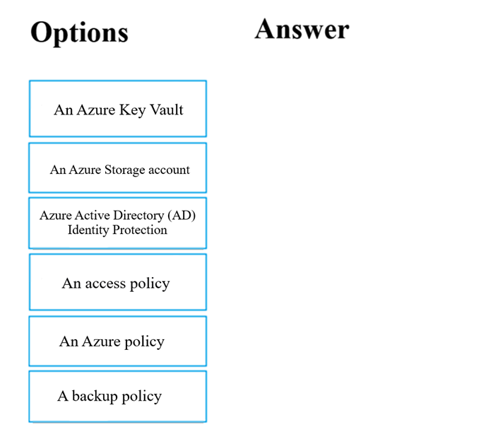
Question

Question 14
Your company has an Azure Active Directory (Azure AD) tenant that is configured for hybrid coexistence with the on-premises Active Directory domain.

The on-premise virtual environment consists of virtual machines (VMs) running on Windows Server 2012 R2 Hyper-V host servers.

You have created some PowerShell scripts to automate the configuration of newly created VMs. You plan to create several new VMs.

You need a solution that ensures the scripts are run on the new VMs.

Which of the following is the best solution?

A.

Configure a SetupComplete.cmd batch file in the %windir%\setup\scripts directory.

B.

Configure a Group Policy Object (GPO) to run the scripts as logon scripts.

C.

Configure a Group Policy Object (GPO) to run the scripts as startup scripts.

D.

Place the scripts in a new virtual hard disk (VHD).

Question 15
Your company has an Azure Active Directory (Azure AD) tenant that is configured for hybrid coexistence with the on-premises Active Directory domain.

You plan to deploy several new virtual machines (VMs) in Azure. The VMs will have the same operating system and custom software requirements.

You configure a reference VM in the on-premise virtual environment. You then generalize the VM to create an image.

You need to upload the image to Azure to ensure that it is available for selection when you create the new Azure VMs.

Which PowerShell cmdlets should you use?

A.

Add-AzVM

B.

Add-AzVhd

C.

Add-AzImage

D.

Add-AzImageDataDisk

Question 16
DRAG DROP -

Your company has an Azure subscription that includes a number of Azure virtual machines (VMs), which are all part of the same virtual network.

Your company also has an on-premises Hyper-V server that hosts a VM, named VM1, which must be replicated to Azure.

Which of the following objects that must be created to achieve this goal? Answer by dragging the correct option from the list to the answer area.

Select and Place:
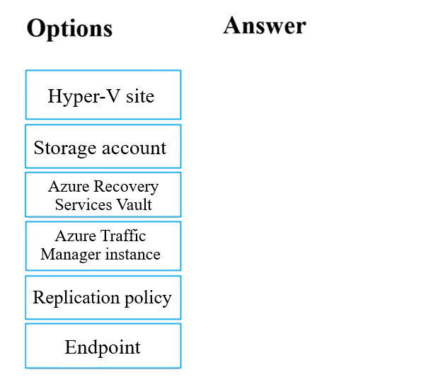
Question

Question 17
Note: The question is included in a number of questions that depicts the identical set-up. However, every question has a distinctive result. Establish if the solution satisfies the requirements.

Your company's Azure subscription includes two Azure networks named VirtualNetworkA and VirtualNetworkB.

VirtualNetworkA includes a VPN gateway that is configured to make use of static routing. Also, a site-to-site VPN connection exists between your company's on- premises network and VirtualNetworkA.

You have configured a point-to-site VPN connection to VirtualNetworkA from a workstation running Windows 10. After configuring virtual network peering between

VirtualNetworkA and VirtualNetworkB, you confirm that you are able to access VirtualNetworkB from the company's on-premises network. However, you find that you cannot establish a connection to VirtualNetworkB from the Windows 10 workstation.

You have to make sure that a connection to VirtualNetworkB can be established from the Windows 10 workstation.

Solution: You choose the Allow gateway transit setting on VirtualNetworkA.

Does the solution meet the goal?

A.

Yes

B.

No

Question 18
Note: The question is included in a number of questions that depicts the identical set-up. However, every question has a distinctive result. Establish if the solution satisfies the requirements.

Your company's Azure subscription includes two Azure networks named VirtualNetworkA and VirtualNetworkB.

VirtualNetworkA includes a VPN gateway that is configured to make use of static routing. Also, a site-to-site VPN connection exists between your company's on- premises network and VirtualNetworkA.

You have configured a point-to-site VPN connection to VirtualNetworkA from a workstation running Windows 10. After configuring virtual network peering between

VirtualNetworkA and VirtualNetworkB, you confirm that you are able to access VirtualNetworkB from the company's on-premises network. However, you find that you cannot establish a connection to VirtualNetworkB from the Windows 10 workstation.

You have to make sure that a connection to VirtualNetworkB can be established from the Windows 10 workstation.

Solution: You choose the Allow gateway transit setting on VirtualNetworkB.

Does the solution meet the goal?

A.

Yes

B.

No

Question 19
Note: The question is included in a number of questions that depicts the identical set-up. However, every question has a distinctive result. Establish if the solution satisfies the requirements.

Your company's Azure subscription includes two Azure networks named VirtualNetworkA and VirtualNetworkB.

VirtualNetworkA includes a VPN gateway that is configured to make use of static routing. Also, a site-to-site VPN connection exists between your company's on- premises network and VirtualNetworkA.

You have configured a point-to-site VPN connection to VirtualNetworkA from a workstation running Windows 10. After configuring virtual network peering between

VirtualNetworkA and VirtualNetworkB, you confirm that you are able to access VirtualNetworkB from the company's on-premises network. However, you find that you cannot establish a connection to VirtualNetworkB from the Windows 10 workstation.

You have to make sure that a connection to VirtualNetworkB can be established from the Windows 10 workstation.

Solution: You download and re-install the VPN client configuration package on the Windows 10 workstation.

Does the solution meet the goal?

A.

Yes

B.

No

Question 20
Your company has virtual machines (VMs) hosted in Microsoft Azure. The VMs are located in a single Azure virtual network named VNet1.

The company has users that work remotely. The remote workers require access to the VMs on VNet1.

You need to provide access for the remote workers.

What should you do?

A.

Configure a Site-to-Site (S2S) VPN.

B.

Configure a VNet-toVNet VPN.

C.

Configure a Point-to-Site (P2S) VPN.

D.

Configure DirectAccess on a Windows Server 2012 server VM.

E.

Configure a Multi-Site VPN

Question 21
Note: The question is included in a number of questions that depicts the identical set-up. However, every question has a distinctive result. Establish if the solution satisfies the requirements.

Your company has a Microsoft SQL Server Always On availability group configured on their Azure virtual machines (VMs).

You need to configure an Azure internal load balancer as a listener for the availability group.

Solution: You create an HTTP health probe on port 1433.

Does the solution meet the goal?

A.

Yes

B.

No

Question 22
Note: The question is included in a number of questions that depicts the identical set-up. However, every question has a distinctive result. Establish if the solution satisfies the requirements.

Your company has a Microsoft SQL Server Always On availability group configured on their Azure virtual machines (VMs).

You need to configure an Azure internal load balancer as a listener for the availability group.

Solution: You set Session persistence to Client IP.

Does the solution meet the goal?

A.

Yes

B.

No

Question 23
Note: The question is included in a number of questions that depicts the identical set-up. However, every question has a distinctive result. Establish if the solution satisfies the requirements.

Your company has an Azure Active Directory (Azure AD) subscription.

You want to implement an Azure AD conditional access policy.

The policy must be configured to require members of the Global Administrators group to use Multi-Factor Authentication and an Azure AD-joined device when they connect to Azure AD from untrusted locations.

Solution: You access the Azure portal to alter the session control of the Azure AD conditional access policy.

Does the solution meet the goal?

A.

Yes

B.

No

Question 24
Note: The question is included in a number of questions that depicts the identical set-up. However, every question has a distinctive result. Establish if the solution satisfies the requirements.

Your company has a Microsoft SQL Server Always On availability group configured on their Azure virtual machines (VMs).

You need to configure an Azure internal load balancer as a listener for the availability group.

Solution: You enable Floating IP.

Does the solution meet the goal?

A.

Yes

B.

No

Question 25
Your company has two on-premises servers named SRV01 and SRV02. Developers have created an application that runs on SRV01. The application calls a service on SRV02 by IP address.

You plan to migrate the application on Azure virtual machines (VMs). You have configured two VMs on a single subnet in an Azure virtual network.

You need to configure the two VMs with static internal IP addresses.

What should you do?

A.

Run the New-AzureRMVMConfig PowerShell cmdlet.

B.

Run the Set-AzureSubnet PowerShell cmdlet.

C.

Modify the VM properties in the Azure Management Portal.

D.

Modify the IP properties in Windows Network and Sharing Center.

E.

Run the Set-AzureStaticVNetIP PowerShell cmdlet.

Question 26
Your company has an Azure Active Directory (Azure AD) subscription.

You need to deploy five virtual machines (VMs) to your company's virtual network subnet.

The VMs will each have both a public and private IP address. Inbound and outbound security rules for all of these virtual machines must be identical.

Which of the following is the least amount of network interfaces needed for this configuration?

A.

5

B.

10

C.

20

D.

40

Question 27
Your company has an Azure Active Directory (Azure AD) subscription.

You need to deploy five virtual machines (VMs) to your company's virtual network subnet.

The VMs will each have both a public and private IP address. Inbound and outbound security rules for all of these virtual machines must be identical.

Which of the following is the least amount of security groups needed for this configuration?

A.

4

B.

3

C.

2

D.

1

Question 28
Your company's Azure subscription includes Azure virtual machines (VMs) that run Windows Server 2016.

One of the VMs is backed up every day using Azure Backup Instant Restore.

When the VM becomes infected with data encrypting ransomware, you decide to recover the VM's files.

Which of the following is TRUE in this scenario?

A.

You can only recover the files to the infected VM.

B.

You can recover the files to any VM within the company's subscription.

C.

You can only recover the files to a new VM.

D.

You will not be able to recover the files.

Question 29
Your company's Azure subscription includes Azure virtual machines (VMs) that run Windows Server 2016.

One of the VMs is backed up every day using Azure Backup Instant Restore.

When the VM becomes infected with data encrypting ransomware, you are required to restore the VM.

Which of the following actions should you take?

A.

You should restore the VM after deleting the infected VM.

B.

You should restore the VM to any VM within the company's subscription.

C.

You should restore the VM to a new Azure VM.

D.

You should restore the VM to an on-premise Windows device.

Question 30
You administer a solution in Azure that is currently having performance issues.

You need to find the cause of the performance issues pertaining to metrics on the Azure infrastructure.

Which of the following is the tool you should use?

A.

Azure Traffic Analytics

B.

Azure Monitor

C.

Azure Activity Log

D.

Azure Advisor

Question 31
Your company has an Azure subscription that includes a Recovery Services vault.

You want to use Azure Backup to schedule a backup of your company's virtual machines (VMs) to the Recovery Services vault.

Which of the following VMs can you back up? Choose all that apply.

A.

VMs that run Windows 10.

B.

VMs that run Windows Server 2012 or higher.

C.

VMs that have NOT been shut down.

D.

VMs that run Debian 8.2+.

E.

VMs that have been shut down.

Question 32
Note: This question is part of a series of questions that present the same scenario. Each question in the series contains a unique solution that might meet the stated goals. Some question sets might have more than one correct solution, while others might not have a correct solution.

After you answer a question in this section, you will NOT be able to return to it. As a result, these questions will not appear in the review screen.

You have an Azure Active Directory (Azure AD) tenant named contoso.com.

You have a CSV file that contains the names and email addresses of 500 external users.

You need to create a guest user account in contoso.com for each of the 500 external users.

Solution: You create a PowerShell script that runs the New-AzureADUser cmdlet for each user.

Does this meet the goal?

A.

Yes

B.

No

Question 33
Note: This question is part of a series of questions that present the same scenario. Each question in the series contains a unique solution that might meet the stated goals. Some question sets might have more than one correct solution, while others might not have a correct solution.

After you answer a question in this section, you will NOT be able to return to it. As a result, these questions will not appear in the review screen.

You have an Azure Active Directory (Azure AD) tenant named contoso.com.

You have a CSV file that contains the names and email addresses of 500 external users.

You need to create a guest user account in contoso.com for each of the 500 external users.

Solution: From Azure AD in the Azure portal, you use the Bulk create user operation.

Does this meet the goal?

A.

Yes

B.

No

Question 34
Note: The question is included in a number of questions that depicts the identical set-up. However, every question has a distinctive result. Establish if the solution satisfies the requirements.

Your company has an Azure Active Directory (Azure AD) subscription.

You want to implement an Azure AD conditional access policy.

The policy must be configured to require members of the Global Administrators group to use Multi-Factor Authentication and an Azure AD-joined device when they connect to Azure AD from untrusted locations.

Solution: You access the Azure portal to alter the grant control of the Azure AD conditional access policy.

Does the solution meet the goal?

A.

Yes

B.

No

Question 35
Note: This question is part of a series of questions that present the same scenario. Each question in the series contains a unique solution that might meet the stated goals. Some question sets might have more than one correct solution, while others might not have a correct solution.

After you answer a question in this section, you will NOT be able to return to it. As a result, these questions will not appear in the review screen.

You have an Azure Active Directory (Azure AD) tenant named contoso.com.

You have a CSV file that contains the names and email addresses of 500 external users.

You need to create a guest user account in contoso.com for each of the 500 external users.

Solution: You create a PowerShell script that runs the New-AzureADMSInvitation cmdlet for each external user.

Does this meet the goal?

A.

Yes

B.

No

Question 36
You are planning to deploy an Ubuntu Server virtual machine to your company's Azure subscription.

You are required to implement a custom deployment that includes adding a particular trusted root certification authority (CA).

Which of the following should you use to create the virtual machine?

A.

The New-AzureRmVm cmdlet.

B.

The New-AzVM cmdlet.

C.

The Create-AzVM cmdlet.

D.

The az vm create command.

Question 37
Note: The question is included in a number of questions that depicts the identical set-up. However, every question has a distinctive result. Establish if the solution satisfies the requirements.

Your company makes use of Multi-Factor Authentication for when users are not in the office. The Per Authentication option has been configured as the usage model.

After the acquisition of a smaller business and the addition of the new staff to Azure Active Directory (Azure AD) obtains a different company and adding the new employees to Azure Active Directory (Azure AD), you are informed that these employees should also make use of Multi-Factor Authentication.

To achieve this, the Per Enabled User setting must be set for the usage model.

Solution: You reconfigure the existing usage model via the Azure portal.

Does the solution meet the goal?

A.

Yes

B.

No

Question 38
Note: The question is included in a number of questions that depicts the identical set-up. However, every question has a distinctive result. Establish if the solution satisfies the requirements.

Your company's Azure solution makes use of Multi-Factor Authentication for when users are not in the office. The Per Authentication option has been configured as the usage model.

After the acquisition of a smaller business and the addition of the new staff to Azure Active Directory (Azure AD) obtains a different company and adding the new employees to Azure Active Directory (Azure AD), you are informed that these employees should also make use of Multi-Factor Authentication.

To achieve this, the Per Enabled User setting must be set for the usage model.

Solution: You reconfigure the existing usage model via the Azure CLI.

Does the solution meet the goal?

A.

Yes

B.

No

Question 39
Note: The question is included in a number of questions that depicts the identical set-up. However, every question has a distinctive result. Establish if the solution satisfies the requirements.

Your company's Azure solution makes use of Multi-Factor Authentication for when users are not in the office. The Per Authentication option has been configured as the usage model.

After the acquisition of a smaller business and the addition of the new staff to Azure Active Directory (Azure AD) obtains a different company and adding the new employees to Azure Active Directory (Azure AD), you are informed that these employees should also make use of Multi-Factor Authentication.

To achieve this, the Per Enabled User setting must be set for the usage model.

Solution: You create a new Multi-Factor Authentication provider with a backup from the existing Multi-Factor Authentication provider data.

Does the solution meet the goal?

A.

Yes

B.

No

Question 40
Note: The question is included in a number of questions that depicts the identical set-up. However, every question has a distinctive result. Establish if the solution satisfies the requirements.

Your company has an Azure Active Directory (Azure AD) tenant named weyland.com that is configured for hybrid coexistence with the on-premises Active

Directory domain.

You have a server named DirSync1 that is configured as a DirSync server.

You create a new user account in the on-premise Active Directory. You now need to replicate the user information to Azure AD immediately.

Solution: You run the Start-ADSyncSyncCycle -PolicyType Initial PowerShell cmdlet.

Does the solution meet the goal?

A.

Yes

B.

No

Question 41
You need to implement a backup solution for App1 after the application is moved.

What should you create first?

A.

a recovery plan

B.

an Azure Backup Server

C.

a backup policy

D.

a Recovery Services vault

Question 42
You need to move the blueprint files to Azure.

What should you do?

A.

Generate an access key. Map a drive, and then copy the files by using File Explorer.

B.

Use Azure Storage Explorer to copy the files.

C.

Use the Azure Import/Export service.

D.

Generate a shared access signature (SAS). Map a drive, and then copy the files by using File Explorer.

Question 43
HOTSPOT -

You need to identify the storage requirements for Contoso.

For each of the following statements, select Yes if the statement is true. Otherwise, select No.

NOTE: Each correct selection is worth one point.

Hot Area:
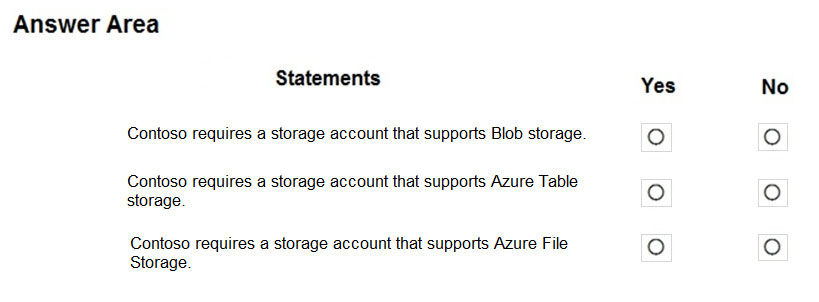
Question

Question 44
HOTSPOT -

You need to create container1 and share1.

Which storage accounts should you use for each resource? To answer, select the appropriate options in the answer area.

NOTE: Each correct selection is worth one point.

Hot Area:
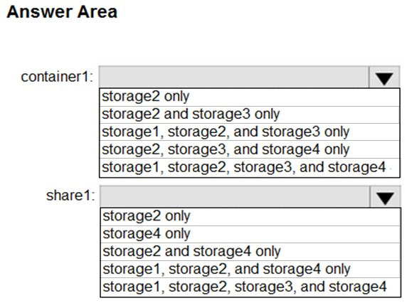
Question

Question 45
HOTSPOT -

You need to create storage5. The solution must support the planned changes.

Which type of storage account should you use, and which account should you configure as the destination storage account? To answer, select the appropriate options in the answer area.

NOTE: Each correct selection is worth one point.

Hot Area:
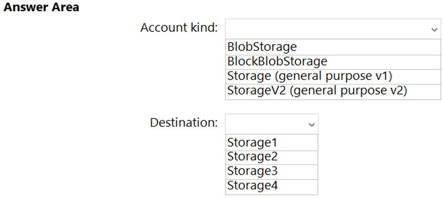
Question

Question 46
You need to identify which storage account to use for the flow logging of IP traffic from VM5. The solution must meet the retention requirements.

Which storage account should you identify?

A.

storage1

B.

storage2

C.

storage3

D.

storage4

Question 47
You discover that VM3 does NOT meet the technical requirements.

You need to verify whether the issue relates to the NSGs.

What should you use?

A.

Diagram in VNet1

B.

Diagnostic settings in Azure Monitor

C.

Diagnose and solve problems in Traffic Manager profiles

D.

The security recommendations in Azure Advisor

E.

IP flow verify in Azure Network Watcher

Question 48
You need to ensure that VM1 can communicate with VM4. The solution must minimize the administrative effort.

What should you do?

A.

Create an NSG and associate the NSG to VM1 and VM4.

B.

Establish peering between VNET1 and VNET3.

C.

Assign VM4 an IP address of 10.0.1.5/24.

D.

Create a user-defined route from VNET1 to VNET3.

Question 49
HOTSPOT -

You need to meet the connection requirements for the New York office.

What should you do? To answer, select the appropriate options in the answer area.

NOTE: Each correct selection is worth one point.

Hot Area:
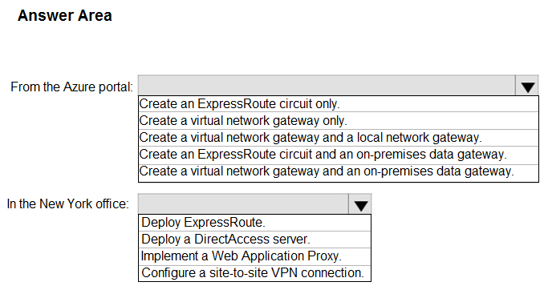
Question

Question 50
HOTSPOT -

You need to recommend a solution for App1. The solution must meet the technical requirements.

What should you include in the recommendation? To answer, select the appropriate options in the answer area.

NOTE: Each correct selection is worth one point.

Hot Area:
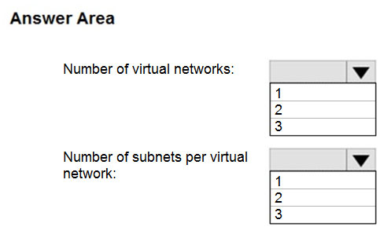
Question

Question 51
You are planning the move of App1 to Azure.

You create a network security group (NSG).

You need to recommend a solution to provide users with access to App1.

What should you recommend?

A.

Create an incoming security rule for port 443 from the Internet. Associate the NSG to the subnet that contains the web servers.

B.

Create an outgoing security rule for port 443 from the Internet. Associate the NSG to the subnet that contains the web servers.

C.

Create an incoming security rule for port 443 from the Internet. Associate the NSG to all the subnets.

D.

Create an outgoing security rule for port 443 from the Internet. Associate the NSG to all the subnets.

Question 52
HOTSPOT -

You implement the planned changes for NSG1 and NSG2.

For each of the following statements, select Yes if the statement is true. Otherwise, select No.

NOTE: Each correct selection is worth one point.

Hot Area:
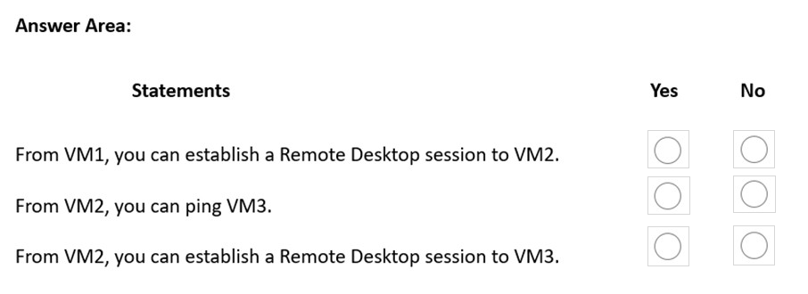
Question

Question 53
You need to add VM1 and VM2 to the backend pool of LB1.

What should you do first?

A.

Connect VM2 to VNET1/Subnet1.

B.

Redeploy VM1 and VM2 to the same availability zone.

C.

Redeploy VM1 and VM2 to the same availability set.

D.

Create a new NSG and associate the NSG to VNET1/Subnet1.

Question 54
You need to ensure that VM1 can communicate with VM4. The solution must minimize administrative effort.

What should you do?

A.

Create a user-defined route from VNET1 to VNET3.

B.

Create an NSG and associate the NSG to VM1 and VM4.

C.

Assign VM4 an IP address of 10.0.1.5/24.

D.

Establish peering between VNET1 and VNET3.

Question 55
HOTSPOT -

You need to implement Role1.

Which command should you run before you create Role1? To answer, select the appropriate options in the answer area.

NOTE: Each correct selection is worth one point.

Hot Area:
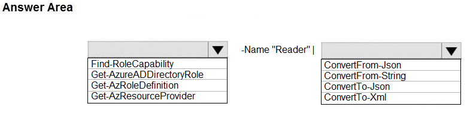
Question

Question 56
You need to recommend a solution to automate the configuration for the finance department users. The solution must meet the technical requirements.

What should you include in the recommendation?

A.

Azure AD B2C

B.

dynamic groups and conditional access policies

C.

Azure AD Identity Protection

D.

an Azure logic app and the Microsoft Identity Management (MIM) client

Question 57
HOTSPOT -

You have an Azure subscription named Subscription1 that contains a resource group named RG1.

In RG1, you create an internal load balancer named LB1 and a public load balancer named LB2.

You need to ensure that an administrator named Admin1 can manage LB1 and LB2. The solution must follow the principle of least privilege.

Which role should you assign to Admin1 for each task? To answer, select the appropriate options in the answer area.

NOTE: Each correct selection is worth one point.

Hot Area:
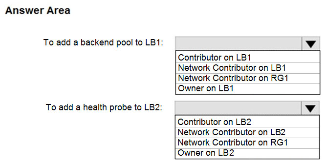
Question

Question 58
You have an Azure Active Directory (Azure AD) tenant that contains 5,000 user accounts.

You create a new user account named AdminUser1.

You need to assign the User administrator administrative role to AdminUser1.

What should you do from the user account properties?

A.

From the Licenses blade, assign a new license

B.

From the Directory role blade, modify the directory role

C.

From the Groups blade, invite the user account to a new group

Question 59
HOTSPOT -

You have a Microsoft Entra tenant that contains the groups shown in the following table.
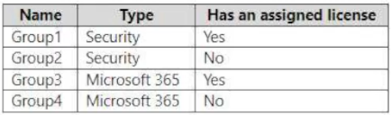
Question
The tenant contains the users shown in the following table.
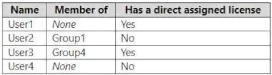
Question
Which users and groups can you delete? To answer, select the appropriate options in the answer area.

NOTE: Each correct selection is worth one point.
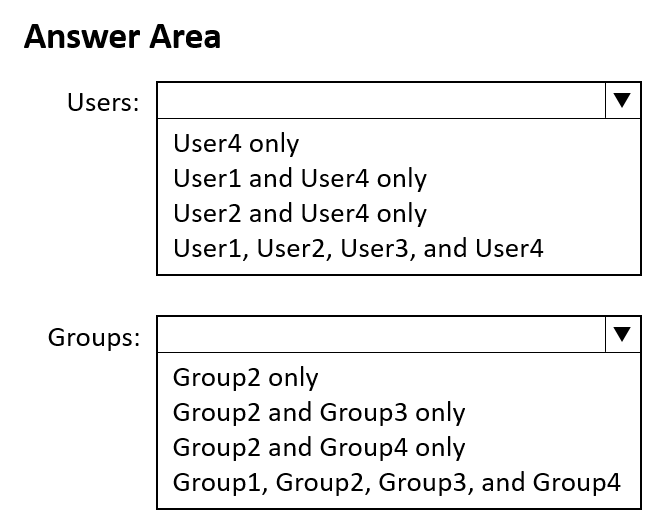
Question

Question 60
You have an Azure subscription that contains the resources shown in the following table.
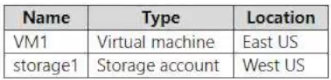
Question
You need to ensure that data transfers between storage1 and VM1 do NOT traverse the internet

What should you configure for storage1?

A.

data protection

B.

a private endpoint

C.

Public network access in the Firewalls and virtual networks settings

D.

a shared access signature (SAS)

Question 61
HOTSPOT

-

You have a Microsoft Entra tenant that is linked to the subscriptions shown in the following table.
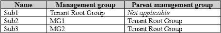
Question
You have the resource groups shown in the following table.
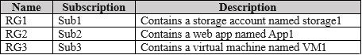
Question
You assign roles to users as shown in the following table.
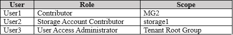
Question
For each of the following statements, select Yes if the statement is true. Otherwise, select No.

NOTE: Each correct selection is worth one point.
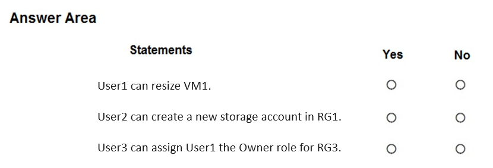
Question

Question 62
Your on-premises network contains a VPN gateway.

You have an Azure subscription that contains the resources shown in the following table.

Question
You need to ensure that all the traffic from VM1 to storage1 travels across the Microsoft backbone network.

What should you configure?

A.

a network security group (NSG)

B.

private endpoints

C.

Microsoft Entra Application Proxy

D.

Azure Virtual WAN

Question 63
You have a Microsoft Entra tenant.

You plan to perform a bulk import of users.

You need to ensure that imported user objects are added automatically as the members of a specific group based on each user's department. The solution must minimize administrative effort.

Which two actions should you perform? Each correct answer presents part of the solution.

NOTE: Each correct selection is worth one point.

A.

Create groups that use the Assigned membership type.

B.

Create an Azure Resource Manager (ARM) template.

C.

Create groups that use the Dynamic User membership type.

D.

Write a PowerShell script that parses an import file.

E.

Create an XML file that contains user information and the appropriate attributes.

F.

Create a CSV file that contains user information and the appropriate attributes.

Question 64
You have an Azure subscription that contains a storage account named storage1.

You need to ensure that the access keys for storage1 rotate automatically.

What should you configure?

A.

a backup vault

B.

redundancy for storage1

C.

lifecycle management for storage1

D.

an Azure key vault

E.

a Recovery Services vault

Question 65
You have an Azure subscription that contains the Microsoft Entra identities shown in the following table.
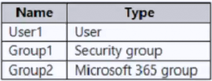
Question
You need to enable self-service password reset (SSPR).

For which identities can you enable SSPR in the Azure portal?

A.

User1 only

B.

Group1 only

C.

User1 and Group1 only

D.

Group1 and Group2 only

E.

User1, Group1, and Group2

Question 66
DRAG DROP -

You have a Microsoft Entra tenant.

You need to ensure that when a new Microsoft 365 group is created, the group name is automatically formatted as follows:
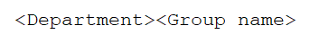
Question
Which three actions should you perform in sequence in the Microsoft Entra admin center? To answer, move the appropriate actions from the list of actions to the answer area and arrange them in the correct order.

Question
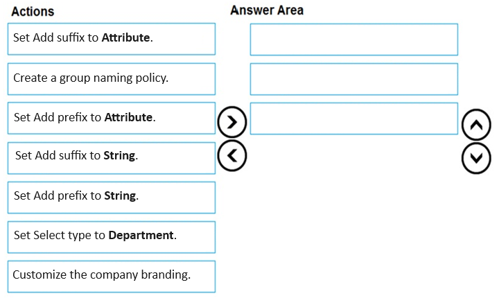
Question 67
HOTSPOT

-

You have a Microsoft Entra tenant that contains the users shown in the following table.
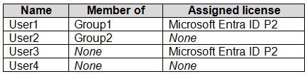
Question
The tenant contains the groups shown in the following table.
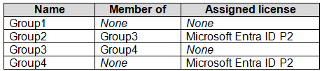
Question
Which users and groups can be deleted? To answer, select the appropriate options in the answer area.

NOTE: Each correct selection is worth one point.
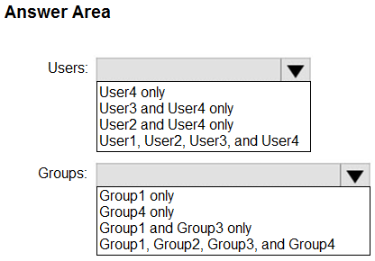
Question

Question 68
HOTSPOT -

You have an Azure subscription that contains the resources shown in the following table.
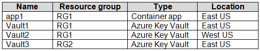
Question
You plan to use an Azure key vault to provide a secret to app1.

What should you create for app1 to access the key vault, and from which key vault can the secret be used? To answer, select the appropriate options in the answer area.

NOTE: Each correct selection is worth one point.
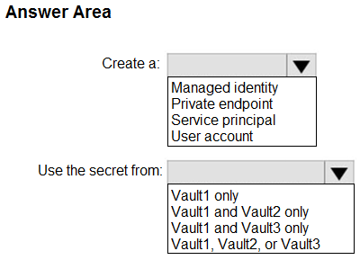
Question

Question 69
You have an Azure Active Directory (Azure AD) tenant named contoso.onmicrosoft.com that contains 100 user accounts.

You purchase 10 Azure AD Premium P2 licenses for the tenant.

You need to ensure that 10 users can use all the Azure AD Premium features.

What should you do?

A.

From the Licenses blade of Azure AD, assign a license

B.

From the Groups blade of each user, invite the users to a group

C.

From the Azure AD domain, add an enterprise application

D.

From the Directory role blade of each user, modify the directory role

Question 70
You have a Microsoft Entra tenant named contoso.com.

You collaborate with an external partner named fabrikam.com.

You plan to invite users in fabrikam.com to the contoso.com tenant.

You need to ensure that invitations can be sent only to fabrikam.com users.

What should you do in the Microsoft Entra admin center?

A.

From Cross-tenant access settings, configure the Tenant restrictions settings.

B.

From Cross-tenant access settings, configure the Microsoft cloud settings.

C.

From External collaboration settings, configure the Guest user access restrictions settings.

D.

From External collaboration settings, configure the Collaboration restrictions settings.

Question 71
You have an Azure subscription that contains a storage account named storage1. The storage1 account contains blob data.

You need to assign a role to a user named User1 to ensure that the user can access the blob data in storage1. The role assignment must support conditions.

Which two roles can you assign to User1? Each correct answer presents a complete solution.

NOTE: Each correct selection is worth one point.

A.

Owner

B.

Storage Account Contributor

C.

Storage Account Backup Contributor

D.

Storage Blob Data Contributor

E.

Storage Blob Data Owner

F.

Storage Blob Delegator

Question 72
HOTSPOT -

Case study -

This is a case study. Case studies are not timed separately. You can use as much exam time as you would like to complete each case. However, there may be additional case studies and sections on this exam. You must manage your time to ensure that you are able to complete all questions included on this exam in the time provided.

To answer the questions included in a case study, you will need to reference information that is provided in the case study. Case studies might contain exhibits and other resources that provide more information about the scenario that is described in the case study. Each question is independent of the other questions in this case study.

At the end of this case study, a review screen will appear. This screen allows you to review your answers and to make changes before you move to the next section of the exam. After you begin a new section, you cannot return to this section.

To start the case study -

To display the first question in this case study, click the Next button. Use the buttons in the left pane to explore the content of the case study before you answer the questions. Clicking these buttons displays information such as business requirements, existing environment, and problem statements. If the case study has an All Information tab, note that the information displayed is identical to the information displayed on the subsequent tabs. When you are ready to answer a question, click the Question button to return to the question.

Overview -

ADatum Corporation is consulting firm that has a main office in Montreal and branch offices in Seattle and New York.

Existing Environment -

Azure Environment -

ADatum has an Azure subscription that contains three resource groups named RG1, RG2, and RG3.

The subscription contains the storage accounts shown in the following table.

Question
The subscription contains the virtual machines shown in the following table.

Question
The subscription has an Azure container registry that contains the images shown in the following table.

Question
The subscription contains the resources shown in the following table.

Question
Azure Key Vault -

The subscription contains an Azure key vault named Vault1.

Vault1 contains the certificates shown in the following table.

Question
Vault1 contains the keys shown in the following table.

Question
Microsoft Entra Environment -

ADatum has a Microsoft Entra tenant named adatum.com that is linked to the Azure subscription and contains the users shown in the following table.

Question
The tenant contains the groups shown in the following table.

Question
The adatum.com tenant has a custom security attribute named Attribute1.

Planned Changes -

ADatum plans to implement the following changes:

• Configure a data collection rule (DCR) named DCR1 to collect only system events that have an event ID of 4648 from VM2 and VM4.

• In storage1, create a new container named cont2 that has the following access policies: o Three stored access policies named Stored1, Stored2, and Stored3 o A legal hold for immutable blob storage

• Whenever possible, use directories to organize storage account content.

• Grant User1 the permissions required to link Zone1 to VNet1.

• Assign Attribute1 to supported adatum.com resources.

• In storage2, create an encryption scope named Scope1.

• Deploy new containers by using Image1 or Image2.

Technical Requirements -

ADatum must meet the following technical requirements:

• Use TLS for WebApp1.

• Follow the principle of least privilege.

• Grant permissions at the required scope only.

• Ensure that Scope1 is used to encrypt storage services.

• Use Azure Backup to back up cont1 and share1 as frequently as possible.

• Whenever possible, use Azure Disk Encryption and a key encryption key (KEK) to encrypt the virtual machines.

You need to implement the planned change for Attribute1.

For each of the following statements, select Yes if the statement is true. Otherwise, select No.

NOTE: Each correct selection is worth one point.
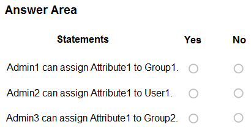
Question

Question 73
You have a Microsoft Entra tenant configured as shown in the following exhibit.
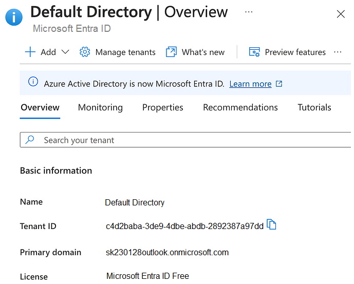
Question
The tenant contains the identities shown in the following table.
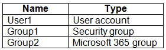
Question
You purchase a Microsoft Fabric license.

To which identities can you assign the license?

A.

User1 only

B.

User1 and Group1 only

C.

User1 and Group2 only

D.

User1, Group1, and Group2

Question 74
You have an Azure subscription that contains a storage account named storage. The storage account contains a blob that stores images.

Client access to storage1 is granted by using a shared access signature (SAS).

You need to ensure that users receive a warning message when they generate a SAS that exceeds a seven-day time period.

What should you do for storage?

A.

Enable a read-only lock.

B.

Configure an alert rule.

C.

Add a lifecycle management rule.

D.

Set Allow recommended upper limit for shared access signature (SAS) expiry interval to Enabled.

Question 75
You have an Azure subscription named Subscription1 and an on-premises deployment of Microsoft System Center Service Manager.

Subscription1 contains a virtual machine named VM1.

You need to ensure that an alert is set in Service Manager when the amount of available memory on VM1 is below 10 percent.

What should you do first?

A.

Create an automation runbook

B.

Deploy a function app

C.

Deploy the IT Service Management Connector (ITSM)

D.

Create a notification

Question 76
You sign up for Azure Active Directory (Azure AD) Premium P2.

You need to add a user named admin1@contoso.com as an administrator on all the computers that will be joined to the Azure AD domain.

What should you configure in Azure AD?

A.

Device settings from the Devices blade

B.

Providers from the MFA Server blade

C.

User settings from the Users blade

D.

General settings from the Groups blade

Question 77
HOTSPOT -

You have Azure Active Directory tenant named Contoso.com that includes following users:
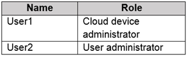
Question
Contoso.com includes following Windows 10 devices:
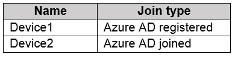
Question
You create following security groups in Contoso.com:
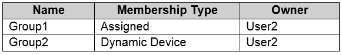
Question
For each of the following statements, select Yes if the statement is true. Otherwise, select No.

NOTE: Each correct selection is worth one point.

Hot Area:
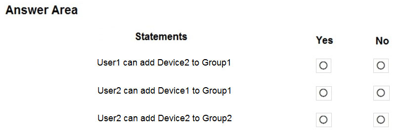
Question

Question 78
You have an Azure subscription that contains a resource group named RG26.

RG26 is set to the West Europe location and is used to create temporary resources for a project. RG26 contains the resources shown in the following table.
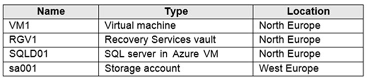
Question
SQLDB01 is backed up to RGV1.

When the project is complete, you attempt to delete RG26 from the Azure portal. The deletion fails.

You need to delete RG26.

What should you do first?

A.

Delete VM1

B.

Stop VM1

C.

Stop the backup of SQLDB01

D.

Delete sa001

Question 79
You have an Azure subscription named Subscription1 that contains a virtual network named VNet1. VNet1 is in a resource group named RG1.

Subscription1 has a user named User1. User1 has the following roles:

✑ Reader

✑ Security Admin

✑ Security Reader

You need to ensure that User1 can assign the Reader role for VNet1 to other users.

What should you do?

A.

Remove User1 from the Security Reader and Reader roles for Subscription1.

B.

Assign User1 the User Access Administrator role for VNet1.

C.

Assign User1 the Network Contributor role for VNet1.

D.

Assign User1 the Network Contributor role for RG1.

Question 80
You have an Azure Active Directory (Azure AD) tenant named contosocloud.onmicrosoft.com.

Your company has a public DNS zone for contoso.com.

You add contoso.com as a custom domain name to Azure AD.

You need to ensure that Azure can verify the domain name.

Which type of DNS record should you create?

A.

MX

B.

NSEC

C.

PTR

D.

RRSIG

Question 81
Note: This question is part of a series of questions that present the same scenario. Each question in the series contains a unique solution that might meet the stated goals. Some question sets might have more than one correct solution, while others might not have a correct solution.

After you answer a question in this section, you will NOT be able to return to it. As a result, these questions will not appear in the review screen.

You have an Azure Directory (Azure AD) tenant named Adatum and an Azure Subscription named Subscription1. Adatum contains a group named Developers.

Subscription1 contains a resource group named Dev.

You need to provide the Developers group with the ability to create Azure logic apps in the Dev resource group.

Solution: On Subscription1, you assign the DevTest Labs User role to the Developers group.

Does this meet the goal?

A.

Yes

B.

No

Question 82
Note: This question is part of a series of questions that present the same scenario. Each question in the series contains a unique solution that might meet the stated goals. Some question sets might have more than one correct solution, while others might not have a correct solution.

After you answer a question in this section, you will NOT be able to return to it. As a result, these questions will not appear in the review screen.

You have an Azure Directory (Azure AD) tenant named Adatum and an Azure Subscription named Subscription1. Adatum contains a group named Developers.

Subscription1 contains a resource group named Dev.

You need to provide the Developers group with the ability to create Azure logic apps in the Dev resource group.

Solution: On Subscription1, you assign the Logic App Operator role to the Developers group.

Does this meet the goal?

A.

Yes

B.

No

Question 83
You have an Azure subscription that contains an Azure Active Directory (Azure AD) tenant named contoso.com and an Azure Kubernetes Service (AKS) cluster named AKS1.

An administrator reports that she is unable to grant access to AKS1 to the users in contoso.com.

You need to ensure that access to AKS1 can be granted to the contoso.com users.

What should you do first?

A.

From contoso.com, modify the Organization relationships settings.

B.

From contoso.com, create an OAuth 2.0 authorization endpoint.

C.

Recreate AKS1.

D.

From AKS1, create a namespace.

Question 84
Note: This question is part of a series of questions that present the same scenario. Each question in the series contains a unique solution that might meet the stated goals. Some question sets might have more than one correct solution, while others might not have a correct solution.

After you answer a question in this section, you will NOT be able to return to it. As a result, these questions will not appear in the review screen.

You have an Azure Directory (Azure AD) tenant named Adatum and an Azure Subscription named Subscription1. Adatum contains a group named Developers.

Subscription1 contains a resource group named Dev.

You need to provide the Developers group with the ability to create Azure logic apps in the Dev resource group.

Solution: On Dev, you assign the Contributor role to the Developers group.

Does this meet the goal?

A.

Yes

B.

No

Question 85
DRAG DROP -

You have an Azure subscription that is used by four departments in your company. The subscription contains 10 resource groups. Each department uses resources in several resource groups.

You need to send a report to the finance department. The report must detail the costs for each department.

Which three actions should you perform in sequence? To answer, move the appropriate actions from the list of actions to the answer area and arrange them in the correct order.

Select and Place:
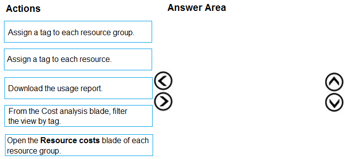
Question

Question 86
You have an Azure subscription named Subscription1 that contains an Azure Log Analytics workspace named Workspace1.

You need to view the error events from a table named Event.

Which query should you run in Workspace1?

A.

Get-Event Event | where {$_.EventType == "error"}

B.

search in (Event) "error"

C.

select * from Event where EventType == "error"

D.

search in (Event) * | where EventType -eq "error"

Question 87
HOTSPOT -

You have an Azure subscription that contains a virtual network named VNET1 in the East US 2 region. A network interface named VM1-NI is connected to

VNET1.

You successfully deploy the following Azure Resource Manager template.
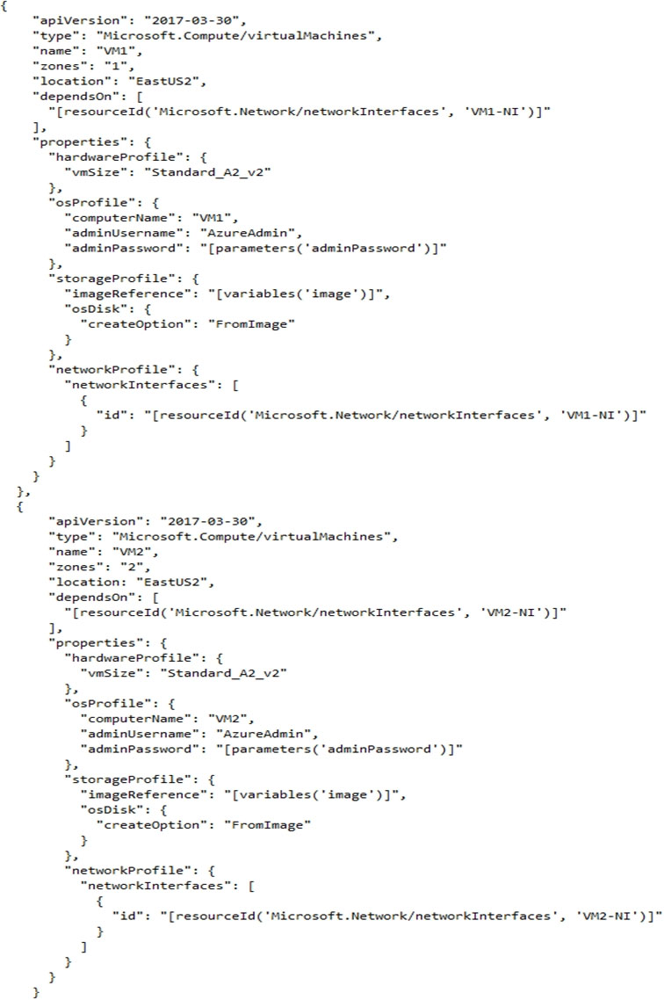
Question
For each of the following statements, select Yes if the statement is true. Otherwise, select No.

NOTE: Each correct selection is worth one point.

Hot Area:
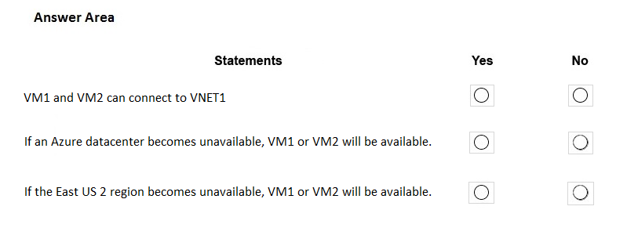
Question

Question 88
You have an Azure subscription named Subscription1. Subscription1 contains the resource groups in the following table.
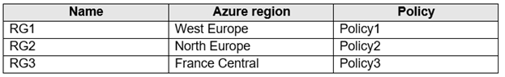
Question
RG1 has a web app named WebApp1. WebApp1 is located in West Europe.

You move WebApp1 to RG2.

What is the effect of the move?

A.

The App Service plan for WebApp1 remains in West Europe. Policy2 applies to WebApp1.

B.

The App Service plan for WebApp1 moves to North Europe. Policy2 applies to WebApp1.

C.

The App Service plan for WebApp1 remains in West Europe. Policy1 applies to WebApp1.

D.

The App Service plan for WebApp1 moves to North Europe. Policy1 applies to WebApp1.

Question 89
HOTSPOT -

You have an Azure subscription named Subscription1 that has a subscription ID of c276fc76-9cd4-44c9-99a7-4fd71546436e.

You need to create a custom RBAC role named CR1 that meets the following requirements:

✑ Can be assigned only to the resource groups in Subscription1

✑ Prevents the management of the access permissions for the resource groups

✑ Allows the viewing, creating, modifying, and deleting of resources within the resource groups

What should you specify in the assignable scopes and the permission elements of the definition of CR1? To answer, select the appropriate options in the answer area.

NOTE: Each correct selection is worth one point.

Hot Area:
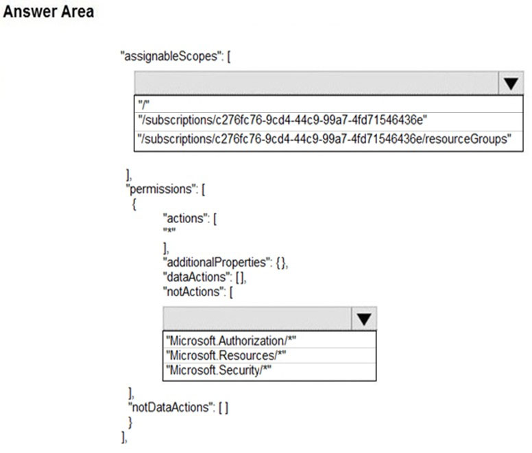
Question

Question 90
You have an Azure subscription.

Users access the resources in the subscription from either home or from customer sites. From home, users must establish a point-to-site VPN to access the Azure resources. The users on the customer sites access the Azure resources by using site-to-site VPNs.

You have a line-of-business-app named App1 that runs on several Azure virtual machine. The virtual machines run Windows Server 2016.

You need to ensure that the connections to App1 are spread across all the virtual machines.

What are two possible Azure services that you can use? Each correct answer presents a complete solution.

NOTE: Each correct selection is worth one point.

A.

an internal load balancer

B.

a public load balancer

C.

an Azure Content Delivery Network (CDN)

D.

Traffic Manager

E.

an Azure Application Gateway

Question 91
You have an Azure subscription.

You have 100 Azure virtual machines.

You need to quickly identify underutilized virtual machines that can have their service tier changed to a less expensive offering.

Which blade should you use?

A.

Monitor

B.

Advisor

C.

Metrics

D.

Customer insights

Question 92
HOTSPOT -

You have an Azure Active Directory (Azure AD) tenant.

You need to create a conditional access policy that requires all users to use multi-factor authentication when they access the Azure portal.

Which three settings should you configure? To answer, select the appropriate settings in the answer area.

NOTE: Each correct selection is worth one point.

Hot Area:
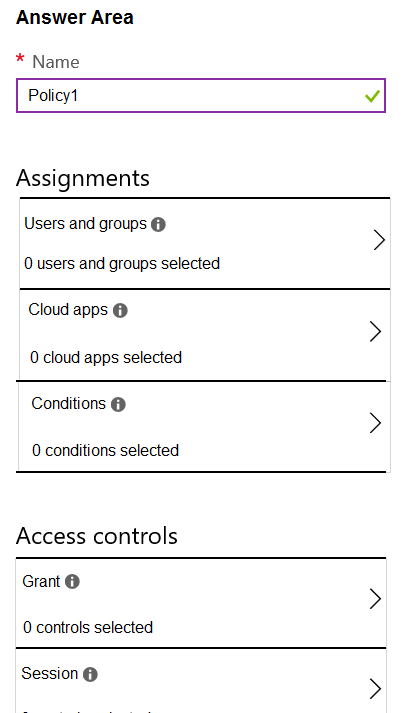
Question

Question 93
You have an Azure Active Directory (Azure AD) tenant named contoso.onmicrosoft.com.

The User administrator role is assigned to a user named Admin1.

An external partner has a Microsoft account that uses the user1@outlook.com sign in.

Admin1 attempts to invite the external partner to sign in to the Azure AD tenant and receives the following error message: `Unable to invite user user1@outlook.com `" Generic authorization exception.`

You need to ensure that Admin1 can invite the external partner to sign in to the Azure AD tenant.

What should you do?

A.

From the Users settings blade, modify the External collaboration settings.

B.

From the Custom domain names blade, add a custom domain.

C.

From the Organizational relationships blade, add an identity provider.

D.

From the Roles and administrators blade, assign the Security administrator role to Admin1.

Question 94
You have a Microsoft 365 tenant and an Azure Active Directory (Azure AD) tenant named contoso.com.

You plan to grant three users named User1, User2, and User3 access to a temporary Microsoft SharePoint document library named Library1.

You need to create groups for the users. The solution must ensure that the groups are deleted automatically after 180 days.

Which two groups should you create? Each correct answer presents a complete solution.

NOTE: Each correct selection is worth one point.

A.

a Microsoft 365 group that uses the Assigned membership type

B.

a Security group that uses the Assigned membership type

C.

a Microsoft 365 group that uses the Dynamic User membership type

D.

a Security group that uses the Dynamic User membership type

E.

a Security group that uses the Dynamic Device membership type

Question 95
You have an Azure subscription linked to an Azure Active Directory tenant. The tenant includes a user account named User1.

You need to ensure that User1 can assign a policy to the tenant root management group.

What should you do?

A.

Assign the Owner role for the Azure Subscription to User1, and then modify the default conditional access policies.

B.

Assign the Owner role for the Azure subscription to User1, and then instruct User1 to configure access management for Azure resources.

C.

Assign the Global administrator role to User1, and then instruct User1 to configure access management for Azure resources.

D.

Create a new management group and delegate User1 as the owner of the new management group.

Question 96
HOTSPOT -

You have an Azure Active Directory (Azure AD) tenant named adatum.com. Adatum.com contains the groups in the following table.
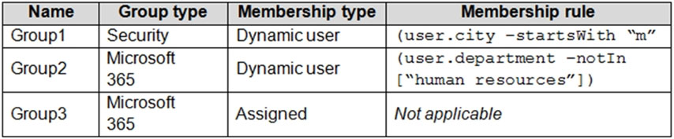
Question
You create two user accounts that are configured as shown in the following table.
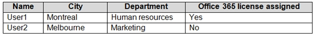
Question
Of which groups are User1 and User2 members? To answer, select the appropriate options in the answer area.

NOTE: Each correct selection is worth one point.

Hot Area:
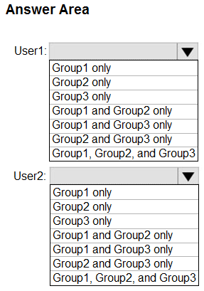
Question

Question 97
HOTSPOT -

You have a hybrid deployment of Azure Active Directory (Azure AD) that contains the users shown in the following table.
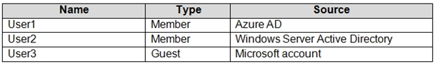
Question
You need to modify the JobTitle and UsageLocation attributes for the users.

For which users can you modify the attributes from Azure AD? To answer, select the appropriate options in the answer area.

NOTE: Each correct selection is worth one point.

Hot Area:
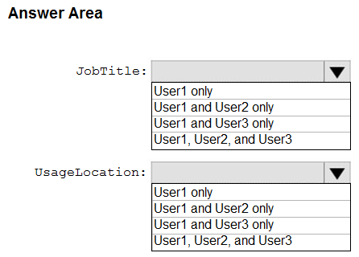
Question

Question 98
Note: This question is part of a series of questions that present the same scenario. Each question in the series contains a unique solution that might meet the stated goals. Some question sets might have more than one correct solution, while others might not have a correct solution.

After you answer a question in this section, you will NOT be able to return to it. As a result, these questions will not appear in the review screen.

You need to ensure that an Azure Active Directory (Azure AD) user named Admin1 is assigned the required role to enable Traffic Analytics for an Azure subscription.

Solution: You assign the Network Contributor role at the subscription level to Admin1.

Does this meet the goal?

A.

Yes

B.

No

Question 99
Note: This question is part of a series of questions that present the same scenario. Each question in the series contains a unique solution that might meet the stated goals. Some question sets might have more than one correct solution, while others might not have a correct solution.

After you answer a question in this section, you will NOT be able to return to it. As a result, these questions will not appear in the review screen.

You need to ensure that an Azure Active Directory (Azure AD) user named Admin1 is assigned the required role to enable Traffic Analytics for an Azure subscription.

Solution: You assign the Owner role at the subscription level to Admin1.

Does this meet the goal?

A.

Yes

B.

No

Question 100
Note: This question is part of a series of questions that present the same scenario. Each question in the series contains a unique solution that might meet the stated goals. Some question sets might have more than one correct solution, while others might not have a correct solution.

After you answer a question in this section, you will NOT be able to return to it. As a result, these questions will not appear in the review screen.

You need to ensure that an Azure Active Directory (Azure AD) user named Admin1 is assigned the required role to enable Traffic Analytics for an Azure subscription.

Solution: You assign the Reader role at the subscription level to Admin1.

Does this meet the goal?

A.

Yes

B.

No

Question 101
You have an Azure subscription that contains a user named User1.

You need to ensure that User1 can deploy virtual machines and manage virtual networks. The solution must use the principle of least privilege.

Which role-based access control (RBAC) role should you assign to User1?

A.

Owner

B.

Virtual Machine Contributor

C.

Contributor

D.

Virtual Machine Administrator Login

Question 102
HOTSPOT -

You have an Azure Active Directory (Azure AD) tenant that contains three global administrators named Admin1, Admin2, and Admin3.

The tenant is associated to an Azure subscription. Access control for the subscription is configured as shown in the Access control exhibit. (Click the Access

Control tab.)
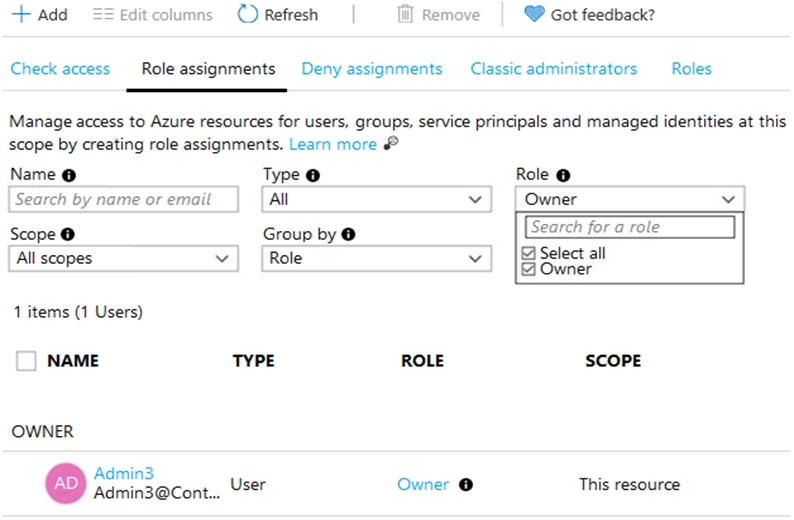
Question
You sign in to the Azure portal as Admin1 and configure the tenant as shown in the Tenant exhibit. (Click the Tenant tab.)
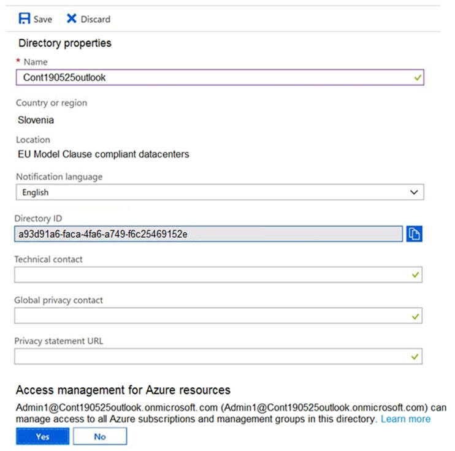
Question
For each of the following statements, select Yes if the statement is true. Otherwise, select No.

NOTE: Each correct selection is worth one point.

Hot Area:
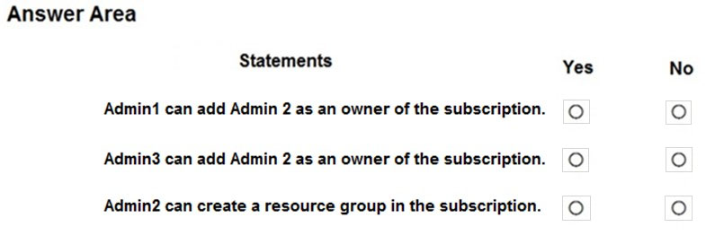
Question

Question 103
You have an Azure subscription named Subscription1 that contains an Azure virtual machine named VM1. VM1 is in a resource group named RG1.

VM1 runs services that will be used to deploy resources to RG1.

You need to ensure that a service running on VM1 can manage the resources in RG1 by using the identity of VM1.

What should you do first?

A.

From the Azure portal, modify the Managed Identity settings of VM1

B.

From the Azure portal, modify the Access control (IAM) settings of RG1

C.

From the Azure portal, modify the Access control (IAM) settings of VM1

D.

From the Azure portal, modify the Policies settings of RG1

Question 104
You have an Azure subscription that contains a resource group named TestRG.

You use TestRG to validate an Azure deployment.

TestRG contains the following resources:
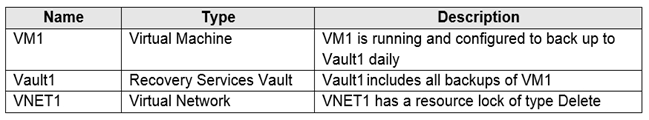
Question
You need to delete TestRG.

What should you do first?

A.

Modify the backup configurations of VM1 and modify the resource lock type of VNET1

B.

Remove the resource lock from VNET1 and delete all data in Vault1

C.

Turn off VM1 and remove the resource lock from VNET1

D.

Turn off VM1 and delete all data in Vault1

Question 105
HOTSPOT -

You have an Azure Active Directory (Azure AD) tenant named contoso.com that contains the users shown in the following table:
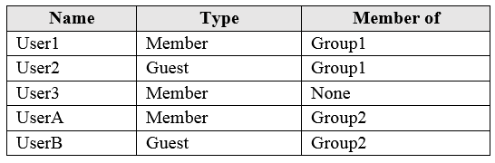
Question
User3 is the owner of Group1.

Group2 is a member of Group1.

You configure an access review named Review1 as shown in the following exhibit:

Question
For each of the following statements, select Yes if the statement is true. Otherwise, select No.

NOTE: Each correct selection is worth one point.

Hot Area:

Question

Question 106
You have an Azure DNS zone named adatum.com.

You need to delegate a subdomain named research.adatum.com to a different DNS server in Azure.

What should you do?

A.

Create an NS record named research in the adatum.com zone.

B.

Create a PTR record named research in the adatum.com zone.

C.

Modify the SOA record of adatum.com.

D.

Create an A record named *.research in the adatum.com zone.

Question 107
DRAG DROP -

You have an Azure Active Directory (Azure AD) tenant that has the contoso.onmicrosoft.com domain name.

You have a domain name of contoso.com registered at a third-party registrar.

You need to ensure that you can create Azure AD users that have names containing a suffix of @contoso.com.

Which three actions should you perform in sequence? To answer, move the appropriate actions from the list of actions to the answer area and arrange them in the correct order.

Select and Place:

Question

Question 108
You have an Azure subscription named Subscription1 that contains an Azure Log Analytics workspace named Workspace1.

You need to view the error events from a table named Event.

Which query should you run in Workspace1?

A.

Get-Event Event | where {$_.EventType == "error"}

B.

Event | search "error"

C.

select * from Event where EventType == "error"

D.

search in (Event) * | where EventType ג€"eq ג€errorג€

Question 109
You have a registered DNS domain named contoso.com.

You create a public Azure DNS zone named contoso.com.

You need to ensure that records created in the contoso.com zone are resolvable from the internet.

What should you do?

A.

Create NS records in contoso.com.

B.

Modify the SOA record in the DNS domain registrar.

C.

Create the SOA record in contoso.com.

D.

Modify the NS records in the DNS domain registrar.

Question 110
HOTSPOT -

You have an Azure subscription that contains a storage account named storage1. The subscription is linked to an Azure Active Directory (Azure AD) tenant named contoso.com that syncs to an on-premises Active Directory domain.

The domain contains the security principals shown in the following table.

Question
In Azure AD, you create a user named User2.

The storage1 account contains a file share named share1 and has the following configurations.

Question
For each of the following statements, select Yes if the statement is true. Otherwise, select No.

NOTE: Each correct selection is worth one point.

Hot Area:

Question

Question 111
HOTSPOT -

You have an Azure subscription named Subscription1 that contains a virtual network VNet1.

You add the users in the following table.

Question
Which user can perform each configuration? To answer, select the appropriate options in the answer area.

NOTE: Each correct selection is worth one point.

Hot Area:

Question

Question 112
HOTSPOT -

You have the Azure resources shown on the following exhibit.

Question
You plan to track resource usage and prevent the deletion of resources.

To which resources can you apply locks and tags? To answer, select the appropriate options in the answer area.

NOTE: Each correct selection is worth one point.

Hot Area:

Question

Question 113
You have an Azure Active Directory (Azure AD) tenant.

You plan to delete multiple users by using Bulk delete in the Azure Active Directory admin center.

You need to create and upload a file for the bulk delete.

Which user attributes should you include in the file?

A.

The user principal name and usage location of each user only

B.

The user principal name of each user only

C.

The display name of each user only

D.

The display name and usage location of each user only

E.

The display name and user principal name of each user only

Question 114
HOTSPOT -

You have an Azure subscription named Sub1 that contains the Azure resources shown in the following table.

Question
You assign an Azure policy that has the following settings:

✑ Scope: Sub1

✑ Exclusions: Sub1/RG1/VNET1

✑ Policy definition: Append a tag and its value to resources

✑ Policy enforcement: Enabled

✑ Tag name: Tag4

✑ Tag value: value4

You assign tags to the resources as shown in the following table.

Question
For each of the following statements, select Yes if the statement is true. Otherwise, select No.

NOTE: Each correct selection is worth one point.

Hot Area:

Question

Question 115
Note: This question is part of a series of questions that present the same scenario. Each question in the series contains a unique solution that might meet the stated goals. Some question sets might have more than one correct solution, while others might not have a correct solution.

After you answer a question in this section, you will NOT be able to return to it. As a result, these questions will not appear in the review screen.

You need to ensure that an Azure Active Directory (Azure AD) user named Admin1 is assigned the required role to enable Traffic Analytics for an Azure subscription.

Solution: You assign the Traffic Manager Contributor role at the subscription level to Admin1.

Does this meet the goal?

A.

Yes

B.

No

Question 116
HOTSPOT -

You have the Azure management groups shown in the following table:

Question
You add Azure subscriptions to the management groups as shown in the following table:

Question
You create the Azure policies shown in the following table:

Question
For each of the following statements, select Yes if the statement is true. Otherwise, select No.

NOTE: Each correct selection is worth one point.

Hot Area:

Question

Question 117
You have three offices and an Azure subscription that contains an Azure Active Directory (Azure AD) tenant.

You need to grant user management permissions to a local administrator in each office.

What should you use?

A.

Azure AD roles

B.

administrative units

C.

access packages in Azure AD entitlement management

D.

Azure roles

Question 118
Note: This question is part of a series of questions that present the same scenario. Each question in the series contains a unique solution that might meet the stated goals. Some question sets might have more than one correct solution, while others might not have a correct solution.

After you answer a question in this section, you will NOT be able to return to it. As a result, these questions will not appear in the review screen.

You have an Azure Directory (Azure AD) tenant named Adatum and an Azure Subscription named Subscription1. Adatum contains a group named Developers.

Subscription1 contains a resource group named Dev.

You need to provide the Developers group with the ability to create Azure logic apps in the Dev resource group.

Solution: On Dev, you assign the Logic App Contributor role to the Developers group.

Does this meet the goal?

A.

Yes

B.

No

Question 119
HOTSPOT -

You have an Azure Load Balancer named LB1.

You assign a user named User1 the roles shown in the following exhibit.

Question
Use the drop-down menus to select the answer choice that completes each statement based on the information presented in the graphic.

NOTE: Each correct selection is worth one point.

Hot Area:

Question

Question 120
You have an Azure subscription named Subscription1 that contains a virtual network named VNet1. VNet1 is in a resource group named RG1.

Subscription1 has a user named User1. User1 has the following roles:

✑ Reader

✑ Security Admin

✑ Security Reader

You need to ensure that User1 can assign the Reader role for VNet1 to other users.

What should you do?

A.

Remove User1 from the Security Reader role for Subscription1. Assign User1 the Contributor role for RG1.

B.

Assign User1 the Owner role for VNet1.

C.

Assign User1 the Contributor role for VNet1.

D.

Assign User1 the Network Contributor role for VNet1.

Question 121
HOTSPOT -

You configure the custom role shown in the following exhibit.

Question
Use the drop-down menus to select the answer choice that completes each statement based on the information presented in the graphic.

NOTE: Each correct selection is worth one point.

Hot Area:

Question

Question 122
You have an Azure subscription that contains a storage account named storage1. The storage1 account contains a file share named share1.

The subscription is linked to a hybrid Azure Active Directory (Azure AD) tenant that contains a security group named Group1.

You need to grant Group1 the Storage File Data SMB Share Elevated Contributor role for share1.

What should you do first?

A.

Enable Active Directory Domain Service (AD DS) authentication for storage1.

B.

Grant share-level permissions by using File Explorer.

C.

Mount share1 by using File Explorer.

D.

Create a private endpoint.

Question 123
You have 15 Azure subscriptions.

You have an Azure Active Directory (Azure AD) tenant that contains a security group named Group1.

You plan to purchase additional Azure subscription.

You need to ensure that Group1 can manage role assignments for the existing subscriptions and the planned subscriptions. The solution must meet the following requirements:

✑ Use the principle of least privilege.

✑ Minimize administrative effort.

What should you do?

A.

Assign Group1 the Owner role for the root management group.

B.

Assign Group1 the User Access Administrator role for the root management group.

C.

Create a new management group and assign Group1 the User Access Administrator role for the group.

D.

Create a new management group and assign Group1 the Owner role for the group.

Question 124
HOTSPOT -

You have an Azure subscription that contains the hierarchy shown in the following exhibit.

Question
You create an Azure Policy definition named Policy1.

To which Azure resources can you assign Policy1 and which Azure resources can you specify as exclusions from Policy1? To answer, select the appropriate options in the answer area.

NOTE: Each correct selection is worth one point.

Hot Area:

Question

Question 125
Note: This question is part of a series of questions that present the same scenario. Each question in the series contains a unique solution that might meet the stated goals. Some question sets might have more than one correct solution, while others might not have a correct solution.

After you answer a question in this section, you will NOT be able to return to it. As a result, these questions will not appear in the review screen.

You have an Azure subscription that contains the following users in an Azure Active Directory tenant named contoso.onmicrosoft.com:

Question
User1 creates a new Azure Active Directory tenant named external.contoso.onmicrosoft.com.

You need to create new user accounts in external.contoso.onmicrosoft.com.

Solution: You instruct User2 to create the user accounts.

Does that meet the goal?

A.

Yes

B.

No

Question 126
Note: This question is part of a series of questions that present the same scenario. Each question in the series contains a unique solution that might meet the stated goals. Some question sets might have more than one correct solution, while others might not have a correct solution.

After you answer a question in this section, you will NOT be able to return to it. As a result, these questions will not appear in the review screen.

You have an Azure subscription that contains the following users in an Azure Active Directory tenant named contoso.onmicrosoft.com:

Question
User1 creates a new Azure Active Directory tenant named external.contoso.onmicrosoft.com.

You need to create new user accounts in external.contoso.onmicrosoft.com.

Solution: You instruct User4 to create the user accounts.

Does that meet the goal?

A.

Yes

B.

No

Question 127
You have an Azure policy as shown in the following exhibit:

Question
What is the effect of the policy?

A.

You are prevented from creating Azure SQL servers anywhere in Subscription 1.

B.

You can create Azure SQL servers in ContosoRG1 only.

C.

You are prevented from creating Azure SQL Servers in ContosoRG1 only.

D.

You can create Azure SQL servers in any resource group within Subscription 1.

Question 128
Note: This question is part of a series of questions that present the same scenario. Each question in the series contains a unique solution that might meet the stated goals. Some question sets might have more than one correct solution, while others might not have a correct solution.

After you answer a question in this section, you will NOT be able to return to it. As a result, these questions will not appear in the review screen.

You have an Azure subscription that contains the following users in an Azure Active Directory tenant named contoso.onmicrosoft.com:

Question
User1 creates a new Azure Active Directory tenant named external.contoso.onmicrosoft.com.

You need to create new user accounts in external.contoso.onmicrosoft.com.

Solution: You instruct User3 to create the user accounts.

Does that meet the goal?

A.

Yes

B.

No

Question 129
You have two Azure subscriptions named Sub1 and Sub2.

An administrator creates a custom role that has an assignable scope to a resource group named RG1 in Sub1.

You need to ensure that you can apply the custom role to any resource group in Sub1 and Sub2. The solution must minimize administrative effort.

What should you do?

A.

Select the custom role and add Sub1 and Sub2 to the assignable scopes. Remove RG1 from the assignable scopes.

B.

Create a new custom role for Sub1. Create a new custom role for Sub2. Remove the role from RG1.

C.

Create a new custom role for Sub1 and add Sub2 to the assignable scopes. Remove the role from RG1.

D.

Select the custom role and add Sub1 to the assignable scopes. Remove RG1 from the assignable scopes. Create a new custom role for Sub2.

Question 130
You have an Azure Subscription that contains a storage account named storageacct1234 and two users named User1 and User2.

You assign User1 the roles shown in the following exhibit.

Question
Which two actions can User1 perform? Each correct answer presents a complete solution.

NOTE: Each correct selection is worth one point.

A.

Assign roles to User2 for storageacct1234.

B.

Upload blob data to storageacct1234.

C.

Modify the firewall of storageacct1234.

D.

View blob data in storageacct1234.

E.

View file shares in storageacct1234.

Question 131
You have an Azure subscription named Subscription1 that contains an Azure Log Analytics workspace named Workspace1.

You need to view the error events from a table named Event.

Which query should you run in Workspace1?

A.

select * from Event where EventType == "error"

B.

Event | search "error"

C.

Event | where EventType is "error"

D.

Get-Event Event | where {$_.EventType == "error"}

Question 132
You have an Azure App Services web app named App1.

You plan to deploy App1 by using Web Deploy.

You need to ensure that the developers of App1 can use their Azure AD credentials to deploy content to App1. The solution must use the principle of least privilege.

What should you do?

A.

Assign the Owner role to the developers

B.

Configure app-level credentials for FTPS

C.

Assign the Website Contributor role to the developers

D.

Configure user-level credentials for FTPS

Question 133
Note: This question is part of a series of questions that present the same scenario. Each question in the series contains a unique solution that might meet the stated goals. Some question sets might have more than one correct solution, while others might not have a correct solution.

After you answer a question in this section, you will NOT be able to return to it. As a result, these questions will not appear in the review screen.

You have an Azure Active Directory (Azure AD) tenant named contoso.com.

You have a CSV file that contains the names and email addresses of 500 external users.

You need to create a guest user account in contoso.com for each of the 500 external users.

Solution: From Azure AD in the Azure portal, you use the Bulk invite users operation.

Does this meet the goal?

A.

Yes

B.

No

Question 134
HOTSPOT -

You have an Azure subscription that is linked to an Azure AD tenant. The tenant contains the custom role-based access control (RBAC) roles shown in the following table.

Question
From the Azure portal, you need to create two custom roles named Role3 and Role4. Role3 will be an Azure subscription role. Role4 will be an Azure AD role.

Which roles can you clone to create the new roles? To answer, select the appropriate options in the answer area.

NOTE: Each correct selection is worth one point.

Question

Question 135
DRAG DROP

-

You have an Azure subscription named Sub1 that contains two users named User1 and User2.

You need to assign role-based access control (RBAC) roles to User1 and User2. The users must be able to perform the following tasks in Sub1:

• User1 must view the data in any storage account.

• User2 must assign users the Contributor role for storage accounts.

The solution must use the principle of least privilege.

Which RBAC role should you assign to each user? To answer, drag the appropriate roles to the correct users. Each role may be used once, more than once, or not at all. You may need to drag the split bar between panes or scroll to view content.

NOTE: Each correct selection is worth one point.

Question

Question 136
You have an Azure subscription that contains 10 virtual machines, a key vault named Vault1, and a network security group (NSG) named NSG1. All the resources are deployed to the East US Azure region.

The virtual machines are protected by using NSG1. NSG1 is configured to block all outbound traffic to the internet.

You need to ensure that the virtual machines can access Vault1. The solution must use the principle of least privilege and minimize administrative effort

What should you configure as the destination of the outbound security rule for NSG1?

A.

an application security group

B.

a service tag

C.

an IP address range

Question 137
You have an Azure AD tenant named adatum.com that contains the groups shown in the following table.

Question
Adatum.com contains the users shown in the following table.

Question
You assign the Azure Active Directory Premium Plan 2 license to Group1 and User4.

Which users are assigned the Azure Active Directory Premium Plan 2 license?

A.

User4 only

B.

User1 and User4 only

C.

User1, User2, and User4 only

D.

User1, User2, User3, and User4

Question 138
HOTSPOT -

You have an Azure subscription that contains the resources shown in the following table:

Question
You assign a policy to RG6 as shown in the following table:

Question
To RG6, you apply the tag: RGroup: RG6.

You deploy a virtual network named VNET2 to RG6.

Which tags apply to VNET1 and VNET2? To answer, select the appropriate options in the answer area.

NOTE: Each correct selection is worth one point.

Hot Area:

Question

Question 139
HOTSPOT -

You have an Azure AD tenant named contoso.com.

You have two external partner organizations named fabrikam.com and litwareinc.com. Fabrikam.com is configured as a connected organization.

You create an access package as shown in the Access package exhibit. (Click the Access package tab.)

Question
You configure the external user lifecycle settings as shown in the Lifecycle exhibit. (Click the Lifecycle tab.)

Question
For each of the following statements, select Yes if the statement is true. Otherwise, select No.

NOTE: Each correct selection is worth one point.

Question

Question 140
You have an Azure subscription named Subscription1 that contains a virtual network named VNet1. VNet1 is in a resource group named RG1.

Subscription1 has a user named User1. User1 has the following roles:

• Reader

• Security Admin

• Security Reader

You need to ensure that User1 can assign the Reader role for VNet1 to other users.

What should you do?

A.

Assign User1 the Network Contributor role for VNet1.

B.

Remove User1 from the Security Reader role for Subscription1. Assign User1 the Contributor role for RG1.

C.

Assign User1 the Owner role for VNet1.

D.

Assign User1 the Network Contributor role for RG1.

Question 141
HOTSPOT

-

You have an Azure subscription that contains the users shown in the following table.

Question
The groups are configured as shown in the following table.

Question
You have a resource group named RG1 as shown in the following exhibit.

Question
For each of the following statements, select Yes if the statement is true. Otherwise, select No.

NOTE: Each correct selection is worth one point.

Question

Question 142
You have an Azure subscription named Subscription1 that contains a virtual network named VNet1. VNet1 is in a resource group named RG1.

Subscription1 has a user named User1. User1 has the following roles:

• Reader

• Security Admin

• Security Reader

You need to ensure that User1 can assign the Reader role for VNet1 to other users.

What should you do?

A.

Remove User1 from the Security Reader role for Subscript on 1. Assign User1 the Contributor role for RG1.

B.

Assign User1 the Owner role for VNet1.

C.

Remove User1 from the Security Reader and Reader roles for Subscription1. Assign User1 the Contributor role for Subscription 1.

D.

Assign User1 the Contributor role for VNet1.

Question 143
Your on-premises network contains a VPN gateway.

You have an Azure subscription that contains the resources shown in the following table.

Question
You need to ensure that all the traffic from VM1 to storage1 travels across the Microsoft backbone network.

What should you configure?

A.

Azure Application Gateway

B.

private endpoints

C.

a network security group (NSG)

D.

Azure Virtual WAN

Question 144
HOTSPOT

-

You have an Azure subscription that contains a user named User1 and the resources shown in the following table.

Question
NSG1 is associated to networkinterface1.

User1 has role assignments for NSG1 as shown in the following table.

Question
For each of the following statements, select Yes if the statement is true. Otherwise, select No.

NOTE: Each correct selection is worth one point.

Question

Question 145
You have an Azure subscription named Subscription1 that contains a virtual network named VNet1. VNet1 is in a resource group named RG1.

Subscription1 has a user named User1. User1 has the following roles:

• Reader

• Security Admin

• Security Reader

You need to ensure that User1 can assign the Reader role for VNet1 to other users.

What should you do?

A.

Remove User1 from the Security Reader role for Subscription1. Assign User1 the Contributor role for RG1.

B.

Assign User1 the Access Administrator role for VNet1.

C.

Remove User1 from the Security Reader and Reader roles for Subscription1. Assign User1 the Contributor role for Subscription1.

D.

Assign User1 the Network Contributor role for RG1.

Question 146
HOTSPOT

-

You have three Azure subscriptions named Sub1, Sub2, and Sub3 that are linked to an Azure AD tenant.

The tenant contains a user named User1, a security group named Group1, and a management group named MG1. User is a member of Group1.

Sub1 and Sub2 are members of MG1. Sub1 contains a resource group named RG1. RG1 contains five Azure functions.

You create the following role assignments for MG1:

• Group1: Reader

• User1: User Access Administrator

You assign User the Virtual Machine Contributor role for Sub1 and Sub2.

Question

Question 147
You have an Azure subscription that contains the resources shown in the following table.

Question
You need to assign User1 the Storage File Data SMB Share Contributor role for share1.

What should you do first?

A.

Enable identity-based data access for the file shares in storage1.

B.

Modify the security profile for the file shares in storage1.

C.

Select Default to Azure Active Directory authorization in the Azure portal for storage1.

D.

Configure Access control (IAM) for share1.

Question 148
You have an Azure subscription named Subscription1 that contains a virtual network named VNet1. VNet1 is in a resource group named RG1.

Subscription1 has a user named User1. User1 has the following roles:

• Reader

• Security Admin

• Security Reader

You need to ensure that User1 can assign the Reader role for VNet1 to other users.

What should you do?

A.

Remove User1 from the Security Reader role for Subscription1. Assign User1 the Contributor role for RG1.

B.

Assign User1 the User Access Administrator role for VNet1.

C.

Remove User1 from the Security Reader and Reader roles for Subscription1.

D.

Assign User1 the Contributor role for VNet1.

Question 149
You have an Azure subscription named AZPT1 that contains the resources shown in the following table:

Question
You create a new Azure subscription named AZPT2.

You need to identify which resources can be moved to AZPT2.

Which resources should you identify?

A.

VM1, storage1, VNET1, and VM1Managed only

B.

VM1 and VM1Managed only

C.

VM1, storage1, VNET1, VM1Managed, and RVAULT1

D.

RVAULT1 only

Question 150
HOTSPOT -

You have an Azure AD tenant named adatum.com that contains the groups shown in the following table.

Question
Adatum.com contains the users shown in the following table.

Question
You assign an Azure Active Directory Premium P2 license to Group1 as shown in the following exhibit.

Question
Group2 is NOT directly assigned a license.

For each of the following statements, select Yes if the statement is true. Otherwise, select No.

NOTE: Each correct selection is worth one point.

Question

Question 151
HOTSPOT

-

You have a hybrid deployment of Azure Active Directory (Azure AD) that contains the users shown in the following table.

Question
You need to modify the JobTitle and UsageLocation attributes for the users.

For which users can you modify the attributes from Azure AD? To answer, select the appropriate options in the answer area.

NOTE: Each correct selection is worth one point.

Question

Question 152
Note: This question is part of a series of questions that present the same scenario. Each question in the series contains a unique solution that might meet the stated goals. Some question sets might have more than one correct solution, while others might not have a correct solution.

After you answer a question in this section, you will NOT be able to return to it. As a result, these questions will not appear in the review screen.

You have an Azure Active Directory (Azure AD) tenant named contoso.com.

You have a CSV file that contains the names and email addresses of 500 external users.

You need to create a guest user account in contoso.com for each of the 500 external users.

Solution: You create a PowerShell script that runs the New-MgUser cmdlet for each external user.

Does this meet the goal?

A.

Yes

B.

No

Question 153
Note: This question is part of a series of questions that present the same scenario. Each question in the series contains a unique solution that might meet the stated goals. Some question sets might have more than one correct solution, while others might not have a correct solution.

After you answer a question in this section, you will NOT be able to return to it. As a result, these questions will not appear in the review screen.

You have an Azure Active Directory (Azure AD) tenant named contoso.com.

You have a CSV file that contains the names and email addresses of 500 external users.

You need to create a guest user account in contoso.com for each of the 500 external users.

Solution: You create a PowerShell script that runs the New-MgInvitation cmdlet for each external user.

Does this meet the goal?

A.

Yes

B.

No

Question 154
You have an Azure subscription named Subscription1 that contains virtual network named VNet1. VNet1 is in a resource group named RG1.

A user named User1 has the following roles for Subscription1:

• Reader

• Security Admin

• Security Reader

You need to ensure that User1 can assign the Reader role for VNet1 to other users.

What should you do?

A.

Assign User1 the Contributor role for VNet1.

B.

Assign User1 the Network Contributor role for VNet1.

C.

Assign User1 the User Access Administrator role for VNet1.

D.

Remove User1 from the Security Reader and Reader roles for Subscription1. Assign User1 the Contributor role for Subscription1.

Question 155
You have an Azure subscription named Subscription1 that contains virtual network named VNet1. VNet1 is in a resource group named RG1.

User named User1 has the following roles for Subscription1:

• Reader

• Security Admin

• Security Reader

You need to ensure that User1 can assign the Reader role for VNet1 to other users.

What should you do?

A.

Remove User1 from the Security Reader and Reader roles for Subscription1. Assign User1 the Contributor role for Subscription1.

B.

Remove User1 from the Security Reader role for Subscription1. Assign User1 the Contributor role for RG1.

C.

Assign User1 the Network Contributor role for VNet1.

D.

Assign User1 the User Access Administrator role for VNet1.

Question 156
HOTSPOT

-

You have an Azure Storage account named storage1 that uses Azure Blob storage and Azure File storage.

You need to use AzCopy to copy data to the blob storage and file storage in storage1.

Which authentication method should you use for each type of storage? To answer, select the appropriate options in the answer area.

NOTE: Each correct selection is worth one point.

Question

Question 157
HOTSPOT

-

You have an Azure AD tenant that contains a user named External User.

External User authenticates to the tenant by using external195@gmail.com.

You need to ensure that External User authenticates to the tenant by using contractor@gmail.com.

Which two settings should you configure from the Overview blade? To answer, select the appropriate settings in the answer area.

NOTE: Each correct answer is worth one point.

Question

Question 158
You have an Azure subscription that contains the resources shown in the following table.

Question
You need to assign Workspace1 a role to allow read, write, and delete operations for the data stored in the containers of storage1.

Which role should you assign?

A.

Storage Account Contributor

B.

Contributor

C.

Storage Blob Data Contributor

D.

Reader and Data Access

Question 159
You have an Azure subscription named Subscription1 that contains virtual network named VNet1. VNet1 is in a resource group named RG1.

A user named User1 has the following roles for Subscription1:

• Reader

• Security Admin

• Security Reader

You need to ensure that User1 can assign the Reader role for VNet1 to other users.

What should you do?

A.

Remove User1 from the Security Reader and Reader roles for Subscription1. Assign User1 the Contributor role for Subscription1.

B.

Assign User1 the Contributor role for VNet1.

C.

Assign User1 the Owner role for VNet1.

D.

Assign User1 the Network Contributor role for RG1.

Question 160
You recently created a new Azure subscription that contains a user named Admin1.

Admin1 attempts to deploy an Azure Marketplace resource by using an Azure Resource Manager template. Admin1 deploys the template by using Azure

PowerShell and receives the following error message: `User failed validation to purchase resources. Error message: `Legal terms have not been accepted for this item on this subscription. To accept legal terms, please go to the Azure portal (http://go.microsoft.com/fwlink/?LinkId=534873) and configure programmatic deployment for the Marketplace item or create it there for the first time.`

You need to ensure that Admin1 can deploy the Marketplace resource successfully.

What should you do?

A.

From Azure PowerShell, run the Set-AzApiManagementSubscription cmdlet

B.

From the Azure portal, register the Microsoft.Marketplace resource provider

C.

From Azure PowerShell, run the Set-AzMarketplaceTerms cmdlet

D.

From the Azure portal, assign the Billing administrator role to Admin1

Question 161
You have an Azure AD tenant that contains the groups shown in the following table.

Question
You purchase Azure Active Directory Premium P2 licenses.

To which groups can you assign a license?

A.

Group1 only

B.

Group1 and Group3 only

C.

Group3 and Group4 only

D.

Group1, Group2, and Group3 only

E.

Group1, Group2, Group3, and Group4

Question 162
HOTSPOT

-

You have an Azure AD tenant.

You need to create a Microsoft 365 group that contains only members of a marketing department in France.

How should you complete the dynamic membership rule? To answer, select the appropriate options in the answer area.

NOTE: Each correct answer is worth one point.

Question

Question 163
HOTSPOT

-

You have an Azure AD tenant.

You need to modify the Default user role permissions settings for the tenant. The solution must meet the following requirements:

• Standard users must be prevented from creating new service principals.

• Standard users must only be able to use PowerShell or Microsoft Graph to manage their own Azure resources.

Which two settings should you modify? To answer, select the appropriate settings in the answer area.

NOTE: Each correct answer is worth one point.

Question

Question 164
HOTSPOT -

You have an Azure subscription named Sub1 that contains the blob containers shown in the following table.

Question
Sub1 contains two users named User1 and User2. Both users are assigned the Reader role at the Sub1 scope.

You have a condition named Condition1 as shown in the following exhibit.

Question
You have a condition named Condition2 as shown in the following exhibit.

Question
You assign roles to User1 and User2 as shown in the following table.

Question
For each of the following statements, select Yes if the statement is true. Otherwise, select No.

NOTE: Each correct selection is worth one point.

Question

Question 165
Note: This question is part of a series of questions that present the same scenario. Each question in the series contains a unique solution that might meet the stated goals. Some question sets might have more than one correct solution, while others might not have a correct solution.

After you answer a question in this section, you will NOT be able to return to it. As a result, these questions will not appear in the review screen.

You have an Azure Active Directory (Azure AD) tenant named contoso.com.

You have a CSV file that contains the names and email addresses of 500 external users.

You need to create a guest user account in contoso.com for each of the 500 external users.

Solution: You create a PowerShell script that runs the New-MgUser cmdlet for each user.

Does this meet the goal?

A.

Yes

B.

No

Question 166
HOTSPOT -

You purchase a new Azure subscription.

You create an Azure Resource Manager (ARM) template named deploy.json as shown in the following exhibit.

Question
You connect to the subscription and run the following command.

New-AzDeployment –Location westus –TemplateFile “deploy.json”

For each of the following statements, select Yes if the statement is true. Otherwise, select No.

NOTE: Each correct selection is worth one point.

Question

Question 167
Your on-premises network contains a VPN gateway.

You have an Azure subscription that contains the resources shown in the following table.

Question
You need to ensure that all the traffic from VM1 to storage1 travels across the Microsoft backbone network.

What should you configure?

A.

Azure AD Application Proxy

B.

private endpoints

C.

a network security group (NSG)

D.

Azure Peering Service

Question 168
Your on-premises network contains a VPN gateway.

You have an Azure subscription that contains the resources shown in the following table.

Question
You need to ensure that all the traffic from VM1 to storage1 travels across the Microsoft backbone network.

What should you configure?

A.

Azure AD Application Proxy

B.

service endpoints

C.

a network security group (NSG)

D.

Azure Firewall

Question 169
Your on-premises network contains a VPN gateway.

You have an Azure subscription that contains the resources shown in the following table.

Question
You need to ensure that all the traffic from VM1 to storage1 travels across the Microsoft backbone network.

What should you configure?

A.

Azure Application Gateway

B.

service endpoints

C.

a network security group (NSG)

D.

Azure Peering Service

Question 170
You have an Azure subscription named Sub1 that contains the resources shown in the following table.

Question
You create a user named Admin1.

To what can you add Admin1 as a co-administrator?

A.

RG1

B.

MG1

C.

Sub1

D.

VM1

Question 171
You have an Azure subscription named Subscription1 that contains the storage accounts shown in the following table:

Question
You plan to use the Azure Import/Export service to export data from Subscription1.

You need to identify which storage account can be used to export the data.

What should you identify?

A.

storage1

B.

storage2

C.

storage3

D.

storage4

Question 172
DRAG DROP -

You have an Azure subscription named Subscription1.

You create an Azure Storage account named contosostorage, and then you create a file share named data.

Which UNC path should you include in a script that references files from the data file share? To answer, drag the appropriate values to the correct targets. Each value may be used once, more than once or not at all. You may need to drag the split bar between panes or scroll to view content.

NOTE: Each correct selection is worth one point.

Select and Place:

Question

Question 173
HOTSPOT -

You have an Azure subscription that contains an Azure Storage account.

You plan to copy an on-premises virtual machine image to a container named vmimages.

You need to create the container for the planned image.

Which command should you run? To answer, select the appropriate options in the answer area.

NOTE: Each correct selection is worth one point.

Hot Area:

Question

Question 174
HOTSPOT -

You have an Azure File sync group that has the endpoints shown in the following table.

Question
Cloud tiering is enabled for Endpoint3.

You add a file named File1 to Endpoint1 and a file named File2 to Endpoint2.

On which endpoints will File1 and File2 be available within 24 hours of adding the files? To answer, select the appropriate options in the answer area.

NOTE: Each correct selection is worth one point.

Hot Area:

Question

Question 175
HOTSPOT -

You have several Azure virtual machines on a virtual network named VNet1.

You configure an Azure Storage account as shown in the following exhibit.

Question
Use the drop-down menus to select the answer choice that completes each statement based on the information presented in the graphic.

NOTE: Each correct selection is worth one point.

Hot Area:

Question

Question 176
HOTSPOT -

You have a sync group named Sync1 that has a cloud endpoint. The cloud endpoint includes a file named File1.txt.

Your on-premises network contains servers that run Windows Server 2016. The servers are configured as shown in the following table.

Question
You add Share1 as an endpoint for Sync1. One hour later, you add Share2 as an endpoint for Sync1.

For each of the following statements, select Yes if the statement is true. Otherwise, select No.

NOTE: Each correct selection is worth one point.

Hot Area:

Question

Question 177
You have an Azure subscription that contains the storage accounts shown in the following table.

Question
You need to identify which storage account can be converted to zone-redundant storage (ZRS) replication by requesting a live migration from Azure support.

What should you identify?

A.

storage1

B.

storage2

C.

storage3

D.

storage4

Question 178
You have an Azure subscription that contains a storage account named account1.

You plan to upload the disk files of a virtual machine to account1 from your on-premises network. The on-premises network uses a public IP address space of

131.107.1.0/24.

You plan to use the disk files to provision an Azure virtual machine named VM1. VM1 will be attached to a virtual network named VNet1. VNet1 uses an IP address space of 192.168.0.0/24.

You need to configure account1 to meet the following requirements:

✑ Ensure that you can upload the disk files to account1.

✑ Ensure that you can attach the disks to VM1.

✑ Prevent all other access to account1.

Which two actions should you perform? Each correct answer presents part of the solution.

NOTE: Each correct selection is worth one point.

A.

From the Networking blade of account1, select Selected networks.

B.

From the Networking blade of account1, select Allow trusted Microsoft services to access this storage account.

C.

From the Networking blade of account1, add the 131.107.1.0/24 IP address range.

D.

From the Networking blade of account1, add VNet1.

E.

From the Service endpoints blade of VNet1, add a service endpoint.

Question 179
DRAG DROP -

You have an on-premises file server named Server1 that runs Windows Server 2016.

You have an Azure subscription that contains an Azure file share.

You deploy an Azure File Sync Storage Sync Service, and you create a sync group.

You need to synchronize files from Server1 to Azure.

Which three actions should you perform in sequence? To answer, move the appropriate actions from the list of actions to the answer area and arrange them in the correct order.

Select and Place:

Question

Question 180
HOTSPOT -

You plan to create an Azure Storage account in the Azure region of East US 2.

You need to create a storage account that meets the following requirements:

✑ Replicates synchronously.

✑ Remains available if a single data center in the region fails.

How should you configure the storage account? To answer, select the appropriate options in the answer area.

NOTE: Each correct selection is worth one point.

Hot Area:

Question

Question 181
You plan to use the Azure Import/Export service to copy files to a storage account.

Which two files should you create before you prepare the drives for the import job? Each correct answer presents part of the solution.

NOTE: Each correct selection is worth one point.

A.

an XML manifest file

B.

a dataset CSV file

C.

a JSON configuration file

D.

a PowerShell PS1 file

E.

a driveset CSV file

Question 182
HOTSPOT -

You have Azure Storage accounts as shown in the following exhibit.

Question
Use the drop-down menus to select the answer choice that completes each statement based on the information presented in the graphic.

NOTE: Each correct selection is worth one point.

Hot Area:

Question

Question 183
You have a Recovery Service vault that you use to test backups. The test backups contain two protected virtual machines.

You need to delete the Recovery Services vault.

What should you do first?

A.

From the Recovery Service vault, delete the backup data.

B.

Modify the disaster recovery properties of each virtual machine.

C.

Modify the locks of each virtual machine.

D.

From the Recovery Service vault, stop the backup of each backup item.

Question 184
HOTSPOT -

You have an Azure subscription named Subscription1 that contains the resources shown in the following table.

Question
In storage1, you create a blob container named blob1 and a file share named share1.

Which resources can be backed up to Vault1 and Vault2? To answer, select the appropriate options in the answer area.

NOTE: Each correct selection is worth one point.

Hot Area:

Question

Question 185
You have an Azure subscription named Subscription1.

You have 5 TB of data that you need to transfer to Subscription1.

You plan to use an Azure Import/Export job.

What can you use as the destination of the imported data?

A.

a virtual machine

B.

an Azure Cosmos DB database

C.

Azure File Storage

D.

the Azure File Sync Storage Sync Service

Question 186
HOTSPOT -

You have an Azure subscription.

You create the Azure Storage account shown in the following exhibit.

Question
Use the drop-down menus to select the answer choice that completes each statement based on the information presented in the graphic.

NOTE: Each correct selection is worth one point.

Hot Area:

Question

Question 187
You have an Azure Storage account named storage1.

You plan to use AzCopy to copy data to storage1.

You need to identify the storage services in storage1 to which you can copy the data.

Which storage services should you identify?

A.

blob, file, table, and queue

B.

blob and file only

C.

file and table only

D.

file only

E.

blob, table, and queue only

Question 188
HOTSPOT -

You have an Azure Storage account named storage1 that uses Azure Blob storage and Azure File storage.

You need to use AzCopy to copy data to the blob storage and file storage in storage1.

Which authentication method should you use for each type of storage? To answer, select the appropriate options in the answer area.

NOTE: Each correct selection is worth one point.

Hot Area:

Question

Question 189
You have an Azure subscription that contains an Azure Storage account.

You plan to create an Azure container instance named container1 that will use a Docker image named Image1. Image1 contains a Microsoft SQL Server instance that requires persistent storage.

You need to configure a storage service for Container1.

What should you use?

A.

Azure Files

B.

Azure Blob storage

C.

Azure Queue storage

D.

Azure Table storage

Question 190
You have an app named App1 that runs on two Azure virtual machines named VM1 and VM2.

You plan to implement an Azure Availability Set for App1. The solution must ensure that App1 is available during planned maintenance of the hardware hosting

VM1 and VM2.

What should you include in the Availability Set?

A.

one update domain

B.

two fault domains

C.

one fault domain

D.

two update domains

Question 191
You have an Azure subscription named Subscription1.

You have 5 TB of data that you need to transfer to Subscription1.

You plan to use an Azure Import/Export job.

What can you use as the destination of the imported data?

A.

an Azure Cosmos DB database

B.

Azure Blob storage

C.

Azure Data Lake Store

D.

the Azure File Sync Storage Sync Service

Question 192
DRAG DROP -

You have an Azure subscription that contains an Azure file share.

You have an on-premises server named Server1 that runs Windows Server 2016.

You plan to set up Azure File Sync between Server1 and the Azure file share.

You need to prepare the subscription for the planned Azure File Sync.

Which two actions should you perform in the Azure subscription? To answer, drag the appropriate actions to the correct targets. Each action may be used once, more than once, or not at all. You may need to drag the split bar between panes or scroll to view content.

NOTE: Each correct selection is worth one point.

Select and Place:

Question

Question 193
You have Azure subscription that includes data in following locations:

Question
You plan to export data by using Azure import/export job named Export1.

You need to identify the data that can be exported by using Export1.

Which data should you identify?

A.

DB1

B.

container1

C.

share1

D.

Table1

Question 194
HOTSPOT -

You have an Azure subscription that contains the file shares shown in the following table.

Question
You have the on-premises file shares shown in the following table.

Question
You create an Azure file sync group named Sync1 and perform the following actions:

✑ Add share1 as the cloud endpoint for Sync1.

✑ Add data1 as a server endpoint for Sync1.

✑ Register Server1 and Server2 to Sync1.

For each of the following statements, select Yes if the statement is true. Otherwise, select No.

NOTE: Each correct selection is worth one point.

Hot Area:

Question

Question 195
HOTSPOT -

You have an Azure subscription named Subscription1 that contains the resources shown in the following table:

Question
You plan to configure Azure Backup reports for Vault1.

You are configuring the Diagnostics settings for the AzureBackupReports log.

Which storage accounts and which Log Analytics workspaces can you use for the Azure Backup reports of Vault1? To answer, select the appropriate options in the answer area.

NOTE: Each correct selection is worth one point.

Hot Area:

Question

Question 196
HOTSPOT -

You have an Azure subscription that contains the storage accounts shown in the following exhibit.

Question
Use the drop-down menus to select the answer choice that completes each statement based on the information presented in the graphic.

NOTE: Each correct selection is worth one point.

Hot Area:

Question

Question 197
HOTSPOT -

You have an Azure subscription named Subscription1.

In Subscription1, you create an Azure file share named share1.

You create a shared access signature (SAS) named SAS1 as shown in the following exhibit:

Question
To answer, select the appropriate options in the answer area.

NOTE: Each correct selection is worth one point.

Hot Area:

Question

Question 198
You have two Azure virtual machines named VM1 and VM2. You have two Recovery Services vaults named RSV1 and RSV2.

VM2 is backed up to RSV1.

You need to back up VM2 to RSV2.

What should you do first?

A.

From the RSV1 blade, click Backup items and stop the VM2 backup

B.

From the RSV2 blade, click Backup. From the Backup blade, select the backup for the virtual machine, and then click Backup

C.

From the VM2 blade, click Disaster recovery, click Replication settings, and then select RSV2 as the Recovery Services vault

D.

From the RSV1 blade, click Backup Jobs and export the VM2 job

Question 199
You have a general-purpose v1 Azure Storage account named storage1 that uses locally-redundant storage (LRS).

You need to ensure that the data in the storage account is protected if a zone fails. The solution must minimize costs and administrative effort.

What should you do first?

A.

Create a new storage account.

B.

Configure object replication rules.

C.

Upgrade the account to general-purpose v2.

D.

Modify the Replication setting of storage1.

Question 200
You have an Azure subscription that contains the storage accounts shown in the following table.

Question
You plan to manage the data stored in the accounts by using lifecycle management rules.

To which storage accounts can you apply lifecycle management rules?

A.

storage1 only

B.

storage1 and storage2 only

C.

storage3 and storage4 only

D.

storage1, storage2, and storage3 only

E.

storage1, storage2, storage3, and storage4

Question 201
You create an Azure Storage account named contosostorage.

You plan to create a file share named data.

Users need to map a drive to the data file share from home computers that run Windows 10.

Which outbound port should you open between the home computers and the data file share?

A.

80

B.

443

C.

445

D.

3389

Question 202
You have an Azure subscription named Subscription1.

You have 5 TB of data that you need to transfer to Subscription1.

You plan to use an Azure Import/Export job.

What can you use as the destination of the imported data?

A.

Azure File Storage

B.

an Azure Cosmos DB database

C.

Azure Data Factory

D.

Azure SQL Database

Question 203
HOTSPOT -

You have an Azure subscription that contains an Azure Storage account named storageaccount1.

You export storageaccount1 as an Azure Resource Manager template. The template contains the following sections.

Question
For each of the following statements, select Yes if the statement is true. Otherwise, select No.

NOTE: Each correct selection is worth one point

Hot Area:

Question

Question 204
HOTSPOT -

You have an Azure Storage account named storage1.

You have an Azure App Service app named App1 and an app named App2 that runs in an Azure container instance. Each app uses a managed identity.

You need to ensure that App1 and App2 can read blobs from storage1. The solution must meet the following requirements:

✑ Minimize the number of secrets used.

✑ Ensure that App2 can only read from storage1 for the next 30 days.

What should you configure in storage1 for each app? To answer, select the appropriate options in the answer area.

NOTE: Each correct selection is worth one point.

Hot Area:

Question

Question 205
You have an Azure subscription that contains a storage account named storage1.

You have the devices shown in the following table.

Question
From which devices can you use AzCopy to copy data to storage1?

A.

Device 1 only

B.

Device1, Device2 and Device3

C.

Device1 and Device2 only

D.

Device1 and Device3 only

Question 206
You have an Azure Storage account named storage1 that contains a blob container named container1.

You need to prevent new content added to container1 from being modified for one year.

What should you configure?

A.

the access tier

B.

an access policy

C.

the Access control (IAM) settings

D.

the access level

Question 207
HOTSPOT -

You have an Azure Storage account named storage1 that contains a blob container. The blob container has a default access tier of Hot. Storage1 contains a container named conainer1.

You create lifecycle management rules in storage1 as shown in the following table.

Question
You perform the actions shown in the following table.

Question
For each of the following statements, select Yes if the statement is true. Otherwise, select No.

NOTE: Each correct selection is worth one point.

Hot Area:

Question

Question 208
You are configuring Azure Active Directory (Azure AD) authentication for an Azure Storage account named storage1.

You need to ensure that the members of a group named Group1 can upload files by using the Azure portal. The solution must use the principle of least privilege.

Which two roles should you configure for storage1? Each correct answer presents part of the solution.

NOTE: Each correct selection is worth one point.

A.

Storage Account Contributor

B.

Storage Blob Data Contributor

C.

Reader

D.

Contributor

E.

Storage Blob Data Reader

Question 209
HOTSPOT -

You have an Azure Storage account named storage1 that stores images.

You need to create a new storage account and replicate the images in storage1 to the new account by using object replication.

How should you configure the new account? To answer, select the appropriate options in the answer area.

NOTE: Each correct selection is worth one point.

Hot Area:

Question

Question 210
You have an on-premises server that contains a folder named D:\Folder1.

You need to copy the contents of D:\Folder1 to the public container in an Azure Storage account named contosodata.

Which command should you run?

A.

https://contosodata.blob.core.windows.net/public

B.

azcopy sync D:\folder1 https://contosodata.blob.core.windows.net/public --snapshot

C.

azcopy copy D:\folder1 https://contosodata.blob.core.windows.net/public --recursive

D.

az storage blob copy start-batch D:\Folder1 https://contosodata.blob.core.windows.net/public

Question 211
You have an Azure subscription.

In the Azure portal, you plan to create a storage account named storage1 that will have the following settings:

✑ Performance: Standard

✑ Replication: Zone-redundant storage (ZRS)

✑ Access tier (default): Cool

✑ Hierarchical namespace: Disabled

You need to ensure that you can set Account kind for storage1 to BlockBlobStorage.

Which setting should you modify first?

A.

Performance

B.

Replication

C.

Access tier (default)

D.

Hierarchical namespace

Question 212
DRAG DROP -

You have an Azure subscription that contains the storage accounts shown in the following table.

Question
You plan to use AzCopy to copy a blob from container1 directly to share1.

You need to identify which authentication method to use when you use AzCopy.

What should you identify for each account? To answer, drag the appropriate authentication methods to the correct accounts. Each method may be used once, more than once, or not at all. You may need to drag the split bar between panes or scroll to view content.

NOTE: Each correct selection is worth one point.

Select and Place:

Question

Question 213
You create an Azure Storage account.

You plan to add 10 blob containers to the storage account.

For one of the containers, you need to use a different key to encrypt data at rest.

What should you do before you create the container?

A.

Generate a shared access signature (SAS).

B.

Modify the minimum TLS version.

C.

Rotate the access keys.

D.

Create an encryption scope.

Question 214
HOTSPOT

-

You have an Azure subscription. The subscription contains a storage account named storage1 that has the lifecycle management rules shown in the following table.

Question
On June 1, you store two blobs in storage1 as shown in the following table.

Question
For each of the following statements, select Yes if the statement is true. Otherwise, select No.

NOTE: Each correct selection is worth one point.

Question

Question 215
HOTSPOT -

You need to create an Azure Storage account that meets the following requirements:

✑ Minimizes costs

✑ Supports hot, cool, and archive blob tiers

✑ Provides fault tolerance if a disaster affects the Azure region where the account resides

How should you complete the command? To answer, select the appropriate options in the answer area.

NOTE: Each correct selection is worth one point.

Hot Area:

Question

Question 216
HOTSPOT

-

You have an Azure subscription.

You plan to deploy a storage account named storage1 by using the following Azure Resource Manager (ARM) template.

Question
For each of the following statements, select Yes if the statement is hue. Otherwise, select No.

NOTE: Each correct selection is worth one point.

Question

Question 217
You have an on-premises server that contains a folder named D:\Folder1.

You need to copy the contents of D:\Folder1 to the public container in an Azure Storage account named contosodata.

Which command should you run?

A.

az storage blob copy start D:\Folder1 https://contosodata.blob.core.windows.net/public

B.

azcopy sync D:\folder1 https://contosodata.blob.core.windows.net/public --snapshot

C.

azcopy copy D:\folder1 https://contosodata.blob.core.windows.net/public --recursive

D.

az storage blob copy start-batch D:\Folder1 https://contosodata.blob.core.windows.net/public

Question 218
HOTSPOT

-

You have an Azure subscription that contains a storage account named storage1. The storage1 account contains a container named container1.

You need to create a lifecycle management rule for storage1 that will automatically move the blobs in container1 to the lowest-cost tier after 90 days.

How should you complete the rule? To answer, select the appropriate options in the answer area.

NOTE: Each correct selection is worth one point.

Question

Question 219
DRAG DROP

-

You have an Azure subscription that contains a virtual machine named VM1.

You need to back up VM1. The solution must ensure that backups are stored across three availability zones in the primary region.

Which three actions should you perform in sequence? To answer, move the appropriate actions from the list of actions to the answer area and arrange them in the correct order.

Question

Question 220
You have an Azure subscription named Subscription1.

You have 5 TB of data that you need to transfer to Subscription1.

You plan to use an Azure Import/Export job.

What can you use as the destination of the imported data?

A.

an Azure Cosmos DB database

B.

Azure File Storage

C.

Azure SQL Database

D.

a virtual machine

Question 221
You have an Azure subscription that contains the resources shown in the following table.

Question
You need to perform the tasks shown in the following table.

Question
Which tasks can you perform by using Azure Storage Explorer?

A.

Task1 and Task3 only

B.

Task1, Task2, and Task3 only

C.

Task1, Task3, and Task4 only

D.

Task2, Task3, and Task4 only

E.

Task1, Task2, Task3, and Task4

Question 222
HOTSPOT

-

You have an Azure AD user named User1 and a read-access geo-redundant storage (RA-GRS) account named contoso2023.

You need to meet the following requirements:

• User1 must be able to write blob data to contoso2023.

• The contoso2023 account must fail over to its secondary endpoint.

Which two settings should you configure? To answer, select the appropriate settings in the answer area.

NOTE: Each correct selection is worth one point.

Question

Question 223
You have an Azure subscription that contains a storage account named storage1.

You plan to create a blob container named container1.

You need to use customer-managed key encryption for container1.

Which key should you use?

A.

an EC key that uses the P-384 curve only

B.

an EC key that uses the P-521 curve only

C.

an EC key that uses the P-384 curve or P-521 curve only

D.

an RSA key with a key size of 4096 only

E.

an RSA key type with a key size of 2048, 3072, or 4096 only

Question 224
HOTSPOT -

You have an Azure subscription that contains a user named User1 and a storage account named storage1. The storage1 account contains the resources shown in the following table.

Question
User1 is assigned the following roles for storage1:

• Storage Blob Data Reader

• Storage Table Data Contributor

• Storage File Data SMB Share Contributor

For storage1, you create a shared access signature (SAS) named SAS1 that has the settings shown in the following exhibit. (Click the Exhibit tab.)

Question
To which resources can User1 write by using SAS1 and key1? To answer, select the appropriate options in the answer area.

NOTE: Each correct selection is worth one point.

Question

Question 225
HOTSPOT

-

You have an Azure subscription that contains the storage account shown in the following exhibit.

Question
Use the drop-down menus to select the answer choice that completes each statement based on the information presented in the graphic

NOTE: Each correct selection is worth one point.

Question

Question 226
You have an Azure subscription that contains the resources in the following table.

Question
Store1 contains a file share named data. Data contains 5,000 files.

You need to synchronize the files in the file share named data to an on-premises server named Server1.

Which three actions should you perform? Each correct answer presents part of the solution.

NOTE: Each correct selection is worth one point.

A.

Create a container instance

B.

Register Server1

C.

Install the Azure File Sync agent on Server1

D.

Download an automation script

E.

Create a sync group

Question 227
You have an Azure subscription named Subscription1.

You have 5 TB of data that you need to transfer to Subscription1.

You plan to use an Azure Import/Export job.

What can you use as the destination of the imported data?

A.

Azure Blob Storage

B.

Azure Data Lake Store

C.

Azure SQL Database

D.

a virtual machine

Question 228
You have an Azure subscription. The subscription contains a storage account named storage1 that has the lifecycle management rules shown in the following table.

Question
On June 1, you store a blob named File1 in the Hot access tier of storage1.

What is the state of File1 on June 7?

A.

stored in the Cool access tier

B.

stored in the Archive access tier

C.

stored in the Hot access tier

D.

deleted

Question 229
HOTSPOT

-

You have an Azure subscription that contains the storage accounts shown in the following table.

Question
You need to identify which storage accounts support lifecycle management, and which storage accounts support moving data to the Archive access tier.

Which storage accounts should you use? To answer, select the appropriate options in the answer area.

NOTE: Each correct selection is worth one point.

Question

Question 230
You have an Azure subscription named Subscription1.

You have 5 TB of data that you need to transfer to Subscription1.

You plan to use an Azure Import/Export job.

What can you use as the destination of the imported data?

A.

an Azure Cosmos DB database

B.

Azure Data Lake Store

C.

Azure Blob storage

D.

Azure Data Factory

Question 231
HOTSPOT

-

You have an Azure subscription that contains a storage account named storage1. The storage1 account contains a container named container1.

You create a blob lifecycle rule named rule1.

You need to configure rule1 to automatically move blobs that were NOT updated for 45 days from contained to the Cool access tier.

How should you complete the rule? To answer, select the appropriate options in the answer area.

NOTE: Each correct selection is worth one point.

Question

Question 232
You have an Azure subscription named Subscription1.

You have 5 TB of data that you need to transfer to Subscription1.

You plan to use an Azure Import/Export job.

What can you use as the destination of the imported data?

A.

an Azure Cosmos DB database

B.

Azure Blob Storage

C.

Azure SQL Database

D.

the Azure File Sync Storage Sync Service

Question 233
You plan to create an Azure Storage account named storage1 that will contain a file share named share1.

You need to ensure that share1 can support SMB Multichannel. The solution must minimize costs.

How should you configure storage?

A.

Premium performance with locally-redundant storage (LRS)

B.

Standard performance with zone-redundant storage (ZRS)

C.

Premium performance with geo-redundant storage (GRS)

D.

Standard performance with locally-redundant storage (LRS)

Question 234
You have an Azure subscription named Subscription1.

You have 5 TB of data that you need to transfer to Subscription1.

You plan to use an Azure Import/Export job.

What can you use as the destination of the imported data?

A.

Azure Data Lake Store

B.

Azure File Storage

C.

Azure SQL Database

D.

the Azure File Sync Storage Sync Service

Question 235
You have an Azure subscription that contains a storage account named storage1.

You plan to use conditions when assigning role-based access control (RBAC) roles to storage1.

Which storage1 services support conditions when assigning roles?

A.

containers only

B.

file shares only

C.

tables only

D.

queues only

E.

containers and queues only

F.

files shares and tables only

Question 236
HOTSPOT

-

You have an Azure subscription that contains the resource groups shown in the following table.

Question
The subscription contains the virtual networks shown in the following table.

Question
You plan to deploy the Azure Kubernetes Service (AKS) clusters shown in the following table.

Question
For each of the following statements, select Yes if the statement is true. Otherwise, select No.

NOTE: Each correct selection is worth one point.

Question

Question 237
HOTSPOT -

You have an Azure subscription that contains the resources shown in the following table.

Question
The status of VM1 is Running.

You assign an Azure policy as shown in the exhibit. (Click the Exhibit tab.)

Question
You assign the policy by using the following parameters:

Microsoft.ClassicNetwork/virtualNetworks

Microsoft.Network/virtualNetworks

Microsoft.Compute/virtualMachines

For each of the following statements, select Yes if the statement is true. Otherwise, select No.

NOTE: Each correct selection is worth one point.

Hot Area:

Question

Question 238
Note: This question is part of a series of questions that present the same scenario. Each question in the series contains a unique solution that might meet the stated goals. Some question sets might have more than one correct solution, while others might not have a correct solution.

After you answer a question in this section, you will NOT be able to return to it. As a result, these questions will not appear in the review screen.

You have an Azure Storage account named storage1.

You need to enable a user named User1 to list and regenerate storage account keys for storage1.

Solution: You assign the Storage Account Encryption Scope Contributor Role to User1.

Does this meet the goal?

A.

Yes

B.

No

Question 239
HOTSPOT -

You have an Azure subscription that has offices in the East US and West US Azure regions.

You plan to create the storage account shown in the following exhibit.

Question
Use the drop-down menus to select the answer choice that completes each statement based on the information presented in the graphic.

NOTE: Each correct selection is worth one point.

Question

Question 240
HOTSPOT

-

You have an Azure subscription.

You plan to deploy a new storage account.

You need to configure encryption for the account. The solution must meet the following requirements:

• Use a customer-managed key stored in a key vault.

• Use the maximum supported bit length.

Which type of key and which bit length should you use? To answer, select the appropriate options in the answer area.

NOTE: Each correct selection is worth one point.

Question

